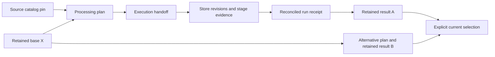

# Retained experiments and the selected dataset result

DocSpec can retain two verified processing results built from the same base,
open and compare both, and explicitly choose either as the current result.
Saving a result does not select it. The [Python runtime](python-runs.md) derives
the plan from your selected implementations and explicit settings. Remaining
catalog construction and export convenience are tracked in
[D04](dataset-experiments-todo.md#d04).

Use the supported [inspection API and commands](inspection.md) to compare
scheduled work separately from each complete retained result.
Use [failure repair selection](repairing-failures.md) to retry accepted failures
while retaining compatible completed stages and the original failure history.

## What the names mean

| Name | Meaning | Existing reference or state |
| --- | --- | --- |
| Dataset | The continuing collection of source inputs and retained results. Its local workspace holds those artifacts. | Exact catalog and result references; there is no additional dataset ledger. |
| Catalog version | One immutable selection of source records, candidate files, metadata and evidence. | `SourceCatalogRef` |
| Processing plan | The exact requested work: input catalog, selected base, implementations, policies and limits. | `ProcessingPlan` and its `ArtifactRef` |
| Execution | Prepared work and the progress of its bounded jobs. | `ExecutionHandoff`, planned-store references and `DocumentStore` revisions |
| Completed run | Accounted task outcomes, result layers, failures and supporting evidence. | `RunReceipt` and its `ArtifactRef` |
| Retained result | An immutable, verified application snapshot that another run can use as its base. | `DocumentReleaseRef` |
| Retry attempt | Another execution attempt for a store, fetch or processor invocation. | The existing owner's attempt records |
| Current result | The operator's selected retained result. | The catalog's guarded `current` pointer |

A `ProcessingPlan.plan_id` identifies the complete internal processing request.
It currently includes its base, storage profiles and work limits. It is not a
claim that different execution routes to identical logical output have the same
identity. The standalone specification's semantic plan identity is a distinct
concept; the broad identity cleanup remains open.

## What is retained and how selection works



The existing application service provides both operations:

```python
service = ReleaseCommitService(
    plan_ref=plan_ref,
    controls=controls,
    records=records,
    document_catalog=catalog,
)
result = service.retain_release(base_ref, run_receipt_ref)
catalog.select(result, expected_current=previously_observed_current)
```

`ReleaseCommitService` lives in `docspec.application.commit`. The surrounding
runtime still supplies the repositories and reconciled run; this example does
not claim that the complete workspace lifecycle API is finished.

`retain_release` verifies the plan and run, delivers the existing complete
artifact to immutable storage, and returns an independently readable reference.
It preserves the exact base and does not read or change the current pointer.
Retention reuses the existing artifact, record, store, receipt and blob checks.
Repeated retention of the same valid result returns the same reference.

`select` independently verifies the retained artifact and its pinned base. It
then checks the current pointer under the catalog's write lock. If A and B both
use X as their base, selecting B after A requires `expected_current=A`. B's
`previousRelease` and generic `supersedes` fields continue to name X; selecting
B does not rewrite either result. A stale expected current is refused. An exact
reference that is already current succeeds idempotently, without rewriting the
pointer. Replaying that selection still verifies the result and its base.

`commit_release(base_ref, run_receipt_ref)` remains a useful combined operation:
retain the result, then select it with `expected_current=base_ref`. This serves a
linear update. If another writer has selected a different result, selection
fails and the valid result remains retained for inspection or explicit selection.
The catalog's `commit` method uses the same retain-and-select operations.

The existing `CatalogCommitReceipt` is prepared authorization for the exact run
and base, with `expectedHead` equal to that base and a `preparedAt` timestamp. Its
presence does not prove that the current pointer changed. Selection does not add
a second run ledger or mutate the receipt.

## Using the CLI

Retain an already reconciled run with a request file:

```json
{
  "format": "docspec-local-release-retain-request",
  "formatVersion": "1.0",
  "runRequest": "/absolute/path/run-request.json",
  "runReceipt": "/absolute/path/run-reference.json",
  "baseRelease": null
}
```

```sh
docspec document-release retain --request retain-request.json \
  --destination retained-result.json --receipt retention-receipt.json
```

For a successor, `baseRelease` contains the exact base reference object. To select
a retained result, put that result's reference object in `release` and the
independently observed current reference in `expectedCurrent`:

```json
{
  "format": "docspec-local-catalog-select-request",
  "formatVersion": "1.0",
  "runRequest": "/absolute/path/run-request.json",
  "release": {
    "releaseId": "urn:spicy:artifact:derivation:<logical-digest>",
    "locator": "document-catalog/releases/<prefix>/<artifact-digest>/artifact.json",
    "digest": "sha256:<artifact-digest>"
  },
  "expectedCurrent": null
}
```

Use the actual reference returned by retention; the values above show its shape.
An initial selection uses explicit `null`. Replacing A with B uses A's reference
as `expectedCurrent`, even if B was built from another base.

```sh
docspec document-catalog select --request selection-request.json \
  --destination selected-result.json --receipt selection-receipt.json
```

These commands write the standard CLI operation receipts. The selection receipt
records that command's outcome; it does not change the immutable prepared
`CatalogCommitReceipt` inside the retained result. The request's runtime settings
and independently configured producer acceptance determine which local storage
and verifier are used.

## Resume and another experiment are different

Resuming verifies the latest saved revisions for the same requested work and
restores completed stages and cumulative accounting. Store and stage retry
records remain attributable to that execution. A source failure remains a source
failure even if a later attempt succeeds.

Changing a processor version or configuration creates a new processing plan
against an explicit retained base. Each alternative gets its own requested work
and output evidence. Changed processors reuse verified captures, representations, segments, and
unaffected results while running the changed processor and its affected dependents.
Changed extraction reuses captures; changed segmentation reuses representations. The current pointer does not choose that base for the
caller.

Submitting an identical plan to the same stores repository currently reuses its
work identity. It does not create an independent same-configuration trial.
A plan can stop after capture or extraction and retain that result for later
processing. `stage_policy()` defaults to extraction and segmentation; an empty
processor list alone does not select capture-only work. See the
[Python lifecycle](python-runs.md#capture-first-and-process-later).

An application `DocumentReleaseRef` is retained state used by DocSpec's reader and
planner. It is distinct from the optional portable document export described in
[the architecture guide](architecture.md#what-comes-out). Retaining an experiment
does not require producing that export or sending anything to a search engine.

## How this foundation is checked

[Catalog tests](../tests/conformance/test_document_catalog_contract.py) cover
retaining alternatives, opening and comparing them, explicit selection, stale
selection refusal, exact-pin retry, interrupted pointer updates, damaged
artifacts/dependencies, and a competing writer moving a staged artifact.
[The processing experiment](../tests/test_experiment_retention.py) runs two
processor versions against one base, verifies that both results remain readable,
and checks that capture, extraction and segmentation were reused.

These checks prove the local retention/selection behavior. They do not close
the full installed workflow, Dagster parity, every stage stopping point or an
unfamiliar human contributor exercise.
