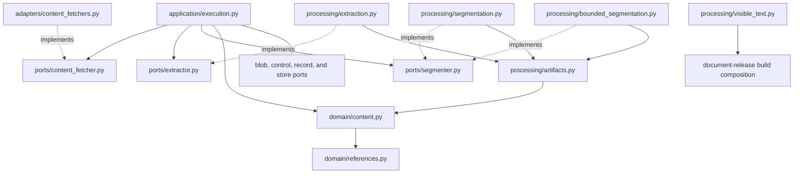
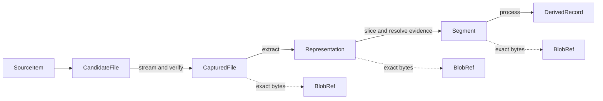
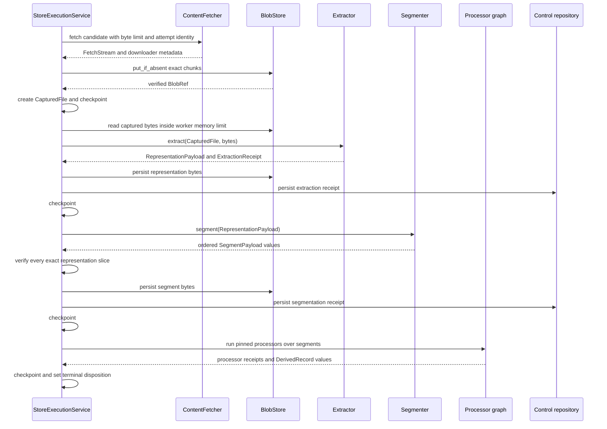
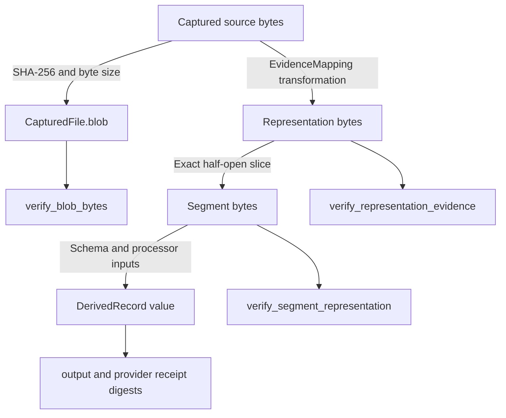

# Content Acquisition and Processing

Content acquisition and processing turns selected source-catalog rows into exact captured files, verified representations, source-grounded segments, and processor-ready inputs. The module keeps every durable identity tied to immutable bytes and retains enough evidence to prove each transformation back to the captured source.

The module sits between catalog selection and governed processing. [Source Catalog Pipeline](source_catalog_pipeline.md) decides which renditions DocSpec may process. [Document Run Application](document_run_application.md) applies plans, limits, retries, checkpoints, and failure policy around the ports and implementations documented here. [Result Delivery and Reconciliation](result_delivery_and_reconciliation.md) and [Document Release Artifacts](document_release_artifacts.md) turn completed records into durable releases.

## Purpose and system role

| Question | Answer |
| --- | --- |
| What goes in? | A compact `SourceItem` derived from a verified source catalog, candidate locators and integrity expectations, a pinned processing plan, and injected acquisition, extraction, segmentation, blob-storage, and processor implementations. |
| What happens? | DocSpec streams each candidate into content-addressed storage, records capture provenance, validates or derives a representation, divides it into reversible byte ranges, and supplies those segments to the processor graph. |
| What comes out? | `CapturedFile`, `Representation`, `Segment`, and `DerivedRecord` values; exact blob references; stage receipts; and a terminal `DocumentEntry` disposition. |
| How is it checked? | Fetchers enforce source and size boundaries. Blob references prove exact bytes. Domain constructors recompute stable identities. Evidence mappings resolve segments back to captured content. Receipts and checkpoint reloads cross-check persisted records before later stages run. |

The module preserves two forms of truth:

- content-addressed blob references identify exact bytes without tying logical records to one storage location;
- semantic records identify why those bytes exist, which source and configuration produced them, and which evidence supports each slice.

## System context

```mermaid
flowchart LR
    Native["Source-native releases"] --> Catalog["Source Catalog Pipeline"]
    Catalog --> Item["SourceItem processing view"]
    Plan["Processing plan and profiles"] --> Execution["StoreExecutionService"]
    Item --> Execution
    Execution --> Acquire["Acquisition"]
    Acquire --> Blobs[("Content-addressed blob store")]
    Acquire --> Captured["CapturedFile"]
    Captured --> Extract["Extraction and evidence"]
    Blobs --> Extract
    Extract --> Representation["Representation"]
    Representation --> Segment["Segmentation"]
    Segment --> Segments["Segment values"]
    Segments --> Processors["Processor Extension Model"]
    Processors --> Derived["DerivedRecord values"]
    Captured --> Entry["DocumentEntry checkpoint"]
    Representation --> Entry
    Segments --> Entry
    Derived --> Entry
    Entry --> Delivery["Delivery, reconciliation, and release"]
```



The neighboring modules divide responsibility as follows:

| Module | Relationship |
| --- | --- |
| [Source Catalog Pipeline](source_catalog_pipeline.md) | Produces the normative catalog row and derives `SourceItem`, including ordered candidate renditions and expected integrity values. |
| [Processing Plan and Job Model](processing_plan_and_job_model.md) | Pins extractor, segmenter, processor, policy, profile, and work-limit identities in `ProcessingPlan`, `StagePolicy`, and `DocumentEntry`. |
| [Document Run Application](document_run_application.md) | Calls the ports in stage order, classifies failures, applies retry and accepted-failure policy, enforces budgets, persists receipts, and resumes from verified checkpoints. |
| [Processor Extension Model](processor_extension_model.md) | Defines processor requests, dependencies, resource use, provider evidence, cache policy, and results that create `DerivedRecord` values. |
| [Portable Task Execution](portable_task_execution.md) | Moves reference-only store tasks across local or external execution backends; byte-bearing payloads remain inside one worker. |
| [Storage and Shared References](storage_and_shared_references.md) | Implements `BlobStore`, control and record repositories, and shared references such as `BlobRef` and `ArtifactRef`. |
| [Document Release Artifacts](document_release_artifacts.md) | Verifies and publishes the durable release that cites the source catalog and contains processed record layers. |

## Architecture and dependency direction

The implementation follows domain, port, processing, adapter, and application boundaries. Domain records know `BlobRef` but do not know local files, HTTP clients, S3 clients, parser packages, or schedulers. Ports describe the replaceable operations. Processing code implements deterministic transformations. Adapters contain external input/output and optional package details. The application service joins them under a sealed plan.



`RepresentationPayload` and `SegmentPayload` are deliberately worker-local. Scheduler and persistence boundaries pass immutable references and records; extraction and segmentation pair those records with bytes only during local work and verification.

## Sub-module documentation

The implementation has three cohesive sub-modules:

| Sub-module | Scope | Detailed documentation |
| --- | --- | --- |
| Acquisition | Processing input records, fetcher port, stream lifecycle, local-file containment, HTTPS allowlists, anonymous-S3 pins, routing, and capture evidence | [Content Acquisition and Processing: Acquisition](content_acquisition_and_processing_acquisition.md) |
| Extraction and evidence | Representation and evidence records, worker-local payloads, standard extraction, PDF page text, visible-text extraction, receipts, and round-trip verification | [Content Acquisition and Processing: Extraction and Evidence](content_acquisition_and_processing_extraction.md) |
| Segmentation | Segment records, standard boundary policies, registry routing, bounded overlap, token-counter injection, heading context, exclusions, coverage, and receipts | [Content Acquisition and Processing: Segmentation](content_acquisition_and_processing_segmentation.md) |

These pages own implementation detail. This overview explains only the relationships needed to navigate the module.

## Core record lifecycle

| Record | Purpose | Identity basis |
| --- | --- | --- |
| `CandidateFile` | Describes one possible rendition, locator, media type, optional expected digest and size, transport version, and source metadata. | Candidate identifier is supplied by the catalog; uniqueness is enforced within `SourceItem`. |
| `SourceItem` | Carries the compact processing view of one catalog row and its state. | Stable URN over source item identifier and version. |
| `CapturedFile` | Records the exact persisted blob and acquisition provenance for one candidate. | Source item and version, candidate identifier, blob digest, media type, and transport version. |
| `Representation` | Records source-native or derived content, extractor identity and configuration, warnings, and evidence mappings. | Captured file identity and digest, representation kind and blob digest, extractor and configuration, and mappings. |
| `Segment` | Records one exact representation slice, resolved evidence, segmenter and policy identity, and derivation. | Representation and byte range, ordinal, kind, content digest, evidence, segmenter, and policy digest. |
| `DerivedRecord` | Records structured processor output and provider evidence. | Source item, processor, ordered input identifiers, schema, output digest, provider receipt digest, and disposition. |

All persisted record classes are frozen and use closed `from_dict()` shapes. Constructors validate text, digest, range, uniqueness, and cross-field rules. Creation helpers derive stable Uniform Resource Names (URNs); deserialization recomputes them and refuses modified semantic inputs.



Logical records can share content-addressed blobs without sharing lineage. For example, identical bytes from two source items have the same blob digest but different `CapturedFile.file_id` values because their source identities differ.

## End-to-end execution flow

`StoreExecutionService` is the main application-level consumer of this module. For a full entry, it executes the following sequence under a memory and work budget.



The service checkpoints after capture, extraction, segmentation, and each completed processor. A resumed run reloads representation and segment bytes from the blob store, rebuilds the payload wrappers, and verifies each segment against its representation before skipping completed work.

The execution service uses each `SourceItem.candidates` entry in order. Capture has its own retry loop. Extraction or segmentation failure terminates processing for that entry and passes through the accepted-failure policy. The store-level application decides whether the completed set is acceptable; the fetchers, extractors, and segmenters do not make that governance decision.

## Extraction compositions

DocSpec currently exposes two related processing paths:

1. The general `StoreExecutionService` path uses `DefaultExtractorRegistry` and `DefaultSegmenterRegistry`. Its standard extractors retain source-native bytes for text, HTML, XML, JSON, and images; the PDF extractor derives page text. The default segmenter splits paragraphs, PDF pages, JSON records, or whole images. A caller may inject bounded segmentation for text kinds.
2. The document-release build tool extracts searchable visible text from XML or HTML, applies a retention floor, calls `BoundedSegmenter.segment_text()`, derives structural nodes, and maps search segments back to captured rendition byte spans.

The visible-text classes are not members of `DefaultExtractorRegistry`. The general runtime therefore does not produce visible-text `ExtractionResult` values unless a composition supplies an explicit adapter. Likewise, `StoreExecutionService` calls the segmenter port's simple `segment()` method and stores a generic `SegmentationReceipt`; it does not persist the bounded API's heading context, exclusion ledger, token counts, or coverage by default.

These distinctions matter when adding a profile or promising a release shape. [Extraction and Evidence](content_acquisition_and_processing_extraction.md) documents both extraction paths. [Segmentation](content_acquisition_and_processing_segmentation.md) documents the standard and bounded result APIs.

## Evidence and verification chain

The module treats evidence as a chain of independently checkable steps:



An identity mapping supports exact subrange arithmetic. A derived mapping, such as PDF page text, supports only its declared complete range unless a caller supplies and runs the named resolver. Segment creation fails if one slice crosses mappings or enters bytes with no single reversible mapping.

`ExtractionReceipt`, `SegmentationReceipt`, and `BoundedSegmentationReceipt` make stage decisions repeatable. The application stores receipts as immutable control artifacts and includes their references on `DocumentEntry`. [Document Release Artifacts](document_release_artifacts.md) adds independent release verification above these processing checks.

## Required invariants

Changes must preserve these properties:

- **Exact-byte capture:** persisted source bytes match expected size and digest when supplied, and the fetcher closes its source on every path.
- **Contained sources:** local paths, HTTPS hosts and redirects, and S3 buckets and prefixes remain inside configured boundaries.
- **Identity-bearing configuration:** downloader, extractor, segmenter, tokenizer, and policy settings that can change acceptance or bytes contribute to recorded digests.
- **Reversible evidence:** a segment names an exact representation range that resolves through one evidence mapping; code refuses unsupported precision.
- **Location-independent meaning:** moving a blob can change its locator without changing its digest, size, media type, or logical content identity.
- **Bounded work:** acquisition, worker memory, page or frame count, segment count, duration, attempts, and processor cost are checked by the governing plan and `WorkBudget`.
- **Deterministic output:** identical inputs and pinned implementations produce the same representation, segment, receipt, and derived-record identities.
- **Verified resumption:** checkpoints contain records and references, never trusted in-memory cursors. Reloaded bytes must pass the same payload and slice checks.
- **Explicit failure:** integrity, deterministic-input, external, resource, policy, and implementation failures remain distinguishable for retry and acceptance policy.
- **Optional dependency isolation:** `httpx`, `boto3`, `pypdf`, and `tiktoken` load only when the selected adapter needs them.

## Contribution guide

Choose the smallest owner for a change:

| Change | Primary documentation | Main verification focus |
| --- | --- | --- |
| Add a locator scheme, network source, source boundary, or downloader setting | [Acquisition](content_acquisition_and_processing_acquisition.md) | Containment, exact bytes, configuration identity, streaming limits, cleanup, provider-error normalization, retries, and checkpoint reuse. |
| Add a media type, parser, representation kind, evidence transformation, or visible-text rule | [Extraction and Evidence](content_acquisition_and_processing_extraction.md) | Captured-byte verification, parser and configuration identity, mapping precision, receipt agreement, optional imports, and evidence replay. |
| Add a boundary policy, representation route, tokenizer, overlap rule, exclusion, or coverage field | [Segmentation](content_acquisition_and_processing_segmentation.md) | UTF-8 byte boundaries, reversible mappings, hard bounds, deterministic identity, complete coverage, and persisted receipt needs. |
| Change retries, memory accounting, checkpoints, failure acceptance, or stage order | [Document Run Application](document_run_application.md) | Store-state transitions, plan pins, resumability, resource release, and terminal verification. |
| Change processor inputs or structured outputs | [Processor Extension Model](processor_extension_model.md) | Data-use policy, dependency order, cache identity, provider evidence, schema, and `DerivedRecord` integrity. |
| Change blob locators, repositories, record layers, or release publication | [Storage and Shared References](storage_and_shared_references.md) and [Document Release Artifacts](document_release_artifacts.md) | Content addressability, independent verification, immutable publication, and release reachability. |

A semantic change must move the identifier or digest that describes it. Add tests at the lowest layer that owns the rule, then add an application or release test when the change crosses a persistence or composition boundary.

## Focused verification

Run these checks from the repository root after changes across the complete module:

```bash
uv run pytest \
  tests/test_content_fetchers.py \
  tests/conformance/test_acquisition.py \
  tests/test_processing_pipeline.py \
  tests/test_visible_text.py \
  tests/test_bounded_segmentation.py \
  tests/test_application_pipeline.py \
  tests/test_stage_checkpoint_recovery.py \
  tests/test_release_integrity.py
uv run ruff check .
```

Use the narrower command in each sub-module page during development. Run the full suite when a change alters shared identity helpers, a public import surface, plan compatibility, a durable schema, or release verification.
