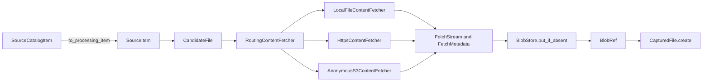
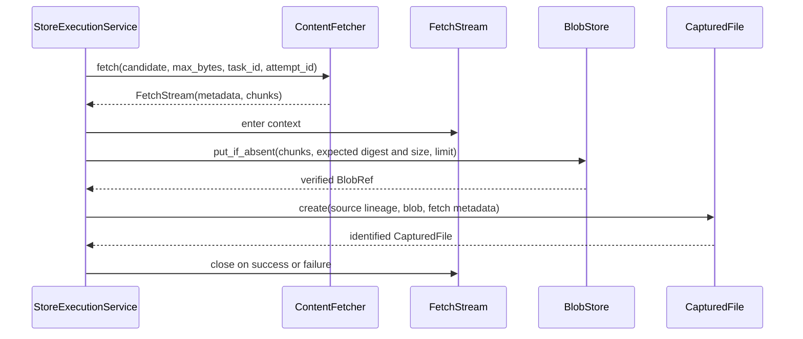
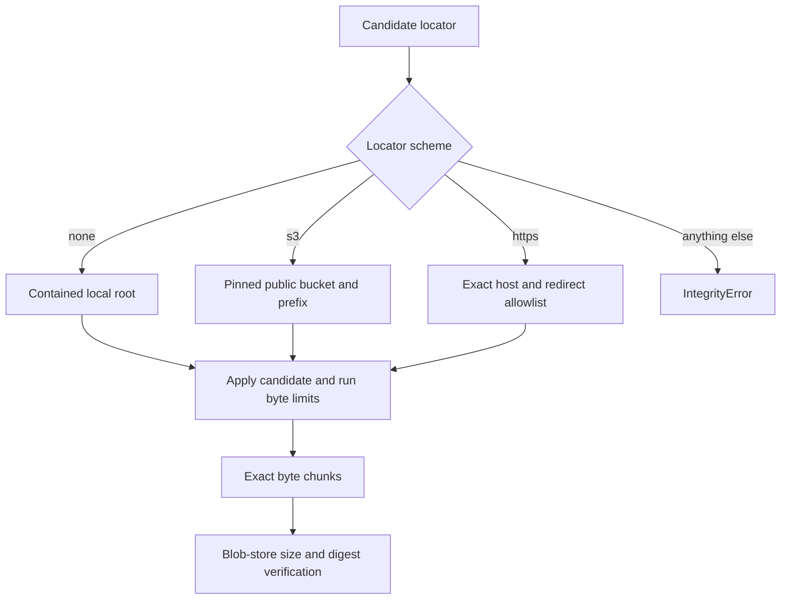

# Content Acquisition and Processing: Acquisition

Acquisition turns a selected catalog candidate into immutable, content-addressed bytes and a `CapturedFile` record that identifies how those bytes entered DocSpec. The code separates provider-neutral planning and execution from local-file, HTTPS, and anonymous Amazon S3 input mechanisms.

This page covers:

- `src/docspec/domain/content.py`: `SourceItemState`, `AcquisitionDisposition`, `CandidateFile`, `SourceItem`, and `CapturedFile`
- `src/docspec/ports/content_fetcher.py`: `ContentFetcher`, `FetchMetadata`, and `FetchStream`
- `src/docspec/adapters/content_fetchers.py`: local-file, HTTPS, anonymous-S3, and routing fetchers

See [Content Acquisition and Processing](content_acquisition_and_processing.md) for the end-to-end module flow. [Source Catalog Pipeline: Model and Ports](source_catalog_pipeline_model_and_ports.md) explains how a normative catalog row becomes the smaller `SourceItem` used here. [Document Run Application](document_run_application.md) owns retries, work limits, checkpoints, and stage execution. [Storage and Shared References](storage_and_shared_references.md) owns `BlobRef` and the blob-store interface.

## Responsibilities and boundaries

| Question | Answer |
| --- | --- |
| What goes in? | A `SourceItem` with one or more ordered `CandidateFile` values, a maximum byte count, and stable task and attempt identifiers. |
| What happens? | A configured fetcher validates the locator against its source boundary and returns a byte stream with downloader metadata. The execution service writes that stream to a content-addressed blob store and checks any expected digest and size. |
| What comes out? | A `BlobRef` and a `CapturedFile` that bind the source item, source version, candidate, exact blob digest, media type, transport observation, and downloader evidence. |
| How is it checked? | Constructors validate closed records and recompute identities. Fetchers enforce source containment and byte limits. The blob store verifies expected size and digest before the execution service creates the capture record. |

The acquisition adapter does not create a `CapturedFile` by itself. It supplies a controlled stream and `FetchMetadata`; `StoreExecutionService._capture_candidate()` persists the bytes and mints the domain record. This split keeps provider behavior out of the domain model and makes blob verification the final capture gate.



## Processing input model

### `CandidateFile`

`CandidateFile` describes one possible rendition. Its fields have distinct roles:

| Field | Meaning and validation |
| --- | --- |
| `candidate_id` | Stable identity within one `SourceItem`; candidate identifiers must be distinct. |
| `locator` | Provider-facing location. The selected fetcher applies the locator grammar and source boundary. |
| `media_type` | Declared representation type used later for extractor dispatch. |
| `expected_digest` | Optional SHA-256 digest. The execution service passes it to `BlobStore.put_if_absent()` for verification. |
| `expected_size` | Optional non-negative byte count. Fetchers use it for early and streaming checks; the blob store checks it again. |
| `transport_version` | Optional version observed or sealed by the source, such as the S3 transport-version Uniform Resource Name (URN). |
| `metadata` | JSON-compatible source details. Construction freezes and thaws the value to reject unsupported values and detach it from caller mutation. |

`to_dict()` and `from_dict()` use a closed JSON shape. Deserialization rejects missing and additional fields.

### `SourceItem`

`SourceItem` is the compact processing view of one source-catalog row. An `ACTIVE` item must contain at least one candidate; `DELETED` and `EXCLUDED` items may contain none. Its identity is a stable URN over `item_id` and `version`, not over the candidate list or metadata.

`SourceCatalogItem.to_processing_item()` maps catalog dispositions as follows:

| Catalog disposition | Processing state |
| --- | --- |
| `selected` | `ACTIVE` |
| `deleted` | `DELETED` |
| `excluded`, `unavailable`, or `failed` | `EXCLUDED` |

The processing view keeps `documentId`, normalized metadata, and the complete source-catalog row in `SourceItem.metadata`. The published source catalog remains the normative decision record.

### `CapturedFile`

`CapturedFile.create()` derives `file_id` from these semantic inputs:

- source item identifier and source version
- candidate identifier
- captured blob digest
- media type
- transport version

The acquisition timestamps, downloader identity, downloader configuration digest, task identifier, and attempt identifier remain audit evidence but do not change `file_id`. Two attempts that capture the same candidate bytes under the same source and transport version therefore identify the same logical file. A different source lineage still produces a different file identity, even if the bytes share a content-addressed blob.

`AcquisitionDisposition` supplies the terminal vocabulary used by `DocumentEntry`: `captured`, `unchanged`, `deleted`, `excluded`, `accepted-failure`, and `rejected-run`. Retry and failure classification belong to the application layer, not to a fetcher.

## Fetcher port and resource lifecycle

`ContentFetcher.fetch()` accepts a `CandidateFile`, `max_bytes`, `task_id`, and `attempt_id`. It returns a `FetchStream` rather than materializing the object in memory.

`FetchMetadata` records:

- the downloader implementation identifier
- a SHA-256 digest of the downloader configuration
- the source transport version, when available
- the acquisition start time
- the supplied task and attempt identifiers

`FetchStream` is a context manager. Its `close()` method closes the chunk iterator and then calls the optional source callback exactly once. It preserves the first close error but still attempts both cleanup steps. Callers should always use `with`, including when they may stop before consuming the stream.



## Fetcher implementations

### Local files

`LocalFileContentFetcher` accepts only relative paths below one configured root. It:

- normalizes the root and uses the shared containment checks from the local storage adapter;
- opens with `O_NOFOLLOW` where the platform provides it;
- accepts only regular files;
- checks the initial size against the execution limit and candidate size;
- compares device, inode, size, and nanosecond modification time before and after streaming; and
- refuses a file that changes before or during the read.

When a candidate has no transport version, the fetcher derives one from the initial file stat. Its configuration digest covers the downloader identity, resolved root, and chunk size.

### HTTPS

`HttpsContentFetcherConfig` seals the network boundary and operational limits. It requires one or more exact ASCII host names, a user agent, positive chunk and timeout values, a non-negative redirect count, and a positive connection limit. Its digest also declares `Accept-Encoding: identity`, which prevents transparent content decoding from changing the acquired bytes.

`HttpsContentFetcher`:

- accepts only fragment-free `https` URLs without credentials or explicit ports;
- requires every original and redirected host to appear in the exact allowlist;
- follows redirects itself, detects cycles, and applies the configured redirect limit;
- rejects content encodings other than identity;
- checks declared and streamed lengths against both limits and a sealed expected size;
- treats HTTP 429 and server errors as provider-neutral connection failures; and
- closes every response after success, refusal, consumer failure, or abandoned iteration.

The fetcher does not claim that an HTTP header proves content identity. A candidate digest, when present, is checked as the blob store consumes the stream.

`from_httpx()` imports `httpx` only when the caller selects this adapter. Install the `http` extra for that composition.

### Anonymous S3

`AnonymousS3ContentFetcherConfig` fixes one public bucket and relative key prefix. It also pins the region, chunk size, timeouts, software-development-kit retry count, connection pool size, and anonymous access. Construction rejects credentialed mode.

An S3 candidate must carry:

- a canonical `s3://bucket/key` locator;
- a closed `metadata["s3"]` object containing `bucket`, `key`, `size`, `etag`, and `lastModified`;
- an `expected_size` equal to the sealed S3 size; and
- a `transport_version` equal to `s3_transport_version()` over the complete S3 observation.

The fetcher refuses candidates outside the configured bucket or prefix before input/output. It issues `get_object` with `IfMatch`, then checks the returned entity tag (ETag), last-modified time, and content length. Missing or precondition-failed objects become integrity failures. Other provider exceptions become `S3ContentFetcherError` without exposing provider details.

`from_boto3()` loads `boto3` and `botocore` only when selected and creates an unsigned client. Install the `s3` extra for that composition.

### Scheme routing

`RoutingContentFetcher` selects a configured delegate from the locator spelling:

| Locator | Delegate |
| --- | --- |
| Relative path with no scheme | Local-file fetcher |
| `s3://...` | Anonymous-S3 fetcher |
| `https://...` | HTTPS fetcher, when configured |

All other schemes fail closed. An optional router-level object limit narrows the caller's limit with `min()`. The returned metadata names the routing fetcher and its configuration digest; that digest includes each delegate's identity and configuration plus the optional overall limit. The original delegate stream remains responsible for source cleanup through the router's close callback.



## Failure, retry, and checkpoint behavior

Fetchers distinguish integrity or limit failures from external connection failures. `StoreExecutionService` converts them into `FailureRecord` values:

- `LimitExceededError`, `IntegrityError`, `ValueError`, and `TypeError` are terminal for the current input;
- connection, timeout, and operating-system failures are retryable external failures; and
- unexpected exceptions are implementation defects.

The retry policy supplies the maximum attempts and deterministic delay. Each attempt gets a stable attempt URN. After successful capture, the service checkpoints the `CapturedFile` before extraction, which lets a resumed run reuse already persisted bytes without fetching them again.

See [Document Run Application](document_run_application.md) for the full state machine, accepted-failure policy, and store revision behavior.

## Extending acquisition

To add a source mechanism:

1. Implement `ContentFetcher.fetch()` and return a close-safe `FetchStream`.
2. Give the adapter a stable `downloader_id` and a configuration digest that covers every setting that can change the accepted source or returned bytes.
3. Validate the locator and source boundary before input/output whenever the candidate provides enough information.
4. Enforce `max_bytes` both before streaming and during streaming. Check truncation when the source declares a length.
5. Normalize provider errors without leaking credentials, private endpoints, or provider response bodies.
6. Add the new route to the composition root or `RoutingContentFetcher`, then update the router configuration identity.
7. Pin the downloader through the processing profile or plan and add resumption, early-close, tamper, boundary-escape, and oversize tests.

Keep optional provider imports inside adapter construction. Domain and port modules must remain importable without network software-development kits.

## Verification and tests

Run the focused checks from the repository root:

```bash
uv run pytest \
  tests/test_content_fetchers.py \
  tests/conformance/test_acquisition.py \
  tests/test_application_pipeline.py \
  tests/test_stage_checkpoint_recovery.py \
  tests/test_processing_pipeline.py
uv run ruff check src/docspec/domain/content.py \
  src/docspec/ports/content_fetcher.py \
  src/docspec/adapters/content_fetchers.py
```

The tests should prove exact bytes and cleanup, not only successful return values. Include unknown schemes, source-boundary escapes, changed objects, truncation, declared and streamed oversize objects, incorrect expected digests, retry classification, and checkpoint reuse.
