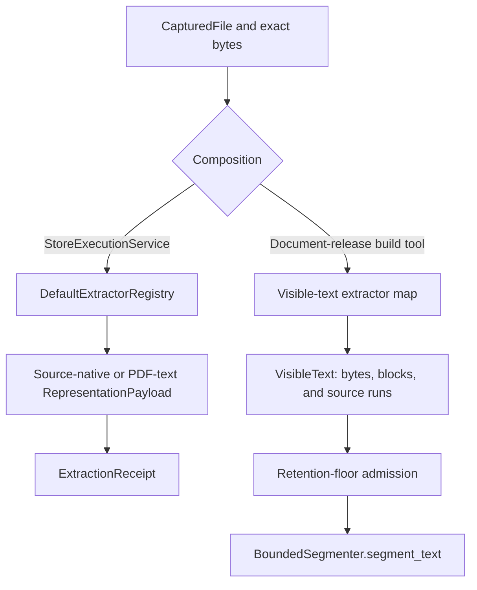
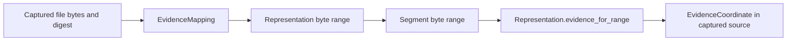
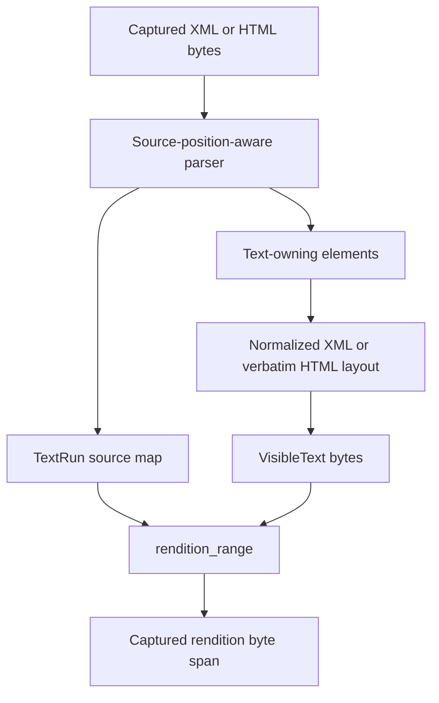

# Content Acquisition and Processing: Extraction and Evidence

Extraction validates captured bytes, creates an identified representation, and records how every usable representation range relates to the captured file. Worker-local payloads keep bytes beside their immutable records long enough to verify and persist them without placing bulk content in scheduler messages.

This page covers:

- `src/docspec/domain/content.py`: `EvidenceCoordinate`, `EvidenceMapping`, `Representation`, `ProcessorDisposition`, and `DerivedRecord`
- `src/docspec/ports/extractor.py`: `Extractor`
- `src/docspec/processing/artifacts.py`: `RepresentationPayload`, `SegmentPayload`, shared builders, and evidence verification
- `src/docspec/processing/extraction.py`: standard extractors, registry, result, and receipt
- `src/docspec/processing/visible_text.py`: XML and HTML visible-text extraction with source runs

See [Content Acquisition and Processing](content_acquisition_and_processing.md) for the complete flow and [Content Acquisition and Processing: Segmentation](content_acquisition_and_processing_segmentation.md) for segment boundaries. `BlobRef` storage belongs to [Storage and Shared References](storage_and_shared_references.md). Processor behavior belongs to [Processor Extension Model](processor_extension_model.md); this module defines `DerivedRecord` because it shares the content-lineage vocabulary.

## Responsibilities and boundaries

| Question | Answer |
| --- | --- |
| What goes in? | A verified `CapturedFile` and its exact bytes. |
| What happens? | An extractor validates the media type and syntax, creates source-native or derived bytes, records evidence mappings, computes a configuration-bound representation identity, and emits a receipt. |
| What comes out? | An `ExtractionResult` containing a `RepresentationPayload` and `ExtractionReceipt`; visible-text helpers instead return a `VisibleText` value for release-building code to adapt. |
| How is it checked? | Blob size and digest checks run before parsing. Domain constructors recompute identity. Evidence verifiers replay identity slices or an explicitly supplied derived transformation. Receipts repeat and cross-check every representation output field. |

The current package has two extraction compositions:

- `StoreExecutionService` accepts `Extractor[ExtractionResult]`. The default command-line composition injects `DefaultExtractorRegistry`, which creates source-native representations for text, HTML, XML, JSON, and images, plus derived PDF page text.
- `tools/build_document_release.py` selects `HtmlVisibleTextExtractor` or `XmlVisibleTextExtractor`, checks a retention floor, and passes the resulting text directly to `BoundedSegmenter.segment_text()`.

`DefaultExtractorRegistry` does not register the visible-text extractors. A developer who needs searchable visible text in the general store-execution path must add an explicit adapter that turns `VisibleText` into the runtime's `ExtractionResult` shape and persists compatible evidence mappings.



## Representation and evidence model

### `EvidenceCoordinate`

An evidence coordinate names the captured source by SHA-256 digest and a coordinate system. It may carry:

- a half-open byte range, with `start` and `end` supplied together;
- a positive page number; and
- a JSON-compatible region, such as a whole-image or whole-page description.

Byte coordinates must be non-negative and ordered. The coordinate does not assume that every transformation supports subrange interpolation.

### `EvidenceMapping`

`EvidenceMapping` connects one half-open representation byte interval to one source coordinate and names the transformation that produced it. The mapping itself requires valid non-negative representation offsets and a non-empty transformation identifier.

`Representation` adds the cross-mapping invariants:

- mappings remain ordered and cannot overlap;
- no mapping extends beyond the representation blob;
- every mapping names the captured file digest stored in `Representation.file_digest`; and
- an `identity-byte-slice` mapping must carry source byte offsets of exactly the same length.

`resolve_evidence_mapping()` resolves any contained subrange of an identity mapping by offset arithmetic. A derived mapping resolves only when the caller requests the mapping's complete declared representation range. This rule prevents DocSpec from inventing byte precision for a transformation that cannot prove it.

### `Representation`

`Representation.create()` derives `representation_id` from:

- captured file identity and digest;
- representation kind and output blob digest;
- extractor identity and configuration digest; and
- the ordered evidence mappings.

Warnings do not change identity. `source_item_id` is reached through the captured-file lineage but is not a separate representation identity input. `evidence_for_range()` accepts only a valid range contained by one reversible mapping.



## Worker-local payloads and shared builders

The durable model stores references; the worker needs bytes. `RepresentationPayload` and `SegmentPayload` pair each immutable record with its exact `bytes` value.

Their constructors:

- compare byte length and SHA-256 digest with the record's `BlobRef`;
- recreate the record from semantic inputs; and
- reject a record whose identifier does not match those inputs.

`content_blob_ref()` creates a location-neutral `cas+sha256` reference for output that has not yet reached a concrete blob store. The application layer later writes the bytes with `put_if_absent()` and replaces only the locator-bearing `BlobRef`; the digest, size, media type, and logical identity remain unchanged.

`build_segment()` centralizes segment creation. It takes an exact representation slice, creates its content reference, resolves source evidence through the representation, adds the representation to the derivation list, and returns a verified `SegmentPayload`. Every built-in segmenter uses this function.

The shared verifiers provide increasing levels of proof:

| Verifier | Proof |
| --- | --- |
| `verify_blob_bytes()` | The bytes match one `BlobRef` in size and digest. |
| `verify_representation_evidence()` | Each representation mapping reproduces its declared output from the captured source. Derived mappings require a named resolver. |
| `verify_segment_representation()` | A segment is the exact representation slice and carries the coordinate that the representation resolves for that slice. |
| `verify_segment_evidence()` | Both the segment-to-representation and representation-to-source checks pass. |

## Standard extraction registry

`DefaultExtractorRegistry` dispatches on the base media type after removing parameters and applying case-insensitive comparison.

| Input media type | Extractor | Representation kind | Output behavior |
| --- | --- | --- | --- |
| Other `text/*` | `TextExtractor` | `text` | Requires exact UTF-8 and retains the source bytes. |
| `text/html` | `HtmlExtractor` | `html` | Parses HTML for validation and counts, then retains the source markup. |
| `application/xml`, `text/xml`, or `*+xml` | `XmlExtractor` | `xml` | Parses with `ElementTree`, then retains the source XML. |
| `application/json` or `*+json` | `JsonExtractor` | `json` | Uses strict JSON parsing, reports root and record counts, and retains exact source bytes. |
| `image/*` | `ImageExtractor` | `image` | Retains the whole image and reports header-derived format and dimensions when recognized. |
| `application/pdf` | `LazyPypdfExtractor` | `pdf-text` | Extracts UTF-8 page text and maps one output range to each PDF page. |

Unknown media types raise `ExtractionError`.

### Source-native passthrough

The text, HTML, XML, JSON, and image extractors call `_passthrough_result()`. That helper:

1. proves the supplied bytes match the captured blob and media type;
2. uses a configuration digest for `source-native-passthrough` mode;
3. maps the complete representation to the complete captured byte range with `identity-byte-slice`;
4. creates and verifies the `RepresentationPayload`; and
5. emits and cross-checks an `ExtractionReceipt`.

The HTML and XML parsers in this path validate syntax or gather metadata; they do not replace markup with visible text.

### PDF page text

`LazyPypdfExtractor` imports `pypdf` only when selected. Install the `pdf` extra for this profile. It refuses encrypted PDFs because decryption requires a separate explicit profile.

The extractor joins page text with a configured separator and creates one `pypdf-page-text` mapping per page. A mapping carries the PDF page number and whole-page region, not source byte offsets. Page separators occupy representation bytes outside those page mappings.

The extractor identity includes the installed `pypdf` version; the configuration digest includes the page separator and whitespace option. `verify()` reruns the same parser version and proves each mapped page through a derived evidence resolver. The built-in `PageSegmenter` creates one segment at each complete page mapping, which respects the rule that derived mappings cannot resolve arbitrary subranges.

## Extraction receipts

`ExtractionReceipt` records the extractor and configuration, input file and digest, output representation and digest, output size and kind, extractor metadata, and warnings. Its JSON shape and format version are closed. `receipt_digest` covers the canonical dictionary form.

`ExtractionResult.__post_init__()` compares the receipt with its representation field by field. This catches a receipt copied from another input or output even when each object is valid alone.

`StoreExecutionService` persists each receipt in the control repository, observes extractor metadata for work-budget accounting, persists representation bytes, and checkpoints the updated entry. See [Document Run Application](document_run_application.md) for restart behavior.

## Visible-text extraction

`visible_text.py` supplies search-oriented XML and HTML extraction without replacing the source-native extractor family. Both implementations return `VisibleText`, which contains:

- UTF-8 output bytes;
- `VisibleTextBlock` layout records;
- `TextRun` mappings from output intervals to captured rendition intervals;
- captured rendition size;
- extractor identity and configuration digest; and
- extraction metadata.

### XML behavior

`XmlVisibleTextExtractor` uses Expat because `CurrentByteIndex` supplies captured-byte positions for character data. It collapses whitespace inside each text-owning block, separates blocks with blank lines, and prefixes configured heading elements with ATX heading markers (`#` through `######`). The Federal Register heading vocabulary, layout mode, parser, and unit all contribute to the configuration digest.

### HTML behavior

`HtmlVisibleTextExtractor` uses `HTMLParser` with character-reference conversion. It suppresses `head`, `script`, `style`, `template`, and `noscript`. It preserves character-data layout rather than reflowing it because the admitted Federal Register HTML carries meaningful paragraph breaks inside preformatted text. Non-ASCII sources use an explicit codepoint-to-UTF-8-byte table to translate parser line and column positions.

### Source-run precision

A `TextRun` is exact when its output and source ranges have equal byte length. Exact runs support subrange resolution. Normalized whitespace and folded character references can change length; those runs resolve to the complete source run rather than a guessed offset.

Injected output, including blank-line separators, heading prefixes, and normalized spaces, has no run. `VisibleText.rendition_range()` gathers the source runs touched by a requested output range and returns the smallest captured span that certainly contains the text. It refuses a range with no source text.



Both extractors raise `VisibleTextError` with a machine-readable reason code for unparseable input or absent visible text. The document-release builder adds media-type conflict, missing-extractor, and retention-floor decisions around these core values.

## Derived processor records

`DerivedRecord` identifies structured processor output by source item, processor, distinct ordered input identifiers, schema, output digest, provider-receipt digest, and `ProcessorDisposition`. Construction freezes the JSON value, recomputes its digest, and recomputes `derived_id`.

The disposition distinguishes `produced`, `abstained`, `excluded`, `accepted-failure`, and `rejected-run`. The module only defines the durable content record. Processor requests, provider evidence, cache behavior, execution order, and result receipts belong to [Processor Extension Model](processor_extension_model.md).

## Extending extraction

For a runtime extractor used by `StoreExecutionService`:

1. Implement `Extractor.extract(captured_file, source_bytes)` and return an `ExtractionResult`.
2. Verify the captured bytes and media type before parsing.
3. Choose a stable, versioned extractor identifier and digest every setting that can change bytes, evidence, or interpretation.
4. Create evidence mappings with the precision the transformation can prove. Supply a replay resolver for derived mappings.
5. Construct output through `Representation.create()` and `RepresentationPayload`.
6. Emit an `ExtractionReceipt` and register the extractor in the composition root or registry.
7. Add the extractor or registry identity to `StagePolicy.extractor_ids`; the execution service rejects unpinned implementations.

For visible-text extraction, also define block rules, source-run behavior, refusal codes, and a retention floor. If the general runtime should use it, add the adapter from `VisibleText` to `ExtractionResult` explicitly; do not assume the current default registry performs that conversion.

Keep optional parser imports lazy so the base package remains usable without every provider extra.

## Verification and tests

Run the focused checks from the repository root:

```bash
uv run pytest \
  tests/test_processing_pipeline.py \
  tests/test_visible_text.py \
  tests/test_application_pipeline.py \
  tests/test_release_integrity.py
uv run ruff check src/docspec/domain/content.py \
  src/docspec/ports/extractor.py \
  src/docspec/processing/artifacts.py \
  src/docspec/processing/extraction.py \
  src/docspec/processing/visible_text.py
```

Tests should include malformed input, media-type conflicts, digest and size tampering, Unicode byte offsets, evidence round trips, optional-provider failures, parser-version identity, receipt mismatch, warnings, suppressed markup, injected visible-text bytes, and ranges that lack provable evidence.
