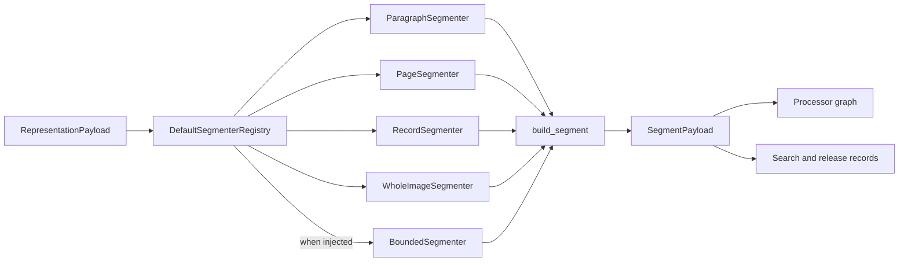
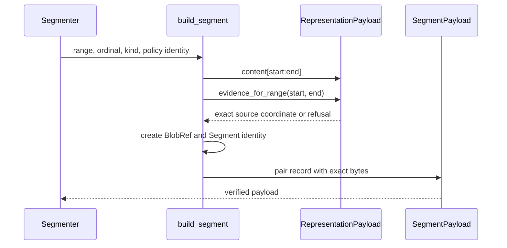
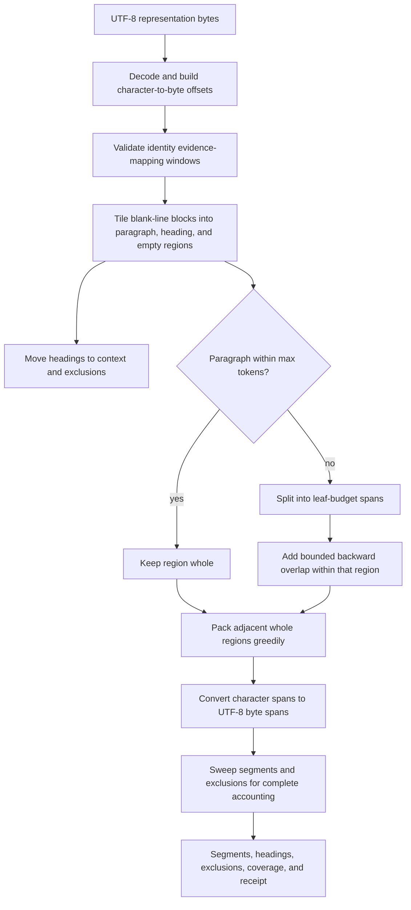
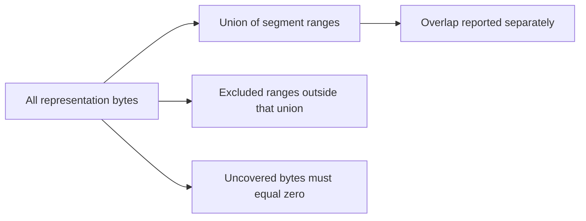

# Content Acquisition and Processing: Segmentation

Segmentation turns one verified representation into exact, source-grounded slices for processors and search artifacts. Every segment names its representation byte range, content digest, resolved source evidence, segmenter identity, and policy digest.

This page covers:

- `src/docspec/domain/content.py`: `Segment`
- `src/docspec/ports/segmenter.py`: `Segmenter`
- `src/docspec/processing/artifacts.py`: `SegmentPayload`, `build_segment()`, and segment verification
- `src/docspec/processing/segmentation.py`: standard segmenters, registry, and receipt
- `src/docspec/processing/bounded_segmentation.py`: token-bounded, heading-aware segmentation and complete byte accounting
- `src/docspec/adapters/token_counters.py`: the optional `TiktokenCounter` used by bounded compositions

See [Content Acquisition and Processing](content_acquisition_and_processing.md) for system context and [Content Acquisition and Processing: Extraction and Evidence](content_acquisition_and_processing_extraction.md) for representation mappings. [Document Run Application](document_run_application.md) owns stage execution and checkpointing. [Document Release Artifacts](document_release_artifacts.md) owns the release structures that consume visible text, structural nodes, search segments, and processing policy evidence.

## Responsibilities and boundaries

| Question | Answer |
| --- | --- |
| What goes in? | A `RepresentationPayload`: an identified representation plus exact worker-local bytes. Bounded segmentation also needs a named and versioned token counter. |
| What happens? | The selected segmenter determines half-open UTF-8 byte ranges, creates an exact content-addressed slice for each range, and resolves source evidence through the representation. |
| What comes out? | `SegmentPayload` values. Standard execution also records a `SegmentationReceipt`; bounded callers can request heading context, exclusions, coverage, and a richer receipt. |
| How is it checked? | `build_segment()` resolves evidence at creation. Payload constructors recompute identity and digest. The application service verifies every segment against its representation before persistence and again when reloading a checkpoint. |



## Segment model and common construction

`Segment.create()` derives `segment_id` from:

- representation identifier and exact start and end offsets;
- ordinal and segment kind;
- segment content digest;
- resolved `EvidenceCoordinate`;
- segmenter identifier; and
- policy digest.

The `source_item_id`, `file_id`, and derivation list remain on the record but do not independently enter the segment identity. The representation identity already binds the captured file and extraction inputs.

Constructor invariants require a non-negative ordinal, a valid half-open representation range, a SHA-256 policy digest, and a content byte size exactly equal to `representation_end - representation_start`.

`build_segment()` is the required common path for built-in segmenters. It slices `RepresentationPayload.content`, creates a content-addressed `BlobRef`, resolves evidence through `Representation.evidence_for_range()`, prepends the representation identifier to the derivation list, constructs the `Segment`, and verifies the resulting `SegmentPayload`.



## Segmenter port

`Segmenter` is a generic structural protocol with one method:

```python
def segment(self, representation: RepresentationPayload) -> tuple[SegmentPayload, ...]: ...
```

The current `StoreExecutionService` uses this concrete payload pairing even though the protocol type variables allow other adapters. The service pins the injected registry's `segmenter_id` through `StagePolicy.segmenter_id`, charges the segment count to the work budget, verifies every returned slice, persists the bytes, and writes a generic `SegmentationReceipt`.

## Standard deterministic segmenters

| Representation kind | Segmenter | Boundary rule | Segment kind |
| --- | --- | --- | --- |
| `text`, `html`, or `xml` | `ParagraphSegmenter` | Trim nonempty ranges separated by blank lines. Convert Python character offsets to exact UTF-8 byte offsets. | `paragraph` |
| `pdf-text` | `PageSegmenter` | Use each complete `pypdf-page-text` evidence mapping. Include empty page mappings. | `page` |
| `json` | `RecordSegmenter` | Use each top-level array member; use one range for any other JSON root. | `record` |
| `image` | `WholeImageSegmenter` | Use the complete representation. | `whole-image` |

Each class publishes a stable `segmenter_id` and a digest of its boundary policy. `DefaultSegmenterRegistry.registered_policy_digests` exposes the registered pairings for plan or release evidence.

`DefaultSegmenterRegistry` routes by representation kind. If the caller injects a `BoundedSegmenter`, it takes `text`, `html`, and `xml`; without one, those kinds use paragraph segmentation. PDF, JSON, and image routing stays unchanged. Unknown kinds fail closed.

### Standard receipt

`SegmentationReceipt` records the representation identifier, the selected segmenter or registry identifier, and the ordered distinct segment identifiers. Its format and version are closed, and `receipt_digest` covers the dictionary form.

The default application path writes this generic receipt. It does not automatically persist bounded heading context, exclusions, token counts, or coverage; callers that require those values must use the bounded result API and write its richer receipt or release records.

## Bounded segmentation

`BoundedSegmenter` implements the selected `structure-overlap` policy for UTF-8 text. It enforces a token limit, preserves structural blocks that fit, adds overlap only when it must split an oversized block, keeps heading text as context rather than evidence, and accounts for every representation byte.

### Settings and token counter

`BoundedSegmentSettings` carries every setting that can move a boundary or change a recorded measurement:

| Setting | Selected default | Meaning |
| --- | ---: | --- |
| `policy` | `structure-overlap` | Human-readable policy name. |
| `policy_version` | `structure-overlap-v1` | Boundary-policy version. |
| `max_tokens` | 1,800 | Hard maximum for one segment. |
| `min_tokens` | 720 | Lower search target for a split point. |
| `overlap_tokens` | 80 | Maximum prior context added to later leaves of one oversized region. |
| `tokenizer` | `o200k_base` | Counter name. |
| `tokenizer_version` | Supplied by the counter | Installed tokenizer build. |
| `boundary_method` | `source-native-oversized-overlap` | Boundary method identity. |

Use `BoundedSegmentSettings.for_counter(counter)` so the settings name the counter that actually performs measurements. Construction and every run reject a name or version mismatch. `policy_digest` covers all settings plus the UTF-8 byte coordinate declaration.

`TokenCounter` requires only `name`, `version`, and `count(text)`. Core segmentation code never imports a tokenizer package. `TiktokenCounter` is the optional outer adapter: it lazily imports `tiktoken`, reports the installed distribution version, selects `o200k_base` by default, and counts with special tokens disabled. Install the `tokens` extra for this composition.

### Boundary process



The algorithm follows these rules:

- A paragraph region within `max_tokens` stays whole.
- An oversized region splits into leaves with `leaf_budget = max_tokens - overlap_tokens`.
- The splitter prefers paragraph, line, sentence, and whitespace breaks, in that order, within its size search window.
- A later leaf may reach backward by at most `overlap_tokens`, never before the start of its own region.
- Split leaves occupy their own segments. Adjacent unsplit regions pack greedily without crossing an evidence window or heading boundary.
- The counter measures the exact text between the final start and end, including separators between packed regions.
- A segment over the hard limit or a limit too small for one source character causes refusal. The implementation never truncates text.

Character-space logic chooses linguistic boundaries. `utf8_byte_offsets()` converts the final boundaries once, at the edge. `_char_index()` rejects any evidence-mapping offset that splits a UTF-8 character.

### Heading context and exclusions

A one-line ATX heading becomes a `HeadingRegion` and an `ExcludedRegion`; its bytes remain in the representation. `SegmentContext.headings` carries the active heading path for segments below it. Context changes neither segment bytes, token count, evidence, nor identity.

Whitespace-only regions also enter the exclusion ledger. Every exclusion includes a machine-readable dotted `reason_code` and reader-facing `reason`:

- `segmentation.region-not-evidence-eligible` for headings
- `segmentation.region-empty` for empty gaps

An exclusion means “not indexed as segment evidence,” not “redacted.” Consumers can still read the representation range.

### Evidence restrictions

Bounded segmentation accepts only representation kinds `text`, `html`, and `xml`, and every evidence window must use `identity-byte-slice`. A packed group stays within one mapping window.

This restriction is deliberate. Derived PDF page mappings can prove a complete page but cannot resolve an arbitrary slice inside that page. `BoundedSegmenter` refuses those mappings; `PageSegmenter` handles `pdf-text` by preserving the complete declared page boundary.

### Coverage accounting

`SegmentCoverage` reports:

- total representation bytes;
- covered bytes, measured as the union of segment ranges;
- duplicated bytes introduced by overlap;
- excluded bytes not already covered;
- uncovered bytes; and
- segment count.

The required identity is:

```text
segmentedByteTotal + excludedByteTotal == representationByteTotal
```

`identity_holds` also requires zero uncovered bytes. `_coverage()` recomputes these values from emitted spans and exclusions instead of trusting stored totals. The segmenter raises `BoundedSegmentationError` if any byte reaches neither a segment nor the exclusion ledger.



### Result APIs

`BoundedSegmenter` exposes three levels. The related result values separate boundary decisions from DocSpec record construction:

| Method or value | Use |
| --- | --- |
| `segment(representation)` | Satisfies the standard port and returns only `SegmentPayload` values. |
| `segment_bounded(representation)` | Returns `BoundedSegmentation`, including payloads, context, settings, exclusions, coverage, and a `BoundedSegmentationReceipt`. |
| `segment_text(content)` | Applies the same boundary and accounting code to raw UTF-8 text as one evidence window, returning `BoundedTextSegmentation` without DocSpec `Segment` records. |
| `TextSpan` | Describes one selected byte range, heading path, and token count before record plumbing. |
| `BoundedSegment` | Pairs a persisted-style `SegmentPayload` with its non-evidence heading context and measured token count. |
| `BoundedTextSegmentation` | Groups raw spans, parsed headings, exclusions, and coverage for callers that own another output schema. |
| `BoundedSegmentation` | Groups identified segment payloads with settings, exclusions, coverage, and the richer receipt. |

`tools/build_document_release.py` uses `segment_text()` after visible-text extraction. It turns `HeadingRegion` values into structural nodes, checks heading paths, maps segment spans back through `VisibleText.rendition_range()`, enforces a separate declared byte ceiling, and writes search-segment records. This release-building path is separate from the default `StoreExecutionService` registry composition.

`BoundedSegmentationReceipt` adds the policy digest, exclusion ledger, and coverage to the standard representation and segment identifiers. Its closed shape supports round-trip verification and an independent receipt digest.

## Extending segmentation

To add or change a segmenter:

1. Define a stable segmenter identifier and a digest that covers every boundary rule and provider version.
2. Accept `RepresentationPayload` and use `build_segment()` for each exact range.
3. Keep offsets in UTF-8 bytes at the public boundary. Use an explicit character-to-byte table for text algorithms.
4. Select only ranges that one representation evidence mapping can resolve.
5. Preserve deterministic ordering and unique, zero-based ordinals.
6. Register the implementation and expose its policy digest. Update the processing plan identity when selection changes.
7. Add adversarial Unicode, empty-input, mapping-boundary, tamper, and checkpoint-reload tests.

For bounded behavior, also prove hard-limit refusal, overlap scope, tokenizer identity, exclusion vocabulary, zero uncovered bytes, and deterministic coverage. A new source structure model should replace only the region discovery step; it should not duplicate the split, pack, byte-conversion, or coverage logic.

## Verification and tests

Run the focused checks from the repository root:

```bash
uv run pytest \
  tests/test_processing_pipeline.py \
  tests/test_bounded_segmentation.py \
  tests/test_visible_text.py \
  tests/test_application_pipeline.py \
  tests/test_stage_checkpoint_recovery.py
uv run ruff check src/docspec/ports/segmenter.py \
  src/docspec/processing/artifacts.py \
  src/docspec/processing/segmentation.py \
  src/docspec/processing/bounded_segmentation.py \
  src/docspec/adapters/token_counters.py
```

Tests should prove the content slice, evidence coordinate, segment identity, policy identity, and receipt together. Boundary-only assertions can miss a segment whose bytes, source link, or persisted record changed.
