# Document Release Artifacts

Document release artifacts turn a completed, reconciled DocSpec run into immutable corpus state that applications can verify, query, compare, and publish. The module defines the release record and catalog interface, packages release state in the shared Rulespec artifact format, verifies portable `DocumentRelease` 2.0 bundles, and prevents parsers from admitting text below a declared retention floor.

This module is the publication side of the document lifecycle. [Document Run Application: Delivery, Reconciliation, and Release](document_run_application_delivery_and_release.md) decides whether a run is eligible for publication. [Storage and Shared References](storage_and_shared_references.md) owns the references, repositories, record layers, and blobs that a release cites. This page explains how those inputs become a release and how readers prove that the result is complete.

## Purpose and system role

| Question | Answer |
| --- | --- |
| What goes in? | A verified processing plan, source-catalog pin, optional previous release, reconciled active layers, retained blob roots, run and commit receipts, sealed store references, counts, coverage, failures, and a partition policy. A separate portable-bundle path consumes a materialized `DocumentRelease` 2.0 directory. |
| What happens? | The catalog path validates the complete release graph, materializes logical layers, seals a shared derivation artifact, and conditionally advances the current pointer. The portable path verifies canonical files, embedded schemas, member digests, identities, joins, byte ranges, set digests, counts, and coverage. |
| What comes out? | A `DocumentReleaseRef` to the current catalog state, query and comparison streams over that state, or a deterministic `VerificationResult` for a portable bundle. |
| How is it checked? | Closed JSON shapes, stable identities, SHA-256 pins, sorted and distinct collections, exact store populations, artifact manifests, record-by-record comparisons, schema validation, lineage checks, and compare-and-swap publication. |

The module does not select source items, acquire content, execute processors, reconcile workers, or decide whether failures are acceptable. Those responsibilities belong to the [Source Catalog Pipeline](source_catalog_pipeline.md), [Content Acquisition and Processing](content_acquisition_and_processing.md), [Processing Plan and Job Model](processing_plan_and_job_model.md), and [Document Run Application](document_run_application.md).

## Two release representations

The current code exposes two byte-level release representations. They share the `docspec-document-release` name and version `2.0`, but they have different roots, identities, and readers.

| Representation | Producer and reader | Purpose |
| --- | --- | --- |
| Catalog release state | `DocumentRelease`, `LocalManifestDocumentCatalog`, and `DocumentReleaseArtifactVerifier` | Represents live DocSpec state as references to plans, receipts, logical layers, and blob roots. `release.json` is a semantic member inside a shared Rulespec derivation artifact. |
| Portable 2.0 bundle | `tools/build_document_release.py` and `verify_document_release()` | Represents a self-contained distribution with a top-level `release.json`, complete member manifest, embedded schemas, tabular data, captured bytes, representations, and a text-body index. |

The catalog release parser expects the closed field set emitted by `DocumentRelease.to_dict()`. The portable verifier expects a six-field top-level root with `content`, `annotations`, and `documentStateDigest`. Neither reader accepts the other shape. Code that handles one representation must call its matching builder and verifier.

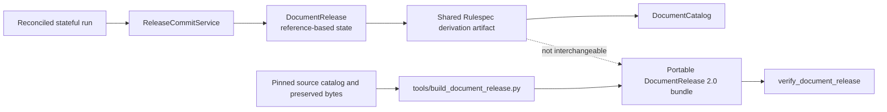

## System context

```mermaid
flowchart LR
    SourceCatalog["Source Catalog Pipeline<br/>SourceCatalogRef"] --> Plan["Processing plan"]
    Plan --> Execute["Execute and deliver stores"]
    Execute --> Reconcile["Run reconciliation"]
    Reconcile --> RunReceipt["RunReceipt and active layers"]
    RunReceipt --> ReleaseCommit["ReleaseCommitService"]
    ReleaseCommit --> Stage["DocumentCatalog.stage"]
    Stage --> ArtifactVerify["Structural and semantic artifact verification"]
    ArtifactVerify --> Commit["DocumentCatalog.commit"]
    Commit --> Current["Current DocumentReleaseRef"]
    Current --> Readers["Lookup, scan, compare, and maintenance"]
```

Neighboring modules divide responsibility as follows:

| Module | Relationship to release artifacts |
| --- | --- |
| [Source Catalog Pipeline](source_catalog_pipeline.md) | Publishes the immutable source snapshot pinned by the release and by the derivation input list. |
| [Content Acquisition and Processing](content_acquisition_and_processing.md) | Produces captured files, representations, segments, and evidence that become release records or portable-bundle members. |
| [Processing Plan and Job Model](processing_plan_and_job_model.md) | Defines the plan, profiles, policies, stores, verdicts, and partition rules that determine release identity and eligibility. |
| [Document Run Application](document_run_application.md) | Plans, executes, delivers, reconciles, and commits a run. The application prepares `CatalogCommitReceipt` and `DocumentRelease`; this module stores and verifies them. |
| [Result Delivery and Reconciliation](result_delivery_and_reconciliation.md) | Defines delivery and run receipts, result sinks, and bounded reconciliation workspaces. `DocumentRelease` cites the resulting evidence. |
| [Storage and Shared References](storage_and_shared_references.md) | Defines `ArtifactRef`, `LayerRef`, `SourceCatalogRef`, `StoreRef`, `DocumentReleaseRef`, and the storage ports used here. |
| [Scale Acceptance](scale_acceptance.md) | Qualifies release, storage, and verification paths against declared corpus and resource targets. |

## Architecture and dependency direction

The domain record depends only on portable values. Ports describe catalog behavior. Adapters depend inward on those types and outward on files, SQLite-backed storage, `jsonschema`, and the shared `rulespec_artifacts` package.

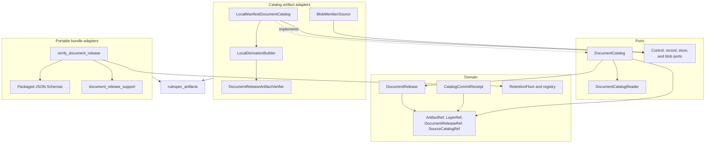

Application services import `DocumentCatalog`, not `LocalManifestDocumentCatalog`. A different catalog adapter may replace the local filesystem implementation if it preserves immutable staging, complete verification, sorted logical reads, comparison behavior, and conditional head advancement.

## Component guide

| Component | Responsibility |
| --- | --- |
| `DocumentRelease` | Defines one immutable catalog snapshot, its predecessor, input pins, active logical layers, retained blob roots, receipts, policies, and summaries. |
| `CatalogCommitReceipt` | Records the exact publication intent: profile, base, expected head, run receipt, and commit-token digest. |
| `DocumentCatalog` | Defines release identity, open, read, compare, stage, current-head, and conditional-commit operations. |
| `DocumentCatalogReader` | Holds one verified immutable release for repeated lookup and scan operations within an application operation. |
| `LocalManifestDocumentCatalog` | Implements the catalog port with immutable local directories and one operator-controlled current pointer. |
| `DerivationSpec` | Maps the processing plan and partition policy to the shared derivation identity fields and expected output roles. |
| `DerivationMember` | Assigns DocSpec meaning, media type, and optional record count to one already-written artifact member. |
| `LocalDerivationBuilder` | Describes members, writes the shared manifest and artifact root, and admits the completed artifact through structural and semantic verification. |
| `DocumentReleaseArtifactVerifier` | Verifies the DocSpec meaning of a structurally valid shared derivation artifact. |
| `BlobMemberSource` | Presents injected `BlobStore` objects through the shared artifact protocol's file-like `MemberSource` interface. |
| `SetDomain` | Declares how one portable release set is keyed and whether its digest frames a full logical row or a named projection. |
| `TextBodyIndex` | Resolves a text body or digest to an exact byte slice inside shared `text/` or `blobs/` partition members. |
| `VerificationIssue` | Carries one portable conformance diagnostic as a code, path, and message. |
| `VerificationResult` | Carries all diagnostics and exposes the precedence-selected first code, path, release identifier, and validity. |
| `RetentionFloor` | Declares a minimum acceptable retained-text fraction, its unit, and its calibration evidence. |
| `RetentionFloorRegistry` | Selects floors by text kind and normalized format, measures extraction retention, and refuses ungoverned or weak parses. |

## Catalog release model

### `DocumentRelease` fields

`DocumentRelease` is frozen and uses slots. Its nested JSON mappings are copied through the canonical identity helpers so later mutation of caller-owned dictionaries cannot silently change the stored release.

| Field | Meaning |
| --- | --- |
| `release_id` | Shared derivation logical identifier. It must match `urn:spicy:artifact:derivation:<64 lowercase hex>`. |
| `previous_release` | Optional `DocumentReleaseRef` that establishes release lineage. |
| `source_catalog` | Exact source-catalog snapshot used by the plan and run. |
| `processing_plan` | Immutable control artifact for the governing `ProcessingPlan`. |
| `profiles` | Pinned implementations for catalog, record, blob, execution, processor, and related roles. |
| `active_layers` | Complete current logical state, with exactly one entry for each present layer kind. |
| `blob_roots` | Root control artifacts from which retained blob reachability begins. |
| `retention_dispositions` | The plan's `RetentionPolicy`, preserved as a typed domain value. |
| `store_receipt_set_digest` | Ordered digest of the sealed `StoreRef` population that produced the run. |
| `run_receipt` | Immutable `RunReceipt` control artifact. |
| `catalog_commit_receipt` | Immutable `CatalogCommitReceipt` control artifact. |
| `counts` | Non-negative release summary counts. |
| `failures` | JSON-safe active failure summary. |
| `coverage` | JSON-safe source and processing coverage summary. |
| `partition_policy` | JSON-safe partition description used to derive the release identity and validate layers. |

`DocumentRelease.create()` sorts layers by `(layer_kind, layer_id)` and blob roots by `artifact_id`. Direct construction and `from_dict()` require serialized collections to already satisfy these canonical rules:

- active layer kinds are sorted and distinct;
- blob-root artifact identifiers are sorted and distinct;
- every count is a non-negative integer, with booleans rejected;
- `store_receipt_set_digest` is a qualified SHA-256 value;
- retention dispositions use `RetentionPolicy`; and
- deserialization receives exactly the known fields, `format = "docspec-document-release"`, and `formatVersion = "2.0"`.

### Identity layers

The catalog path keeps logical state, artifact bytes, and the current pointer separate.

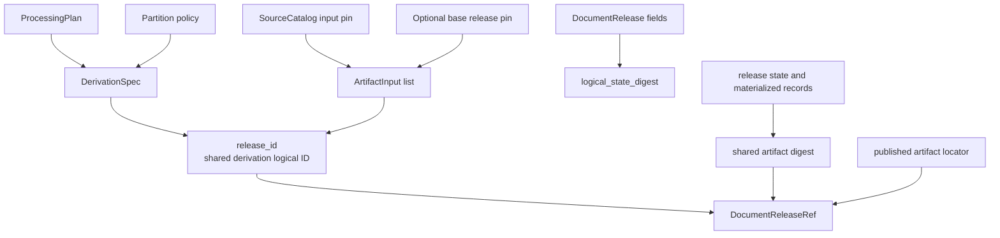

These values answer different questions:

- `release_id` identifies the derivation described by the plan, source and base inputs, policy, parameters, and partitioning.
- `logical_state_digest` summarizes active layers, blob roots, retention dispositions, counts, and coverage. It does not replace the release identifier or artifact digest.
- the shared artifact digest pins the exact packaged bytes and manifests;
- `DocumentReleaseRef` combines the logical identifier, published locator, and artifact digest; and
- `document-catalog/current.json` selects one verified release as the visible head.

`DocumentRelease.file_bytes` writes canonical JSON file bytes for the catalog artifact's semantic `release.json` member. `DocumentRelease.reference(locator, artifact_digest)` creates the published reference; the shared artifact digest already covers the semantic member, so the reference does not add a second digest for that member.

## Commit intent and optimistic publication

`CatalogCommitReceipt` proves what `ReleaseCommitService` prepared before it asked the catalog to publish. Its identity covers `profile_id`, `base_release`, `expected_head`, `run_receipt`, and `commit_token_digest`. `prepared_at` records the event but does not change the receipt identity.

The receipt constructor enforces text fields, a qualified SHA-256 commit token, and the stable receipt Uniform Resource Name (URN). Its wire shape is closed at `docspec-catalog-commit-receipt/1.0`.

`base_release` and `expected_head` serve related but distinct checks:

- `base_release` names the state from which the run was planned and reconciled;
- `expected_head` names the catalog value that publication expects to replace; and
- `LocalManifestDocumentCatalog.commit()` independently requires the release's `previous_release` and the live current pointer to agree with the supplied `expected_base`.

See [Document Run Application: Delivery, Reconciliation, and Release](document_run_application_delivery_and_release.md) for commit-token construction, run eligibility, and full-graph `DocumentReleaseVerifier` behavior.

## Catalog interfaces

### `DocumentCatalog`

| Operation | Behavior |
| --- | --- |
| `release_id(plan, partition_policy)` | Derives the shared logical release identifier before a release is constructed. |
| `open(reference)` | Opens the exact published artifact and returns a verified `DocumentRelease`. |
| `open_reader(reference)` | Verifies once and returns an immutable view for multiple record operations. |
| `current()` | Returns `None` or the verified current `DocumentReleaseRef`. A pointer to missing or corrupt state fails. |
| `lookup(reference, layer_kind, record_id)` | Finds one logical record in the named active layer. |
| `scan(reference, layer_kind)` | Streams every record in the named active layer. |
| `compare(older, newer, layer_kind)` | Streams `(record_id, change)` pairs, where change is `added`, `deleted`, or `changed`. |
| `stage(release)` | Verifies dependencies, materializes members, seals the artifact, and returns an `ArtifactRef` without changing the head. |
| `commit(staged, expected_base, stores)` | Verifies the staged artifact and exact sealed-store population, publishes it immutably, and advances the head only from the expected base. |

### `DocumentCatalogReader`

The reader holds one already-verified release, which avoids reopening and rechecking the artifact for every query in one application operation.

- `lookup()` resolves exactly one active layer kind. For `source-items`, the local reader directs the lookup to the partition derived from the record identifier.
- `scan()` streams the complete logical layer.
- `scan_source()` narrows the physical read by the supplied source item, then filters records by their `sourceItemId`. It refuses a layer whose rows do not carry source identity.

Every operation requires exactly one active `LayerRef` for the requested layer kind. A missing or repeated kind is an integrity failure, not an empty result.

## Local catalog storage and publication

`LocalManifestDocumentCatalog` combines four responsibilities behind the port: path-safe local storage, shared artifact packaging, semantic release verification, and operator-only current-head mutation.

### On-disk layout

| Path | Purpose |
| --- | --- |
| `document-catalog/staged/<prefix>/<artifact-digest>/...` | Immutable staged derivation directory. Staging does not change visible state. |
| `document-catalog/releases/<prefix>/<artifact-digest>/...` | Published derivation directory. The digest determines the path. |
| `document-catalog/current.json` | Small mutable pointer to the current `DocumentReleaseRef`. |
| `document-catalog/.commit.lock` | Exclusive local commit sentinel. |
| `document-catalog/.staging/` | Temporary working directories used before immutable publication. |

All locators remain under the configured storage root. The shared storage helpers reject symlink traversal, absolute paths, parent traversal, non-regular members, and conflicting immutable content.

### Stage flow

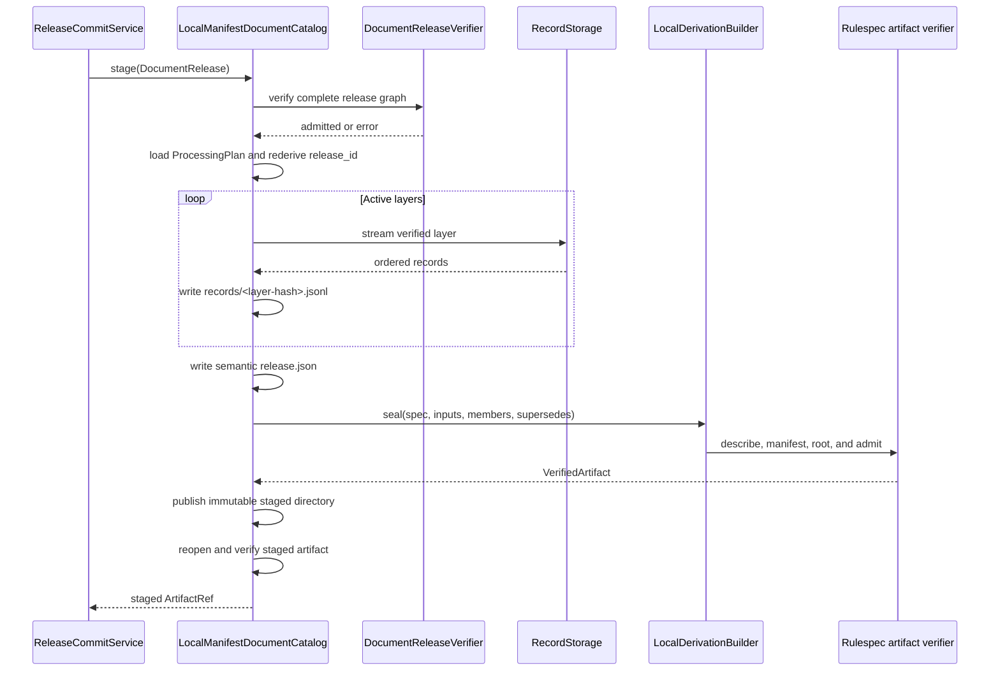

Staging performs several independent checks:

1. `DocumentReleaseVerifier` verifies the release and its referenced plans, receipts, layers, stores, blobs, and summaries.
2. The catalog reloads `ProcessingPlan` and recomputes `derivation_logical_id(plan, partition_policy)`.
3. `write_release_members()` writes the release state and streams every active layer into one canonical newline-delimited JSON (NDJSON) member.
4. The count written for each member must equal `LayerRef.record_count`.
5. `LocalDerivationBuilder` requires the produced roles to equal the spec's declared roles, then writes the shared manifest and root with exclusive creation.
6. Rulespec verifies common artifact structure; `DocumentReleaseArtifactVerifier` verifies DocSpec meaning.
7. The catalog publishes the staging directory without replacing an existing result, then reopens the staged artifact from its immutable reference.

The default maximum size for the catalog release-state member is 1 MiB. Logical layer data remains outside that small member and streams through record storage.

### Commit flow

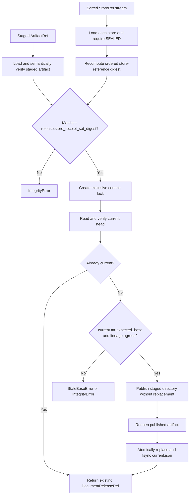

The commit stream must contain references sorted by strictly increasing `store_id`. Each reference must load as a sealed `DocumentStore`. The ordered reference digest must equal `release.store_receipt_set_digest` before the adapter acquires its commit lock.

Publication then applies compare-and-swap semantics:

- an exact replay returns the already-current release;
- a changed head raises `StaleBaseError`;
- release lineage that differs from `expected_base` raises `IntegrityError`;
- an existing published directory is reused only after verification;
- a new directory is published without replacing another result; and
- the current pointer changes through a flushed temporary file, atomic `os.replace()`, and parent-directory synchronization.

The lock prevents concurrent local writers. The `finally` block removes it after normal success or failure. Operators should treat a lock left by abrupt process termination as state to investigate before retrying.

### Reads and comparisons

`open()` derives the only legal published locator from the reference digest, admits the complete shared artifact, reads its semantic release member, and verifies its dependencies. `current()` also opens the referenced release, so a syntactically valid pointer cannot make corrupt state appear current.

`compare()` performs a merge over two identity-sorted record streams:

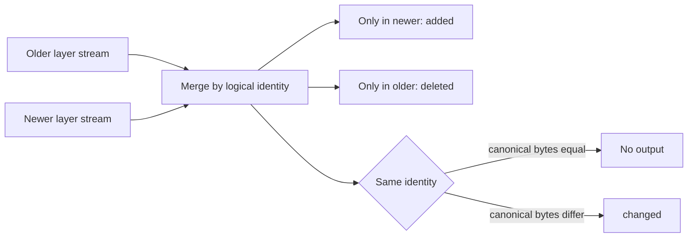

The two layers must expose the same identity field. The comparison detects logical record changes, not physical repacking: records with equal canonical JSON bytes produce no event even if their storage members differ.

## Shared derivation artifact

The catalog packages release state with the common `rulespec_artifacts` protocol. Rulespec owns structural checks such as root identity, manifests, member descriptions, pins, and succession. DocSpec adds processing-plan and logical-record meaning.

### Derivation identity

`derivation_spec()` maps a `ProcessingPlan` into five groups:

| Group | Included values |
| --- | --- |
| Processor | Processor-set identifier, fixed adapter version, and digest of the complete processor set. |
| Policy | Stable policy identifier and digest over accepted-failure, data-use, retention, and retry policy pins. |
| Parameters | Digest over limits, profiles, selection, and stage configuration. |
| Partitioning | Stable partitioning identifier and digest over the release partition policy. |
| Outputs | Exactly the `records` and `release-state` roles. |

`derivation_inputs()` adds one `source` input for the source catalog and, when present, one `base` input for the prior release. It sorts inputs by role, logical identifier, and artifact digest. `derivation_logical_id()` passes the shared format, inputs, derivation kind, and spec to the protocol's `expected_logical_id()` function.

Changing a plan value that belongs to these fields changes the logical derivation identifier. Changing only physical artifact packing can change the artifact digest without changing that logical identifier.

### Members and sealing

The shared artifact contains:

- one `release.json` member with role `release-state` and media type `application/vnd.docspec.document-release+json`;
- one `records/<sha256(layer_id)>.jsonl` member per active layer, all with role `records` and media type `application/x-ndjson`;
- one shared member manifest; and
- one shared artifact root.

`LocalDerivationBuilder.seal()` refuses a symlink or non-directory working root, undeclared output roles, and pre-existing protocol files. It describes already-written members in object-key order, writes the manifest and root with exclusive creation and `fsync()`, then calls `admit_artifact()` with the semantic verifier. If sealing fails, it removes only the protocol files it created; caller-owned output members remain available for the caller's cleanup path.

### Semantic artifact verification

`DocumentReleaseArtifactVerifier` runs after Rulespec has verified common structure. It checks:

1. artifact kind and installed producer identity;
2. the release member's role, media type, size, canonical JSON shape, and logical identifier;
3. exact agreement between `previous_release` and the shared `supersedes` record;
4. the processing-plan artifact and reconstructed derivation spec and inputs;
5. exact member-key equality with the release's active layers;
6. role, media type, and record count for every layer member;
7. byte-for-byte equality between each published NDJSON row and the corresponding verified record-storage stream; and
8. the full release graph through application-level `DocumentReleaseVerifier`.

This split prevents two incomplete forms of confidence. Structural artifact validity does not prove that a member represents the declared DocSpec layer, and a valid `DocumentRelease` object does not prove that the artifact packaged the rows it names.

### `BlobMemberSource`

`BlobMemberSource` adapts a mapping of artifact object keys to `BlobRef` values. `keys()` returns sorted keys. `open()` reads the referenced blob as a buffered binary stream without exposing provider-specific objects to Rulespec. It translates missing keys and blob failures into the shared protocol's member-source errors and closes the underlying iterator when the consumer closes the stream.

Use this adapter when artifact members already live behind a `BlobStore`. The local catalog uses `LocalMemberSource` because its staged members are files.

## Portable `DocumentRelease` 2.0 bundles

The portable verifier reads a materialized directory. It opens no database, performs no network request, and imports no sibling product. The bundle must contain every file declared by its manifest and no undeclared file.

### Bundle layout

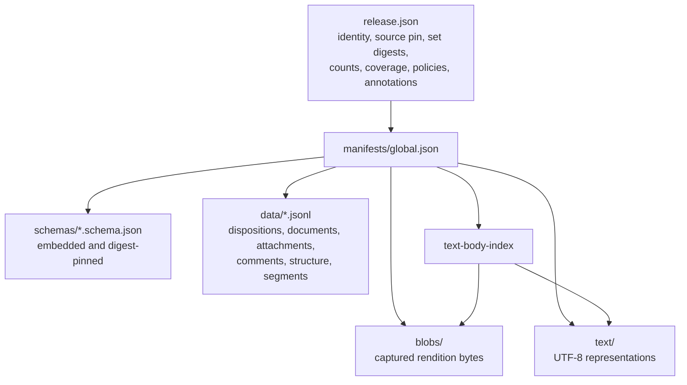

The DocSpec generation requires eight schema roles: release root, member manifest, source dispositions, documents, attachments, comments, structural nodes, and search segments. The text-body index row schema lives in the member-manifest schema and does not add a ninth schema role.

Tabular members use canonical NDJSON. Captured and representation members may contain several text bodies in one partition bucket. The index supplies `startByte` and `byteLength` so the verifier can recover and hash each body's exact slice.

### Generation-aware verification

The verifier accepts two schema-identifier generations because the sealed predecessor corpus predates the schemas' move into DocSpec.

| Generation | How it is selected | Main differences |
| --- | --- | --- |
| `predecessor` | The bundle declares the frozen `rulespec.org` schema identifiers, or does not declare a complete DocSpec-only generation. | Six schema roles, JSON-array tabular members, structure keyed by `documentVersionId`, plain predecessor set digests, and no attachment, comment, or text-body-index members. |
| `docspec` | Every declared schema identifier belongs to the packaged `urn:docspec:` generation. | Eight schema roles, NDJSON tables, `textBodyId` keys, attachment and comment accounting, text-body index, framed logical-row set digests, and per-kind counts. |

A mixed generation receives an `invalid.schema` diagnostic. Unknown schema identifiers stay unknown and fail closed; the verifier never guesses a replacement schema.

### Verification pipeline

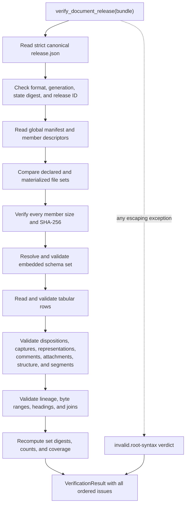

`verify_document_release()` always returns a verdict. Its outer exception boundary converts unexpected failures into one `invalid.root-syntax` issue, which prevents malformed input from crashing the gate.

The verifier collects all issues it can judge. `VerificationResult.first` chooses the first diagnostic by `DIAGNOSTIC_CODES` precedence, and `code` and `path` expose that stable summary. `valid` is true only when `issues` is empty.

Diagnostic groups proceed from prerequisites to dependent semantics:

1. root syntax, format, identity, version binding, paths, membership, member digests, schemas, and duplicate identities;
2. source-catalog pin and source dispositions;
3. comment selection, attachment accounting, and retention floors;
4. captures, representations, structure, segments, and coverage; and
5. joins, set digests, and counts.

### Portable identity and set digests

For a DocSpec-generation bundle, `documentStateDigest` hashes the format, version, and logical content under the shared artifact canonicalizer. Logical content excludes physical packing details and publication annotations. `releaseId` derives directly from the state digest's hexadecimal value with prefix `urn:docspec:document-release:v2:`.

This rule preserves identity across a physical-only repack while changing identity when a logical row changes. The predecessor generation retains its historical full-content identity rule so its sealed fixtures remain verifiable.

`SetDomain` makes each DocSpec-generation set digest explicit:

- full-row domains frame a record after `logical_row()` removes only declared physical locators and acquisition clocks;
- projection domains frame named identity fields in a fixed order;
- each domain declares one key;
- keys sort by UTF-16 code units, matching the shared artifact canonicalizer; and
- a repeated or untyped key is an error.

The registered domains cover selected sources, source dispositions, document versions, attachments, comments, structural nodes, search segments, the cross-kind text-body census, and source-to-document mappings.

### Text-body relationships

The DocSpec generation treats document bodies, attachments, and comments as one text pipeline.

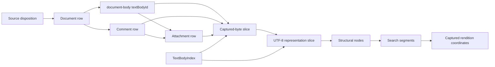

The verifier checks ownership and identity across this graph:

- selected dispositions join one-to-one to document versions;
- a document body's `textBodyId` equals its `documentVersionId`;
- an attachment identifier derives from its owner and attachment identity, and a text-carrying attachment uses that identifier as its `textBodyId`;
- a comment identifier and `textBodyId` agree, and the comment names a document in the release;
- captured and representation descriptions resolve to declared member bytes or indexed slices with matching digest and size;
- structural nodes stay within their text body, form resolvable parent chains, and use dense sibling ordinals;
- segments stay within their representation and structural parent, use dense body-local ordinals, carry the derived heading path, and resolve evidence against captured bytes; and
- document segments plus explicit exclusions tile the representation without overlap, while aggregate and per-kind summaries independently reconcile byte totals.

Attachment renditions remain accounted even when they produce no text. Each rendition uses one of four dispositions: `text-captured`, `text-excluded`, `source-unavailable`, or `extraction-failed`. Non-captured outcomes require a declared reason and machine-readable reason code.

### Corpus verification

`verify_corpus(corpus_file)` runs the verifier over every fixture case. For each case it reports:

- whether the materialized directory matches its sealed tree digest;
- expected and observed diagnostic code;
- expected and observed path; and
- the complete issue strings.

The fixture corpus therefore tests both byte preservation and semantic refusal behavior. A test that only checks the first code does not prove that the rest of the diagnostic set stayed stable.

## Retention floors

Retention floors stop a parser from admitting a thin, empty, or ungoverned extraction as valid text. They apply before release construction; the portable verifier later checks that bundle policy declarations cover the text bodies actually carried.

### Floor model

`RetentionFloor` carries four text fields:

| Field | Rule |
| --- | --- |
| `value` | Decimal string strictly between zero and one. This is the minimum admitted fraction. |
| `unit` | One registered unit: `normalized-visible-text-fraction`, the predecessor `visible-text-fraction`, or `text-density`. |
| `observed_minimum` | Decimal string strictly greater than `value`, preserving margin below the lowest legitimate calibration observation. |
| `population` | Named calibration population from which the observed minimum came. |

Fractions remain decimal strings because canonical JSON rejects binary floats and release evidence must round-trip exactly. `greater()` compares zero-padded decimal spellings without converting them to floating point. `decimal_fraction()` truncates instead of rounding up, so a measured result never appears stronger than the byte counts support.

### Registry and admission flow

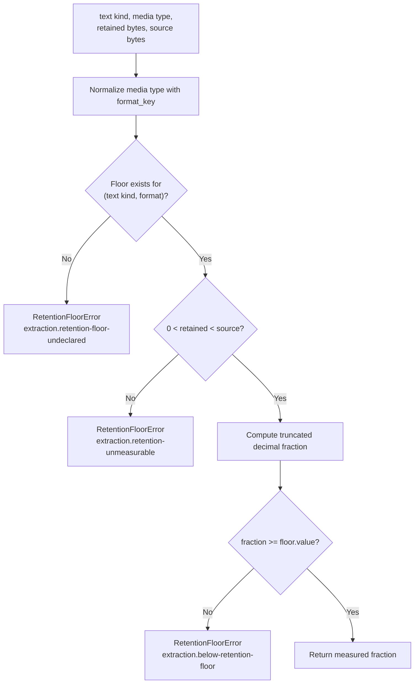

`RetentionFloorRegistry` keys floors by `(text_kind, format_key)`. `format_key()` removes media-type parameters and maps `text/xml`, `application/xml`, and every `+xml` type to `application/xml`, so one parser family cannot receive different runtime floors because a publisher changed a header spelling. Text kinds remain separate; a document-body floor never governs a comment.

For normalized markup retention, `normalized_byte_size()` collapses each ASCII whitespace run to one space and removes leading and trailing whitespace before measuring. Producer code must pass normalized source and retained byte counts to `admit()`.

The portable release policy check serves a different purpose. It requires a literal `(textKind, mediaType)` policy row for every carried capture media type. A producer may use one normalized floor internally, but it must emit each concrete media-type row that a consumer will join against.

## Failure behavior

| Failure | Raised or returned by | Meaning |
| --- | --- | --- |
| `ValueError` or `TypeError` | Domain constructors and closed-shape readers | A caller supplied an invalid value before storage or deserialized an invalid domain object. |
| `IntegrityError` | Catalog, artifact, record, and portable semantic checks | Stored bytes or cross-references disagree with their immutable descriptions. |
| `LimitExceededError` | Release-member, record, and storage readers | Input exceeds an explicit resource or record-size boundary. |
| `StateTransitionError` | Local catalog commit locking and conflicting immutable writes | Publication cannot safely make the requested transition. |
| `StaleBaseError` | Catalog commit | Another release is current, so this run cannot replace the base it expected. |
| `RetentionFloorError` | Retention registry | Extraction is ungoverned, unmeasurable, or below its declared floor. The exception carries a release reason code and prose reason. |
| `VerificationResult` with issues | Portable verifier | An untrusted bundle failed conformance. The public gate returns diagnostics instead of raising. |

The catalog path raises because application services must stop the transaction. The portable gate returns a result because validation tools need a deterministic report for untrusted material.

## Developer usage

### Read the current catalog release

```python
current = catalog.current()
if current is not None:
    reader = catalog.open_reader(current)
    source = reader.lookup(layer_kind="source-items", record_id=source_item_id)
    segments = tuple(
        reader.scan_source(layer_kind="segments", source_item_id=source_item_id)
    )
```

Use one reader for related reads. It pins one verified release and prevents a current-head change from mixing records from two releases inside one operation.

### Verify a portable bundle

```python
from pathlib import Path

from docspec.adapters.document_release_verify import verify_document_release

result = verify_document_release(Path("output/document-release"))
if not result.valid:
    for issue in result.issues:
        print(issue)
```

Treat `result.valid`, not only `result.code`, as the admission decision. `code` reports the highest-precedence issue for concise automation; `issues` preserves the full diagnostic evidence.

### Apply a retention floor

```python
from docspec.processing.retention_floors import (
    RetentionFloor,
    RetentionFloorRegistry,
    normalized_byte_size,
)

registry = RetentionFloorRegistry(
    {
        ("document-body", "application/xml"): RetentionFloor(
            value="0.42",
            unit="normalized-visible-text-fraction",
            observed_minimum="0.51",
            population="federal-register-calibration-v1",
        )
    }
)

measured = registry.admit(
    "document-body",
    "text/xml; charset=utf-8",
    retained=normalized_byte_size(representation_bytes),
    source=normalized_byte_size(captured_bytes),
)
```

Callers should catch `RetentionFloorError` only to record its `reason_code` and `reason` as a refused disposition. They must not continue with the rejected representation.

## Contribution guidance

### Preserve the release boundary

- Keep domain and port modules independent of filesystem, cloud SDK, and `jsonschema` types.
- Pass references across application and scheduler boundaries. Keep bulk rows and bytes behind `RecordStorage`, `BlobStore`, or artifact-member sources.
- Keep staging separate from visibility. Only `commit()` may update the current catalog pointer.
- Verify a release after materialization, not only before it. Packaging can introduce missing, reordered, or changed members.
- Preserve complete release semantics: one active layer per kind, exact store populations, explicit predecessor lineage, and all retained blob roots.

### Change identities deliberately

Identity changes require coordinated updates. Before modifying a field, determine whether it affects:

1. `DocumentRelease.identity_content()` or `logical_state_digest`;
2. `DerivationSpec`, derivation inputs, or `derivation_logical_id()`;
3. shared artifact member descriptions or succession;
4. the portable bundle's `documentStateDigest`, `releaseId`, or framed set domains;
5. reference locators and artifact digests; and
6. fixture tree digests and expected diagnostic sets.

Never change `RELEASE_FORMAT_VERSION` and the portable `RELEASE_ID_PREFIX` as if they were one value. The format version identifies a byte contract; the `v2` prefix is the sealed identity namespace.

### Preserve closed shapes and canonical order

- Add or remove a serialized field through the matching `to_dict()`, `from_dict()`, schema, builder, verifier, fixture, and decision update.
- Reject unknown fields instead of ignoring them.
- Sort layers, roots, inputs, members, schemas, and set members by their declared canonical key.
- Refuse duplicates before computing a set digest.
- Keep canonicalization owned by the layer that mints the identity. The shared artifact canonicalizer owns portable top-level identity.
- Preserve qualified and unqualified SHA-256 spellings where the existing format distinguishes them.

### Maintain safe and bounded input handling

- Resolve every object key as a safe relative POSIX path and reject symlinks.
- Hash and count immutable members before parsing their semantics.
- Keep catalog record writes and reads streaming. Do not replace them with whole-corpus lists.
- Retain explicit root, record, member, blob, and scratch limits.
- Keep `verify_document_release()` exception-safe. New validation code must become a diagnostic, not an escaping exception.
- Validate slice starts, lengths, and far bounds before seeking into a shared member.

### Extend portable records as one graph

A new text kind or tabular role affects more than one schema. Review:

- member-role and schema-role registries;
- schema identifier generation mapping;
- member media type and `recordCount` rules;
- identity and duplicate checks;
- text-body ownership and byte-slice indexing;
- structure, segment, evidence, and coverage joins;
- set digest domains and logical-row exclusions;
- total and per-kind counts; and
- predecessor-generation refusal behavior.

Do not let a new role pass unread. If no registered schema and semantic checks govern its rows, the verifier must refuse it.

### Change retention floors from evidence

- Calibrate a floor on a named population before enabling its parser and format.
- Keep `observed_minimum` strictly above the chosen floor.
- Measure source and retained bytes under the same unit.
- Add the exact text-kind and normalized-format registry entry.
- Emit literal policy rows for every concrete capture media type in a portable bundle.
- Preserve the three refusal codes because downstream disposition accounting depends on them.

## Verification and tests

Run focused tests from the DocSpec repository root:

```bash
uv run pytest tests/test_platform_artifact.py tests/test_storage_records_catalog.py -q
uv run pytest tests/test_document_release_verify.py tests/test_retention_floors.py -q
uv run pytest tests/test_document_release_builder.py -q
uv run pytest \
  tests/conformance/test_document_catalog_contract.py \
  tests/conformance/test_document_release_integrity.py \
  tests/conformance/test_release_manifest.py \
  tests/conformance/test_incremental_equivalence.py -q
```

The test groups prove different properties:

| Test area | Evidence |
| --- | --- |
| Platform artifact | Stable derivation identity, succession behavior, blob-backed member reading, semantic refusal, and symlink safety. |
| Local catalog | Stage, open, compare, commit, replay, stale-base rejection, sealed-store requirements, complete state reopening, and blob-root verification. |
| Portable verifier | Both minting generations, exact diagnostics, schema identities, canonical bytes, safe paths, identities, set domains, attachments, comments, text-body indexes, counts, joins, and crash-safe verdicts. |
| Portable builder | Preserved-byte adoption, honest source dispositions, retention refusal, deterministic identity, multibyte offsets, complete attachment accounting, real-corpus sampling, and reproducibility. |
| Retention floors | Format normalization, decimal arithmetic, calibration invariants, refusal codes, and committed calibration evidence. |
| Conformance | Shared behavior across registered catalog profiles, full retained-object verification, manifest closure, and convergence of clean, incremental, targeted, and compacted state. |

Tests that use the pinned real corpus require the corresponding local corpus artifacts. The fixture-based catalog, artifact, verifier, and retention tests remain the primary fast feedback path.

## Implementation map

| File | Main responsibility |
| --- | --- |
| `src/docspec/domain/release.py` | Reference-based `DocumentRelease` state, closed serialization, and logical-state digest. |
| `src/docspec/domain/receipts.py` | `CatalogCommitReceipt` and the neighboring delivery and run receipts. |
| `src/docspec/ports/document_catalog.py` | Catalog and immutable-reader interfaces. |
| `src/docspec/adapters/storage.py` | Local catalog, reader, compare, staging, publication, and current pointer. |
| `src/docspec/adapters/platform_artifact.py` | Shared derivation mapping, member writing, sealing, blob-member bridge, and semantic artifact verification. |
| `src/docspec/adapters/document_release_verify.py` | Portable 2.0 identity, generation detection, schema and member checks, semantic validation, diagnostics, and corpus verification. |
| `src/docspec/document_release_support.py` | Portable canonical JSON, strict file loading, path safety, logical-content projection, digests, and packaged-schema lookup. |
| `src/docspec/processing/retention_floors.py` | Retention-floor records, exact decimal arithmetic, media-type normalization, measurement, and refusal. |
| `src/docspec/schemas/document_release/2.0/` | Eight packaged portable-bundle JSON Schemas. |
| `tools/build_document_release.py` | Produces a portable bundle from a pinned catalog and preserved bytes, then runs the portable gate. |
| `docs/decisions/0001-document-release-2-0.md` | Records the portable 2.0 format, identity, member, retention, and acceptance decisions. |

The main maintenance rule is simple: a release is visible only after its logical state, packaged bytes, lineage, stores, and summaries all describe the same build. Preserve independent checks at each boundary so no single self-reported field can publish incomplete state.
