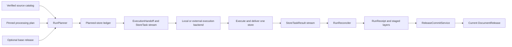
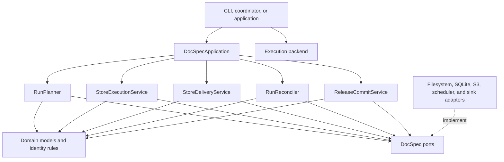
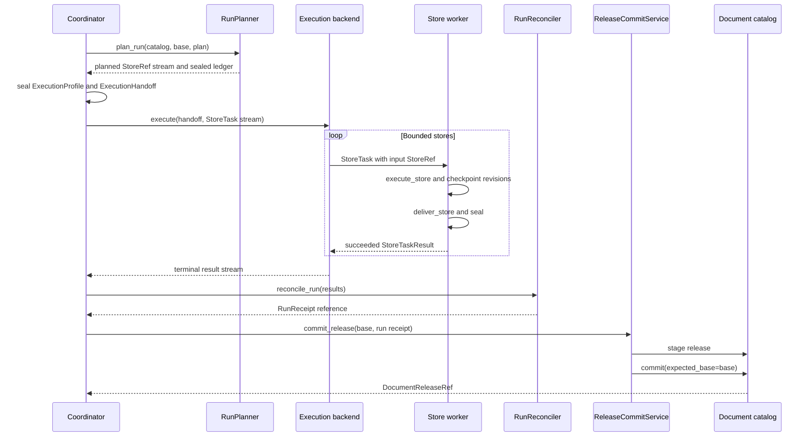
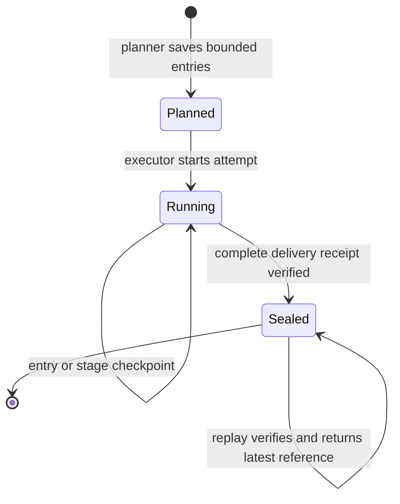

# Document Run Application

The document run application turns a verified source catalog and a pinned processing plan into a verified `DocumentRelease`. It plans bounded `DocumentStore` jobs, executes and checkpoints each job, delivers every terminal record, reconciles the complete task population, and publishes release state through one conditional commit.

This module is DocSpec's application layer for a run. It coordinates domain rules and storage or processing ports; it does not define source-catalog policy, content parsing algorithms, processor implementations, scheduler products, or storage formats. Those responsibilities stay in the neighboring modules linked below.

## Purpose and system role

| Question | Answer |
| --- | --- |
| What goes in? | An immutable `SourceCatalogRef`, a verified `ProcessingPlan`, an optional base `DocumentReleaseRef`, pinned profiles and policies, and injected implementations of DocSpec's catalog, store, blob, record, processing, scheduler, cache, and result-sink ports. |
| What happens? | The planner compares current and prior source state, saves bounded stores, workers acquire and process each selected entry, the delivery service seals complete results, the reconciler proves that the terminal results equal the planned task set, and the commit service conditionally advances the document catalog. |
| What comes out? | Immutable `StoreRef` revisions, stage and delivery receipts, execution ledgers, a `RunReceipt`, and, for a successful stateful run, a `DocumentReleaseRef`. |
| How is it checked? | Every stage reloads and verifies pinned artifacts, stable identities, closed record shapes, exact populations, work limits, receipt contents, and state transitions. `DocumentReleaseVerifier` then walks the release's plans, receipts, ledgers, layers, retained blobs, counts, coverage, and failures. |

The application separates parallel work from publication. Workers can create immutable store revisions and staged record layers, but only `ReleaseCommitService` makes a release current. A failed, incomplete, stateless, or stale-base run cannot advance the catalog.

## System context



The neighboring modules provide the values and implementations used in this flow:

| Neighbor | Relationship to this module |
| --- | --- |
| [Source Catalog Pipeline](source_catalog_pipeline.md) | Publishes the complete immutable source snapshot that planning reads once. |
| [Content Acquisition and Processing](content_acquisition_and_processing.md) | Defines source items, captured files, representations, segments, fetchers, extractors, and segmenters used during store execution. |
| [Processing Plan and Job Model](processing_plan_and_job_model.md) | Defines `ProcessingPlan`, `WorkLimits`, `DocumentEntry`, `DocumentStore`, profiles, policies, failures, states, and verdicts. |
| [Processor Extension Model](processor_extension_model.md) | Defines processor descriptions, dependency order, requests, results, provider evidence, and result-cache behavior. |
| [Portable Task Execution](portable_task_execution.md) | Defines execution profiles, sealed handoffs, reference-only tasks and results, and local or external scheduler adapters. |
| [Result Delivery and Reconciliation](result_delivery_and_reconciliation.md) | Defines delivery records, receipts, result sinks, and the bounded reconciliation workspace. |
| [Storage and Shared References](storage_and_shared_references.md) | Defines immutable references and the control, store, record, catalog, blob, and workspace ports. |
| [Document Release Artifacts](document_release_artifacts.md) | Defines `DocumentRelease`, durable logical layers, artifact verification, and retention floors. |
| [Scale Acceptance](scale_acceptance.md) | Qualifies implementations and run shapes at their intended corpus and resource scale. |

## Architecture and dependency direction

`DocSpecApplication` is a composition-only façade over five application services. Each public method delegates to one service and passes small references rather than source rows or content bytes.



The current command-line composition constructs the services directly because scheduler setup also needs an `ExecutionProfile`, an `ExecutionHandoff`, and an execution backend. `DocSpecApplication` remains useful when a host application already owns that coordination and wants the five small-reference operations behind one object.

## Core components

| Component | Primary responsibility |
| --- | --- |
| [`DocSpecApplication`](../src/docspec/application/service.py) | Delegates planning, store execution, delivery, reconciliation, and release commit to injected services. It owns no run state or adapters. |
| [`RunPlanner`](../src/docspec/application/planner.py) | Validates the plan, compares the complete source snapshot with the optional base release, selects work, estimates it, and saves deterministic bounded stores plus their ledger. |
| [`StoreExecutionService`](../src/docspec/application/execution.py) | Recovers the latest store revision, verifies reusable checkpoints, acquires and processes nonterminal entries, enforces policy and actual-work limits, and saves immutable checkpoints. |
| [`WorkBudget` and `MemoryScope`](../src/docspec/application/work_budget.py) | Charge stable logical work once across retries and resumes; track current and peak materialized memory; enforce aggregate store limits. |
| [`load_latest_store`](../src/docspec/application/store_state.py) | Resolves an input `StoreRef` to a newer durable revision when one exists without moving the store identity backwards. |
| [`StoreDeliveryService`](../src/docspec/application/delivery.py) | Streams the complete terminal record population to a pinned sink, verifies the sink's receipt, computes the store verdict, and seals the store. |
| [`RunReconciler`](../src/docspec/application/reconcile.py) | Matches terminal task results to the sealed planned population, validates delivery evidence, assembles stateful layers, writes run ledgers, and emits one `RunReceipt`. |
| [`ReleaseCommitService`](../src/docspec/application/commit.py) | Verifies a publishable run, prepares commit evidence, stages a `DocumentRelease`, and advances the catalog only when its expected base is still current. |
| [`DocumentReleaseVerifier`](../src/docspec/application/commit.py) | Independently verifies that a release and every retained plan, receipt, ledger, layer, store, artifact, and blob describe the same build. |

## Sub-module documentation

The implementation has three cohesive sub-modules. Their detailed pages contain the algorithms, receipt shapes, replay rules, and extension guidance; this page keeps the complete lifecycle and cross-module boundaries in one place.

| Sub-module | Implementation files | Scope | Detailed documentation |
| --- | --- | --- | --- |
| Planning | `application/planner.py` | Selection, complete-snapshot comparison, prior-failure repair, plan invalidation, work estimates, stable partitions, bounded spooling, store packing, and the sealed planned-store ledger | [Document Run Application: Planning](document_run_application_planning.md) |
| Store execution and recovery | `application/execution.py`, `application/work_budget.py`, and `application/store_state.py` | Latest-revision recovery, checkpoint verification, full and processor-only processing, retries, cache validation, policy enforcement, actual-work accounting, memory ownership, and terminal entry dispositions | [Document Run Application: Store Execution and Recovery](document_run_application_execution.md) |
| Delivery, reconciliation, and release | `application/delivery.py`, `application/reconcile.py`, and `application/commit.py` | Complete sink acknowledgement, store sealing, exact task-result reconciliation, stateful layer assembly, stateless evidence, commit gating, concurrent-call behavior, optimistic publication, recovery, and independent release verification | [Document Run Application: Delivery, Reconciliation, and Release](document_run_application_delivery_and_release.md) |

## End-to-end run flow

The operator path divides a run into five durable boundaries.

| Stage | Input | Main work | Durable output | Refusal boundary |
| --- | --- | --- | --- | --- |
| Plan | Source catalog, plan, optional base release | Select changes, recover previously failed items, classify invalidation, estimate work, partition entries, and seal the planned population | Planned `DocumentStore` revisions and a `planned-document-stores` ledger | Invalid pins or selectors, undeclared partitions, malformed prior state, or any item that exceeds a per-store limit |
| Execute | One planned `StoreRef` | Recover a verified checkpoint; acquire, extract, segment, and run processors; save coarse restart points | Running store revisions, blobs, derived records, failures, and stage receipts | Broken lineage or receipts, policy mismatch, exhausted limits, rejected stage failures, or worker-level integrity and persistence errors |
| Deliver | One processed running `StoreRef` and sink reference | Stream every delivery record, verify complete acknowledgement, derive verdict, and seal | Sealed store revision and `DeliveryReceipt` | Nonterminal entries, wrong sink, dropped or rejected records, incomplete acknowledgement, or inconsistent verdict |
| Reconcile | Sealed handoff and terminal `StoreTaskResult` stream | Deduplicate exact replay, require the planned population, verify stores and receipts, assemble layers, and write ledgers | `RunReceipt`, staged layers, blob roots, counts, coverage, and failure summary | Missing, extra, conflicting, failed, foreign, unsealed, or incompletely delivered tasks or stores |
| Commit | Stateful `RunReceipt` and expected base release | Recheck run evidence, prepare a commit token and receipt, stage the release, and compare-and-set the catalog head | Current `DocumentReleaseRef` | Stateless runs, rejected stores, invalid layers or ledgers, inconsistent pins, or a stale expected base |



## Store and entry lifecycle

`DocumentStore` is the unit of bounded execution and recovery. Its stable `store_id` identifies the logical job; each save returns a `StoreRef` with a newer immutable revision.



An entry can finish as captured, unchanged, deleted, excluded, accepted failure, or rejected run. Only terminal entries can enter delivery. Store delivery combines those dispositions into `COMPLETED`, `ACCEPTED_FAILURE`, or `REJECTED`; a run containing rejected stores can reconcile for evidence, but it cannot publish a `DocumentRelease`.

The executor checkpoints only frontiers it can verify and replay:

- an ordered prefix of captured candidates and representations;
- complete segmentation for all extracted representations;
- complete processor layers in dependency order;
- for processor-only repair, exact base content plus complete requested processor layers.

It never treats an in-memory cursor as durable state. On restart, it reloads the latest revision, verifies every referenced artifact and blob, reconstructs charged work from stable identities, and continues after the last complete frontier.

## Planning and incremental behavior

Planning reads one complete catalog snapshot and, when supplied, the verified base release's `failures` and `source-items` layers. The planner keeps only the distinct failed item identifiers from the first scan. The current and prior source-item streams are ordered by identity, so `RunPlanner` can merge them with bounded cursor state.

The planner classifies entries as added, changed, deleted, excluded, unchanged, or repair work. A complete source-item digest catches metadata and candidate changes even when a publisher reuses its version label. Omission from a complete current snapshot creates a tombstone for a previously active item. An unchanged active item with a recorded base failure receives a full repair because the failure class alone cannot prove which processing artifacts are safe to reuse.

A change in extraction, segmentation, data-use, profiles, limits, or other non-processor governing content schedules full repair. If only processor descriptions change, the planner schedules `PROCESSORS_ONLY` repair for the invalidated dependency closure. The executor then reuses verified files, representations, segments, and unaffected processor results from the pinned base release.

Selection compiles once before the item stream. It can filter exact identities, identity prefixes, source partitions, stable logical buckets, media types, and source states. The planner spools selected changes to a temporary record workspace, groups them by stable logical partition, and closes a store before adding an entry that would exceed any `WorkLimits` dimension.

See the sub-module documentation for the exact selector shapes, estimate rules, classification table, and store-ordering behavior.

## Execution, policy, and actual-work controls

The executor refuses a worker composition that differs from the plan. It checks the retry and accepted-failure policy digests, the processor set and dependency order, each processor's data-use and retry pins, and whether externally declared processors are allowed to send data outside the worker.

`WorkBudget` applies the plan's limits to the complete store attempt:

- cumulative source bytes;
- observed pages or frames;
- created segments;
- processor invocations;
- current and peak materialized memory;
- active elapsed duration.

Stable stage and invocation identities prevent double charging after a retry or restart. Retry policy still bounds failed transport and processor attempts. `MemoryScope` releases every owned buffer when an entry completes or raises, and explicit `rename()` transfers ownership when extraction reuses the same byte object as its representation.

Processor execution occurs in the plan's dependency order for each segment. The service validates accepted input schemas and media types, allowed fields, prerequisite result references, item limits, provider evidence, provider receipts, resource use, output schema and media type, and derived-record lineage. Exact deterministic cache hits remain advisory: an invalid or unavailable cache entry falls back to processor execution, and every reused result receives the same semantic checks as a fresh result.

Detailed fetcher, extractor, representation, evidence, and segment behavior belongs in [Content Acquisition and Processing](content_acquisition_and_processing.md). Processor description and result semantics belong in [Processor Extension Model](processor_extension_model.md).

## Execution handoff and scheduler boundary

The planner does not put source items or store contents into scheduler messages. It persists each store first, then the coordinator maps the planned ledger to small `StoreTask` values containing the processing plan identifier, operation identifier, and input `StoreRef`.

Before dispatch, the coordinator seals an `ExecutionProfile` and `ExecutionHandoff`. The handoff pins the plan, worker composition, scheduler controls, planned ledger, result sink, base release, expected task count, and ordered task-set digest. Local and external execution backends validate the same values and return `StoreTaskResult` messages.

Completion order may differ from planning order. `RunReconciler` writes terminal results to a bounded workspace keyed by store identity, then walks the planned ledger in canonical order. This produces deterministic ledgers and receipts without requiring the scheduler to preserve order or the coordinator to retain the corpus in memory.

See [Portable Task Execution](portable_task_execution.md) for message limits, execution profiles, local concurrency, external serialization, retries at the scheduler boundary, and Dagster integration.

## Delivery, reconciliation, and publication

Delivery computes the expected record count, byte count, ordered entry population digest, idempotency-set digest, and final store verdict before it trusts the sink receipt. A sink must acknowledge every expected record, reject none, leave none undelivered, and return durable layers or an explicit returned-result acknowledgement.

Reconciliation accepts exact replay but refuses conflict. Repeating an identical `StoreTaskResult` for the same store has no effect; a different result for that identity fails the run. The reconciler also refuses any result outside the planned ledger, any missing result, and any result that does not name a succeeded sealed store from the same handoff and plan.

For a stateful run, reconciliation stages new records for touched source partitions and reuses untouched partitions from the base release. It writes three independent ledgers for stores, selected entries, and terminal task results, then creates a `RunReceipt` that pins those ledgers, the complete active layers, blob roots, counts, coverage, failures, and partition policy. A stateless run records execution evidence without staged release layers and cannot proceed to release commit.

`ReleaseCommitService` is the visibility point. It rechecks the run and layer evidence, derives a commit token from the expected base, run receipt, store-set digest, and layers, then prepares a `CatalogCommitReceipt`. The catalog's `commit(..., expected_base=...)` operation prevents two runs based on the same head from silently overwriting each other.

`DocumentReleaseVerifier` provides the deeper read-side check. It follows every release link, verifies task and store ledgers together, validates active layer schemas and profiles, checks retained blob roots and bytes, replays logical layer rules, and recomputes store digests, counts, coverage, and failure summaries.

## Required invariants

Changes must preserve these properties:

- **Pinned inputs:** a run uses the exact source catalog, plan, profiles, policies, worker composition, result sink, partition policy, and optional base release named by its durable controls.
- **Reference-only scheduling:** tasks and results contain small immutable references; bulk source and result data stay behind repositories and blob or record stores.
- **Bounded work:** planning, execution, and reconciliation use stable partitions and temporary disk-backed workspaces; store admission and actual execution enforce the plan's limits.
- **Verified recovery:** only complete, independently checked stage frontiers can be reused. A newer store revision helps only after its identities, receipts, lineage, and blobs verify.
- **Complete delivery:** a store seals only after one receipt accounts for its full entry and record population with no rejection or omission.
- **Exact task population:** reconciliation proves that terminal results equal the handoff's planned task set, independent of arrival order and exact replay.
- **Immutable evidence:** plans, store revisions, stage receipts, delivery receipts, ledgers, run receipts, layers, commit receipts, and releases remain content-addressed or otherwise immutable.
- **Single publication point:** worker and reconciliation activity stays staged. Only a successful stateful commit against the expected catalog head makes a release current.
- **Independent release verification:** release admission recomputes relationships and summaries from retained objects instead of trusting self-reported receipt fields.

## Current façade caveat

The operational scheduler path passes `Iterable[StoreTaskResult]` to `RunReconciler.reconcile_run()`. [`DocSpecApplication.reconcile_run()`](../src/docspec/application/service.py) currently annotates its parameter as `Iterable[StoreRef]` and forwards it unchanged. `RunReconciler` rejects non-`StoreTaskResult` values, so callers must follow the reconciler's runtime input shape until the façade annotation is corrected.

The repository's command-line composition does follow the runtime shape: its worker returns `StoreTaskResult.succeeded(...)`, and its reconciliation helper passes that result stream to `RunReconciler`. No current repository caller constructs `DocSpecApplication`, so the mismatch is isolated to the convenience façade's public typing rather than the tested operator path.

## Composition and operator entry points

[`docspec.application`](../src/docspec/application/__init__.py) exports `DocSpecApplication`, `RunPlanner`, `StoreExecutionService`, `RunReconciler`, `ReleaseCommitService`, and `DocumentReleaseVerifier`. Code that composes delivery or observes resource use imports `StoreDeliveryService` from `docspec.application.delivery` and `WorkBudget` from `docspec.application.work_budget`.

The command-line interface exposes the durable boundaries separately:

| Command | Purpose |
| --- | --- |
| `docspec run prepare` | Plan stores and publish a sealed execution-handoff reference without executing tasks. |
| `docspec task execute` | Execute and deliver one serialized `StoreTask`, then emit one `StoreTaskResult`. |
| `docspec run reconcile` | Read a saved terminal result stream and create the verified `RunReceipt`. |
| `docspec run start` | Compose planning, local threaded execution, delivery, and reconciliation for a new run. |
| `docspec run resume` | Reuse the saved planned ledger and verified store checkpoints, then finish local execution and reconciliation. |
| `docspec run status` | Verify and summarize a sealed run receipt. |
| `docspec document-release commit` | Commit a stateful reconciled run through an expected-base comparison. |
| `docspec document-release verify` | Verify one canonical release root and its composed integrity rules. |

Use `prepare`, `task execute`, and `reconcile` when a deployment owns scheduling. Use `start` and `resume` for the built-in local execution profile. Committing remains a separate command because a reconciled run is durable evidence, not yet published catalog state.

## Contribution guide

Choose the owner that matches the change:

| Change | Primary documentation | Main verification focus |
| --- | --- | --- |
| Change selection, source comparison, invalidation, estimates, partitioning, or store admission | Planning sub-module documentation | Complete-snapshot merge, deterministic store identities and order, processor-only dependency closure, bounded spooling, and every limit dimension |
| Change acquisition-to-processor stage order, checkpoints, retries, caching, failure mapping, or actual-work accounting | Execution sub-module documentation | Immutable lineage, receipt agreement, resume equivalence, resource cleanup, data-use policy, processor graph order, and aggregate limits |
| Change delivery acknowledgement, store sealing, run ledgers, layer assembly, commit, or release verification | Delivery and release sub-module documentation | Complete populations, replay behavior, stateful and stateless boundaries, profile pins, compare-and-set publication, and retained-object verification |
| Change job, plan, profile, policy, execution-message, or processor domain values | [Processing Plan and Job Model](processing_plan_and_job_model.md), [Portable Task Execution](portable_task_execution.md), or [Processor Extension Model](processor_extension_model.md) | Closed shapes, stable identities, serialization bounds, dependency rules, and round trips |
| Change a repository, workspace, sink, scheduler, blob store, or record store | The relevant adapter module | Port conformance, bounded streaming, atomic or immutable persistence, idempotency, and failure cleanup |

Keep application services dependent on ports rather than concrete adapters. A semantic change must move the identifier or digest that describes it. Add a focused unit or conformance test at the owning boundary, then add end-to-end coverage when a change crosses planning, worker, delivery, or publication state.

## Focused verification

Run the application and recovery checks from the repository root:

```bash
uv run pytest \
  tests/test_planner.py \
  tests/test_bounded_partitions.py \
  tests/test_application_pipeline.py \
  tests/test_work_budget.py \
  tests/test_stage_checkpoint_recovery.py \
  tests/test_processor_only_checkpoint_recovery.py \
  tests/test_processor_reprocessing.py \
  tests/test_result_sinks_and_recovery.py \
  tests/test_policy_security.py \
  tests/conformance/test_recovery.py \
  tests/conformance/test_scheduler_portability.py \
  tests/conformance/test_document_catalog_contract.py \
  tests/conformance/test_document_release_integrity.py
uv run ruff check .
```

Use the narrower commands in each sub-module page during development. Run the complete list before merging a change that crosses service boundaries or changes a persisted identity, receipt, ledger, or release rule.
