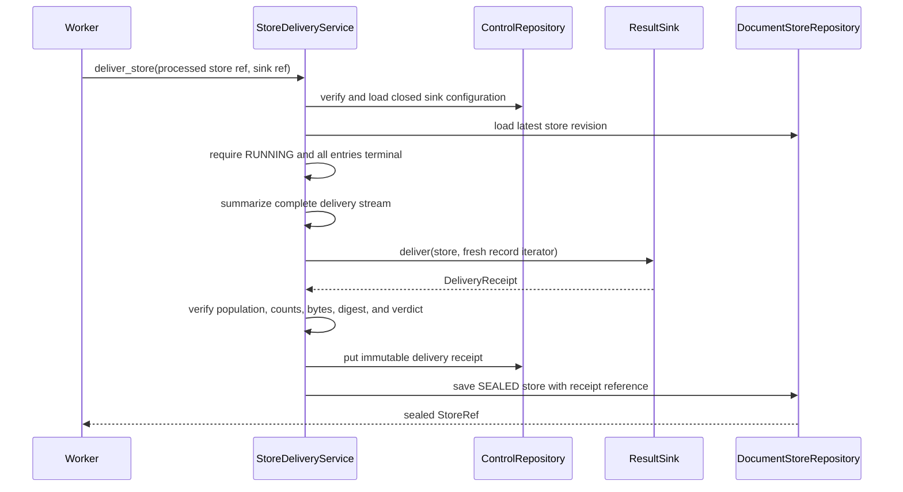
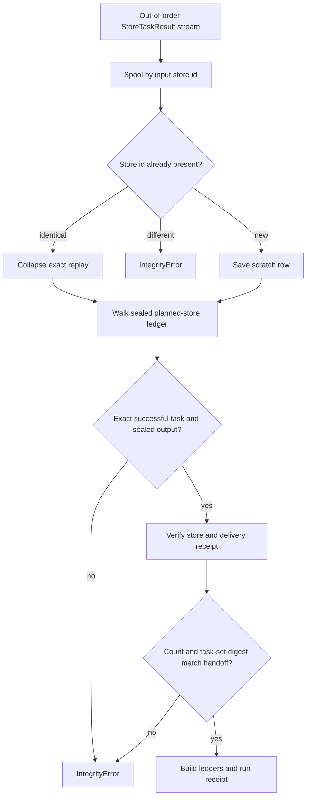
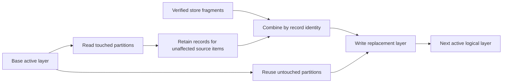
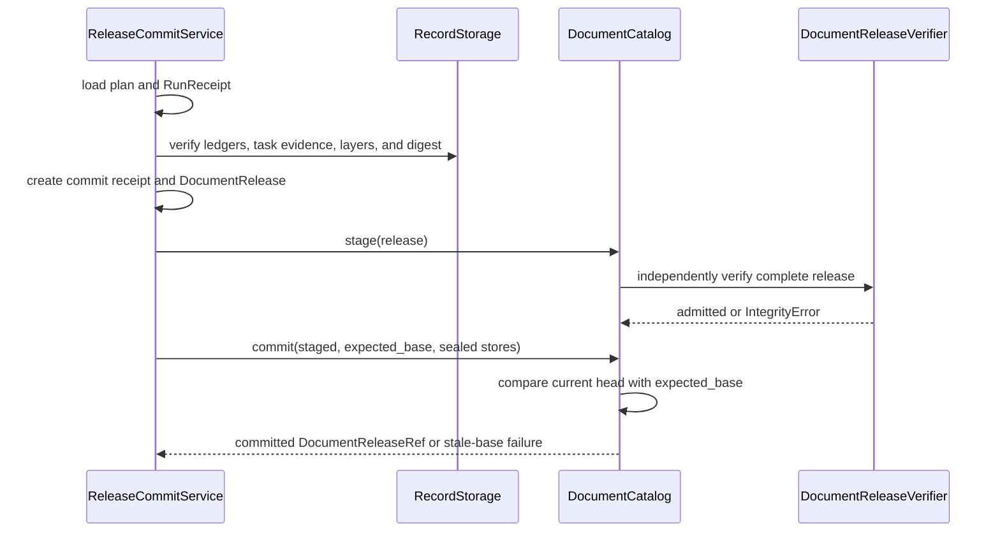
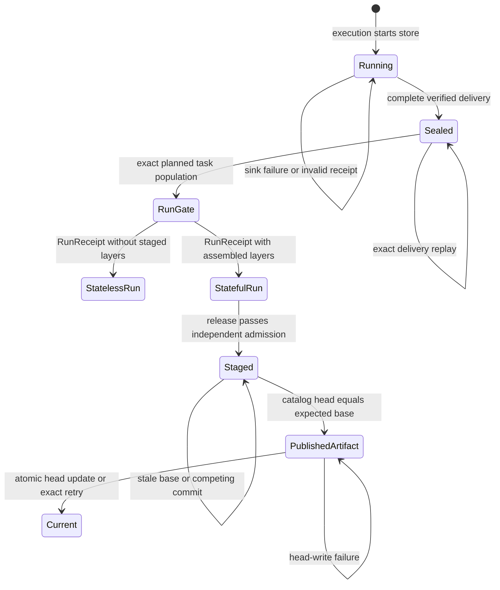

# Document Run Application: Delivery, Reconciliation, and Release

This part of the document-run application turns terminal `DocumentStore` jobs into checked delivery evidence, one reconciled run, and, for stateful runs, one visible `DocumentRelease`. It is the publication boundary: workers may write immutable stores, result fragments, and receipts, but only `ReleaseCommitService` asks the document catalog to advance its current release.

This page covers:

- `src/docspec/application/delivery.py`: `StoreDeliveryService`
- `src/docspec/application/reconcile.py`: `RunReconciler` and the three run-ledger schemas
- `src/docspec/application/commit.py`: `ReleaseCommitService`, `DocumentReleaseVerifier`, and release summary helpers

See [Document Run Application](document_run_application.md) for the complete plan-to-release flow. [Result Delivery and Reconciliation](result_delivery_and_reconciliation.md) owns delivery records, receipts, result sinks, and the reconciliation workspace. [Document Release Artifacts](document_release_artifacts.md) owns the release record and artifact representation. [Storage and Shared References](storage_and_shared_references.md) owns repositories, immutable record layers, blob roots, and references. [Portable Task Execution](portable_task_execution.md) owns execution profiles, handoffs, tasks, and task results. [Processing Plan and Job Model](processing_plan_and_job_model.md) owns the plan, store state, entry dispositions, profiles, and policies used by every gate here.

## Purpose and boundaries

| Question | Answer |
| --- | --- |
| What goes in? | Terminal entries in a running `DocumentStore`, a pinned result-sink reference, successful `StoreTaskResult` values for the exact planned task population, and an optional base release. |
| What happens? | Delivery proves that the sink accepted the complete deterministic record stream and seals each store. Reconciliation verifies the execution population, builds immutable run ledgers, and, for stateful runs, assembles replacement logical layers. Commit verifies the run, builds a release and commit receipt, then asks the document catalog to advance from the expected base. |
| What comes out? | Sealed store references, a `RunReceipt` reference, and, for a publishable stateful run, a `DocumentReleaseRef`. |
| How is it checked? | Each boundary recomputes identities, populations, digests, counts, profile pins, partition policy, and state transitions. `DocumentReleaseVerifier` independently walks the full release graph and retained content before admission. |

This code does not fetch or process source bytes, schedule workers, implement a result sink, store record-layer bytes, or mutate a catalog pointer directly. Those operations sit behind injected ports. The application services decide whether their evidence is complete enough to move to the next state.

## Architecture

```mermaid
flowchart LR
    Running["Running store with terminal entries"]
    Delivery["StoreDeliveryService"]
    Sink["ResultSink"]
    Receipt["DeliveryReceipt"]
    Sealed["Sealed DocumentStore"]
    TaskResult["Successful StoreTaskResult"]
    Reconcile["RunReconciler"]
    Ledgers["Store, selection, and task-result ledgers"]
    Layers["Reconciled active layers"]
    Run["RunReceipt"]
    Commit["ReleaseCommitService"]
    Stage["DocumentCatalog.stage"]
    Verifier["DocumentReleaseVerifier"]
    Release["Verified staged DocumentRelease"]
    Catalog["DocumentCatalog.commit expected base"]
    Current["Current DocumentRelease"]

    Running --> Delivery
    Delivery --> Sink
    Sink --> Receipt
    Receipt --> Delivery
    Delivery --> Sealed
    Sealed --> TaskResult
    TaskResult --> Reconcile
    Reconcile --> Ledgers
    Reconcile --> Layers
    Ledgers --> Run
    Layers --> Run
    Run --> Commit
    Commit --> Stage
    Stage --> Verifier
    Verifier --> Release
    Release --> Catalog
    Catalog --> Current
```



The durable path has three gates:

1. **Store gate:** the sink receipt must describe every record from one processed store before that store becomes sealed.
2. **Run gate:** successful task results must match the complete planned task set before reconciliation writes a `RunReceipt`.
3. **Release gate:** the stateful run, all referenced stores and layers, and their cross-links must verify before the catalog compares and advances its head.

## Component responsibilities

| Component | Responsibility |
| --- | --- |
| `StoreDeliveryService` | Resolves the pinned sink, delivers a stable record stream, checks the returned `DeliveryReceipt`, persists that receipt, and seals the store with its derived verdict. |
| `RunReconciler` | Validates the plan, source-catalog summary, execution profile and handoff, exact terminal task population, sealed stores, delivery receipts, layer fragments, and partition replacements; writes run ledgers and a `RunReceipt`. |
| `ReleaseCommitService` | Refuses unpublishable runs, verifies their durable evidence, builds the commit receipt and release, stages the release, and requests an optimistic catalog commit from the expected base. |
| `DocumentReleaseVerifier` | Independently verifies a complete release and every immutable dependency that must describe the same build. Catalog adapters use it as an admission check. |
| `DeliveryReceipt`, `RunReceipt`, `CatalogCommitReceipt` | Store small, identity-bearing summaries that link bulk immutable data without placing it in coordinator messages. |
| `ResultSink`, `RecordStorage`, `DocumentStoreRepository`, `DocumentCatalog` | Provide replaceable output, layer storage, store history, and release publication operations. |
| `ReconciliationWorkspace` | Supplies bounded scratch storage for reordering task results and joining changed records with base layers. Its contents are disposable; record layers and control artifacts remain authoritative. |

## Evidence chain

Each step saves a small receipt or ledger that names the immutable output from the preceding step. The next step reopens that output and recomputes the fields it can derive from authoritative data.

| Evidence | Written by | Referenced by | Required relationship |
| --- | --- | --- | --- |
| `DeliveryReceipt` | `ResultSink`, then persisted by `StoreDeliveryService` | Sealed `DocumentStore.delivery_receipt` | Names the processed, pre-seal store revision; matches the store's ordered entry population, delivery-record count, canonical byte count, idempotency-key digest, and derived verdict. |
| Planned-store ledger | `DocumentStoreRepository` during planning | `ExecutionHandoff` and `RunReceipt` | Contains every revision-zero planned store once. Its record count equals the handoff's expected task count and the run's terminal store count. |
| Task-result ledger | `RunReconciler` | `RunReceipt` | Contains one successful `StoreTaskResult` per planned input store after exact duplicates collapse. Each result names the handoff and the sealed output store recorded in the store ledger. |
| Store ledger | `RunReconciler` | `RunReceipt`, commit service, release verifier, and document catalog | Contains the exact sealed output-store references in deterministic store-identity order. The digest of that ordered reference sequence is `store_receipt_set_digest`. |
| Selection ledger | `RunReconciler` | `RunReceipt` | Contains one selected source-item row with its store, entry, change, and terminal disposition. Its record count equals `selected_item_count`. |
| Staged logical layers and blob roots | Stateful `RunReconciler` | `RunReceipt` and `DocumentRelease` | The release must copy the exact ordered layer and blob-root references from the run. Each logical layer uses the plan's record-storage profile and partition policy. |
| `CatalogCommitReceipt` | `ReleaseCommitService` | `DocumentRelease` | Names the run, base release, and expected head. Its token digests the base, run reference, store digest, and staged layer references; `prepared_at` equals the run completion time. |

`completedAt`, delivery warnings, and `retriedRecordCount` remain reported receipt metadata. `DeliveryReceipt` requires a completion time and bounds the retry count, but `StoreDeliveryService` cannot reconstruct retry count or warnings from the final record stream. It therefore recomputes delivery completeness from the entry population, accepted/rejected/undelivered outcomes, record and byte counts, idempotency keys, and verdict.

## Store delivery and sealing

`StoreDeliveryService.deliver_store()` starts from a store reference, not a byte-bearing job. It loads the latest store revision, so a worker or scheduler may safely replay an older reference after a later revision has been saved.

The service applies these checks in order:

1. It verifies and loads the sink artifact. The configuration must contain exactly `sinkId` and `profileId`.
2. It resolves the sink by the artifact identifier. The artifact identifier, configured sink identifier, injected `ResultSink.sink_id`, and profile identifier must agree.
3. A new delivery requires a `RUNNING` store whose entries are all terminal.
4. The service independently summarizes `iter_delivery_records(store)` before calling the sink.
5. The sink receives a new iterator over the same deterministic stream and returns a `DeliveryReceipt`.
6. The service compares the receipt with the independently computed entry population, record count, byte count, ordered idempotency-key digest, and store verdict.
7. The receipt must accept every offered record, reject none, leave none undelivered, and provide durable layers or a returned-result acknowledgement.
8. Only then does the service persist the receipt, derive the store verdict, and save the sealed store revision.



The final sealed revision cites a receipt for the preceding processed revision. Delivery and reconciliation therefore check `store.revision - 1` when they re-open a sealed store.

Delivery is replay-safe in two ways:

- If the sink or receiver fails before the receipt passes validation, the service saves no sealed revision. The running store remains available for retry, and stable idempotency keys let the receiver collapse acknowledged records.
- If the latest store is already sealed, the service verifies the existing receipt against the requested sink and current store, then returns the same reference without invoking the sink again.

Replay safety does not provide a delivery lock. Two workers that begin from the same running revision may both call the sink before either saves the sealed revision. A sink and receiver must therefore treat delivery idempotency keys as at-least-once keys, and a store repository must accept only identical immutable content for the same revision or reject the conflict. The scheduler should avoid assigning one store to concurrent workers when it needs single-call delivery semantics.

The built-in durable, returned-result, and hybrid sink behavior belongs in [Result Delivery and Reconciliation](result_delivery_and_reconciliation.md). This application layer treats all three through `ResultSink` and applies the same completeness rule.

## Run reconciliation

`RunReconciler.reconcile_run()` consumes `StoreTaskResult` values. It does not trust their arrival order and does not use a submitted store reference as proof that the store was planned or sealed.

Before reading task results, the reconciler:

- verifies the processing-plan artifact and checks its source catalog and base release against the injected run inputs;
- requires the record partition count to match the plan;
- consumes the immutable source-catalog snapshot and uses its verified summary for run coverage;
- loads the plan's sealed planned-store ledger; and
- verifies the `ExecutionProfile` and `ExecutionHandoff`, including control artifacts, worker composition, planned ledger, base release, task count, and artifact identities.

### Exact task population and replay rules

Incoming task results first enter the reconciliation workspace by the planned input store identifier. The reconciler accepts an exact duplicate as replay, but refuses two different results for the same store. It then walks the sealed planned-store ledger and reconstructs each expected `StoreTask` from the plan identifier, handoff operation, and planned store reference.

For every planned position, it requires:

- one matching successful result;
- the correct handoff identifier and exact reconstructed task;
- a non-null output store reference;
- a sealed output store from the same plan; and
- a delivery-receipt reference on that store.

After the walk, the number of unique results must equal the planned count. The reconstructed task count and ordered task-set digest must equal the handoff. This design accepts out-of-order results and exact duplicates, but rejects missing, extra, conflicting, failed, or nonterminal results.



### Delivery re-verification

Reconciliation does not rely on the delivery service's earlier decision. For each sealed store, it reloads the receipt and recomputes the complete delivery stream. The receipt must agree with:

- the processed store revision;
- ordered entry count and population digest;
- record and canonical-byte counts;
- ordered idempotency-key digest;
- complete acceptance and zero rejected or undelivered records;
- the derived store verdict and the verdict saved on the sealed store; and
- the result-delivery profile pinned by the plan.

It also verifies every durable layer reference, rejects repeated logical layer kinds, and requires durable layers when `stateful=True`.

### Stateful layer assembly

A stateful reconciliation starts with the base release's active layers, if present. For each store, it accepts only core delivery layers and `derived:<processor-id>` layers scheduled by the current plan. Every fragment record must belong to a source item in that store. Fragments for the same logical layer must agree on schema, and an existing logical layer cannot change schema under the same layer kind.

The workspace marks affected source items and their logical partitions. For each layer that needs replacement, it:

1. retains base records in touched partitions for source items that this run did not affect;
2. combines them with new fragment records for affected source items;
3. writes one replacement logical layer, using the base layer and `replace_partitions` so `RecordStorage` can reuse untouched partitions; and
4. removes an obsolete derived layer when its processor left the plan and the replacement becomes empty.

All core layer kinds remain part of the assembled state, including empty core layers. Derived layers may only name processors pinned by the current plan. `DocumentReleaseVerifier` later requires the final release to contain the derived layers expected by that plan and rejects unplanned derived layers.



The local SQLite workspace bounds process memory and enforces per-record and total spool limits. It deletes its scratch database when reconciliation ends. A failed reconciliation may leave safe, immutable layer objects in record storage, but it writes no authoritative `RunReceipt` until all ledgers and summaries verify.

### Stateless runs

A stateless run still verifies the plan, handoff, complete task population, sealed stores, delivery receipts, coverage, counts, and immutable run ledgers. It skips logical-layer assembly and records `staged_layers=()` in `RunReceipt`. This mode supports returned results without advancing the document catalog.

`ReleaseCommitService` refuses every stateless run. A hybrid or returned-result acknowledgement proves delivery; it does not make a stateful release.

## Immutable run evidence

Reconciliation writes three record layers before it creates the small `RunReceipt`:

| Evidence | Layer kind | What it proves |
| --- | --- | --- |
| Planned-store ledger | Owned by `DocumentStoreRepository` and cited by the run | The immutable store population sealed during planning. |
| Store ledger | `run-store-receipts` | The exact sealed output-store reference for each planned store. Its store-identity-ordered reference digest becomes `store_receipt_set_digest`. |
| Selection ledger | `run-selection` | The selected source item, store, entry, change kind, and terminal disposition. |
| Task-result ledger | `execution-task-results` | The exact terminal `StoreTaskResult` for each planned task. |
| `RunReceipt` | Control artifact `run-receipts` | The plan, execution evidence, source catalog, base release, ledgers, staged layers, blob roots, counts, failures, coverage, partition policy, run mode, and completion time. |

The run receipt contains references and summaries rather than bulk rows. Commit and release verification reopen the immutable layers and recompute the important counts and digests.

Blob roots follow the same fail-closed rule. Reconciliation sorts them by artifact identifier, collapses equal references, and rejects two different references that claim the same artifact identifier.

## Release commit and optimistic head check

`ReleaseCommitService.commit_release()` is the only application service in this path that can make staged state visible. It first loads the pinned plan and requested run receipt, then requires the run to name that plan and the requested base release. It refuses stateless runs and runs with any rejected store.

An exact replay has a fast path: if the current release already names the same previous release and run receipt, the service returns that current reference. Otherwise it verifies the run ledgers, execution evidence, record-storage profiles, distinct sorted active layer kinds, active layer references, and store-ledger digest.

The service then:

1. computes `catalog_commit_token_digest()` over the base release, run receipt, store-receipt-set digest, and staged layers;
2. creates an immutable `CatalogCommitReceipt` with `expected_head` equal to the requested base;
3. recomputes release counts from active layers and blob roots, the active failure summary from the failure layer, and coverage from the run plus active source-item count;
4. creates and stages the `DocumentRelease`;
5. streams the exact store references from the run ledger to `DocumentCatalog.commit()`; and
6. passes `expected_base` to the catalog and checks that the returned release identifier matches the staged release.



The optimistic head comparison belongs to `DocumentCatalog.commit()`. If another release advances the catalog after this run's base was chosen, the catalog refuses the stale commit instead of merging it implicitly. Catalog implementations also check that cited stores are sealed. Exact commit replay returns the existing release, including recovery after immutable publication succeeded but the head update failed.

The local manifest catalog serializes the final compare-and-commit section with an exclusive commit lock. A competing writer receives `StateTransitionError`; a writer that acquires the lock after another release advanced the head receives `StaleBaseError`. The catalog removes the lock in a `finally` block. Staging remains immutable and may finish before either refusal. Catalog callers can retry the exact staged artifact, and rerunning `ReleaseCommitService` restages the same release content. This lock protects catalog visibility; it does not serialize delivery or reconciliation.

## Independent release verification

`DocumentReleaseVerifier.verify()` treats the release as an untrusted graph even when the same process just built it. Its checks cover these layers of evidence:

1. **Artifact identities:** deserialize the plan, run receipt, and commit receipt and require each semantic identity to match its reference.
2. **Cross-links:** require the release, plan, run, and commit receipt to agree on source catalog, base release, profiles, retention policy, active layers, blob roots, store digest, partition policy, completion time, and commit token.
3. **Publishability:** require a stateful run with no rejected stores and a catalog profile pinned by the plan.
4. **Expected layers:** require all core logical layers and every current processor's derived layer; reject derived layers that the plan does not govern.
5. **Run ledgers:** verify layer bytes, kinds, record profile, partition policy, the planned-store ledger, and the execution profile, handoff, and task-result population.
6. **Active layers and blob roots:** verify each active layer and its pinned record profile and partition policy. Verify each blob-root control record against the pinned blob-storage profile.
7. **Cross-layer lineage:** stream all logical layers through `verify_logical_release_layers()`. This check rebuilds a bounded SQLite index, validates closed domain records and idempotency keys, follows source-to-file-to-representation-to-segment-to-derived relationships, verifies stage artifacts, and verifies every retained blob when a blob store is available.
8. **Store population:** stream the run's store ledger, load each sealed store, require the plan identifier, and recompute the store-receipt-set digest and count.
9. **Release summaries:** recompute active-layer and blob-root counts, active source coverage, and the failure summary from persisted records.

This depth separates schema validity from semantic integrity. A JSON object can match its schema and still cite an unrelated plan, layer, store, receipt, blob root, or predecessor; release admission rejects those combinations.

## State and failure behavior



The services use two main error classes:

- `StateTransitionError` reports a valid object used at the wrong lifecycle point, such as delivery before every entry is terminal or an attempt to publish a stateless or rejected run.
- `IntegrityError` reports evidence that disagrees, has an open or wrong shape, names an unpinned profile, repeats or omits an identity, crosses a store or source boundary, or fails a digest or lineage check.

The catalog may raise its stale-base error when the current head differs from `expected_base`. Storage and receiver failures propagate without converting incomplete work into a sealed store, run receipt, or current release.

Reconciliation may write content-addressed layer objects before a later check fails. Those objects remain unreferenced staging products: without a verified `RunReceipt` and successful catalog commit, they do not become current release state. A commit may likewise leave a valid staged or published artifact after the head write fails; exact replay completes the pointer update after re-verification.

## Extension and contribution guidance

Choose the owner that controls the rule:

| Change | Required work |
| --- | --- |
| Add a result sink | Implement `ResultSink`, preserve the stable delivery order and idempotency keys, return a receipt for the complete stream, and prove interrupted and completed replay. Keep sink-specific details in [Result Delivery and Reconciliation](result_delivery_and_reconciliation.md). |
| Add a run-ledger field | Version the `RecordSchema`, update reconciliation writes and commit reads together, and add tamper, missing-field, ordering, and replay tests. |
| Change task execution evidence | Update `ExecutionProfile`, `ExecutionHandoff`, `StoreTaskResult`, reconciliation, `_verify_execution_evidence()`, and [Portable Task Execution](portable_task_execution.md) as one change. |
| Change layer partitioning or replacement | Preserve deterministic record order, source-item partitioning, unaffected-record retention, untouched-partition reuse, schema stability, and bounded scratch use. |
| Add or remove a processor layer | Keep plan invalidation, allowed delivery kinds, retired-layer cleanup, expected release layers, and cross-layer verification aligned. See [Processing Plan and Job Model](processing_plan_and_job_model.md). |
| Change a receipt or release identity | Update the domain identity content, all producers, all independent verifiers, artifact fixtures, and replay tests. Never accept an old identity with new meaning. |
| Add a document catalog adapter | Implement stage, open, current, and compare-and-commit behavior; run the shared catalog conformance suite; preserve exact replay, stale-base refusal, sealed-store admission, and recovery between immutable publication and head update. |
| Change concurrent execution behavior | Keep delivery idempotency separate from mutual exclusion. Test simultaneous calls, conflicting immutable revisions, catalog lock contention, stale-head refusal, lock cleanup, and exact retry after partial publication. |

Keep publication checks independent from construction. A new producer path must pass the same `DocumentReleaseVerifier` checks as an existing release reopened later.

## Focused verification

Run the focused checks from the repository root:

```bash
uv run pytest \
  tests/test_result_sinks_and_recovery.py \
  tests/test_application_pipeline.py \
  tests/test_reconciliation_workspace.py \
  tests/test_storage_records_catalog.py \
  tests/test_release_integrity.py \
  tests/conformance/test_result_sink_contract.py \
  tests/conformance/test_recovery.py \
  tests/conformance/test_document_catalog_contract.py \
  tests/conformance/test_document_release_integrity.py
uv run ruff check \
  src/docspec/application/delivery.py \
  src/docspec/application/reconcile.py \
  src/docspec/application/commit.py \
  src/docspec/domain/delivery.py \
  src/docspec/domain/receipts.py \
  src/docspec/domain/release.py
```

These suites cover complete and dropped delivery streams, outcome accounting, durable and returned-result replay, stateful and stateless behavior, bounded workspace cleanup, exact planned-task matching, out-of-order and duplicate task results, missing and conflicting results, partition reuse, stale and unsealed commits, crash recovery around the head update, cross-series tampering, blob-root verification, retained-blob tampering, and cross-layer lineage.
