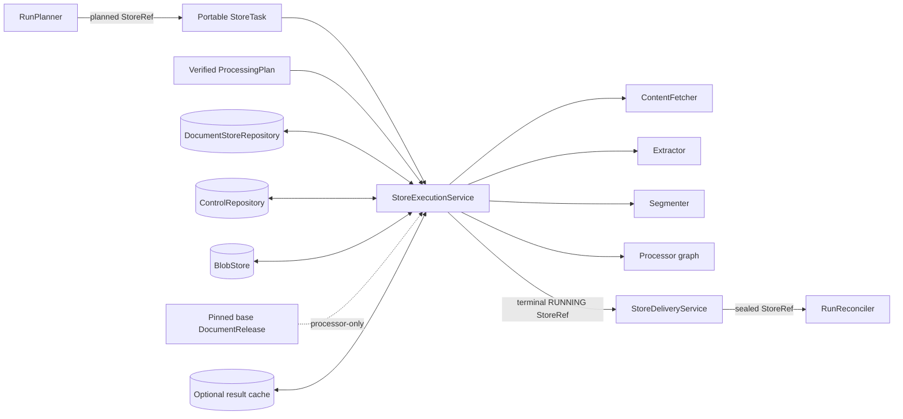
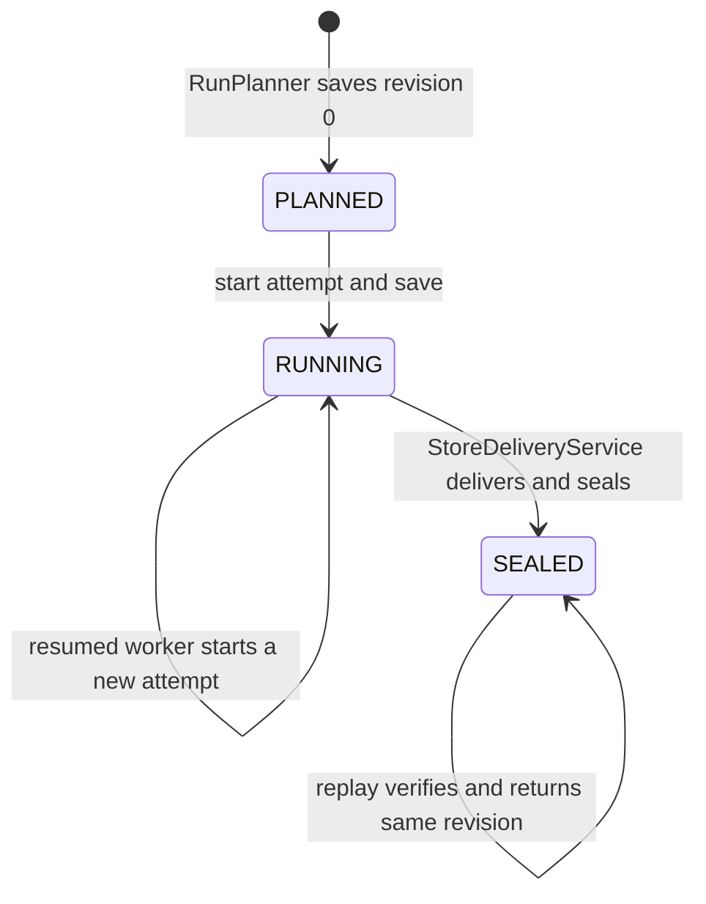
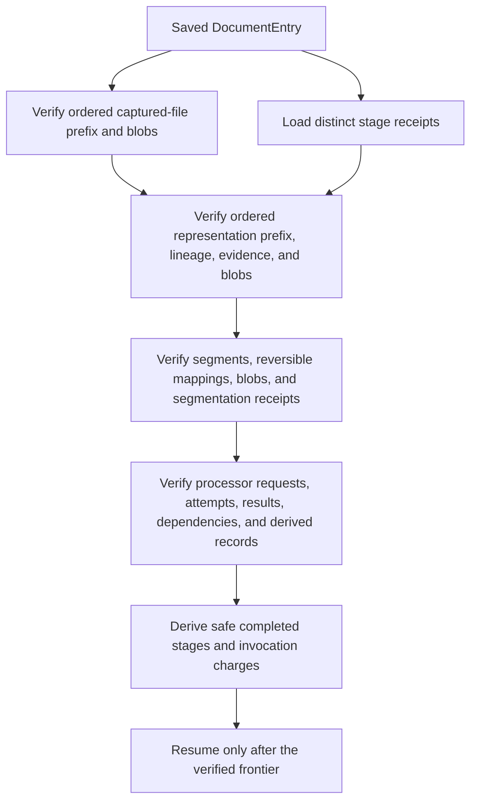
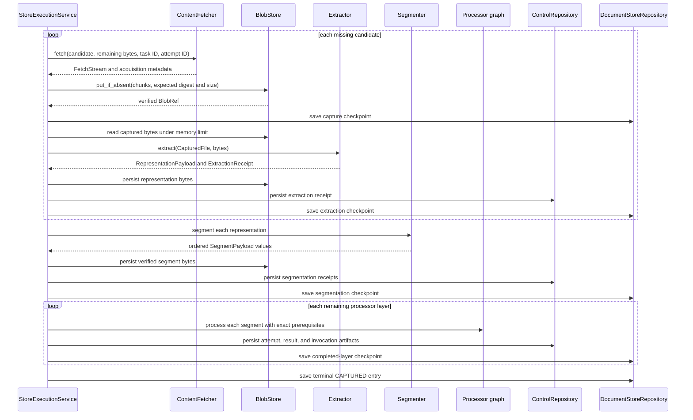
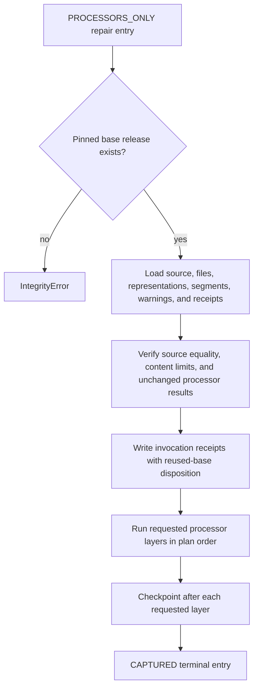
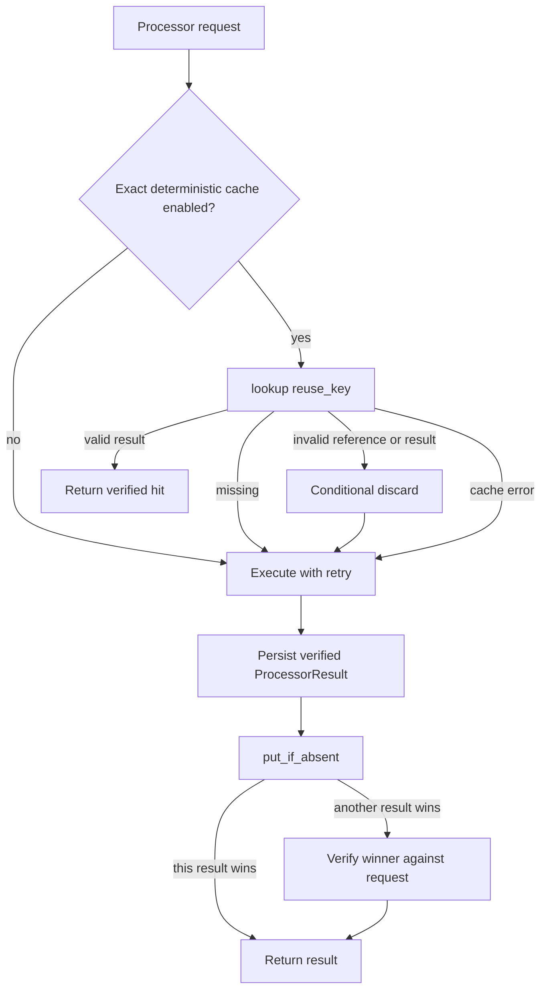

# Document Run Application: Store Execution and Recovery

Store execution turns one planned `DocumentStore` reference into a durable, terminal store revision. It acquires and processes content, verifies every reusable checkpoint, enforces the plan's work and policy limits, and returns another small `StoreRef`. It does not plan work, schedule tasks, deliver records, reconcile a run, or publish a release.

This page covers:

- `src/docspec/application/execution.py`: `StoreExecutionService` and its checkpoint, processing, retry, cache, and result-verification logic;
- `src/docspec/application/work_budget.py`: `WorkBudget`, `WorkUsage`, and `MemoryScope`; and
- `src/docspec/application/store_state.py`: latest-revision recovery through `load_latest_store()`.

See [Document Run Application](document_run_application.md) for the five-stage run lifecycle. See [Content Acquisition and Processing](content_acquisition_and_processing.md) for fetcher, extractor, segmenter, representation, and evidence details. [Processor Extension Model](processor_extension_model.md) owns processor descriptions, requests, results, and cache policy. [Portable Task Execution](portable_task_execution.md) owns the scheduler-facing `StoreTask` and `StoreTaskResult` boundary.

## Purpose and boundary

| Question | Answer |
| --- | --- |
| What goes in? | A `StoreRef` for a planned, partially processed, or already sealed store; a verified `ProcessingPlan` reference; and injected repositories, processing ports, processors, policies, clocks, and an optional processor cache. |
| What happens? | The service loads the newest durable revision, validates the plan and any saved work, starts a worker attempt, processes each unfinished entry, and saves immutable revisions at safe restart points. |
| What comes out? | Normally, a `StoreRef` for a `RUNNING` store whose entries all have terminal `AcquisitionDisposition` values. A replay against an already sealed store returns that verified `SEALED` revision. `StoreDeliveryService` handles the normal transition from `RUNNING` to `SEALED`. |
| How is it checked? | Stable identities, closed receipt shapes, content digests, lineage checks, plan pins, processor-result validation, resource limits, and focused recovery tests prove that reused work matches the requested run. |

The module keeps scheduler messages small. A worker receives and returns references; it reads bulk bytes from `BlobStore` only while extracting, segmenting, or invoking a processor.

## System context



The application layer controls order and governance. Domain records define valid state. Ports isolate storage and processing implementations. The execution service composes those pieces but does not select concrete local, HTTP, S3, parser, scheduler, or provider adapters.

## Component responsibilities

| Component | Responsibility |
| --- | --- |
| `StoreExecutionService` | Executes one bounded store, validates durable progress, invokes stages in order, persists receipts and revisions, and maps caught stage failures to terminal entry dispositions. Preflight, checkpoint-validation, and store-revision persistence errors fail the worker call. |
| `_VerifiedEntryCheckpoint` | Holds a worker-local interpretation of a verified entry: completed content stages, completed processor layers, exact processor results, and charged invocation identities. It is never serialized as a cursor. |
| `load_latest_store()` | Loads the requested revision, then prefers a newer revision for the same store identity when the repository reports one. Both revisions cross the repository's normal verification boundary. |
| `WorkBudget` | Applies aggregate source-byte, page or frame, segment, processor-cost, memory, and elapsed-time limits to one worker attempt. Stable charge identities prevent duplicate accounting. |
| `WorkUsage` | Exposes current cumulative and memory counters for observation and tests. It does not persist execution state. |
| `MemoryScope` | Owns materialized-byte reservations for one entry and releases every outstanding reservation on success, failure, or exception exit. |

The main injected ports are `DocumentStoreRepository`, `ControlRepository`, `DocumentCatalog`, `BlobStore`, `ContentFetcher`, `Extractor`, `Segmenter`, `Processor`, and optional `ProcessorResultCache`. The service depends on their interfaces, not their adapters. The processor mapping may contain additional implementations, but every identifier selected by the plan must resolve to an implementation whose description has the same `processor_id`.

## Public execution contract

`execute_store(planned_document_store_ref)` performs the following work:

1. Verify and load the pinned `ProcessingPlan`.
2. Load the requested store revision and prefer a newer durable revision with the same `store_id`.
3. Require the store's `plan_id` to equal the loaded plan's `plan_id`.
4. If the newest store is sealed, reverify its terminal entries and delivery-receipt artifact, then return the same reference.
5. Verify every terminal and partial entry before charging or reusing any saved work.
6. Reconstruct cumulative budget charges from the verified entries.
7. Open the pinned base release only when at least one entry requests processor-only repair.
8. Start and save a new store attempt.
9. Process unfinished entries in their planned order, saving immutable checkpoints at safe frontiers.
10. Return the newest store reference after all entries become terminal.

The active execution path deliberately stops before delivery and returns a `StoreState.RUNNING` store. [Result delivery and reconciliation](result_delivery_and_reconciliation.md) owns receipt validation, verdict selection, and the transition to `SEALED`; the sealed replay short-circuit performs neither operation again.

## Store and revision lifecycle



`DocumentStore.store_id` remains stable across revisions because it identifies the plan, logical partition, and ordered entry population. Each state change increments `revision`; a checkpoint cannot add, remove, or reorder entry identities.

At the start of a worker attempt, the service derives an attempt identifier from `store_id` and the next attempt number. It calls `DocumentStore.start()`, which accepts either a planned or running store, increments the revision, and records that attempt once. A restart therefore adds a worker attempt and one starting revision without changing the planned work.

`load_latest_store()` first loads the caller's reference. It then asks the repository for the latest revision and uses it only when its revision number is greater. This behavior supports stale task replay while still refusing an invalid requested reference.

### Checkpoint cadence

For full execution, the service saves a checkpoint:

- after a candidate has been captured, before extraction begins;
- after that candidate's representation and extraction receipt have been persisted;
- after segmentation has completed for all representations;
- after each complete processor layer; and
- after the entry receives its terminal disposition.

The capture checkpoint matters during hard failure. If extraction crashes after producing in-memory output but before the extraction checkpoint, the next worker reuses the captured blob and reruns extraction. It never refetches that verified candidate.

## Checkpoint verification and resume frontiers

A checkpoint is a set of immutable records and artifact references, not a trusted stage number. `_verify_entry_checkpoint()` reconstructs progress only after it validates the complete saved relationship graph.



### Durable frontier rules

| Saved work | Required shape | Safe reuse decision |
| --- | --- | --- |
| Captured files | Candidate identities form an ordered prefix of `SourceItem.candidates`. Source identity, version, media type, transport version, expected digest, expected size, and blob bytes agree. | Reuse each verified capture. Fetch only the first missing candidate. |
| Representations | Representation file identities form an ordered prefix of captured files. A checkpoint may have no unmatched capture or one captured file awaiting extraction. Extractor identity, file lineage, evidence ranges, and blob bytes agree. | Reuse each verified representation. Rerun only incomplete extraction. |
| Extraction receipts | There is exactly one valid receipt per representation, in representation order. Receipt inputs, output digest and size, kind, extractor configuration, and warnings match the immutable representation. | Extraction is complete only when every candidate is captured and represented. |
| Segments and receipts | Segments refer to known representations, reproduce their reversible evidence ranges, and pass blob verification. Segmentation receipts cover a representation prefix, and their flattened segment identifiers equal the entry's ordered segments. | A nonterminal checkpoint may stop before segmentation or after all segmentation; it may not stop inside segmentation. |
| Processor results | Invocation and attempt receipts have closed shapes and semantic artifact identities. Requests, dependencies, results, resources, and derived records agree. | Full execution resumes after a complete processor layer. It may not resume from the middle of a layer. |
| Processor-only results | Unaffected base results plus completed requested layers form the exact allowed set. Completed requested processors follow the requested order. | Resume the first incomplete requested processor layer without rerunning base reuse or completed layers. |

The service rejects duplicate stage-receipt references, unknown receipt formats, invalid semantic artifact identifiers, noncontiguous retry sequences, results without prerequisites, and stage output that breaks source lineage. It performs these checks before fetcher, extractor, segmenter, or processor work restarts.

Terminal entries receive the same validation. A `CAPTURED` entry must cover every planned content and processor stage. Metadata-only `UNCHANGED`, `DELETED`, and `EXCLUDED` entries must contain no captured files, representations, segments, derived records, or stage receipts. A terminal failure may retain a verified partial frontier and failed processor-attempt receipts for diagnosis; the executor skips it on replay.

## Full entry execution

Full execution handles an added, changed, or broad repair entry. It processes ordered candidates, then runs the processor graph over the resulting ordered segments.



### Acquisition

Each source candidate gets a stable acquisition task identifier. Each transport attempt also names the current store attempt and retry number. The fetcher receives the budget's remaining source-byte count. `BlobStore.put_if_absent()` consumes the stream while enforcing the candidate's optional expected digest and size and the remaining hard byte limit.

The `FetchStream` context closes the iterator and source on success or failure. Only a successfully verified `CapturedFile` charges source bytes. A failed transport attempt may read bytes, but it does not count as a second durable source object.

Acquisition has its own retry loop. It retries only failures classified as transient external or transient resource errors, up to the pinned `RetryPolicy.max_attempts`. Each failed attempt becomes an entry `FailureRecord`; a later successful capture can therefore leave diagnostic failures on an otherwise `CAPTURED` entry.

Fetcher containment, redirect, streaming, and transport-version behavior belongs to [Content Acquisition and Processing: Acquisition](content_acquisition_and_processing_acquisition.md).

### Extraction

The worker reserves memory for the captured blob, reads it with `max_memory_bytes`, and invokes the injected extractor. The returned extractor identity, or an injected registry identity, must appear in `plan.stages.extractor_ids`.

The service charges observed `pageCount` or `frameCount` metadata. If neither field exists, an image counts as one frame and other representation kinds count as zero. It persists representation bytes by expected digest and size, stores a semantic extraction receipt, and checkpoints both records together.

When extraction returns the same bytes object as the source, `MemoryScope.rename()` transfers the reservation from the source identity to the representation identity. Otherwise, the service reserves the representation bytes before releasing the source bytes. This ordering enforces the true peak materialization.

Extraction details and evidence mappings belong to [Content Acquisition and Processing: Extraction and Evidence](content_acquisition_and_processing_extraction.md).

### Segmentation

Before segmentation, the injected registry's `segmenter_id` must equal the plan's pinned identifier. For each representation, the service:

1. invokes `segment()`;
2. charges the actual segment count;
3. verifies every `SegmentPayload` against the representation and its evidence mapping;
4. reserves and persists each segment's bytes;
5. releases the representation reservation; and
6. stores a `SegmentationReceipt` with the ordered segment identifiers.

The service checkpoints after it completes all representations. It reloads and re-verifies representation and segment blobs when a restart needs worker-local payloads for a later stage.

Boundary policies and reversible evidence behavior belong to [Content Acquisition and Processing: Segmentation](content_acquisition_and_processing_segmentation.md).

### Processor graph

The plan supplies a topologically valid processor order. The executor completes one processor across every segment before advancing to the next processor. Each dependency lookup uses the same segment identifier, so a processor sees only results from its declared prerequisite edges.

For each processor and segment, the service:

- checks that the description accepts the `docspec-segment/1` schema and the actual segment media type;
- derives a stable invocation identifier from entry, processor, and segment identities;
- creates a `ProcessorRequest` that pins the plan, processor-description digest, exact input record, prerequisite result references, allowed fields, item limits, cache-key schema, and invocation identity;
- builds a worker-local `ProcessorPayload` containing only fields allowed by the data-use policy;
- invokes or reuses a result;
- verifies the result and its derived records; and
- saves a processor-invocation receipt before checkpointing the completed layer.

Derived records are flattened in plan execution order and sorted by `derived_id` inside each processor. This stable order makes checkpoint comparison and release delivery deterministic.

## Processor-only repair

Processor-only execution rebuilds an invalid processor subgraph while reusing exact content from the pinned base release. The planner marks these entries `EntryExecutionMode.PROCESSORS_ONLY` and requests the changed processors plus their affected dependents.



The mode enforces these conditions:

- the plan names a base release;
- requested processors form an ordered subset of the current plan stages;
- extractor and segmenter identities remain unchanged;
- the base release contains exactly the planned `SourceItem` for the entry;
- base files, representations, segments, warnings, and nonprocessor receipts deserialize and verify;
- segment count stays within the current plan's processor-only limit;
- every unaffected current processor has an exact result for every segment, with its declared prerequisites; and
- base derived layers contain exactly the records covered by those verified results.

The service creates current invocation receipts for unaffected results with `cacheDisposition: "reused-base"`. It does not copy their attempt receipts or call the result cache. It omits processors removed from the current plan and runs only requested current processors. A repair with no requested processors can therefore retire removed derived layers without fetching or reprocessing content.

| Concern | Full execution | Processor-only execution |
| --- | --- | --- |
| Source acquisition | Fetch missing candidates. | Reuse pinned base files; no fetch. |
| Extraction and segmentation | Run missing stages or load verified checkpoints. | Reuse exact base representations and segments. |
| Processor population | Run every incomplete planned layer. | Reuse unaffected current results and run only requested layers. |
| Budget seeding | Restore source bytes, observed pages or frames, segments, and processor invocations. | Charge only requested processor invocations; base content work is reused rather than repeated. |
| Required release | Optional for ordinary full work. | A pinned base release is mandatory. |

A resumed processor-only checkpoint must still match base content and unaffected base results. Tampering with any referenced receipt fails before the service invokes another processor.

## Retries and failure evidence

The service separates transport retry evidence from processor retry evidence.

| Operation | Retry behavior | Durable evidence |
| --- | --- | --- |
| Candidate acquisition | Retry transient external and transient resource failures. Delay comes from the pinned retry policy and stable acquisition task identity. | Failed attempts become entry `FailureRecord` values. Successful capture records downloader, task, attempt, timing, transport, and blob evidence. |
| Extraction | No stage-local retry loop. A caught failure terminates the entry under accepted-failure policy. Only an abrupt worker loss before the failure or output becomes terminal lets a replay rerun extraction from the capture checkpoint. | Successful extraction has an `ExtractionReceipt`; failure has an entry `FailureRecord`. |
| Segmentation | No stage-local retry loop. A failure terminates the entry. | Successful representations have `SegmentationReceipt` artifacts; failure has an entry `FailureRecord`. |
| Processor invocation | Retry transient errors up to `RetryPolicy.max_attempts`. Deterministic backoff and jitter use the invocation identity. | Every attempt has a `docspec-processor-attempt-receipt`. A successful or cached result has one invocation receipt. |

The processor budget charges the stable invocation once before cache lookup or retry. Three attempts for one processor-segment node therefore consume one unit of aggregate processor cost, while the receipts preserve all three attempts.

Attempt receipt verification requires a contiguous sequence beginning at one. No attempt may follow a successful attempt. Executed results require a successful final attempt; cache hits require no attempt; `reused-base` results forbid local attempts. A terminal failed entry may retain a final failed sequence, but a resumable nonterminal checkpoint may not contain an unsettled processor attempt.

`RetryPolicy.max_attempts` limits each candidate-acquisition loop and each processor-invocation loop. `StoreExecutionService` does not use that value to cap whole-worker restarts; task-attempt limits and deadlines belong to the execution backend described in [Portable Task Execution](portable_task_execution.md). Each worker restart still adds a stable store-attempt identifier and reconstructs prior work from verified checkpoints.

### Failure boundary

The executor turns errors from acquisition, extraction, segmentation, and processor invocation into entry failures when those errors occur inside the stage handlers. The last `FailureRecord` then determines `ACCEPTED_FAILURE` or `REJECTED_RUN` through `AcceptedFailurePolicy`.

Errors outside those handlers propagate from `execute_store()` instead of becoming acceptable document outcomes. This fail-closed boundary includes an invalid plan or injected composition, an unreadable store revision, a broken saved checkpoint, base-release integrity errors discovered before processor-only work, a failed checkpoint save, and a failed terminal-entry verification. Callers should treat these as worker or infrastructure failures and must not convert them into successful store results.

## Exact-result cache

The processor cache is optional and disposable. It can improve performance, but it cannot establish truth. The service enables it only when:

- a cache implementation is injected;
- the processor declares deterministic behavior; and
- its cache policy uses `ProcessorCacheMode.EXACT_INPUTS`.



| `cacheDisposition` | Meaning |
| --- | --- |
| `bypassed` | Cache was absent or disabled for this processor. |
| `miss` | Lookup found no result; the processor executed. |
| `hit` | A previously stored or concurrent winning result passed full verification. |
| `invalid` | Lookup returned an invalid reference or result; the service discarded it conditionally and recomputed. |
| `unavailable` | A cache operation failed; processing continued without treating cache availability as required state. |
| `reused-base` | Processor-only execution reused a verified result from the pinned base release. |

A cache hit must match the current reuse key, exact segment identity, processor description, allowed fields, prerequisites, and resource declarations. Physical blob relocation does not change `ProcessorRecordRef` because its digest uses the logical blob digest, size, and media type rather than the locator.

## Plan, data-use, and provider enforcement

The executor checks its injected composition against the sealed plan before work begins:

- injected retry and accepted-failure policy digests equal the plan's digests;
- `WorkLimits.max_attempts` equals `RetryPolicy.max_attempts`;
- each scheduled processor registry key equals its description's `processor_id`;
- descriptions resolved for the plan's scheduled processor identifiers form the exact `ProcessorSet` pinned by the plan;
- each description pins the plan's data-use and retry policy digests; and
- an externally executing processor appears only under a data-use policy that permits external processing.

`ProcessorPayload.for_segment()` projects the allowed field set. Content bytes count toward processor input bytes only when `content` is allowed. A processor with dependencies also requires `prerequisiteResults` in the allowed set; otherwise execution fails before invocation.

`_validate_processor_result()` checks:

- result request identity or cache reuse identity;
- output media type and exact external resource identities;
- provider evidence presence and evidence modes for external work;
- absence of provider evidence for local work;
- agreement between declared execution scope and external request count;
- provider receipt fields, including processor description, inputs, schema, configuration, and policy digests;
- input record, input byte, output record, output byte, and duration limits;
- reported resource use against recomputed input and output sizes; and
- every derived record's processor, source, schema, ordered input identifiers, and disposition.

This validation runs after a live invocation, on cache hits, during checkpoint replay, and while reusing base-release results.

## WorkBudget and MemoryScope

`WorkBudget` applies the sealed plan's actual-work limits, not only the planner's estimates.

| Limit | Runtime accounting |
| --- | --- |
| `maxEstimatedBytes` | Cumulative bytes in successfully verified captured source blobs. The historical field name says “estimated,” but execution uses it as the hard source-byte budget. |
| `maxPagesOrFrames` | Observed extraction metadata. Resume reconstruction counts distinct PDF pages, one frame per image, and zero for other kinds. |
| `maxSegments` | Actual segments produced for each representation. |
| `maxProcessorCost` | One charge per stable processor invocation identity, including zero-output or abstaining invocations. Retries do not add charges. |
| `maxMemoryBytes` | Current materialized source, representation, and segment bytes held by the worker. Peak memory remains observable after release. |
| `maxDurationSeconds` | Elapsed monotonic time for the active worker attempt. Scheduler idle time between attempts is outside this timer. |
| `maxAttempts` | Must agree with the injected retry policy; acquisition and processor retry loops use it. |

`WorkLimits.max_entries` is enforced when `DocumentStore` is constructed and when the planner fills a store. `WorkBudget` does not recount entries during execution because the immutable store identity fixes their ordered population.

Every cumulative charge uses a stable identity. Repeating the same identity and amount is idempotent. Reusing an identity with a different amount is an integrity error. A new charge that crosses its limit raises `LimitExceededError` before the budget records it.

At resume, the service first verifies every entry and receipt. Only then does `seed_verified_entries()` reconstruct source, page or frame, segment, and processor charges. This order prevents corrupted checkpoints from manufacturing or avoiding budget usage.

### Memory ownership

`MemoryScope` tracks reservations owned by one entry:

- `reserve(identity, bytes)` adds a current reservation and updates peak usage;
- `release(identity)` frees an owned reservation;
- `rename(source, destination)` transfers ownership without changing current bytes; and
- `close()` releases every outstanding reservation exactly once.

The scope rejects unknown releases, duplicate destinations, changed reservation sizes, and use after close. Its context-manager exit closes the scope even when parsing, storage, or processor code raises an exception.

## Terminal dispositions and error behavior

| `AcquisitionDisposition` | Meaning in execution |
| --- | --- |
| `CAPTURED` | All requested content and processor stages completed and passed terminal verification. |
| `UNCHANGED` | Planning identified metadata-only unchanged work. Execution verifies and skips it. |
| `DELETED` | Planning supplied a deletion entry. Execution verifies and skips it. |
| `EXCLUDED` | Planning supplied an excluded entry. Execution verifies and skips it. |
| `ACCEPTED_FAILURE` | The last entry failure matches the injected accepted-failure policy. Partial verified work and diagnostic evidence may remain. |
| `REJECTED_RUN` | The last entry failure is outside the accepted-failure policy. Delivery may seal a rejected store, but release commit refuses a run containing rejected stores. |

The service classifies exceptions consistently:

| Exception | `FailureClass` | Retryable |
| --- | --- | --- |
| `LimitExceededError` | `DETERMINISTIC_INPUT` | No |
| `IntegrityError` | `ARTIFACT_INTEGRITY` | No |
| `MemoryError` | `TRANSIENT_RESOURCE` | Yes |
| `TimeoutError`, `ConnectionError`, `OSError` | `TRANSIENT_EXTERNAL` | Yes |
| `ValueError`, `TypeError` | `DETERMINISTIC_INPUT` | No |
| Any other exception | `IMPLEMENTATION_DEFECT` | No |

The diagnostic code records the stage and exception type without copying provider messages. Detail text also names only the stage and exception class. `AcceptedFailurePolicy` forbids `ARTIFACT_INTEGRITY` and `IMPLEMENTATION_DEFECT` in `accepted_classes`; its separate `accepted_diagnostic_codes` match exact diagnostic codes independently. Review both policy fields when deciding whether a specific failure can become `ACCEPTED_FAILURE`.

An exhausted processor retry sequence is preserved in attempt receipts, then the enclosing processing failure becomes the entry's terminal `FailureRecord`. A successful retry keeps the failed attempt receipts but does not add those processor attempts to entry failures.

## Invariants to preserve

Changes to this module must preserve these properties:

- **Reference-only task boundary:** workers accept and return `StoreRef`; bulk content stays behind storage and processing ports.
- **Pinned composition:** plan, policies, stage identities, processor descriptions, resources, and base release agree before reuse or invocation.
- **Immutable recovery:** each resume begins with repository, artifact, blob, lineage, and receipt verification.
- **Ordered progress:** candidates, representations, segments, processors, and entries retain their planned order.
- **Coarse safe checkpoints:** a nonterminal revision stops only after a capture, extraction result, complete segmentation stage, or complete processor layer.
- **Stable accounting:** durable logical work charges once across checkpoint recovery and processor retry.
- **Exact processor graph:** a node receives only its segment and declared prerequisite results.
- **Policy-limited payloads:** processors receive only allowed fields, and external work supplies the required provider evidence.
- **Cache independence:** removing or losing the cache changes performance, not accepted output or verification.
- **Explicit visibility boundary:** execution never seals or publishes; delivery and commit remain separate operations.

## Extension and contribution guide

### Changing checkpoint behavior

Add a new durable receipt format to `_load_stage_receipts()` with a semantic identity kind, then extend `_verify_entry_checkpoint()` before allowing resume past the new frontier. Test normal restart, hard failure before persistence, duplicate references, content tampering, semantic-identity tampering, and budget reconstruction. Never add a serialized “current stage” field as the sole proof of progress.

### Adding or changing a processing stage

Keep stage-specific byte and evidence rules in [Content Acquisition and Processing](content_acquisition_and_processing.md). The execution layer should invoke the port, enforce plan identity and limits, persist the immutable output and receipt, and verify both during replay. If a stage cannot restart safely from its output boundary, checkpoint before it rather than preserving an unverified partial result.

### Adding a processor

Implement the `Processor` port and give the processor a complete `ProcessorDescription`. Add it to a topologically valid `ProcessorSet`; do not branch on concrete processor classes inside `StoreExecutionService`. Verify accepted input schema and media types, data-use fields, dependency edges, output schema and media type, resource identities, provider evidence, item limits, retry policy, and deterministic cache rules. See [Processor Extension Model](processor_extension_model.md).

### Changing retry or cache behavior

Treat retry evidence as durable run evidence and the cache as disposable optimization. Any new cache disposition must be accepted and verified in invocation receipts. Preserve stable invocation charges, contiguous attempt sequences, conditional invalid-entry removal, and winner verification under concurrent `put_if_absent()` calls.

### Changing work accounting

Define a stable unit identity, charge after the relevant output becomes verifiable, and reconstruct the same charge from durable records on resume. Add aggregate multi-entry tests and a resume test. For memory, reserve before materialization and release at the earliest safe point; keep the enclosing `MemoryScope` cleanup path.

### Changing store persistence

Preserve immutable revisions, monotonically increasing revision numbers, stable store identity, and ordered entry population. A repository's `latest()` result is a recovery hint; `load()` remains the verification boundary. Scheduler transport changes belong to [Portable Task Execution](portable_task_execution.md).

## Focused verification

Run the execution and recovery tests from the repository root:

```bash
uv run pytest \
  tests/test_stage_checkpoint_recovery.py \
  tests/test_processor_only_checkpoint_recovery.py \
  tests/test_processor_reprocessing.py \
  tests/test_processor_cache.py \
  tests/test_work_budget.py \
  tests/test_policy_security.py \
  tests/conformance/test_processor_contract.py \
  tests/conformance/test_recovery.py \
  tests/test_execution_backends.py
```

Run focused static checks after changing the implementation or tests:

```bash
uv run ruff check \
  src/docspec/application/execution.py \
  src/docspec/application/work_budget.py \
  src/docspec/application/store_state.py \
  tests/test_stage_checkpoint_recovery.py \
  tests/test_processor_only_checkpoint_recovery.py \
  tests/test_processor_reprocessing.py \
  tests/test_processor_cache.py \
  tests/test_work_budget.py \
  tests/test_policy_security.py
```

The focused tests establish these behaviors:

- extraction, segmentation, processor-layer, multi-candidate, and hard-crash recovery reuse exact durable work;
- tampered or duplicate receipts fail before external work restarts;
- processor-only recovery reuses base content and checkpoints only changed layers;
- processor changes rerun only the invalidated subgraph and preserve unaffected layers;
- cache hits, invalid entries, outages, and concurrent winners produce verified results;
- aggregate actual-work limits and resume accounting remain enforced;
- processor payload projection, provider evidence, resource accounting, and declared input types fail closed; and
- replayed local or external tasks return the same sealed result without duplicating processing or delivery.
