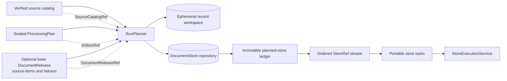
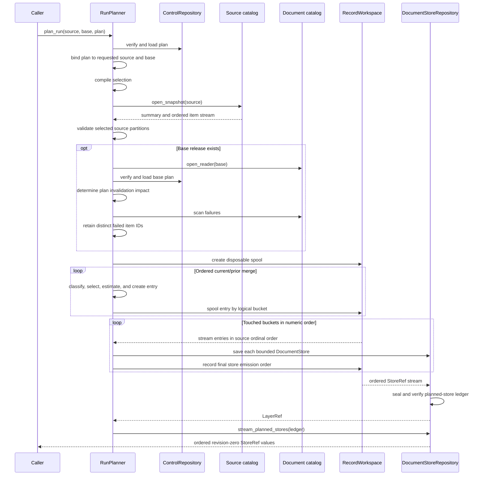
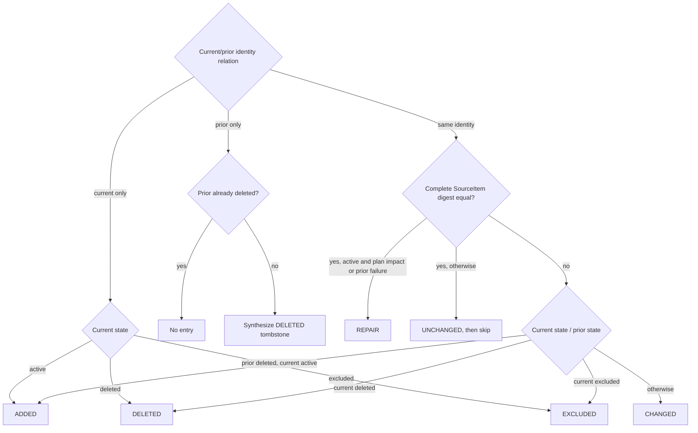
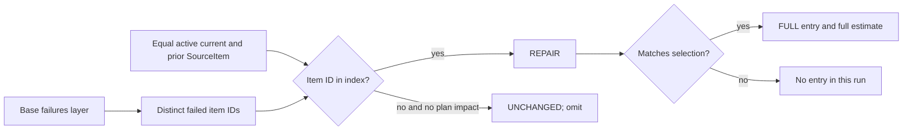
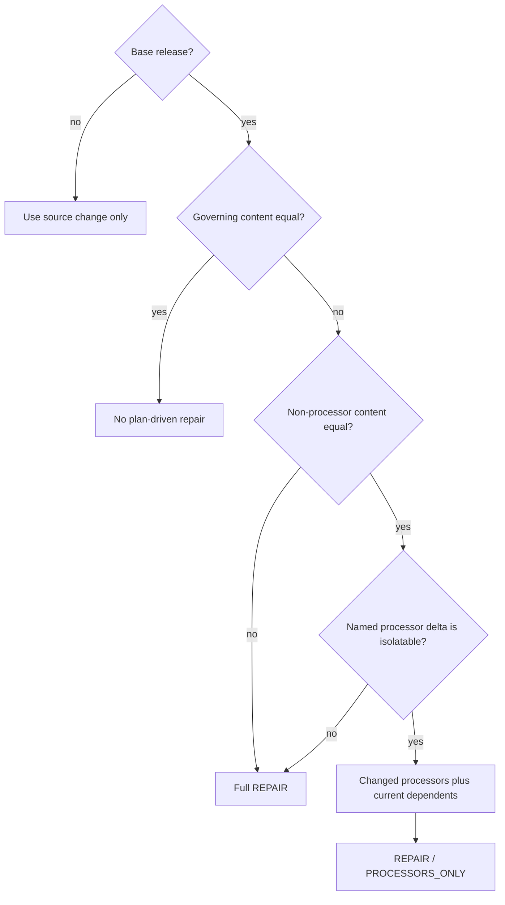

# Document Run Application: Planning

Run planning compares one immutable source catalog with an optional base `DocumentRelease`, applies the processing plan's selection, repair, and invalidation rules, and persists a deterministic set of bounded `DocumentStore` jobs. The planner moves only immutable references across the coordinator boundary. Source rows and content bytes remain in the source catalog, document catalog, and store repositories.

This page covers `src/docspec/application/planner.py` and its direct domain and port dependencies. See [Document Run Application](document_run_application.md) for the full plan, execute, deliver, reconcile, and commit sequence. The data types that define plans and jobs belong to [Processing Plan and Job Model](processing_plan_and_job_model.md); this page explains how the application planner uses them.

## Purpose and boundaries

| Question | Answer |
| --- | --- |
| What goes in? | A `SourceCatalogRef`, an optional explicit base `DocumentReleaseRef`, and an `ArtifactRef` for a sealed `ProcessingPlan`, plus injected catalog, store, control, and scratch-workspace implementations. |
| What happens? | `RunPlanner` verifies the plan, compiles its selection, indexes failed item identifiers from the base release, compares ordered current and prior source-item streams, decides the required work, estimates that work, partitions entries, and packs them into bounded stores. |
| What comes out? | An iterator of revision-zero `StoreRef` values read from one immutable planned-store ledger. Each reference names a persisted `DocumentStore`; the iterator never contains a source row or content bytes. |
| How is it checked? | The planner verifies input references and closed record shapes, recomputes domain identities during deserialization, rejects malformed selections and over-limit items, and delegates final store-population verification to `DocumentStoreRepository.seal_planned_stores()`. |

The planner owns these decisions:

- whether a source item is added, changed, deleted, excluded, unchanged, or repaired;
- whether an unchanged item with a prior failure must be retried;
- whether a repair needs the full extraction path or only part of the processor graph;
- whether an item belongs to the current run's selected scope;
- which stable logical partition receives the item;
- where work-limit boundaries split a partition into stores; and
- the exact order of the complete planned-store population.

The planner does not fetch content, extract representations, segment text, invoke processors, dispatch scheduler tasks, deliver results, reconcile layers, or publish a release. Those responsibilities belong to [Content Acquisition and Processing](content_acquisition_and_processing.md), [Processor Extension Model](processor_extension_model.md), [Portable Task Execution](portable_task_execution.md), [Result Delivery and Reconciliation](result_delivery_and_reconciliation.md), and [Document Release Artifacts](document_release_artifacts.md).

## System context

`DocSpecApplication.plan_run()` is a composition-only facade over `RunPlanner.plan_run()`. Both accept the same three references and return `Iterator[StoreRef]`. A local coordinator may call `RunPlanner` directly, as the command-line composition does, or inject it into `DocSpecApplication` for scheduler-neutral use.



The neighboring modules supply the planner's meaning without being reimplemented here:

| Module | Planning relationship |
| --- | --- |
| [Source Catalog Pipeline](source_catalog_pipeline.md) | Supplies a complete, immutable, globally ordered catalog snapshot. `SourceCatalogItem.to_processing_item()` produces the compact `SourceItem` used for change detection. |
| [Source Catalog Pipeline: Model and Ports](source_catalog_pipeline_model_and_ports.md) | Defines `ImmutableSourceCatalogReader`, `SourceCatalogSnapshot`, the summary's declared source partitions, and the normative-to-processing conversion. |
| [Processing Plan and Job Model](processing_plan_and_job_model.md) | Defines `ProcessingPlan`, `WorkLimits`, `StagePolicy`, `ChangeKind`, `EntryExecutionMode`, `DocumentEntry`, and `DocumentStore`. |
| [Processor Extension Model](processor_extension_model.md) | Defines the pinned `ProcessorSet`, stable processor names, processor identities, dependencies, and transitive invalidation order. |
| [Storage and Shared References](storage_and_shared_references.md) | Defines control, document-catalog, document-store, and scratch-workspace ports plus `ArtifactRef`, `SourceCatalogRef`, `DocumentReleaseRef`, and `StoreRef`. |
| [Portable Task Execution](portable_task_execution.md) | Converts the sealed planned-store population into reference-only scheduler tasks. |

## Components and responsibilities

### `RunPlanner`

`RunPlanner` coordinates the complete planning operation. Its constructor receives five replaceable dependencies:

| Dependency | Planner use |
| --- | --- |
| `ImmutableSourceCatalogReader` | Opens the exact source snapshot and exposes its summary and single-pass item stream. |
| `DocumentCatalog` | Opens one verified reader for the explicit base release, scans its active `failures` layer for repairable item identifiers, and scans its active `source-items` layer for the ordered comparison. |
| `DocumentStoreRepository` | Saves revision-zero stores, seals the exact ordered population, and streams the population back from the immutable ledger. |
| `ControlRepository` | Verifies and loads the current plan and the base release's plan. |
| `RecordWorkspaceFactory` | Creates disposable bounded scratch storage for partitioned entries and final store ordering. |

`RunPlanner` does not construct concrete adapters. The local composition currently supplies `LocalSqliteReconciliationWorkspaceFactory`, whose workspace supports the smaller `RecordWorkspace` operations used here: add a record, stream a collection in identity order, and discard the scratch database when the context closes.

### `WorkEstimate`

`WorkEstimate` holds six additive planning estimates: bytes, pages or frames, segments, processor cost, memory bytes, and duration seconds. `exceeds()` returns the first exceeded limit name; `plus()` produces the aggregate estimate used by a store buffer.

The seventh planning admission dimension is `WorkLimits.max_entries`, enforced separately by `_StoreBuffer`. `WorkLimits.max_attempts` governs later execution and does not affect store packing.

The estimate is a conservative admission forecast, not an execution receipt. [Document Run Application](document_run_application.md) documents `WorkBudget`, which rebuilds and enforces actual counters during execution.

### Selection and buffering helpers

The remaining planner types are private implementation helpers:

- `_CompiledSelection` validates the plan's selection once and turns repeated membership tests into set or tuple lookups.
- `_PriorSourceItem` couples a verified prior `SourceItem` with its release-layer deletion and failure markers.
- `_PlanImpact` records whether otherwise unchanged active items need repair, which processors need repair, and whether extraction and segmentation can be reused.
- `_StoreBuffer` accumulates one logical partition and store sequence until another entry would exceed an admission limit.
- `logical_partition()` delegates to `partition_bucket()`, which hashes the UTF-8 item identifier with SHA-256 and maps the first eight digest bytes into `plan.partition_count` buckets.

## End-to-end planning flow

The public method is a generator, but it completes and seals planning before yielding the first store reference. `seal_planned_stores()` consumes the internal store-reference iterator, writes the ordered ledger, and verifies each referenced revision-zero planned store. The planner then reopens that ledger and yields its references.



The method performs these steps:

1. Verify `plan_ref`, load `ProcessingPlan`, and require its `source_catalog` and `base_release` to equal the method arguments.
2. Compile the closed selection shape before reading source items.
3. Open the source snapshot and reject any requested source partition absent from `snapshot.summary.partitions`.
4. Open the base release reader once, when present, compare its processing plan with the current plan, and scan its `failures` layer into a distinct failed-item set.
5. Scan the base `source-items` layer and merge it with the current ordered item stream. The merge keeps two cursors; the failed-item set remains available for repair decisions.
6. Classify each item, apply every selection filter, and skip `UNCHANGED` results.
7. Estimate each remaining item. Reject an item that cannot fit by itself in one store.
8. Create a `DocumentEntry` with full or processor-only execution, then spool it under its logical bucket.
9. Stream one touched bucket at a time, pack entries into bounded `DocumentStore` values, save each store, and record its emission key.
10. Seal the complete store population as the plan's immutable planned-store ledger, close and remove the scratch workspace, and stream the ledger's references.

An empty or fully unchanged selection produces a valid zero-record planned-store ledger. It does not create an empty `DocumentStore`, because the domain model requires every store to contain at least one entry.

## Selection

The plan's `selection` is a closed JSON object. Unknown fields and malformed values fail before the source item stream is consumed. All supplied filters combine with logical AND.

| Field | Accepted value | Match rule |
| --- | --- | --- |
| `includeItemIds` | Array of non-empty strings | When present, the item's exact identifier must appear in the array. An empty array selects nothing. |
| `excludeItemIds` | Array of non-empty strings | A matching exact identifier always excludes the item. |
| `itemIdPrefixes` | Array of non-empty strings | The identifier must start with at least one supplied prefix. |
| `logicalBuckets` | Array of integers in `[0, partition_count)` | The stable SHA-256 bucket must appear in the set. Booleans are rejected even though Python treats them as integers. |
| `mediaTypes` | Array of non-empty strings | At least one candidate rendition must have a matching media type. |
| `sourcePartitions` | Array of non-empty strings | The catalog summary must declare every name, and the item's `metadata.sourcePartition` must be a matching non-empty string. A missing value does not match; a malformed value fails planning. |
| `states` | Array of `active`, `deleted`, or `excluded` | The current item or synthesized tombstone must have a matching `SourceItemState`. |

Repeated values are deduplicated during compilation. Selection runs after change classification and tombstone synthesis. This order gives targeted runs precise scope: an omitted prior item becomes a deletion candidate, but an `excludeItemIds`, bucket, state, or other filter may keep that deletion outside the current run. Reconciliation retains untouched base partitions, so a targeted plan changes only its selected population.

Selection is also part of `ProcessingPlan.governing_content()`. If the selection differs from the base plan, otherwise unchanged active items that remain selected receive a full `REPAIR`; the planner does not treat the new selection as a reason to remove out-of-scope base records.

## Incremental classification

For an incremental run, the planner makes two sequential scans through the verified base release. It scans `failures` first and retains each distinct, non-empty `sourceItemId`, then scans `source-items` once for the ordered merge. Both source-item streams must be ordered by `item_id`; the source-catalog and document-catalog readers own that ordering guarantee. The merge advances at most one current item and one prior item at a time.

The failed-item index uses `O(K)` memory, where `K` is the number of distinct failed items and `K <= N` for a release with `N` source items. The planner does not retain failure payloads or retry histories. Each failure row must have the closed delivery-record shape, but planning reads only `sourceItemId` because the failure class cannot prove which reusable artifacts exist.

Classification compares the digest of the complete canonical `SourceItem.to_dict()` value. A version string alone does not decide equality. Candidate population, locator, expected digest, expected size, transport version, candidate metadata, source state, and source metadata can therefore schedule a change even when the source version stays the same.

| Merge case | Planned result |
| --- | --- |
| Current item has no prior item | `ADDED`, `DELETED`, or `EXCLUDED`, according to current state. |
| Prior non-deleted item is absent from the complete current snapshot | A tombstone retaining the prior version, candidates, and metadata, with state `deleted` and change `DELETED`. |
| Prior deleted item remains absent | No new tombstone. |
| Current and prior complete item digests match | `UNCHANGED`, unless the item is active and either the plan changed or the base failure layer names it; that case becomes `REPAIR`. |
| Current item changed to deleted | `DELETED`. |
| Current item changed to excluded | `EXCLUDED`. |
| Current active item replaces a prior tombstone | `ADDED`. |
| Any other changed current item | `CHANGED`. |

`DELETED` and `EXCLUDED` entries are terminal when created; they need no content processing. The planner removes `UNCHANGED` entries before store creation. `ADDED`, `CHANGED`, and full `REPAIR` entries use `EntryExecutionMode.FULL`.



### Recovery of previously failed items

An unchanged active item receives `REPAIR` when its identifier appears in the base release's active `failures` layer, even when the current and prior plans have equal governing content. Unfailed unchanged items remain `UNCHANGED` and stay out of the planned population. Selection still applies after classification, so a targeted run can exclude a repair candidate deliberately.

A prior failure always schedules `EntryExecutionMode.FULL`. The planner cannot safely infer from `failureClass` whether capture, extraction, or segmentation completed. It therefore refuses the processor-only optimization even when an unrelated processor-plan change would otherwise permit base-content reuse. Full execution also uses the full-work estimate.



## Plan changes and repair scope

The planner compares `ProcessingPlan.governing_content()` from the base release with the current plan. Governing content includes profiles, work limits, stages, processors, partition count, selection, retention policy, data-use policy, retry-policy digest, and accepted-failure-policy digest. It excludes the source-catalog reference, base-release reference, and plan identifier because the method compares source state separately and the new plan necessarily cites the base.

The repair decision follows these rules:

1. With no base release, source classification alone decides the work.
2. If governing content matches, the plan causes no repair. Prior failure evidence can still turn an unchanged active item into `REPAIR`.
3. If any non-processor governing content differs, every otherwise unchanged selected active item receives a full `REPAIR` using the current complete `StagePolicy`.
4. If only processor declarations or the processor stage list differ, the planner compares processors by stable `ProcessorDescription.name`.
5. A new name or a changed description marks the current processor identity as changed. `ProcessorSet.invalidated_by()` adds only its transitive dependents in current topological order.
6. Removed processor names schedule processor-only repair with no replacement processor for that removal. This zero-processor repair still touches the source item so reconciliation can retire obsolete derived layers.
7. If processor-set content differs but the planner cannot isolate added, changed, or removed named processors, it falls back to a full repair.



Processor-only entries retain the current extractor and segmenter identities in `requested_stages`, but list only invalidated processor identities. [Document Run Application](document_run_application.md) explains how execution verifies and reuses the pinned base release's files, representations, segments, unaffected processor results, and receipts before running this reduced graph. An item named by the base failure layer bypasses this optimization and receives a full repair.

The optimization applies only to otherwise unchanged active source items. A changed or added item always receives full execution, even when processors also changed in the same plan. This rule prevents the worker from reusing base content after the source description changed.

## Work estimation and admission

The planner reads optional non-negative integer estimates from `SourceItem.metadata`. Booleans, negative values, and non-integers fail with `IntegrityError` when the corresponding field is used.

### Full execution estimate

| Dimension | Metadata field | Default |
| --- | --- | --- |
| Estimated source bytes | `estimatedBytes` | Sum all candidate `expected_size` values when every size is known; otherwise use `maxEstimatedBytes`. |
| Pages or frames | `estimatedPagesOrFrames` | `1` |
| Segments | `expectedSegments` | At least one, using the page/frame estimate as the default. |
| Processor cost | `processorCost` | At least one, using `segments * max(1, processor_count)`. |
| Memory bytes | `estimatedMemoryBytes` | `min(max(1, estimated_bytes), maxMemoryBytes)` |
| Duration seconds | `estimatedDurationSeconds` | `1` |

Deleted and excluded items receive a metadata-only estimate: zero source bytes, pages or frames, segments, and processor cost; one memory byte and one second.

### Processor-only estimate

Processor-only repair reuses source, representation, and segment bytes. Its estimate therefore charges zero source bytes and zero pages or frames. It uses `expectedSegments` with default `1`, `processorCost` with default `segments * invalidated_processor_count`, `estimatedMemoryBytes` with default `maxMemoryBytes`, and `estimatedDurationSeconds` with default `1`.

The conservative full-memory default ensures that a processor-only entry does not share a store with other work unless the source metadata supplies a smaller explicit estimate. A pure processor removal may have zero processor cost but still needs segment and memory capacity to verify and carry forward base content.

Before spooling an entry, `WorkEstimate.exceeds()` rejects any single item above a per-store maximum. During packing, `_StoreBuffer.can_add()` rejects the next item when either the entry count or any aggregate estimate would cross its limit. The planner then closes the current store and starts the next sequence in the same logical bucket. The persisted store carries `WorkLimits`; the execution service later checks actual work independently.

## Bounded spooling, store identity, and order

Planning uses scratch storage because the source population, planned entries, and final store population may exceed coordinator memory. For every selected non-unchanged item, the planner writes a closed record containing the source ordinal and serialized `DocumentEntry` to `planner:partition:{bucket:05d}`. The zero-padded ordinal is the scratch identity, so each partition streams in original source order. In memory, the planner retains the compiled selectors, the distinct failed-item index for incremental runs, the touched-bucket set, and one store buffer; it never buffers the full current or prior source-item population.

After the input merge completes, the planner processes touched buckets in numeric order. It holds only one `_StoreBuffer` at a time. Each store receives a stable logical name:

```text
bucket-{partition:05d}/store-{sequence:08d}
```

`DocumentStore.planned()` derives `store_id` from the plan identifier, logical name, and ordered entry identifiers. The store repository saves it at revision zero and returns the immutable `StoreRef`.

The final emission order preserves the planner's historical full-then-remainder rule:

- a store closed because the next entry would overflow receives `closed/{next_source_ordinal:020d}`;
- the last partial store in each touched bucket receives `remaining/{partition:05d}`; and
- ordered scratch streaming emits every `closed/...` store by the source ordinal that forced closure, followed by every `remaining/...` store in bucket order.

This order is part of durable run identity. The planned-store ledger records contiguous ordinals, an ordered-set digest, a count, and `orderPolicy: planner-emission-order`. Reordering entries, buckets, or remainder stores changes store identifiers or the ledger digest even when the item set stays the same.

The local repository also bounds the planned ledger by store count, record bytes, and total ledger bytes; verifies distinct store identifiers; reloads every referenced store; and requires revision zero, `PLANNED` state, and the same `plan_id`. A second identical planning pass can resolve to the same content-addressed stores and ledger. A conflicting population under an existing plan identifier fails closed.

The command-line coordinator checks `DocumentStoreRepository.has_planned_store_ledger(plan.plan_id)` when resume behavior is automatic. If the ledger exists, it verifies and reuses that durable population instead of replanning. The scratch SQLite file is not authoritative and is removed when its context closes.

## Invariants and failure behavior

Changes to the planner must preserve these properties:

- **Pinned inputs:** the loaded plan names the exact source catalog and base release passed to `plan_run()`.
- **Complete source comparison:** initial runs consume one complete source snapshot; incremental runs also scan the base `failures` and `source-items` layers.
- **Failed-item recovery:** an unchanged active item named by the base failure layer becomes a full `REPAIR`; unfailed unchanged items remain omitted.
- **Full item equality:** change detection covers the complete canonical `SourceItem`, not only version or locator fields.
- **Explicit targeted scope:** every supplied selector must match, and items outside the selection remain untouched rather than becoming implicit deletions.
- **Stable partitioning:** an item identifier and `partition_count` always produce the same SHA-256 bucket.
- **Bounded coordinator memory:** corpus-sized entries live in the workspace, and the planner buffers one store at a time. Incremental planning also holds `O(K)` failed item identifiers, where `K <= N`, plus compiled selectors and at most 65,536 touched bucket identifiers.
- **Bounded jobs:** no individual entry or aggregate store estimate exceeds the current `WorkLimits` admission dimensions.
- **Exact repair mode:** processor-only execution is valid only for `REPAIR`; changed source content always takes the full path.
- **Immutable job identity:** entry identity includes source content, change kind, requested stages, and execution mode. Store identity includes the plan, logical store name, and ordered entry identities.
- **Complete planned population:** workers consume only references reopened from the sealed planned-store ledger.
- **Scratch-state independence:** closing or losing the planning workspace cannot change a sealed ledger or persisted store.

The planner and its adapters fail at different boundaries:

| Failure | Typical cause | Result |
| --- | --- | --- |
| `IntegrityError` | Plan inputs disagree; a selector, estimate, prior source or failure record, source partition, spooled entry, or processor-name comparison is invalid. | Planning stops; no planned ledger is accepted. |
| `LimitExceededError` | One item exceeds a store limit, scratch records exceed workspace bounds, or the store ledger exceeds adapter limits. | Planning stops before a complete population becomes authoritative. |
| `StateTransitionError` from the local store repository | The same plan identifier already owns a different immutable planned-store ledger. | The existing population remains authoritative; the conflicting plan is refused. |
| Domain `ValueError` or `TypeError` | A loaded closed domain value cannot reconstruct its declared identity or shape. | Loading fails before the value can influence planning. |

Because stores are saved before the ledger root is sealed, a failed planning attempt may leave immutable revision-zero store objects that no accepted ledger references. They do not become runnable work. Repository maintenance may treat such objects as unreachable staging artifacts; planner code must never infer a planned population by scanning loose store files.

## Contribution guide

Choose the owner of a change before editing the planner:

| Change | Primary owner | Required planning checks |
| --- | --- | --- |
| Add or change a source selector | `ProcessingPlan.selection` and `_CompiledSelection` | Close the field shape, define AND behavior, validate before item consumption, include it in plan identity, and test targeted incremental retention. |
| Change item equality or tombstone rules | `SourceItem`, `DocumentEntry`, and `_merge_snapshot()` | Preserve complete-snapshot omission behavior, repeated-deletion suppression, prior-record validation, and same-version change detection. |
| Change failed-item recovery | `_failed_item_ids()`, `_PriorSourceItem`, and `_classify()` | Preserve the two base-layer scans, distinct-ID memory bound, selection behavior, full repair mode, and isolation of unfailed unchanged items. |
| Add a governing plan field | `ProcessingPlan.governing_content()` and `_plan_impact()` | Decide whether it requires full repair or can support narrower reuse. Test unchanged sources against old and new plans. |
| Change processor invalidation | `ProcessorSet` and `_plan_impact()` | Compare stable names, include current transitive dependents, handle additions, removals, renames, and pure removal, and prove unchanged content bytes are reused. |
| Add an estimate dimension | `WorkLimits`, `WorkEstimate`, planner metadata rules, and execution accounting | Define a conservative default, single-item rejection, aggregate packing, resume reconstruction, serialization, and boundary tests. |
| Change partitioning or store order | `partition_bucket()`, `_save_partition_stores()`, and planned-ledger format | Treat the change as durable identity behavior. Prove deterministic replay and incremental equivalence. |
| Change scratch storage | `RecordWorkspace` and its adapter | Preserve ordered streaming, duplicate refusal, record and total byte limits, bounded reads, cleanup, and non-authoritative status. |
| Change planned-store persistence | `DocumentStoreRepository` | Preserve revision-zero validation, plan binding, uniqueness, ledger completeness, ordered digest, immutable retry behavior, and verified resume. |

When a planner change affects the meaning of `DocumentEntry`, `DocumentStore`, `ProcessingPlan`, or the planned-store ledger, update the corresponding format version or stable identity input. Keeping an old identity for changed behavior can make incompatible work appear reusable.

Add tests at three levels when the behavior crosses them:

1. Unit-level planner tests for selection, classification, estimates, and error paths.
2. Repository and bounded-partition tests for deterministic store packing, ledger order, spool cleanup, and size limits.
3. End-to-end incremental tests for base-layer reuse, processor invalidation, failed-item repair, targeted selection, and equivalence with a clean rebuild.

## Focused verification

Run the planner and bounded-spooling checks from the repository root:

```bash
uv run pytest \
  tests/test_planner.py \
  tests/test_bounded_partitions.py
```

Run the processor-only repair, failed-item recovery, and incremental equivalence checks when repair behavior changes:

```bash
uv run pytest \
  tests/test_processor_reprocessing.py::test_changed_processor_reuses_content_and_runs_only_it_and_dependents \
  tests/conformance/test_incremental_equivalence.py
```

Run the application pipeline and recovery scenarios when store identity, ledger order, or resume behavior changes:

```bash
uv run pytest \
  tests/test_application_pipeline.py \
  tests/conformance/test_recovery.py
```

Finish a code change with the repository-wide static checks and full test suite required by the project. Documentation-only edits need no format migration, but links should remain flat wiki-relative paths because every generated module page shares this directory.
