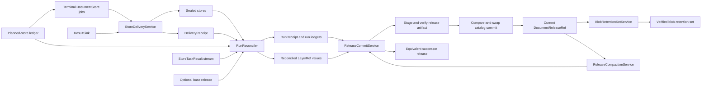
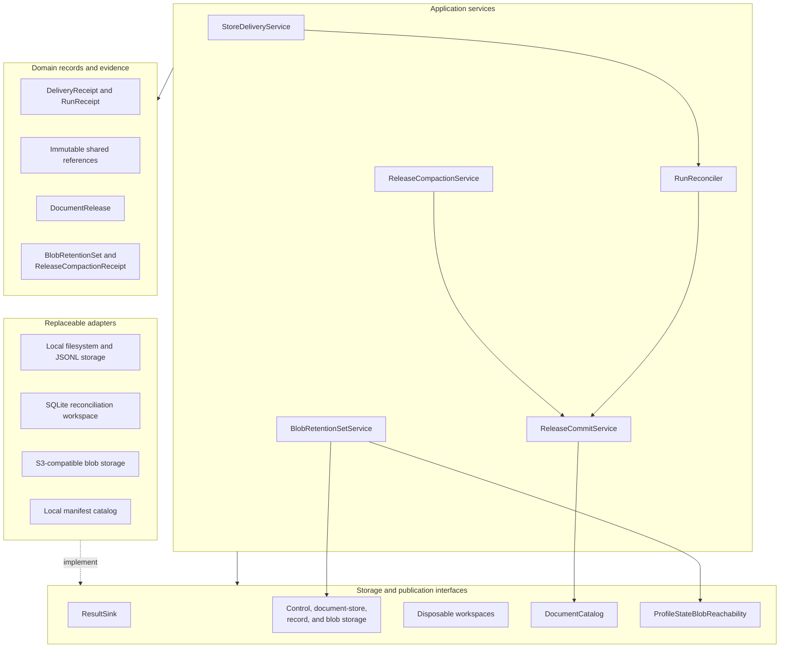

# Durable Results and Release Lifecycle

The `durable_results_and_release_lifecycle` module turns completed document-processing jobs into verified, immutable results and governed releases. It:

- Delivers each terminal `DocumentStore` through a selected result sink.
- Reconciles delivered stores against the exact planned task population.
- Builds immutable logical record layers for stateful runs.
- Verifies, stages, and conditionally publishes releases.
- Maintains published releases through blob-retention analysis and lossless physical compaction.

Large records and bytes remain behind storage interfaces. Services exchange small, verifiable references such as `ArtifactRef`, `BlobRef`, `StoreRef`, `LayerRef`, and `DocumentReleaseRef`. Temporary workspaces are disposable and never become release authority.

## Lifecycle architecture

Delivery seals a store only after the sink acknowledges the complete, independently regenerated record stream. Reconciliation then matches completion-order results to the canonical planning order, rejects missing or conflicting results, and replaces only affected source partitions. Stateless runs retain durable run evidence but cannot be published because they contain no staged release layers.

Release publication remains separate from reconciliation. The catalog verifies the complete release graph and packaged records before atomically advancing its current pointer. Compaction reuses this same publication path and must prove that the successor contains the exact ordered logical records of its source release.

## Component architecture

The domain layer defines stable identities and evidence without depending on filesystems, databases, or cloud software. Ports specify the required behavior, application services enforce lifecycle rules, and adapters provide concrete storage and publication mechanisms.

The catalog supports two distinct release representations:

- A reference-based catalog release used for live publication, lookup, comparison, retention, and compaction.
- A self-contained portable `DocumentRelease` 2.0 bundle with its own builder and conformance verifier.

These representations share a format name and version but have different structures and readers. Release maintenance operates only on catalog releases.

## Core component documentation

| Area | Core components | Documentation |
| --- | --- | --- |
| Result delivery and reconciliation | `DeliveryRecord`, `ResultSink`, `StoreDeliveryService`, `DeliveryReceipt`, `RunReconciler`, `RunReceipt`, and reconciliation workspaces | [Result Delivery and Reconciliation](result_delivery_and_reconciliation.md) |
| Storage and shared references | Immutable reference types, `ControlRepository`, `DocumentStoreRepository`, `RecordStorage`, `BlobStore`, partitioned layers, and local or S3-compatible adapters | [Storage and Shared References](storage_and_shared_references.md) |
| Release construction and publication | `DocumentRelease`, `DocumentCatalog`, catalog staging and commit, whole-release verification, portable bundles, and retention floors | [Document Release Artifacts](document_release_artifacts.md) |
| Post-publication maintenance | `BlobRetentionSetService`, `BlobRetentionSet`, `ReleaseCompactionService`, `ReleaseCompactionReceipt`, and dry-run blob inventory | [Release Maintenance](release_maintenance.md) |

The module’s governing rule is that no self-reported result can advance visible corpus state. Each boundary reopens immutable references and independently verifies identities, counts, ordered populations, stored bytes, cross-layer relationships, predecessor lineage, and publication state.