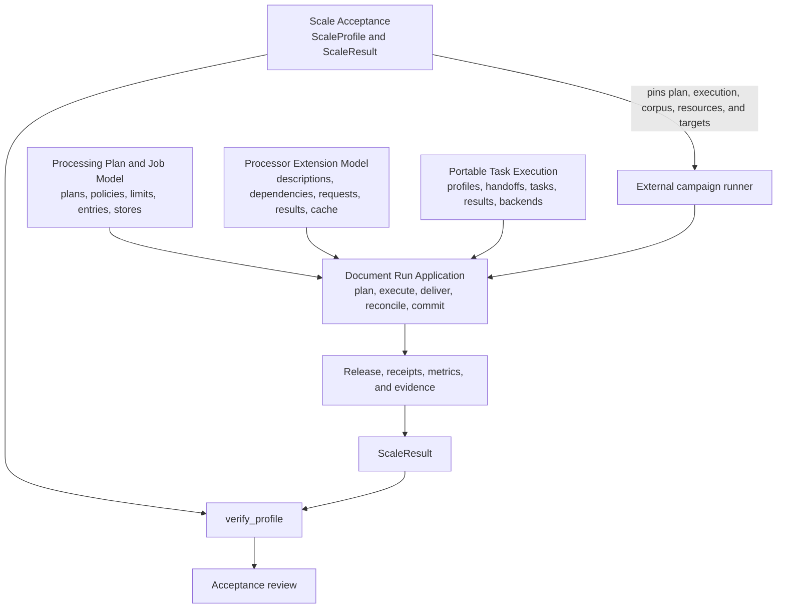

# Governed Processing, Execution, and Qualification

## Purpose

This module turns a verified source catalog and a sealed `ProcessingPlan` into bounded processing jobs, portable scheduler tasks, reconciled run evidence, and—when every publication gate passes—a verified `DocumentRelease`.

It governs the run through content-derived identities, immutable references, explicit policies, resource limits, checkpoint verification, complete task reconciliation, and conditional publication. It also defines `ScaleProfile` and `ScaleResult`, which make performance and capacity claims reproducible without embedding benchmark execution in the domain model.

| Question | Answer |
| --- | --- |
| What goes in? | A verified source catalog, processing plan, optional base release, processor graph, policies, execution profile, and injected implementations of the required ports. |
| What happens? | DocSpec plans bounded stores, executes and checkpoints their entries, runs processors in dependency order, delivers terminal records, and reconciles the exact planned task population. |
| What comes out? | Immutable store revisions, receipts, ledgers, a `RunReceipt`, and optionally a published `DocumentRelease`. Scale campaigns produce separate `ScaleResult` evidence. |
| How is it checked? | Stable identities, closed serialized shapes, work limits, policy pins, task-set digests, checkpoint replay, complete delivery receipts, release verification, and profile-to-result scale checks. |

## Architecture

### Processing and publication flow

```mermaid
flowchart LR
    Catalog["Verified SourceCatalogRef"]
    Plan["Sealed ProcessingPlan"]
    Base["Optional base DocumentReleaseRef"]

    Catalog --> Planner["RunPlanner"]
    Plan --> Planner
    Base --> Planner

    Planner --> Stores["Bounded DocumentStore jobs"]
    Stores --> Handoff["ExecutionHandoff and StoreTask stream"]
    Handoff --> Backend["Local or external ExecutionBackend"]
    Backend --> Worker["StoreExecutionService"]
    Worker --> Processors["Processor graph"]
    Processors --> Delivery["StoreDeliveryService"]
    Delivery --> Results["Sealed stores and StoreTaskResults"]
    Results --> Reconcile["RunReconciler"]
    Reconcile --> Receipt["RunReceipt and staged layers"]
    Receipt --> Commit["ReleaseCommitService"]
    Commit -->|"expected base still current"| Release["Verified DocumentRelease"]
```

Workers may create immutable checkpoints and staged results in parallel. Only `ReleaseCommitService` can make a release current. Missing tasks, conflicting replay, rejected stores, incomplete delivery, invalid evidence, stateless execution, or a stale base prevents publication.

### Component and qualification relationships

The application layer coordinates the run. Domain models define valid work and evidence. Ports isolate storage, processing, delivery, and scheduling implementations. Adapters implement those ports without changing the logical plan or published result.

Scale acceptance defines and checks campaign evidence; it does not run the campaign. Full qualification still requires verification by the owning pipeline and the named acceptance authority.

## Core component documentation

| Component | Documentation |
| --- | --- |
| Run planning, execution, delivery, reconciliation, and conditional release publication | [Document Run Application](document_run_application.md) |
| `ProcessingPlan`, policies, profiles, work limits, entries, stores, failures, and verdicts | [Processing Plan and Job Model](processing_plan_and_job_model.md) |
| Processor declarations, dependency ordering, policy-limited payloads, verified results, and exact-result caching | [Processor Extension Model](processor_extension_model.md) |
| Scheduler-neutral profiles, handoffs, reference-only tasks, results, and local or external backends | [Portable Task Execution](portable_task_execution.md) |
| Reproducible scale profiles, campaign results, metric gates, and acceptance evidence | [Scale Acceptance](scale_acceptance.md) |