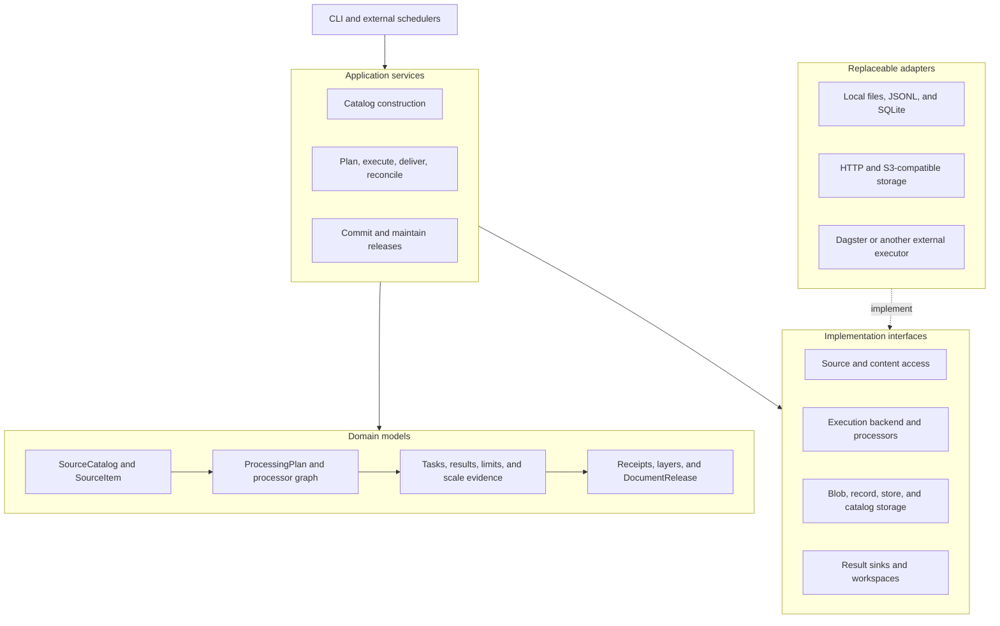

# DocSpec Repository Overview

## Purpose

DocSpec is a format-neutral pipeline for turning immutable, source-native releases into verified document releases.

It:

- Builds a complete, policy-controlled `SourceCatalog`.
- Captures exact source bytes and derives document representations, segments, and evidence coordinates.
- Executes processor graphs as bounded, restartable jobs.
- Reconciles every planned task before publishing.
- Produces immutable `DocumentRelease` artifacts that consumers can verify and read directly.

DocSpec publishes `docspec-source-catalog`, `docspec-processing-plan`, and `docspec-document-release` artifacts through Rulespec’s generic artifact format. It does not serve search or provide a required online service.

## End-to-end architecture

```mermaid
flowchart LR
    Source["Immutable source-native release"]

    subgraph Intake["Source intake and preparation"]
        Adapter["Source adapter"]
        CatalogPolicy["Pinned catalog policy"]
        CatalogBuilder["SourceCatalogBuilder"]
        Catalog[("Verified SourceCatalog")]
        Fetch["Capture exact bytes"]
        Extract["Extract representations"]
        Segment["Create source-grounded segments"]
    end

    subgraph Run["Governed processing"]
        Plan["Sealed ProcessingPlan"]
        Base["Optional base release"]
        Planner["RunPlanner"]
        Jobs["Bounded DocumentStore jobs"]
        Tasks["ExecutionHandoff and StoreTasks"]
        Backend["Local or external backend"]
        Execute["StoreExecutionService"]
        Processors["Dependency-ordered processors"]
    end

    subgraph Publication["Results and publication"]
        Deliver["StoreDeliveryService"]
        Sealed["Sealed stores and receipts"]
        Reconcile["RunReconciler"]
        Evidence["RunReceipt and immutable layers"]
        Commit["ReleaseCommitService"]
        Verify["Whole-release verification"]
        Current[("Current DocumentRelease")]
    end

    Source --> Adapter
    CatalogPolicy --> CatalogBuilder
    Adapter --> CatalogBuilder --> Catalog
    Catalog --> Fetch --> Extract --> Segment

    Catalog --> Planner
    Plan --> Planner
    Base --> Planner
    Planner --> Jobs --> Tasks --> Backend --> Execute
    Segment --> Execute
    Execute --> Processors --> Deliver --> Sealed
    Sealed --> Reconcile --> Evidence --> Commit --> Verify --> Current

    Current --> Consumer["Consumers verify and read artifacts directly"]
```

Each processing boundary uses immutable, digest-pinned references. Planning bounds the work; execution records checkpoints; delivery independently regenerates and acknowledges record streams; reconciliation checks the complete planned task population; publication advances the current release only after verification and a compare-and-swap update.

## Component architecture

The domain layer defines valid identities, records, and evidence. Application services enforce workflow rules. Ports describe required external behavior, and adapters provide local or distributed implementations without changing the meaning of published artifacts.

## Core module documentation

### Source intake and document preparation

- [Module overview](wiki/source_intake_and_document_preparation.md)
- [Source Catalog Pipeline](wiki/source_catalog_pipeline.md)
- [Content Acquisition and Processing](wiki/content_acquisition_and_processing.md)

### Governed processing, execution, and qualification

- [Module overview](wiki/governed_processing_execution_and_qualification.md)
- [Document Run Application](wiki/document_run_application.md)
- [Processing Plan and Job Model](wiki/processing_plan_and_job_model.md)
- [Processor Extension Model](wiki/processor_extension_model.md)
- [Portable Task Execution](wiki/portable_task_execution.md)
- [Scale Acceptance](wiki/scale_acceptance.md)

### Durable results and release lifecycle

- [Module overview](wiki/durable_results_and_release_lifecycle.md)
- [Result Delivery and Reconciliation](wiki/result_delivery_and_reconciliation.md)
- [Storage and Shared References](wiki/storage_and_shared_references.md)
- [Document Release Artifacts](wiki/document_release_artifacts.md)
- [Release Maintenance](wiki/release_maintenance.md)