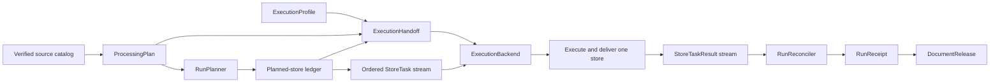
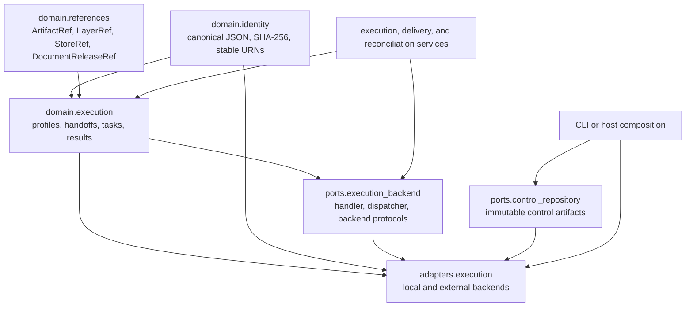
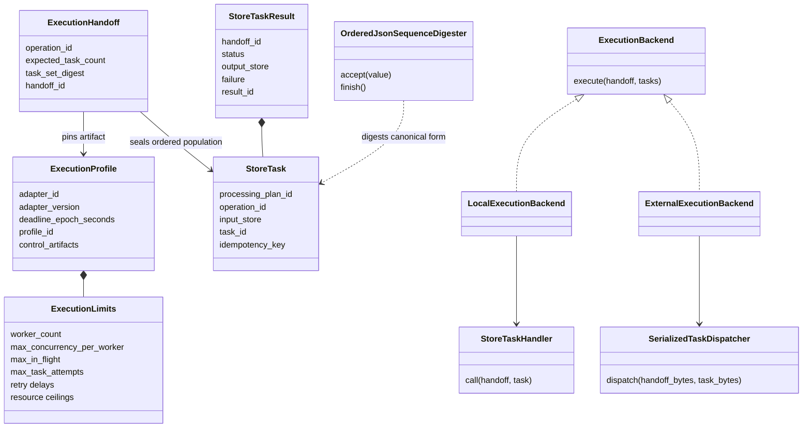
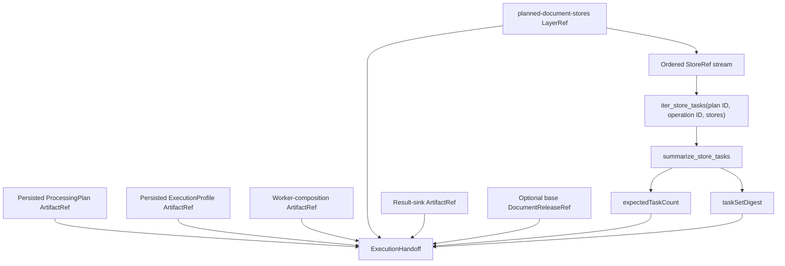
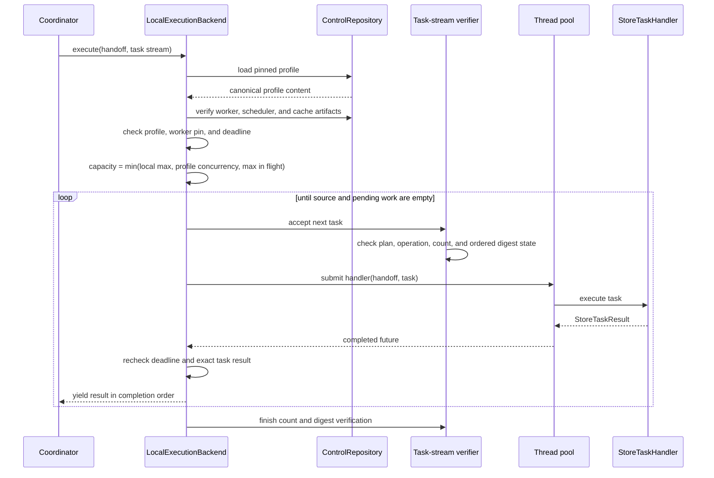
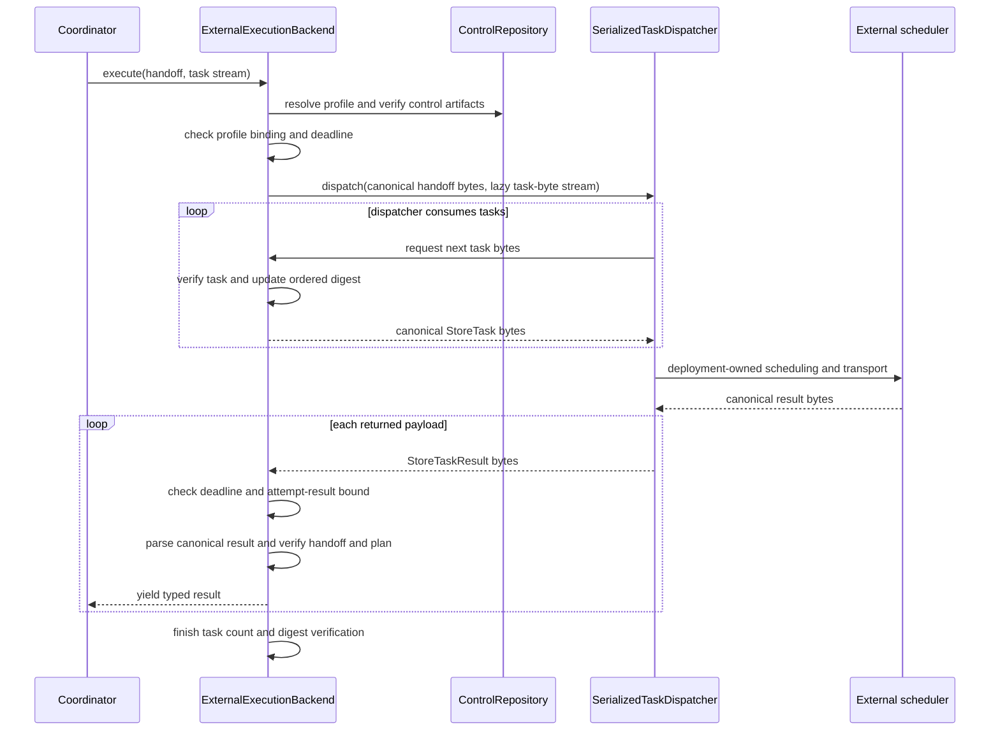
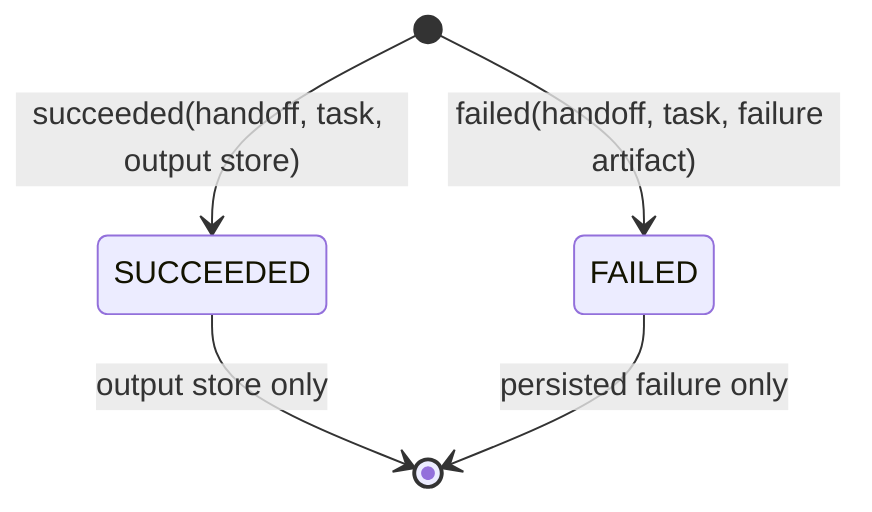
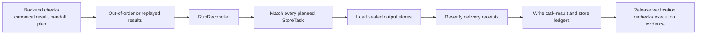
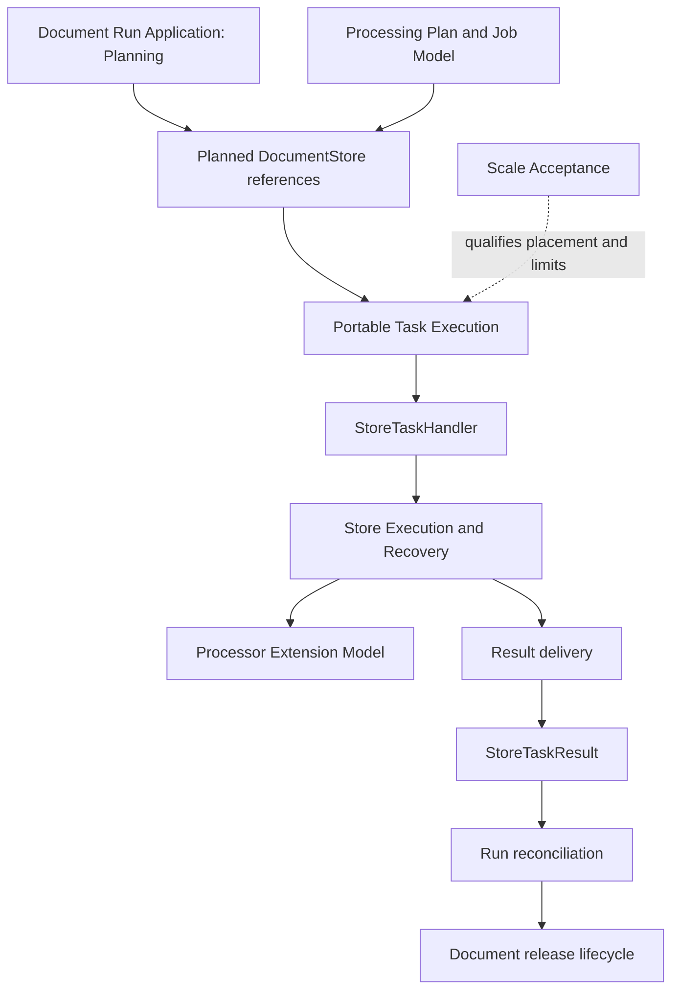

# Portable Task Execution

Portable task execution lets DocSpec run the same bounded store operation in a local thread pool or behind an external scheduler. It defines small, canonical JSON messages that contain immutable references rather than document bytes, binds each run to an execution profile and a sealed task population, and validates results before the run application reconciles them.

This page covers:

- `src/docspec/domain/execution.py`: execution profiles, handoffs, tasks, results, and task-stream helpers;
- `src/docspec/domain/identity.py`: streaming ordered-sequence digests;
- `src/docspec/ports/execution_backend.py`: scheduler-neutral execution interfaces; and
- `src/docspec/adapters/execution.py`: bounded local execution and the serialized external-scheduler boundary.

See [Document Run Application](document_run_application.md) for the full plan-to-release lifecycle. [Processing Plan and Job Model](processing_plan_and_job_model.md) owns the logical plan and store state. [Document Run Application: Store Execution and Recovery](document_run_application_execution.md) explains what a worker does inside one task. [Document Run Application: Delivery, Reconciliation, and Release](document_run_application_delivery_and_release.md) explains how terminal results are matched to the plan and admitted to a release.

## Purpose and system role

| Question | Answer |
| --- | --- |
| What goes in? | A pinned `ExecutionProfile`, an `ExecutionHandoff`, and an ordered stream of `StoreTask` values derived from the planned-store ledger. |
| What happens? | A backend verifies the profile and handoff, checks the task stream against its sealed count and digest, invokes a typed local handler or a serialized external dispatcher, and validates each returned result. |
| What comes out? | A completion-order stream of `StoreTaskResult` values containing either an output `StoreRef` or a persisted failure `ArtifactRef`. |
| How is it checked? | Closed canonical JSON, content-derived identifiers, immutable artifact verification, task count and ordered digest checks, deadline and concurrency bounds, result lineage checks, reconciliation, and focused portability tests. |

The module separates scheduling from document processing. A scheduler sees references, identifiers, limits, and canonical messages. The worker resolves those references and runs the application services. Content bytes, extracted text, segments, and processor payloads do not cross this boundary.

## System context



The composition root, not `RunPlanner`, creates the profile, derives tasks from the saved ledger, computes the task-set summary, and persists the handoff. The backend then transports each task to a handler. In the built-in local run, that handler executes a store through `StoreExecutionService`, delivers its records through `StoreDeliveryService`, and returns the sealed store reference.

## Architecture and dependency direction

The module follows DocSpec's domain-port-adapter split. Domain messages know only identity helpers and shared immutable references. Ports define callable behavior over those messages. Adapters bind the messages to threads or a deployment-owned dispatcher.



| File | Responsibility |
| --- | --- |
| [`domain/execution.py`](../src/docspec/domain/execution.py) | Defines the portable message formats, their validation rules, stable identities, and streaming task helpers. |
| [`domain/identity.py`](../src/docspec/domain/identity.py) | Encodes canonical JSON and computes the ordered task-set digest without retaining the stream. |
| [`ports/execution_backend.py`](../src/docspec/ports/execution_backend.py) | Defines typed local handling, serialized dispatch, and backend execution interfaces. |
| [`adapters/execution.py`](../src/docspec/adapters/execution.py) | Resolves and verifies profiles, checks task streams, applies live bounds, and adapts local or external execution. |

Shared reference and repository relationships are summarized in [Processing Plan and Job Model](processing_plan_and_job_model.md) and [Document Run Application](document_run_application.md). Operational scale qualification remains outside this module.

## Core component relationships



### Component responsibilities

| Component | Responsibility |
| --- | --- |
| `ExecutionLimits` | Records scheduler and worker bounds. It validates positive counts, non-negative retry delays, and delay ordering. |
| `ExecutionProfile` | Seals the adapter identity, immutable worker and scheduler configuration, operational limits, deadline, and optional cache configuration. |
| `ExecutionHandoff` | Binds one plan and planned-store ledger to one profile, operation, task count, ordered task digest, result sink, and optional base release. |
| `StoreTask` | Names one idempotent operation over one saved `StoreRef`. It carries no store content. |
| `StoreTaskResult` | Records one terminal success or failure for one task and handoff. |
| `OrderedJsonSequenceDigester` | Computes the SHA-256 digest of a canonical JSON array incrementally. |
| `StoreTaskHandler` | Defines process-local task behavior over typed domain values. |
| `SerializedTaskDispatcher` | Defines the deployment boundary over canonical bytes. |
| `ExecutionBackend` | Gives callers one typed streaming interface regardless of scheduler placement. |
| `LocalExecutionBackend` | Runs handlers in a bounded thread pool and yields results in completion order. |
| `ExternalExecutionBackend` | Streams canonical messages through an external dispatcher and parses returned result bytes. |

Two private adapter helpers enforce shared rules. `_ExecutionProfileBinding` resolves the pinned profile and verifies every nested control artifact. `_TaskStreamVerifier` checks plan and operation identifiers while incrementally reproducing the sealed task count and ordered digest.

## Portable message formats

Every message uses format version `1.0`, an exact closed object shape, UTF-8 canonical JSON, and one trailing newline. Deserializers reject unknown fields, missing fields, duplicate JSON keys, alternate whitespace or key ordering, noncanonical encodings, and altered content-derived identifiers.

| Value | Format marker | Maximum canonical file size | Primary identifier |
| --- | --- | ---: | --- |
| `ExecutionProfile` | `docspec-execution-profile` | 32 KiB | `profileId` |
| `ExecutionHandoff` | `docspec-execution-handoff` | 64 KiB | `handoffId` |
| `StoreTask` | `docspec-store-task` | 16 KiB | `taskId` and `idempotencyKey` |
| `StoreTaskResult` | `docspec-store-task-result` | 32 KiB | `resultId` |

Construction checks the serialized size before a value can enter normal use. `from_bytes()` checks the byte limit before parsing, requires a JSON object, reconstructs the domain value, and recomputes its identifier. These limits keep scheduler messages small even when locators and nested references vary by deployment.

### Identity and serialization flow


| Identifier | Derived from |
| --- | --- |
| `ExecutionProfile.profile_id` | Adapter identity, worker composition, scheduler configuration, all limits, deadline, and both optional cache references. |
| `ExecutionHandoff.handoff_id` | Every pinned handoff field, including the ordered task summary and result sink. |
| `StoreTask.task_id` | Processing-plan identifier, operation identifier, and exact input `StoreRef`. |
| `StoreTask.idempotency_key` | The same task content under a distinct URN kind. It gives a receiver a stable deduplication key but does not perform deduplication itself. |
| `StoreTaskResult.result_id` | Handoff identifier, complete task, status, output store, and failure reference. |

The separate task and idempotency URNs let logs name a task while result stores or handlers key replay protection independently. Identical task content always produces identical bytes and identifiers.

## Execution profile

`ExecutionProfile` describes one operational placement of a logical run. Changing an adapter version, configuration artifact, limit, deadline, or cache reference produces a new `profile_id` even when the `ProcessingPlan` stays unchanged.

The profile pins these immutable controls:

- `worker_composition`: everything a worker needs to reconstruct the application services;
- `scheduler_configuration`: deployment-owned scheduler settings;
- `cache_profile` and `cache_state`: an optional pair that identifies cache semantics and initial state; and
- `ExecutionLimits`: concurrency, capacity, retry, network, scratch-space, provider, and timing bounds.

`cache_profile` and `cache_state` must both be present or both be absent. `control_artifacts` returns the worker and scheduler references followed by the optional cache pair. Both backends verify every returned reference through `ControlRepository` before they start work.

`artifact_ref(locator=...)` packages the profile's canonical bytes as an `ArtifactRef` with the profile identifier, SHA-256 digest, JSON media type, and exact byte size. Persistence still belongs to the configured `ControlRepository`.

### Current enforcement ownership

The profile seals more limits than the two generic backends can enforce directly. Deployment code must not assume that constructing a profile applies every bound.

| Profile field | Current backend behavior |
| --- | --- |
| `worker_count`, `max_concurrency_per_worker`, `max_in_flight` | `LocalExecutionBackend` takes their minimum with its configured `max_workers` to set thread-pool capacity. |
| `deadline_epoch_seconds` | Both backends check it before work. The local backend checks before submission and after completion; the external backend checks each returned payload. |
| `max_task_attempts` | `ExternalExecutionBackend` uses it to cap the total result stream at `expected_task_count * max_task_attempts`. The backend does not schedule retries itself. |
| `max_scratch_bytes_per_worker`, `max_network_bytes_per_task` | Sealed for the worker and scheduler composition; the generic backends do not measure these resources. |
| `request_rate_limit_per_second`, `max_provider_concurrency` | Sealed for deployment and provider-control code; the generic backends do not rate-limit provider calls. |
| Retry delays | Validated and sealed for a scheduler's retry policy; neither generic backend sleeps or retries a task. |

Logical work ceilings remain in `ProcessingPlan.WorkLimits`; see [Processing Plan and Job Model](processing_plan_and_job_model.md). Content retries, processor retries, and actual-work accounting belong to [Store Execution and Recovery](document_run_application_execution.md). Scheduler retry behavior must map the execution profile into the chosen scheduler without weakening the sealed bounds.

## Handoff and task-set preparation

`ExecutionHandoff` is the immutable root of one scheduler submission. It joins the logical run, physical placement, task population, output destination, and optional prior release without embedding any of those artifacts.



The handoff constructor requires:

- a `plannedStoreLedger` whose `layer_kind` is `planned-document-stores`;
- `expectedTaskCount` equal to the ledger's `record_count`;
- a normalized SHA-256 `taskSetDigest`;
- task and result schema versions equal to `1.0`; and
- a non-empty operation identifier.

The current built-in operation is `execute-and-deliver-store/v1`. Its handler must return a store that has completed both processing and result delivery. The operation name is part of every task and the handoff, so a new operation requires a new versioned identifier and matching handler and reconciliation semantics.

### Streaming task summary

`iter_store_tasks()` maps each ordered `StoreRef` to a `StoreTask`. `summarize_store_tasks()` then counts the stream and passes each complete task dictionary to `OrderedJsonSequenceDigester`.

The digester hashes the exact bytes of a canonical JSON array:

```text
[<canonical task 1>,<canonical task 2>,...]
```

It writes the opening bracket at construction, commas between accepted values, and the closing bracket at `finish()`. It retains only SHA-256 state, so task-set verification uses constant memory. Order remains significant: the same tasks in another order produce another digest.

Because an iterator is consumed during summarization, a composition root normally creates a fresh stream from the immutable planned-store ledger for execution. It must not summarize a one-shot iterator and then expect to dispatch that exhausted iterator.

## Execution interfaces

The three protocols separate application behavior from transport and placement.

| Protocol | Signature | Use |
| --- | --- | --- |
| `StoreTaskHandler` | `(ExecutionHandoff, StoreTask) -> StoreTaskResult` | Process-local worker function. It may compose store execution and delivery services without exposing those services to the scheduler adapter. |
| `SerializedTaskDispatcher` | `dispatch(handoff=bytes, tasks=Iterable[bytes]) -> Iterable[bytes]` | Deployment-owned transport and scheduling boundary. Only canonical bytes cross it. |
| `ExecutionBackend` | `execute(handoff, tasks) -> Iterator[StoreTaskResult]` | Common typed interface used by a coordinator. |

The interfaces deliberately use iterables. An implementation can stream a task population larger than coordinator memory and can emit results as workers complete.

## Local execution process

`LocalExecutionBackend` executes the typed handler in a `ThreadPoolExecutor`. It gives local development and single-host deployments the same task and result model used by external schedulers.



The effective capacity is:

```text
min(
  max_workers,
  worker_count * max_concurrency_per_worker,
  max_in_flight,
)
```

The backend fills available capacity, waits for at least one future, validates each completion, and yields it immediately. Result order therefore reflects completion, not planned-store order.

The local adapter applies these rules:

- It verifies the complete profile and all control artifacts before calling the handler.
- It refuses tasks from another plan or operation and refuses a stream longer than the sealed count before submitting the extra task.
- It requires each handler result to name the same handoff and exact submitted task.
- It checks the deadline before each submission and after each completed future.
- It verifies the final task count and ordered digest after the source is exhausted.
- It propagates handler exceptions. It does not convert exceptions into failed results or retry tasks.

A short or reordered stream can therefore fail its final digest check after valid earlier tasks have run. Handlers must remain idempotent and persist recoverable state; stream verification is an integrity gate, not a transaction that rolls worker effects back.

## External execution process

`ExternalExecutionBackend` preserves the typed `ExecutionBackend` interface and delegates transport, placement, task retry, and worker lifecycle to `SerializedTaskDispatcher`.



The task-byte iterator is lazy. The dispatcher controls when it consumes tasks, but the backend validates each task before releasing its bytes. When dispatch ends, the backend requires the dispatcher to have consumed the complete sealed stream.

The external backend accepts completion order and possible replay. It caps returned values at `expected_task_count * max_task_attempts`, parses each as canonical `StoreTaskResult` bytes, and requires the correct handoff and processing-plan identifier. It does not prove that each returned task occupied a position in the planned ledger, collapse duplicates, or require one success per task. `RunReconciler` owns that complete-population proof.

An optional Dagster integration in [`adapters/dagster.py`](../src/docspec/adapters/dagster.py) demonstrates another use of the same messages and `StoreTaskHandler`. It maps stable task identifiers to dynamic scheduler steps and reconstructs application services in worker processes. The portable domain types remain independent of Dagster.

## Result model and downstream proof

`StoreTaskResult` has exactly two valid terminal shapes.



| Status | Required value | Forbidden value | Additional invariant |
| --- | --- | --- | --- |
| `succeeded` | `output_store` | `failure` | Output keeps the input `store_id` and cannot move its revision backwards. |
| `failed` | `failure` | `output_store` | Failure details must already exist behind an immutable `ArtifactRef`. |

A successful result does not by itself prove that the output store is sealed, belongs to the complete planned population, or has valid delivery evidence. A failed result records terminal scheduler evidence but cannot produce a publishable run. Downstream services complete those checks.



`RunReconciler` spools results by input store identity, collapses exact replay, rejects conflicting replay, reconstructs tasks in planned-ledger order, and refuses missing, extra, failed, or nonterminal results. `ReleaseCommitService` later reopens the profile, handoff, task-result ledger, and store ledger. See [Delivery, Reconciliation, and Release](document_run_application_delivery_and_release.md) for those algorithms.

## Validation and failure boundaries

Validation is layered so each process checks the evidence it can prove.

| Boundary | Checks | Typical refusal |
| --- | --- | --- |
| Domain construction | Required text, integer ranges, paired cache references, status shape, store lineage, ledger kind and count, schema versions, and message size. | `ValueError`, `ProfileError`, or `IntegrityError`. |
| Byte deserialization | Byte type, maximum size, duplicate-safe UTF-8 JSON, exact canonical encoding, closed object shape, registered status or format, and recomputed identity. | `TypeError`, `IntegrityError`, or `ProfileError`. |
| Backend admission | Handoff pins the configured profile; stored profile content equals the configured value; nested artifacts verify; worker composition agrees; deadline remains active. | `IntegrityError` or `LimitExceededError`. |
| Task stream | Plan and operation agree; count never exceeds the handoff; final count and ordered digest agree. | `IntegrityError`. |
| Local handler result | Result type, handoff, plan, and exact task agree; deadline remains active. | `TypeError`, `IntegrityError`, or `LimitExceededError`. |
| External result stream | Result count stays within the sealed attempt bound; bytes and result identity verify; handoff and plan agree. | `IntegrityError` or `LimitExceededError`. |
| Reconciliation and release | Exact planned population, successful status, sealed stores, delivery evidence, ledgers, and release links agree. | `IntegrityError` or publication refusal. |

The backend clock must return numeric epoch seconds; booleans are rejected even though Python treats `bool` as an `int`. The deadline is exclusive: execution expires when `now >= deadline_epoch_seconds`.

## End-to-end interaction with neighboring modules



The boundaries are:

- [Planning](document_run_application_planning.md) owns the ordered planned-store ledger and stable store population.
- [Processing Plan and Job Model](processing_plan_and_job_model.md) owns logical work, entry state, store identity, revision rules, and `WorkLimits`.
- This module owns portable placement controls and scheduler messages.
- [Store Execution and Recovery](document_run_application_execution.md) owns content work, checkpoints, processing-policy enforcement, and durable store revisions.
- [Processor Extension Model](processor_extension_model.md) owns processor invocation and exact-result cache semantics. The execution profile only pins the cache's deployment configuration.
- [Delivery, Reconciliation, and Release](document_run_application_delivery_and_release.md) owns result delivery, exact task-population proof, run evidence, and publication gates.

## Contribution and extension guide

### Add a local-style backend

Implement `ExecutionBackend.execute()` over typed `ExecutionHandoff`, `StoreTask`, and `StoreTaskResult` values. Preserve streaming, verify the profile before work, enforce the task count and ordered digest, validate each result, and document which `ExecutionLimits` the adapter enforces.

Reuse or extract the shared profile-binding and stream-verification behavior instead of creating a weaker validation path. Do not buffer the full task population merely to compare it with the handoff.

### Add an external scheduler

Implement `SerializedTaskDispatcher` when the generic `ExternalExecutionBackend` fits the scheduler. The dispatcher should:

1. treat handoff and task bytes as canonical immutable messages;
2. consume the entire task iterator or fail the dispatch;
3. reconstruct worker dependencies from pinned artifacts, not coordinator closures;
4. use `StoreTask.idempotency_key` around durable side effects;
5. map retry and concurrency settings from the sealed profile;
6. return canonical `StoreTaskResult` bytes; and
7. preserve failure artifacts long enough for reconciliation and diagnosis.

A scheduler with native mapped-task semantics may use the domain messages and `StoreTaskHandler` directly, as the optional Dagster adapter does. It must retain the same count, digest, canonical serialization, result-lineage, and downstream reconciliation guarantees.

### Change a message format

Treat the four formats as public durable interfaces. Do not add an optional field to the existing closed `1.0` shape. Introduce an explicit version, define its identity-bearing content and byte ceiling, add a reader or migration policy, and update every producer and verifier, including reconciliation and release verification.

Keep `taskId`, `idempotencyKey`, `handoffId`, and `resultId` derived rather than caller-selected. Any field that can change execution meaning must participate in the appropriate identity.

### Add an operation or limit

Use a versioned operation identifier and define its terminal output before scheduling it. Update task construction, handlers, and reconciliation together.

For a new limit, name its enforcement owner and test the refusal at that boundary. A field in `ExecutionProfile` is evidence of a sealed choice; it becomes an active guard only when the scheduler, backend, worker, or provider adapter measures and applies it.

### Preserve these invariants

- Scheduler messages remain reference-only and bounded.
- Canonical bytes round-trip exactly across process and scheduler boundaries.
- The handoff seals the complete ordered task population.
- Local and external placement cannot change task identity or published logical state.
- A handler can replay a task without changing its logical meaning.
- A result cannot change store identity or move its revision backwards.
- Backends validate live transport; reconciliation proves the complete run.
- Worker and scheduler implementations resolve immutable pinned controls before work.

## Focused verification

Run the backend unit tests after changing messages, limits, profile binding, stream verification, or either generic adapter:

```bash
uv run pytest tests/test_execution_backends.py
```

Run scheduler portability and the application pipeline after changing the handoff, task/result semantics, or downstream boundaries:

```bash
uv run pytest tests/conformance/test_scheduler_portability.py
uv run pytest tests/test_application_pipeline.py
```

Run the optional Dagster tests after changing scheduler-facing messages or `StoreTaskHandler`:

```bash
uv run --extra dagster pytest tests/test_dagster_adapter.py
```

The focused tests should prove canonical round trips, tamper refusal, bounded local concurrency, profile and nested-artifact verification, deadline checks, task count and digest checks, external result bounds, out-of-order completion, exact replay behavior, real process-boundary reconstruction, and equivalent published state across scheduler placements.
