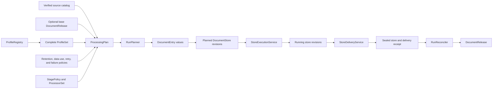
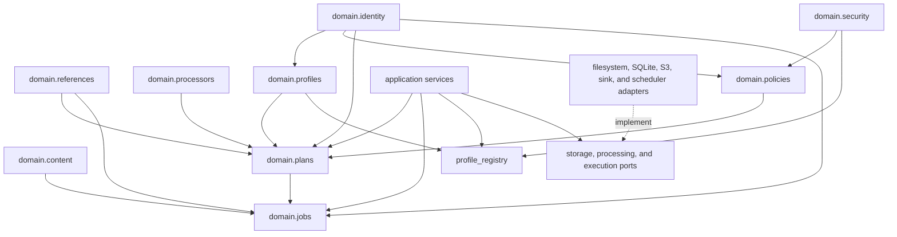
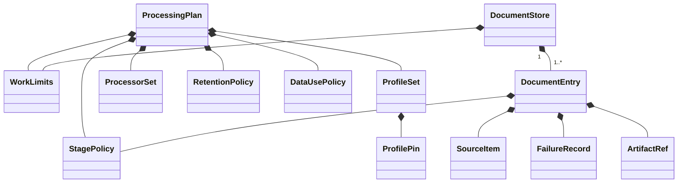
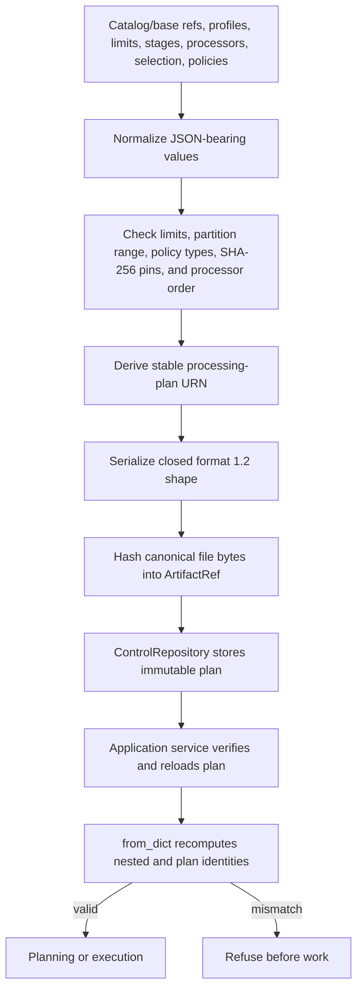
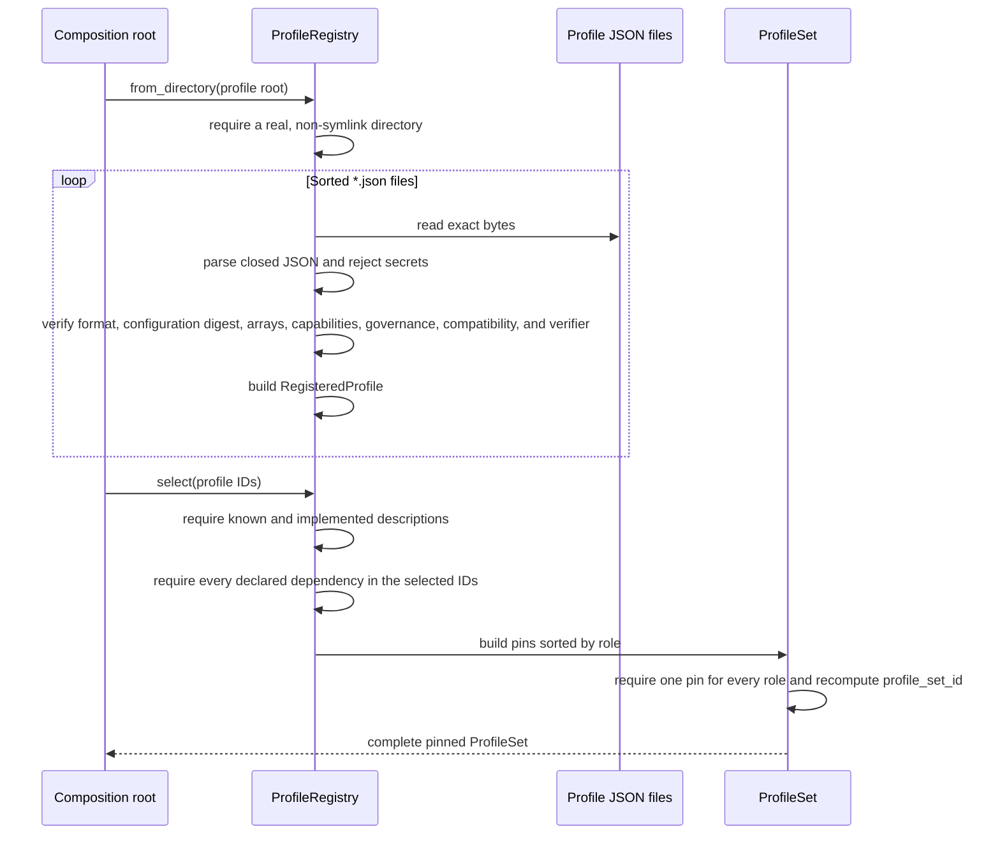
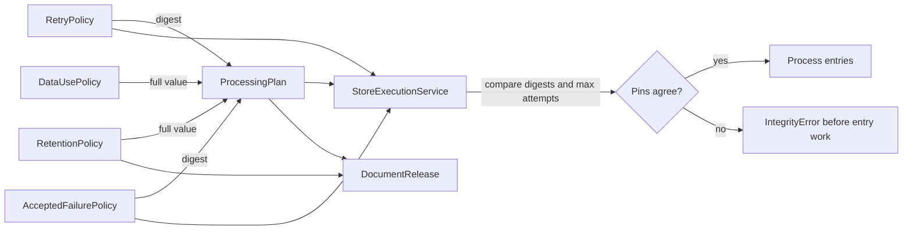
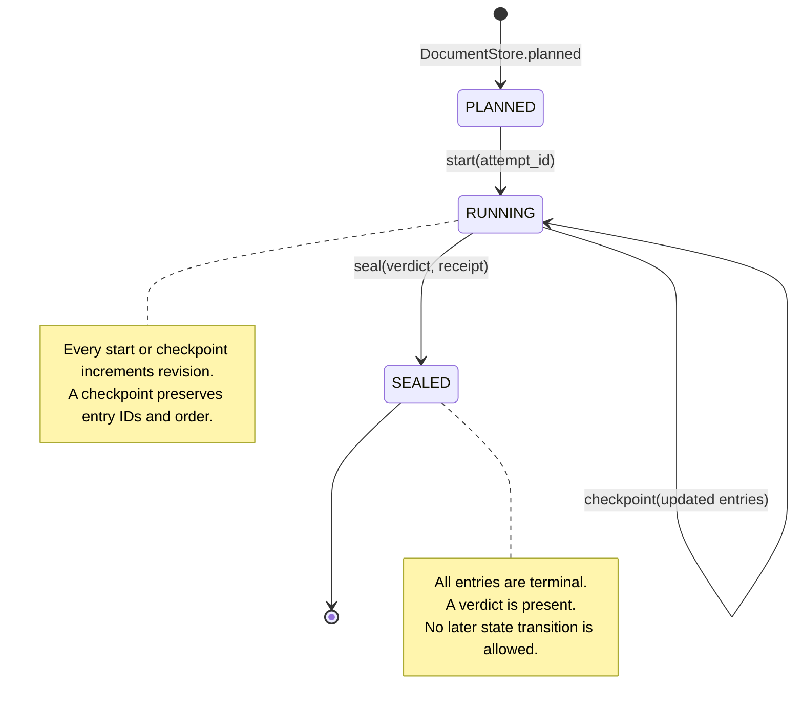
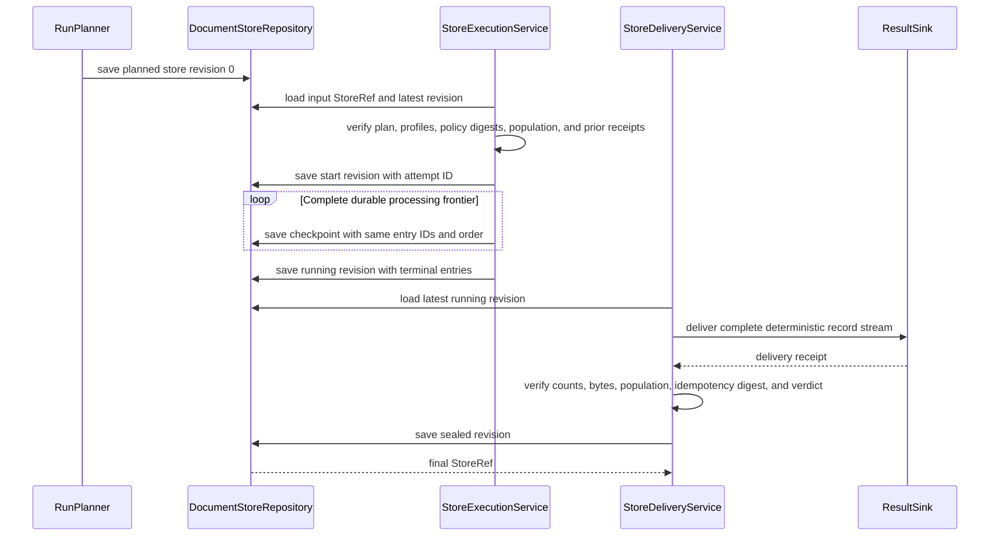
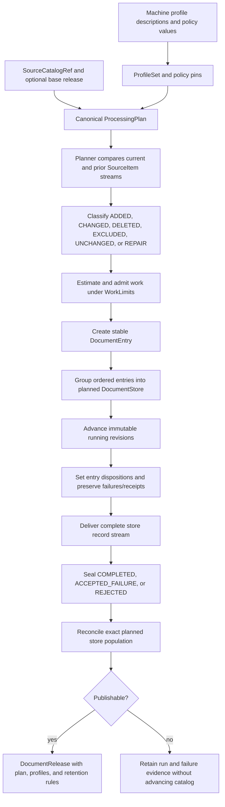

# Processing Plan and Job Model

This module defines the sealed instructions and bounded job records that govern a DocSpec document run. A `ProcessingPlan` identifies the source snapshot, optional base release, processing stages, processor graph, physical profiles, work limits, selection, retention rules, data-use rules, and failure behavior. The planner turns that plan into stable `DocumentEntry` values grouped in revisioned `DocumentStore` jobs.

The models separate intended behavior from execution progress. A plan says what a run must do. An entry says what one source item needs. A store records the durable state of a bounded group of entries as workers start, checkpoint, deliver, and seal it.

## Purpose and system role

| Question | Answer |
| --- | --- |
| What goes in? | A verified source-catalog reference, an optional base-release reference, one complete physical-profile set, work and partition limits, stage and processor identities, a selection object, and pinned retention, data-use, retry, and accepted-failure policies. |
| What happens? | DocSpec derives stable identities from canonical content, validates closed shapes and cross-field rules, classifies per-item work, and records execution through immutable store revisions. |
| What comes out? | A canonical `ProcessingPlan` artifact, planned `DocumentEntry` values, revisioned `DocumentStore` jobs, failure records, terminal store verdicts, and digests that later receipts and releases can verify. |
| How is it checked? | Constructors reject invalid values, deserializers reject unknown or missing fields, stable identifiers are recomputed, application services reload pinned artifacts, and conformance tests exercise planning, recovery, profile compatibility, delivery, and publication refusal. |

This module owns declarations and state rules. It does not choose source items, fetch bytes, run extractors or processors, schedule workers, write result layers, or publish releases. The application and adapter modules perform those operations against these models.

## System context



The neighboring modules supply or consume these values:

| Module | Relationship |
| --- | --- |
| [Source Catalog Pipeline](source_catalog_pipeline.md) | Publishes the immutable `SourceCatalogRef` and ordered `SourceItem` population named by the plan. |
| [Content Acquisition and Processing](content_acquisition_and_processing.md) | Defines `SourceItem`, acquisition dispositions, captured files, representations, segments, and derived records held by an entry. |
| [Document Run Application](document_run_application.md) | Coordinates planning, store execution, delivery, reconciliation, and release commit. |
| [Document Run Application: Planning](document_run_application_planning.md) | Defines selection syntax, change classification, repair scope, work estimation, partitioning, and bounded store packing. |
| [Document Run Application: Store Execution and Recovery](document_run_application_execution.md) | Enforces plan pins and actual work limits while it advances entry and store checkpoints. |
| [Document Run Application: Delivery, Reconciliation, and Release](document_run_application_delivery_and_release.md) | Derives store verdicts, verifies delivery receipts, reconciles the planned population, and gates release publication. |
| [Processor Extension Model](processor_extension_model.md) | Defines `ProcessorSet`, processor identities, dependency order, requests, results, and cache behavior pinned by a plan. |
| [Portable Task Execution](portable_task_execution.md) | Converts persisted stores into reference-only scheduler tasks and results without duplicating store contents. |
| [Storage and Shared References](storage_and_shared_references.md) | Defines `ArtifactRef`, `SourceCatalogRef`, `DocumentReleaseRef`, `StoreRef`, and the repositories that persist plans and store revisions. |
| [Document Release Artifacts](document_release_artifacts.md) | Copies the plan's profile and retention decisions into the immutable release root. |
| [Release Maintenance](release_maintenance.md) | Applies retention rules through reachability-aware blob collection and creates maintenance successor releases. |

## Code organization and dependency direction

| File | Responsibility |
| --- | --- |
| [`domain/plans.py`](../src/docspec/domain/plans.py) | Plan identity, work ceilings, stage selection, serialization, and invalidation-relevant content. |
| [`domain/jobs.py`](../src/docspec/domain/jobs.py) | Source-item change kinds, entry execution modes, failure taxonomy, store states, revisions, and verdicts. |
| [`domain/profiles.py`](../src/docspec/domain/profiles.py) | Physical-profile roles, governance declarations, descriptions, immutable pins, and complete profile sets. |
| [`profile_registry.py`](../src/docspec/profile_registry.py) | Safe loading, validation, inventory, and selection of machine-readable profile descriptions. |
| [`domain/policies.py`](../src/docspec/domain/policies.py) | Retention, data use, external-provider evidence, deterministic retry, and accepted-failure rules. |

The domain files depend on small identity and reference helpers, not concrete storage, scheduler, or processor adapters. Application services depend on these domain values and injected ports. Composition code selects concrete implementations only after it validates the plan's pins.



## Core model relationships



The composition rules are deliberate:

- The plan contains the complete processor descriptions as well as their execution order. A processor implementation cannot change beneath an unchanged plan identifier.
- Each entry repeats its requested stage policy. Processor-only repair can therefore request a strict subset of the plan's processor graph while retaining the plan's extractor and segmenter identities.
- Each store carries the limits used to admit and execute it. A worker need not infer ceilings from deployment defaults.
- Execution outputs and failures live on entries; the stable entry identity excludes them so a checkpoint can add results without changing the job population.

## Identity model

DocSpec derives content identities with canonical JSON hashing. Deserialization recomputes derived identifiers and refuses altered content under an existing identifier.

| Identity | Identity-bearing content | Content intentionally excluded |
| --- | --- | --- |
| `ProcessingPlan.plan_id` | Source catalog, base release, profile set, all work limits, stages, complete processor set, partition count, selection, full retention and data-use policies, retry-policy digest, and accepted-failure-policy digest | Nothing else in the plan |
| `ProfileSet.profile_set_id` | The ordered serialized profile pins | Registry inventory order and runtime objects |
| `ProfilePin.description_digest` | The registry's complete executable machine-description fields | Mutable verification status evidence |
| `DocumentEntry.entry_id` | Complete `SourceItem`, `ChangeKind`, requested stages, and execution mode | Captures, representations, segments, derived records, disposition, failures, receipts, and warnings |
| `DocumentStore.store_id` | Plan identifier, logical partition, and ordered entry identifiers | Store state, revision, attempt identifiers, entry execution results, delivery receipt, and verdict |
| `DocumentStore.receipt_digest` | The complete serialized sealed store revision | Nothing; the property is available only after sealing |

The result is a two-level model: stable logical identities name the intended plan and job population, while immutable repository references name exact revisions and bytes. A replay can find a newer checkpoint for the same `store_id` without mistaking it for a different job.

## Processing plans

### `ProcessingPlan`

`ProcessingPlan` is the complete behavior declaration for one run. `ProcessingPlan.create()` assembles its identity-bearing content and derives `plan_id` with `stable_urn("processing-plan", content)`. Direct construction and `from_dict()` accept a plan only when the supplied identifier matches the reconstructed content.

| Field | Meaning and validation |
| --- | --- |
| `source_catalog` | Exact immutable catalog snapshot to process. |
| `base_release` | Optional release used for incremental comparison, checkpoint reuse, and untouched partition reuse. |
| `profiles` | One pinned implementation description for every `ProfileRole`. |
| `limits` | Store admission and execution ceilings in `WorkLimits`. |
| `stages` | Allowed extractor identities, one segmenter identity, and ordered processor identities. |
| `processors` | Complete `ProcessorSet`, including descriptions and dependency order. Its `execution_order` identifiers must exactly equal `stages.processor_ids`. |
| `partition_count` | Stable logical partition count from `1` through `65,536`. |
| `selection` | JSON object interpreted by the planner. The plan validates that it is JSON-safe; the planner validates its closed selector shape. |
| `retention_policy` | Full typed retention policy copied into the eventual release. |
| `data_use_policy` | Full typed field and external-processing policy enforced before processor invocation. |
| `retry_policy_digest` | SHA-256 digest of the separately supplied `RetryPolicy`. |
| `accepted_failure_policy_digest` | SHA-256 digest of the separately supplied `AcceptedFailurePolicy`. |

The serialized plan uses `format: docspec-processing-plan` and `formatVersion: "1.2"`. `from_dict()` requires the exact field set; unknown and missing fields fail together as an invalid closed shape.

`artifact_ref(locator=...)` serializes the plan as canonical JSON file bytes and returns an `ArtifactRef` with:

- `artifact_id` equal to `plan_id`;
- the caller-supplied locator;
- a SHA-256 digest of the exact file bytes;
- media type `application/json`; and
- the exact byte count.

The control repository remains responsible for storing and verifying those bytes. See [Storage and Shared References](storage_and_shared_references.md).

### Plan construction and verification flow



### Governing content and incremental repair

`governing_content()` returns every plan field that may invalidate an otherwise unchanged source item. It excludes only `source_catalog`, `base_release`, and `plan_id`; source comparison handles catalog changes, and every incremental plan necessarily names a new base.

The planner compares this value with the base release's plan:

- Equal governing content leaves equal active source items unchanged.
- A non-processor change schedules full repair.
- An isolated processor-description or processor-stage change can schedule processor-only repair for changed processors and their current dependents.
- A change that the planner cannot isolate safely falls back to full repair.

This page defines which fields participate. [Document Run Application: Planning](document_run_application_planning.md) defines the comparison algorithm, selection behavior, and repair closure.

### `WorkLimits`

`WorkLimits` declares eight positive integer ceilings:

| Field | Applies to |
| --- | --- |
| `max_entries` | Number of entries admitted to one store. |
| `max_estimated_bytes` | Planner estimate and execution accounting for captured source bytes. |
| `max_pages_or_frames` | Observed extraction pages or frames. |
| `max_segments` | Created segment count. |
| `max_processor_cost` | Planned processor cost and actual processor invocations. |
| `max_memory_bytes` | Materialized worker memory tracked by `MemoryScope`. |
| `max_duration_seconds` | Active execution duration. |
| `max_attempts` | Maximum retry count; defaults to `3` and must equal the injected retry policy's `max_attempts`. |

The `DocumentStore` constructor enforces only the non-empty entry population and `max_entries`. The planner and executor enforce the remaining dimensions because they require estimates or observed work. See the planning and execution pages for those algorithms.

Python booleans are rejected even though `bool` is an `int` subclass. The serialized nested object has a closed eight-field shape.

### `StagePolicy`

`StagePolicy` holds immutable identity tuples for extractors and processors plus one segmenter identity. It requires:

- at least one extractor;
- non-empty text for every identity;
- distinct extractor identities;
- distinct processor identities; and
- actual tuples, not mutable lists, in the Python model.

The tuple order is identity-bearing. The extractor tuple supplies the allowed identities, and processor order must equal `ProcessorSet.execution_order`. The empty processor tuple is valid for extraction-and-segmentation-only plans or maintenance work.

## Physical profiles and registry selection

Profiles let the plan pin storage and delivery behavior without importing concrete adapters into the domain model.

### Profile roles

A `ProfileSet` must contain exactly one pin for each role, sorted by the role's serialized name.

| `ProfileRole` | What the profile describes |
| --- | --- |
| `ReleaseManifestProfile` | Canonical `DocumentRelease` root representation. |
| `DocumentCatalogProfile` | Current-release lookup, staging, comparison, and commit behavior. |
| `RecordStorageProfile` | Immutable logical record-layer storage. |
| `BlobStorageProfile` | Content-addressed source, representation, and segment blobs. |
| `DocumentStorePersistenceProfile` | Revisioned `DocumentStore` persistence and planned-store ledgers. |
| `ResultDeliveryProfile` | Durable, returned, or hybrid delivery behavior. |

`ProfileSet.for_role()` returns the unique pin for a role. Planning, delivery, commit, release verification, the command-line composition, and maintenance use this method rather than relying on tuple position.

### Description, pin, and registry inventory

The profile types separate three levels of information:

| Type | Purpose |
| --- | --- |
| `ProfileDescription` | Parsed logical description: role, version, implementation identity, configuration, schemas, media types, enabled capabilities, limits, governance policy identities, dependencies, and verifier identity. |
| `RegisteredProfile` | Description plus registry-only evidence: complete description digest, implementation status and module, declared profile-set compatibility identifier, and verifier status/test identifier. |
| `ProfilePin` | Small plan-safe selection: role, profile and implementation identities, version, configuration digest, complete description digest, and enabled capabilities. |

`configuration_digest` identifies only the configuration object. `description_digest` identifies the complete executable machine description. A change to limits, schemas, media types, capabilities, governance, compatibility, version, implementation identity, module, or verifier test changes the registry-issued description digest even when configuration stays constant.

Implementation status and verifier status describe current evidence, so `_description_identity()` excludes those two status values. Changing a profile from `specified` to `implemented`, or updating verification status, does not rename an otherwise identical description. Selection still refuses a profile whose current implementation status is not `implemented`.

### Registry loading and selection



`ProfileRegistry.from_directory()` rejects a missing or symlinked root, requires at least one `*.json` file, and loads files in sorted order. `from_file()` also rejects symlinked files and verifies these boundaries before returning a profile:

- exact top-level fields, `docspec-storage-profile` format, and version `1.0`;
- secret-free content;
- implementation status of `specified` or `implemented`;
- a configuration object whose digest matches `configurationDigest`;
- non-empty schema and media-type arrays;
- a non-empty capability map of string names to booleans;
- a limits object;
- closed compatibility and verifier objects; and
- five known governance policy Uniform Resource Names (URNs).

`select()` enforces selected IDs, implementation status, and each profile's `requires` list. `ProfileSet` then enforces one pin per role and all six roles. A composition root may add deployment-specific compatibility checks; the registry's generic composition rule is the declared `requires` graph.

## Policies

Policies are closed, identity-bearing values. The plan embeds retention and data-use policies because later releases and processor requests need their complete rules. It stores retry and accepted-failure policy digests because the execution composition supplies those runtime policy objects separately and must prove that they match.



### `RetentionPolicy`

`RetentionPolicy` assigns one action to each logical data class:

- source bytes;
- representations;
- segments;
- derived records; and
- receipts.

`RetentionAction.RETAIN` keeps the class. `COLLECT_WHEN_UNREFERENCED` permits a reachability-aware collector to remove it after `minimum_age_seconds`, which must be a non-negative integer. Collection permission does not bypass release and profile roots. [Release Maintenance](release_maintenance.md) defines reachability and compaction behavior.

`RetentionPolicy.create()` derives `policy_id` from these six rules. `retain_all()` supplies the conservative all-retain policy. The serialized format is `docspec-retention-policy` version `1.0`.

### `DataUsePolicy`

`DataUsePolicy` controls what a processor can receive and whether it may call an external provider. `allowed_fields` must be a non-empty, sorted, distinct tuple drawn from:

| Allowed field | Payload meaning |
| --- | --- |
| `content` | Segment bytes. |
| `contentMediaType` | Segment content media type. |
| `evidence` | Source-grounding evidence. |
| `prerequisiteResults` | Results from processor dependencies. |
| `representationCoordinates` | Coordinates within the parent representation. |
| `segmentKind` | Segment classification. |
| `segmentOrdinal` | Stable segment order. |

`ProcessorExecutionScope.LOCAL_ONLY` forbids external processing. `DECLARED_EXTERNAL` permits it only for processors that declare an external execution scope and return matching provider evidence. `local_content()` creates a local-only policy that exposes all registered fields.

The policy separately selects request and response evidence modes:

- `digest-only` stores a SHA-256 digest and no provider record.
- `redacted-record` stores a secret-free JSON object whose identity digest equals the declared digest.

`ProviderInteractionEvidence` pairs request and response evidence with a provider identity. `require_provider_evidence()` applies three rules: local processors attach no external evidence, external processors require policy permission and evidence, and request/response evidence modes must equal the plan's modes.

The serialized format is `docspec-data-use-policy` version `1.0`. [Processor Extension Model](processor_extension_model.md) documents payload field filtering and processor result validation.

### `RetryPolicy`

`RetryPolicy` defines bounded exponential backoff:

```text
base delay = min(max delay, base delay * 2 ** (attempt - 1))
actual delay = base delay + deterministic signed jitter
```

The defaults are three attempts, a 250 ms base delay, a 30,000 ms maximum delay, and 2,000 basis points of jitter. One basis point is one hundredth of one percent, so the default jitter range is plus or minus 20 percent.

Jitter is deterministic. `delay_milliseconds(task_id, attempt)` hashes the task identity and one-based attempt number, then maps the result into the configured range. Replaying the same task and attempt produces the same delay. The method computes delay; callers still enforce `max_attempts`.

The policy digest covers the closed `docspec-retry-policy` version `1.0` representation. Execution requires both that digest and `WorkLimits.max_attempts` to match the injected policy.

### `AcceptedFailurePolicy`

`AcceptedFailurePolicy` contains sorted, distinct accepted failure classes and diagnostic codes. `accepts()` returns true when either the failure class or diagnostic code appears in the policy.

The class list cannot accept `ARTIFACT_INTEGRITY` or `IMPLEMENTATION_DEFECT`. Diagnostic-code matching remains an independent rule, so maintainers should add codes narrowly and cover them with an end-to-end refusal or acceptance test. The policy digest covers the `docspec-accepted-failure-policy` version `1.0` representation.

## Document entries

### Change kinds and execution modes

`ChangeKind` states why an entry exists:

| Kind | Meaning |
| --- | --- |
| `ADDED` | Active source item has no active equivalent in the base release. |
| `CHANGED` | Current and prior complete source-item values differ. |
| `UNCHANGED` | Current and prior values match. The standard planner omits these from stores unless another rule schedules repair. |
| `DELETED` | Current state or complete-snapshot omission removes a prior item. |
| `REPAIR` | Source is unchanged, but governing plan changes require new or replaced outputs. |
| `EXCLUDED` | Source policy records the item but bars content processing. |

`EntryExecutionMode.FULL` runs the requested acquisition, extraction, segmentation, and processor stages. `PROCESSORS_ONLY` reuses verified base content and runs only the requested processor subset. The latter is valid only for `REPAIR` entries.

Planning details, including tombstones and processor invalidation, belong in [Document Run Application: Planning](document_run_application_planning.md).

### `DocumentEntry`

`DocumentEntry.create()` derives the entry identity from the source item, change kind, stage policy, and execution mode. It also makes metadata-only changes terminal immediately:

| Change | Initial disposition |
| --- | --- |
| `DELETED` | `AcquisitionDisposition.DELETED` |
| `EXCLUDED` | `AcquisitionDisposition.EXCLUDED` |
| `UNCHANGED` | `AcquisitionDisposition.UNCHANGED` |
| `ADDED`, `CHANGED`, `REPAIR` | `None`; execution must decide the terminal disposition |

`terminal` means only that `disposition` is non-null. Higher-level services apply stronger rules to each disposition before accepting a checkpoint or delivery.

As work advances, immutable replacement entries can add:

- ordered captured files;
- ordered representations;
- ordered segments;
- processor-derived records;
- classified failure records;
- immutable stage-receipt references; and
- warnings.

Those fields do not change `entry_id`. The executor can checkpoint partial progress while the planner's intended entry population remains stable. The executor verifies that outputs and receipts form a valid frontier before it trusts them; see [Document Run Application: Store Execution and Recovery](document_run_application_execution.md).

## Failures and store verdicts

### `FailureRecord` and `FailureClass`

A `FailureRecord` contains a registered class, non-empty diagnostic code and detail, one-based attempt number, and retryable flag. The flag is derived by class and cannot disagree with this table:

| Failure class | Retryable | Typical meaning |
| --- | --- | --- |
| `TRANSIENT_EXTERNAL` | Yes | Temporary network, remote service, or transport failure. |
| `TRANSIENT_RESOURCE` | Yes | Temporary local resource failure, including memory pressure. |
| `DETERMINISTIC_INPUT` | No | The same valid implementation and input will fail again, including a hard work-limit breach. |
| `POLICY_EXCLUSION` | No | A governing rule excludes the operation or input. |
| `ARTIFACT_INTEGRITY` | No | A referenced artifact, digest, lineage, or persisted checkpoint fails verification. |
| `IMPLEMENTATION_DEFECT` | No | Unexpected implementation behavior or an unclassified exception. |

`StoreExecutionService` maps exceptions into these classes, stores a normalized diagnostic code, and avoids copying raw exception content into the public failure detail. Accepted-failure policy applies to the final failure; transient classification alone never makes an exhausted failure acceptable.

### `StoreVerdict`

The delivery layer derives the final verdict from all terminal entry dispositions:

| Verdict | Derivation and effect |
| --- | --- |
| `COMPLETED` | No entry ended in accepted failure or rejected run. `DocumentStore.seal()` requires a delivery receipt for this verdict. |
| `ACCEPTED_FAILURE` | At least one entry has an accepted failure and no entry is rejected. The run can publish with failure evidence. |
| `REJECTED` | At least one entry has `REJECTED_RUN`. Reconciliation preserves evidence, but release commit refuses publication. |

The domain `seal()` method accepts a verdict; `StoreDeliveryService` computes it from the entry population and verifies that the delivery receipt reports the same value.

## Document stores and revision lifecycle

`DocumentStore` is the bounded unit of execution and recovery. A planned store must contain at least one distinct entry and no more than `limits.max_entries`. Its `store_id` fixes the plan, logical partition, and ordered entry population.



### State transitions

| Operation | Preconditions | Result |
| --- | --- | --- |
| `planned(...)` | Non-empty distinct entries within `max_entries`; non-empty plan and partition identities | Revision `0`, state `PLANNED`, derived stable `store_id` |
| `start(attempt_id)` | Store is not sealed; attempt identity is non-empty | State `RUNNING`, revision plus one, and first occurrence of the attempt appended |
| `checkpoint(entries)` | State is `RUNNING`; entry identifiers and order exactly match the planned population | Replaced entry values and revision plus one |
| `seal(verdict, delivery_receipt)` | State is `RUNNING`; every entry is terminal; `COMPLETED` includes a receipt | State `SEALED`, revision plus one, receipt and verdict recorded |
| `receipt_digest` | State is `SEALED` | SHA-256 identity digest of the complete serialized store |

`start()` also supports retrying an already running store. Reusing the same attempt identifier does not duplicate it in `attempts`, though the new start still advances the revision.

The serialized store uses `format: docspec-document-store` and `formatVersion: "1.0"`. `from_dict()` requires the exact field set and reconstructs every nested entry, limit, reference, enum, and optional verdict.

### Checkpoint interaction



The repository owns immutable revision persistence and latest-revision lookup. The job model supplies transition rules but does not perform compare-and-set, filesystem writes, or concurrency control. [Storage and Shared References](storage_and_shared_references.md) documents repository behavior.

## End-to-end data flow

The plan and job models participate at every run boundary without carrying bulk data between services.



## Validation and refusal boundaries

The models fail early at different layers:

| Boundary | Examples of refusal |
| --- | --- |
| Value construction | Empty identities, invalid enum values, unsorted or repeated sets, bad SHA-256 pins, non-positive limits, incompatible retryability, invalid partition counts, or missing profile roles |
| Deserialization | Unknown format version, extra or missing fields, arrays supplied as strings, invalid nested values, or an identity that differs from reconstructed content |
| Profile registry | Unsafe path, no profile files, secrets, configuration digest drift, unknown governance policy, invalid capability map, unknown profile ID, unimplemented profile, or missing requirement |
| Plan composition | Processor execution order differs from the stage list, policy types differ, selection is not a JSON object, or a runtime policy digest differs |
| Store transition | Empty or oversized population, duplicate entry identity, changed checkpoint population or order, checkpoint outside `RUNNING`, nonterminal seal, or restart after seal |
| Delivery and publication | Incomplete delivery evidence, mismatched verdict, rejected store, inconsistent profile, or failure evidence that does not match the sealed store |

These checks complement each other. A dataclass constructor protects local invariants; application services verify relationships that require repositories, prior releases, runtime implementations, or complete streams.

## Serialization and compatibility rules

Most deserializers use exact key-set comparisons. This prevents silent acceptance of fields that an older reader does not understand. Contributors should treat serialized shapes as versioned public interfaces, even when only local adapters currently read them.

| Value | Format marker | Current version |
| --- | --- | --- |
| Processing plan | `docspec-processing-plan` | `1.2` |
| Document store | `docspec-document-store` | `1.0` |
| Profile description file | `docspec-storage-profile` | `1.0` |
| Retention policy | `docspec-retention-policy` | `1.0` |
| Data-use policy | `docspec-data-use-policy` | `1.0` |
| Retry policy | `docspec-retry-policy` | `1.0` |
| Accepted-failure policy | `docspec-accepted-failure-policy` | `1.0` |

The frozen dataclasses prevent field reassignment, but JSON-bearing members such as `selection`, profile `configuration`, and profile `limits` are normalized back into ordinary dictionaries. Treat them as immutable after construction. Mutating one in place would bypass the constructor's identity check and make later serialization disagree with the original identifier.

## Contributor guidance

### Changing the processing plan

When adding or changing an identity-bearing plan field:

1. Update `create()`, `identity_content()`, `governing_content()`, `to_dict()`, and `from_dict()` together.
2. Decide whether the change invalidates unchanged source items. If it does, include it in governing content and add full or processor-only repair tests.
3. Update the exact closed field set and bump `formatVersion` when an older reader cannot preserve the new meaning.
4. Update artifact schemas, CLI request parsing, maintenance-plan construction, release verification, and any fixtures that build plans.
5. Prove that semantic changes alter `plan_id` and unchanged round trips preserve it.

### Adding or changing a profile

1. Add or update one JSON description under `profiles/`; use no symlinks.
2. Keep the exact top-level shape and recompute `configurationDigest` after configuration changes.
3. Declare the exact schemas, media types, sorted enabled capabilities, limits, governance policy URNs, compatibility requirements, implementation module, and verifier test.
4. Mark the profile `implemented` only when the implementation and shared conformance tests exist.
5. Add the profile to the role-combination tests. A new `ProfileRole` also requires changes to every complete `ProfileSet`, composition mapping, release verifier, schema, and fixture.

Do not use `ProfileDescription.configuration_digest` as a substitute for the registry's complete `description_digest`. The full pin prevents an implementation, schema, limit, capability, governance, or compatibility change from hiding beneath an unchanged configuration.

### Changing job states or failure behavior

State and failure enums affect the planner, worker, delivery stream, reconciliation counts, release summaries, and commit gate. Update those readers as one change. Preserve these properties:

- entry and store identities remain stable across legitimate checkpoints;
- checkpoints preserve planned entry order and population;
- retryability follows the registered failure class;
- accepted failures remain visible in run and release evidence; and
- rejected stores reconcile for diagnosis but cannot publish.

### Changing a policy

Keep policy input validation, identity content, serialization, and runtime enforcement together. A new data-use field also requires `ProcessorPayload` filtering and byte-accounting changes. A new retention class requires release-root and reachability support. A new failure acceptance rule requires delivery, reconciliation, and publication tests.

## Verification guide

Use the focused tests while changing this module:

```bash
pytest tests/test_domain.py \
  tests/test_profile_registry.py \
  tests/test_policy_security.py
```

Use the shared behavior tests before merging profile, job, or failure changes:

```bash
pytest tests/conformance/test_profile_descriptions.py \
  tests/conformance/test_profile_compatibility.py \
  tests/conformance/test_document_store.py
```

Run the neighboring application tests when a change affects planning, budgets, recovery, delivery, or publication:

```bash
pytest tests/test_planner.py \
  tests/test_work_budget.py \
  tests/test_stage_checkpoint_recovery.py \
  tests/test_result_sinks_and_recovery.py
```

The most important negative checks are identity drift, closed-shape rejection, profile incompatibility before planning writes state, checkpoint population preservation, bounded retry, complete delivery acknowledgement, and publication refusal for rejected stores.
