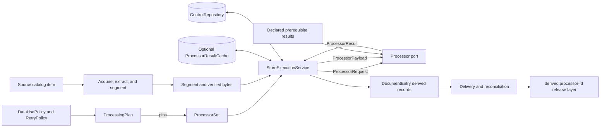
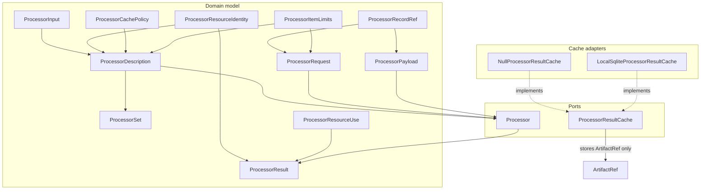
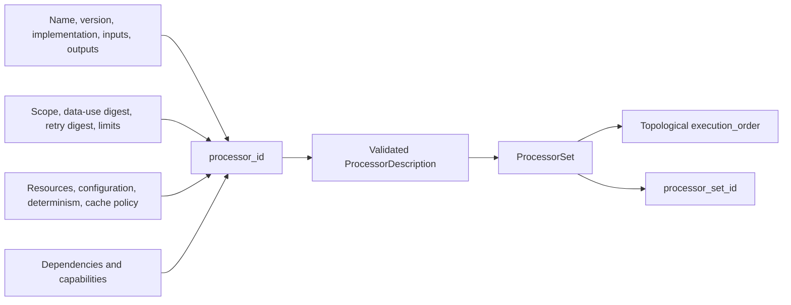
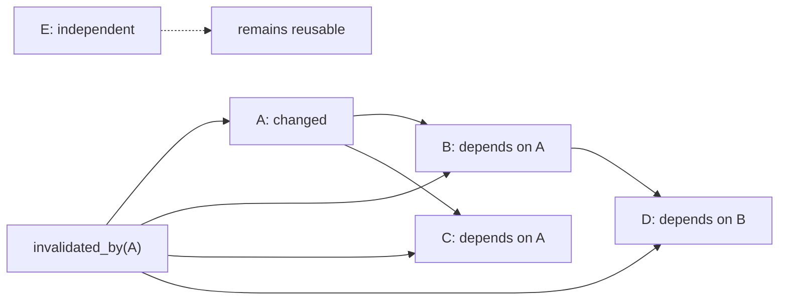
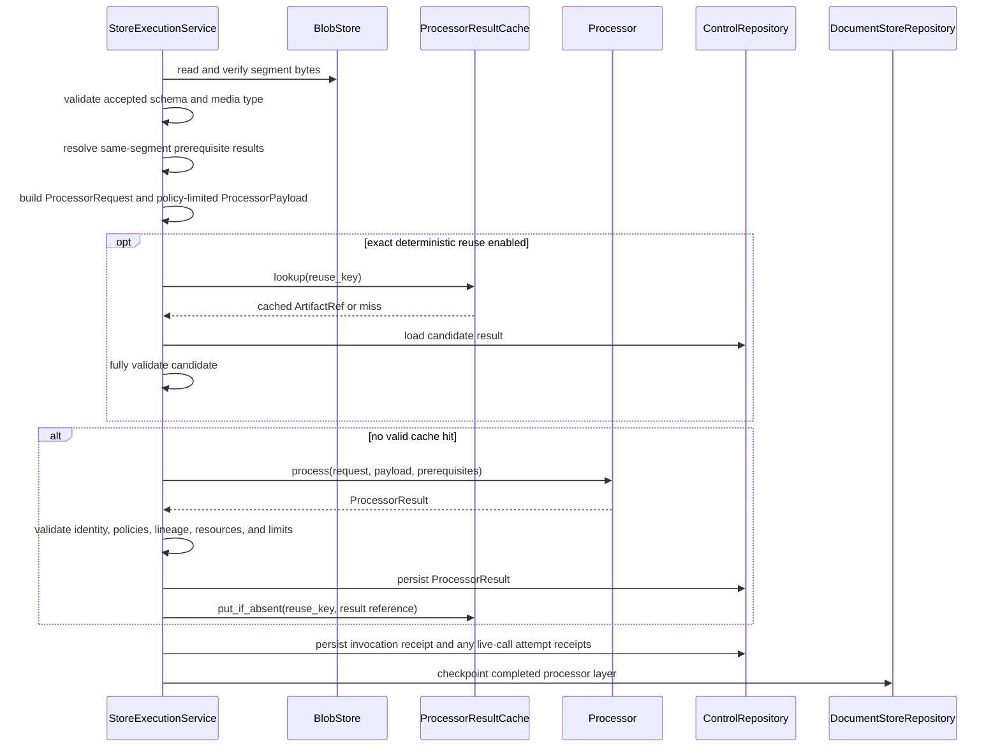
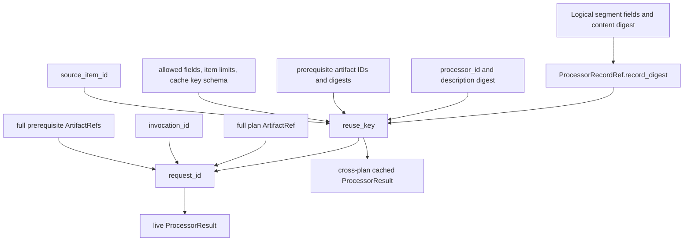
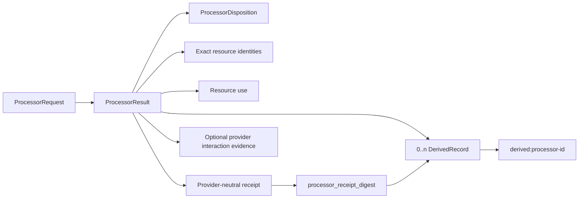
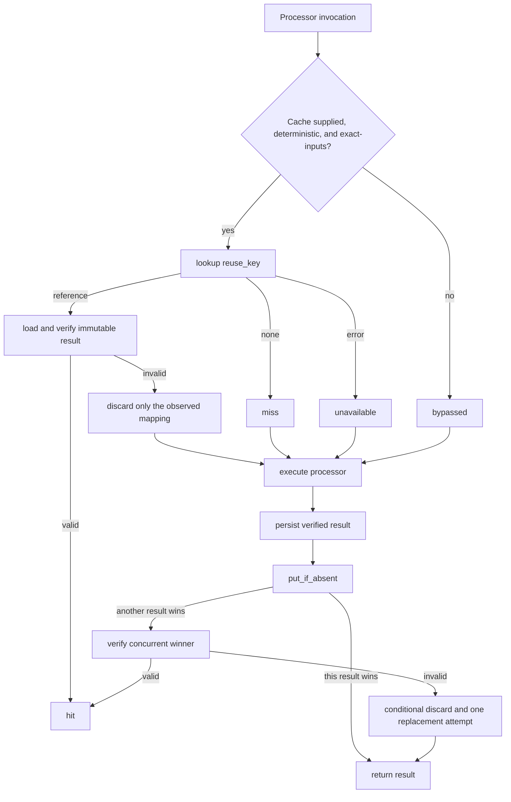
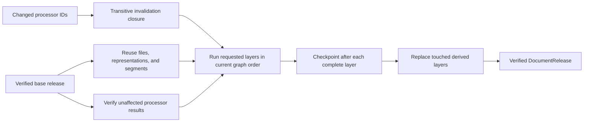

# Processor Extension Model

The processor extension model lets DocSpec add local or external content processors without putting provider SDK types, cache products, or processor-specific branches into the application layer. It pins each processor's behavior and policies, orders processors as an acyclic dependency graph, sends each invocation a policy-limited payload, and returns identity-bearing results that DocSpec can verify, store, replay, and publish.

This page covers:

- `src/docspec/domain/processors.py`: processor declarations, requests, payloads, results, graph rules, and identities;
- `src/docspec/ports/processor.py`: the injected `Processor` interface;
- `src/docspec/ports/processor_cache.py`: the optional exact-result cache interface; and
- `src/docspec/adapters/processor_cache.py`: the null and local SQLite cache adapters.

See [Processing Plan and Job Model](processing_plan_and_job_model.md) for the plan that pins a `ProcessorSet`. See [Document Run Application: Store Execution and Recovery](document_run_application_execution.md) for scheduling, retries, checkpoint recovery, and application-level result validation. Segment and `DerivedRecord` semantics belong to [Content Acquisition and Processing: Extraction and Evidence](content_acquisition_and_processing_extraction.md) and [Content Acquisition and Processing: Segmentation](content_acquisition_and_processing_segmentation.md).

## Purpose and boundary

| Question | Answer |
| --- | --- |
| What goes in? | Immutable segment records and bytes, a sealed processing plan, declared prerequisite results, data-use and retry policies, processor implementations, and an optional result cache. |
| What happens? | DocSpec validates the processor graph, includes only policy-approved fields, derives exact request and reuse identities, invokes processors in dependency order, and verifies every live or reused result. |
| What comes out? | Immutable `ProcessorResult` artifacts, provenance-bearing `DerivedRecord` values, resource-use observations, provider receipts and evidence, and advisory cache mappings. |
| How is it checked? | Closed JSON shapes, canonical digests, content-derived Uniform Resource Names (URNs), graph validation, input and output limits, policy checks, cache-hit revalidation, checkpoint replay, and focused conformance tests. |

The module owns the language shared by DocSpec and injected processors. It does not acquire files, extract or segment content, choose work, run scheduler tasks, persist release layers, or publish releases. Those operations remain in the linked modules.

## System context



The dependency direction is deliberate. Domain types describe valid processor work. Ports refer only to those domain types and shared artifact references. Adapters implement ports. The application service composes them and applies run policy. A processor may depend on a provider SDK internally, but provider objects never enter `ProcessorDescription`, `ProcessorRequest`, `ProcessorResult`, or the cache.

## Architecture and component relationships



### Component reference

| Component | Role and important rules |
| --- | --- |
| `ProcessorInput` | Declares one accepted record kind and its supported schema identifiers and media types. Schema and media tuples must be non-empty, sorted, and distinct. A description may declare each record kind once. |
| `ProcessorResourceKind` | Classifies an output-affecting resource as `model`, `reference-data`, or `software`. |
| `ProcessorResourceIdentity` | Pins a resource identifier, kind, revision, and SHA-256 identity digest. It describes an exact input to behavior without exposing a provider object. |
| `ProcessorCacheMode` | Selects `disabled` or `exact-inputs` reuse. |
| `ProcessorCachePolicy` | Pairs the mode with a cache-key schema identifier. Disabled caching forbids a key schema; exact-input reuse requires one. |
| `ProcessorItemLimits` | Sets positive per-invocation bounds for input records, input bytes, output records, output bytes, and duration. These limits complement the run-wide `WorkLimits` described in [Processing Plan and Job Model](processing_plan_and_job_model.md). |
| `ProcessorDescription` | Pins behavior, accepted inputs, outputs, execution scope, resources, dependencies, determinism, cache policy, configuration, data-use policy, item limits, retry policy, and capabilities under one content-derived `processor_id`. |
| `ProcessorSet` | Validates distinct processor identifiers and names, known dependencies, and an acyclic graph. It exposes deterministic execution order and transitive invalidation. |
| `ProcessorRecordRef` | Names one logical input by kind, identifier, schema, and digest without carrying bulk content. `for_segment()` excludes the blob locator from the digest, so physical relocation does not change logical reuse identity. |
| `ProcessorPayload` | Carries worker-local segment data after policy filtering. It validates source bytes against the segment's digest and size before exposing only the approved content or metadata fields. |
| `ProcessorRequest` | Describes one closed unit of work. It pins the plan, processor, source item, exact input records, prerequisite result references, allowed fields, limits, cache-key schema, and invocation identifier. |
| `ProcessorResourceUse` | Reports non-negative input bytes, output bytes, elapsed milliseconds, and external request count. The application recomputes the byte counts and checks the declared execution scope. |
| `ProcessorResult` | Returns disposition, output media type, exact resources, derived records, resource use, warnings, a provider-neutral receipt, and optional external-provider evidence. Its content determines `result_id`. |
| `Processor` | Defines the synchronous injected method `process(request, payload, prerequisite_results)`. The implementation also exposes its immutable `description`. |
| `ProcessorResultCache` | Provides `lookup`, first-writer-wins `put_if_absent`, and compare-and-delete `discard` operations over `reuse_key -> ArtifactRef`. |
| `NullProcessorResultCache` | Implements the no-reuse behavior: every lookup misses, writes return the caller's result, and discards do nothing. |
| `LocalSqliteProcessorResultCache` | Stores reuse keys and immutable result references in a local SQLite table. It resolves concurrent publishers to one winner but never stores result bodies. |
| `processor_receipt_digest()` | Canonicalizes and hashes a provider receipt so every `DerivedRecord` can pin the exact receipt that supports it. |

## Declaring processors and dependency graphs

`ProcessorDescription.create()` is the normal construction path. It calculates `processor_id` from every behavior-bearing field; callers do not assign the identifier. Any change to implementation, inputs, output types, resources, dependencies, determinism, cache behavior, configuration, policies, limits, or capabilities creates a different processor identity.



`ProcessorSet` treats dependencies as processor identifiers, not names. Names must still be unique because planning compares stable names when it decides which processor changed between releases. The set rejects self-dependencies, missing nodes, duplicate identifiers, duplicate names, and cycles.

Topological ordering uses processor identifiers to break ties between ready nodes. The input tuple remains identity-bearing: `processor_set_id` hashes descriptions in the supplied order. A plan therefore pins both the set identity and `StagePolicy.processor_ids`; `ProcessingPlan` requires the stage list to equal `ProcessorSet.execution_order` exactly.

An empty `ProcessorSet` is valid for runs with no derived processing. For a populated graph, `invalidated_by(changed_processor_ids)` returns the changed nodes and their transitive dependents in execution order. Planning uses that closure for processor-only repair. See [Document Run Application: Planning](document_run_application_planning.md) for source comparison and repair classification.



### Description rules that contributors must preserve

- `accepted_inputs` contains at least one `ProcessorInput` and is sorted by distinct `record_kind`.
- `output_media_types`, `dependencies`, and `capabilities` are immutable, sorted, and distinct tuples. Output media types cannot be empty.
- `external_resources` is sorted and distinct by `(resource_kind, resource_id)`.
- `configuration_digest`, `data_use_policy_digest`, and `retry_policy_digest` use normalized `sha256:<hex>` values.
- Only a deterministic processor may select `ProcessorCacheMode.EXACT_INPUTS`.
- `execution_scope` and `external_resources` express separate facts. Scope says whether an invocation crosses the worker boundary; resources name exact models, data, or software that affect output.
- Capabilities are identity-bearing descriptions. The current executor does not perform capability negotiation.

## Invocation data flow

The current application path invokes each processor once for each segment. Although `ProcessorInput` can describe other record kinds, `StoreExecutionService` currently requires the `segment` kind, the `docspec-segment/1` schema, and a matching media type. Exact media types, `type/*` wildcards, and `*/*` are supported.

The executor completes one processor layer across all segments before it advances to the next processor. It resolves each declared dependency for the same segment. A downstream processor receives no results from undeclared siblings.



### Request, payload, and prerequisites

These three inputs have different jobs:

| Input | Contents | Lifetime |
| --- | --- | --- |
| `ProcessorRequest` | Stable semantic description and immutable references; no bulk segment bytes. | Serialized into the processor-invocation receipt and verified during replay. |
| `ProcessorPayload` | The current segment's allowed bytes and metadata. | Worker-local; it is not the durable request or cache value. |
| `prerequisite_results` | Full verified results from the processor's declared incoming graph edges for the same segment. | Passed separately to `process()`; their artifact references appear in the request. |

`ProcessorPayload.for_segment()` always verifies the supplied bytes against `Segment.content.byte_size` and `Segment.content.digest` before applying the data-use policy. This prevents a policy that hides `content` from bypassing source-integrity checks.

The allowed field names are:

- `content`;
- `contentMediaType`;
- `evidence`;
- `prerequisiteResults`;
- `representationCoordinates`;
- `segmentKind`; and
- `segmentOrdinal`.

For payload fields, membership in `allowed_fields` must exactly match value presence. `prerequisiteResults` authorizes the separate prerequisite-results argument rather than adding a field to `ProcessorPayload`. A processor with dependencies fails before invocation if the plan's data-use policy omits that permission. `input_byte_size` counts projected content bytes only; application validation later adds the canonical serialized size of prerequisite results.

The data-use policy, provider evidence modes, and retry policy live in [Processing Plan and Job Model](processing_plan_and_job_model.md). The executor requires every description's policy digests to match the plan before it invokes any processor.

## Identity model and exact reuse

DocSpec separates an invocation's identity from its reusable semantic inputs.



`ProcessorRequest.reuse_key` includes the cache-key schema, source item, processor and description digest, logical input records, prerequisite result artifact identifiers and digests, allowed fields, and item limits. It omits the processing plan, invocation identifier, and physical details of prerequisite artifact references. This design permits exact reuse across plan identities and storage relocation when the semantic inputs remain equal.

`request_id` adds the complete plan reference, complete prerequisite references, and invocation identifier. A fresh result must name the current request. A cache hit may carry an earlier `request_id`, but it must match the current `reuse_key` and pass the same semantic checks.

`ProcessorRecordRef.for_segment()` hashes the complete logical segment after replacing its `BlobRef` with digest, byte size, and media type. The locator therefore cannot invalidate reuse by itself. Changes to content, evidence, coordinates, kind, ordinal, representation lineage, segmenter, or segmentation policy still change the input digest.

All serialized requests use the closed `docspec-processor-request` format version `1.0`. Deserialization reconstructs and compares both `requestId` and `reuseKey`; extra, missing, or altered fields fail.

## Result and evidence model

A processor returns one `ProcessorResult`, serialized as the closed `docspec-processor-result` format version `1.2`. The result's full identity content determines `result_id`.



`ProcessorDisposition` may be `produced`, `abstained`, `excluded`, `accepted-failure`, or `rejected-run`. A `produced` result must contain at least one derived record. Result construction also requires distinct derived identifiers, sorted distinct warnings, sorted distinct resource identities, and a valid provider receipt. Application validation adds the request, schema, lineage, policy, resource, and size checks described below.

Every provider receipt has exactly these fields:

| Field | Meaning |
| --- | --- |
| `executionKind` | Provider-neutral description of how the work ran, such as a local deterministic implementation. |
| `requestId`, `reuseKey` | Links to the invocation and its exact-reuse identity. |
| `processorId`, `processorDescriptionDigest` | Pins the processor declaration used for the result. |
| `inputIds` | Lists the segment identifier followed by derived identifiers from declared prerequisites. |
| `outputDigest` | Processor-reported digest for its output evidence. Each `DerivedRecord.output_digest` is separately recomputed from that record's JSON value. |
| `outputSchemaId`, `outputMediaType` | Declares the output's schema and media surface. |
| `configurationDigest`, `dataUsePolicyDigest`, `retryPolicyDigest` | Pins the behavior and governance applied by the adapter. |

The receipt must contain JSON-safe, secret-free content. Its canonical digest must equal every returned `DerivedRecord.provider_receipt_digest`. Warnings must also pass secret detection.

External processors attach `ProviderInteractionEvidence`. The plan's data-use policy decides whether request and response evidence retain only a digest or a redacted JSON record. A local processor must omit provider evidence. An external processor must attach matching evidence and report a positive `external_request_count`; a local processor must report zero.

### Application-level result checks

`ProcessorResult` construction establishes local shape and identity rules. `StoreExecutionService` then checks the result against current run context after live execution, on a cache hit, during checkpoint replay, and during base-release reuse:

- current `request_id` for live work, or the exact current `reuse_key` for reused work;
- declared output media type and exact `external_resources`;
- execution scope, external request count, and required provider evidence modes;
- provider receipt agreement with the request, description, schema, configuration, and policies;
- input record count and bytes, output record count and canonical value bytes, and duration limits;
- reported input and output bytes against recomputed values; and
- every derived record's processor, source item, output schema, ordered input lineage, and disposition.

The service persists a verified result as an immutable control artifact. The invocation receipt stores the complete request, the result's `ArtifactRef`, and a cache disposition. The `DocumentEntry` carries derived records until delivery writes each processor's output to its own `derived:<processor_id>` layer. See [Document Run Application: Delivery, Reconciliation, and Release Commit](document_run_application_delivery_and_release.md) for layer assembly and publication.

## Cache design and process flow

The cache is a disposable index, not a source of truth. It stores only a `reuse_key -> ArtifactRef` mapping; the immutable result remains in `ControlRepository`. Every hit must load and verify that artifact against the current request before use.



Invocation receipts record these cache outcomes:

| Disposition | Meaning |
| --- | --- |
| `bypassed` | No cache was supplied, or the processor did not qualify for exact reuse. |
| `miss` | Lookup found no mapping, so the processor ran. |
| `hit` | A prior or concurrent result passed full verification. |
| `invalid` | A mapped reference or result failed verification; execution discarded it conditionally and recomputed. |
| `unavailable` | A cache operation failed; execution continued without cache service. |
| `reused-base` | Processor-only repair reused a verified unaffected result from the pinned base release rather than this cache. |

`put_if_absent()` makes concurrent publishers converge without overwriting the first mapping. `discard(reuse_key, expected)` removes a mapping only when its full `ArtifactRef` still equals the caller's observed value, so cleanup cannot delete a newer replacement.

`LocalSqliteProcessorResultCache` creates one `processor_results` table with the reuse key as its primary key and the five `ArtifactRef` fields as values. `INSERT OR IGNORE` selects the first winner. Each operation opens a short-lived SQLite connection and applies the configured positive busy timeout. Construction creates the parent directory and rejects a cache path or immediate parent that is a symbolic link.

`NullProcessorResultCache` provides an explicit no-reuse composition. Supplying no cache to `StoreExecutionService` has the same execution effect. Neither adapter verifies artifact existence or contents; the application owns that check. The SQLite adapter also defines no eviction or time-to-live policy, so invalid or missing artifacts are repaired when encountered.

## Processor-only repair and release lifecycle

Processor identity changes affect incremental processing. Planning compares descriptions by processor name, maps changed descriptions to their new processor identifiers, and asks `ProcessorSet.invalidated_by()` for the affected dependency closure. It schedules those layers as `PROCESSORS_ONLY` work when source content and nonprocessor governing inputs remain unchanged.



The executor requires an exact unaffected result for every segment and preserves only results governed by the current plan. Changed layers run in current topological order and may consume reused prerequisite results. A restart verifies the completed layer frontier and resumes with the first incomplete layer. Detailed checkpoint and base-release rules belong to [Document Run Application: Store Execution and Recovery](document_run_application_execution.md).

Delivery groups derived records by processor identity. Reconciliation reuses untouched partitions, replaces touched processor layers, and removes obsolete derived layers when a processor leaves the plan. Release verification later requires exactly the derived layers governed by the current plan.

## Serialization and trust boundaries

Processor values use closed shapes: deserializers require exactly the registered keys and reject both omissions and additions. Lists that affect identity become immutable tuples. JSON-bearing receipts and derived values pass canonical JSON normalization, which rejects unsupported values such as binary objects, non-string object keys, and floating-point numbers.

Validation occurs in four layers:

1. Dataclass construction checks local types, enums, ordering, limits, digests, and cross-field rules.
2. `from_dict()` checks closed format versions and recomputes content-derived identities.
3. `StoreExecutionService` compares requests and results with the sealed plan, actual segment, prerequisite graph, policies, and recomputed resource use.
4. Checkpoint and release verification reload immutable artifacts and prove that stored results and derived layers still agree.

This layered model keeps injected code outside the trust boundary. Returning a well-formed `ProcessorResult` is necessary but insufficient; the application accepts it only after contextual verification.

## Required invariants

Changes must preserve these properties:

- **Provider-neutral domain:** no provider client, response class, credential, or cache product type enters a domain value.
- **Pinned behavior:** every output-affecting declaration contributes to `processor_id`, and every processor set contributes to the plan identity.
- **Acyclic exact dependencies:** each processor sees only same-segment results from declared prerequisite edges.
- **Policy-limited data:** payload fields and prerequisite access follow the plan's sealed data-use policy.
- **Reference-based durability:** requests and cache entries use immutable references; bulk bytes stay worker-local or behind storage ports.
- **Verified results:** live, cached, checkpointed, and base-release results pass the same semantic validation.
- **Bounded work:** per-item record, byte, and duration limits combine with run-wide work and retry limits.
- **Cache independence:** losing, clearing, or corrupting the cache may cost work but cannot change accepted semantics.
- **Race-safe repair:** concurrent cache publication has one verified winner, and invalidation deletes only the observed mapping.
- **Complete provenance:** each derived record pins its processor, source item, ordered inputs, schema, value digest, provider receipt digest, and disposition.
- **Secret-free evidence:** provider receipts, warnings, and retained provider records cannot contain recognized credentials or secret-like values.

## Extension and contribution guide

### Adding a processor

1. Define the data-use and retry policies that the run will pin.
2. Build a `ProcessorDescription` with `create()`. Use sorted immutable tuples and exact SHA-256 digests for configuration, policies, and resources.
3. Implement `Processor[ProcessorPayload, ProcessorResult]`. Keep provider types inside the implementation.
4. Validate that the request names your description, exact input record, prerequisites, allowed fields, and item limits before doing expensive or external work.
5. Require each payload field that the implementation needs. Let excluded fields fail explicitly through `payload.require()`.
6. Produce secret-free provider receipts, exact resource-use counts, optional policy-compliant provider evidence, and `DerivedRecord` values with complete ordered lineage.
7. Add the description to `ProcessorSet`, use its topological `execution_order` in `StagePolicy.processor_ids`, and register the implementation by `processor_id` in the application composition.
8. Add domain, policy, conformance, cache, incremental-reprocessing, and recovery tests appropriate to the processor's behavior.

`src/docspec/processing/processors.py::ContentStatisticsProcessor` is the local deterministic reference implementation. It shows description construction, payload requirements, request checks, receipt creation, derived-record construction, exact resource accounting, and exact-input caching.

### Adding external processing

Set `execution_scope` to `declared-external`, make the plan's `DataUsePolicy` permit external processing, and honor its request and response evidence modes. Report every provider call in `external_request_count`, pin output-affecting models, reference data, and software in `external_resources`, and keep credentials out of all returned evidence and warnings.

The application owns its processor retry loop and writes one durable attempt receipt for each call to `process()`. Allow retryable transport or resource exceptions to reach that boundary so failure classification, delays, limits, and recovery evidence stay consistent.

### Changing schemas or behavior

Change the appropriate identity-bearing field instead of reusing an old description:

- change `version` or `implementation_id` for implementation behavior;
- change `configuration_digest` for configuration behavior;
- change `accepted_inputs`, `output_schema_id`, or `output_media_types` for input or output surfaces;
- change resource identities when a model, reference dataset, or output-affecting software revision changes;
- change policy digests or item limits when governance changes; and
- change `cache_policy.key_schema_id` when reuse-key meaning changes.

Planning will then invalidate the changed processor and its current dependents. Keep stable processor names when a new description replaces the same logical processor; a rename represents removal plus addition.

### Adding a cache adapter

Implement the three `ProcessorResultCache` operations with these semantics:

- `lookup()` returns the current immutable reference or `None`;
- `put_if_absent()` never overwrites an existing mapping and returns the winner; and
- `discard()` uses the complete expected reference as a compare-and-delete guard.

Treat all cache state as disposable. Store no bulk result body in the index, and require the caller to verify the referenced artifact. Test persistence, concurrent publishers, stale references, conditional discard, and complete cache outage.

### Reviewing changes

Check both declaration-time and execution-time effects. A field added to `ProcessorDescription`, `ProcessorRequest`, or `ProcessorResult` may require format-version handling, identity updates, request construction, cache-key decisions, receipt verification, checkpoint replay changes, plan invalidation, and release verification. Keep documentation in the module that owns the rule and link to it from neighboring pages.

## Focused verification

Run the processor domain, policy, cache, incremental, recovery, and conformance tests from the repository root:

```bash
uv run pytest \
  tests/test_domain.py \
  tests/test_policy_security.py \
  tests/test_processor_cache.py \
  tests/test_processor_reprocessing.py \
  tests/test_processor_only_checkpoint_recovery.py \
  tests/conformance/test_processor_contract.py
```

Run focused static checks after changing implementation or tests:

```bash
uv run ruff check \
  src/docspec/domain/processors.py \
  src/docspec/ports/processor.py \
  src/docspec/ports/processor_cache.py \
  src/docspec/adapters/processor_cache.py \
  src/docspec/processing/processors.py \
  src/docspec/application/execution.py \
  tests/test_domain.py \
  tests/test_policy_security.py \
  tests/test_processor_cache.py \
  tests/test_processor_reprocessing.py \
  tests/test_processor_only_checkpoint_recovery.py \
  tests/conformance/test_processor_contract.py
```

The focused tests establish graph ordering and invalidation, closed and identity-bearing descriptions, policy filtering, external-provider evidence, secret rejection, input and output validation, cross-plan cache reuse, invalid-entry repair, concurrent winner handling, processor-only checkpoint recovery, exact dependency flow, and final derived-layer publication.
