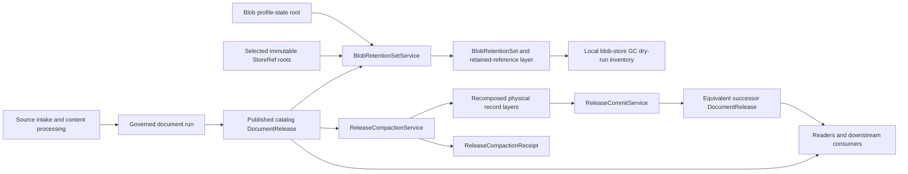
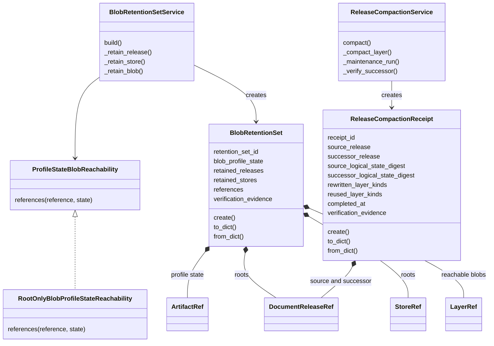
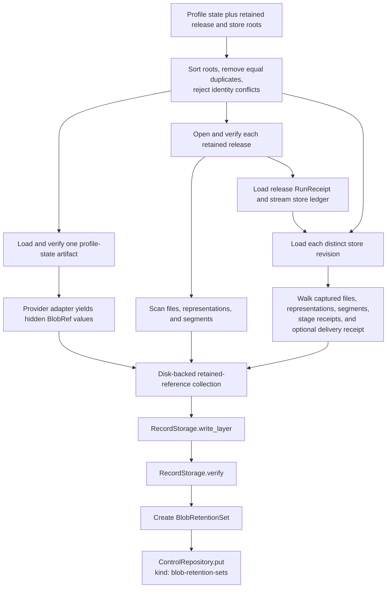
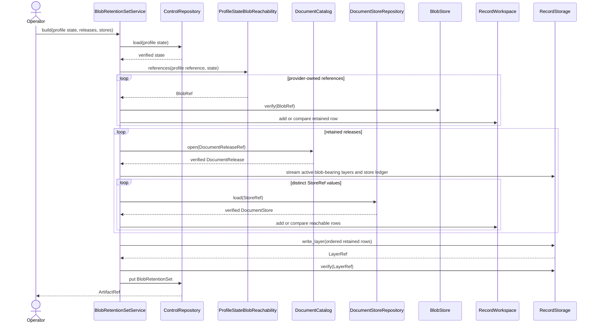
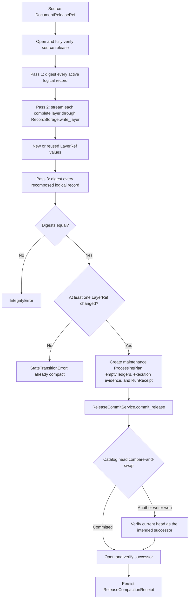
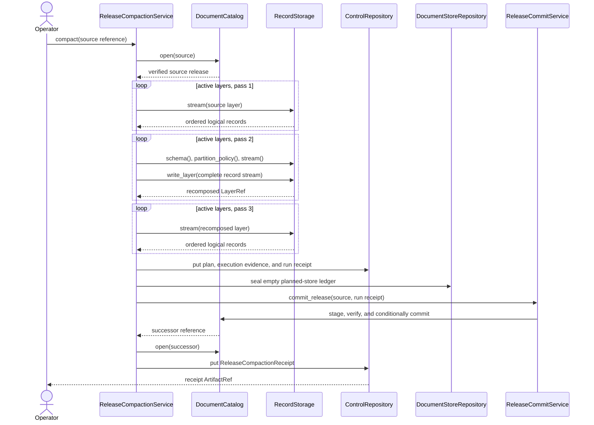

# Release Maintenance

Release maintenance keeps an existing DocSpec corpus safe and efficient after publication. It can derive the exact set of immutable blobs that must remain reachable, or rewrite fragmented record layers and publish an equivalent successor release. Both operations produce content-identified evidence that another reader can verify.

This module does not ingest sources, process documents, or change active logical records. It works from already-verified releases, stores, profile state, layers, and receipts. [Document Release Artifacts](document_release_artifacts.md) explains the release and catalog model. [Storage and Shared References](storage_and_shared_references.md) explains the references and storage interfaces used here.

## Purpose and system role

| Question | Blob retention | Release compaction |
| --- | --- | --- |
| What goes in? | One blob-storage profile-state `ArtifactRef` and at least one retained `DocumentReleaseRef` or `StoreRef`. | One catalog-backed `DocumentReleaseRef` and injected control, record, store, and catalog implementations. |
| What happens? | The service verifies each immutable root, walks every reachable blob reference, removes exact duplicates in a disk-backed workspace, and writes one immutable reference layer. | The service streams every active logical layer three times: source digest, physical rewrite, and successor digest. It then commits a zero-task maintenance release. |
| What comes out? | An `ArtifactRef` to a `BlobRetentionSet`; the set points to a scalable `blob-retention-references` layer. | An `ArtifactRef` to a `ReleaseCompactionReceipt`; the receipt identifies the source and successor releases and proves equal logical state. |
| How is it checked? | Closed JSON shapes, verified releases and stores, one profile-state root, matching profile roots, blob digests, unique locator metadata, layer verification, counts, and stable identities. | Ordered record digests, record-count reconciliation, equal source and successor digests, equivalent release fields, a sealed zero-task run, compare-and-swap publication, and replay recovery. |

The two workflows solve different problems:

- retention answers, “Which immutable blob objects must an operator preserve?”;
- compaction answers, “Can the record store represent the same active records with a better physical layout?”

`BlobRetentionSet` is unrelated to the parser-quality `RetentionFloor` type. Retention sets protect stored blobs after publication. Retention floors decide whether extracted text is good enough to admit before publication; see [Document Release Artifacts: Retention floors](document_release_artifacts.md#retention-floors).

## System context



Release maintenance sits inside the durable-results lifecycle, after run reconciliation and release publication. It depends on the existing catalog and storage boundaries instead of knowing whether records live in JSON Lines, Parquet, a table format, or another implementation.

### Release representation boundary

DocSpec exposes two release representations. This module compacts only the catalog release handled by `DocumentRelease` and `DocumentCatalog`. It does not compact a self-contained portable `DocumentRelease` 2.0 bundle. A portable bundle carries its members directly and follows a separate builder and verifier path. See [Document Release Artifacts: Two release representations](document_release_artifacts.md#two-release-representations).

## Source layout

| File | Responsibility |
| --- | --- |
| [`domain/maintenance.py`](../src/docspec/domain/maintenance.py) | Defines the immutable `BlobRetentionSet` and `ReleaseCompactionReceipt` evidence records, their closed wire formats, and their identity rules. |
| [`application/maintenance.py`](../src/docspec/application/maintenance.py) | Coordinates retention traversal, logical-state hashing, physical layer rewriting, zero-task run construction, release commit, successor verification, and retry recovery. |
| [`ports/profile_state_reachability.py`](../src/docspec/ports/profile_state_reachability.py) | Defines the provider-owned `ProfileStateBlobReachability` interface for blobs hidden behind a profile-state root. |
| [`adapters/storage.py`](../src/docspec/adapters/storage.py) | Supplies `RootOnlyBlobProfileStateReachability` for the local storage profile. The same file supplies the local storage and catalog implementations used by the workflows. |

The services also use components owned by neighboring modules:

- `DocumentRelease`, `DocumentCatalog`, and `ReleaseCommitService` come from [Document Release Artifacts](document_release_artifacts.md) and [Document Run Application: Delivery, Reconciliation, and Release](document_run_application_delivery_and_release.md).
- `ArtifactRef`, `BlobRef`, `DocumentReleaseRef`, `LayerRef`, `StoreRef`, `RecordStorage`, `RecordWorkspace`, and the repository interfaces come from [Storage and Shared References](storage_and_shared_references.md).
- `RunReceipt`, `DeliveryReceipt`, and run-ledger schemas come from [Result Delivery and Reconciliation](result_delivery_and_reconciliation.md).
- `ProcessingPlan`, `ExecutionProfile`, and `ExecutionHandoff` come from [Processing Plan and Job Model](processing_plan_and_job_model.md) and [Portable Task Execution](portable_task_execution.md).

## Architecture and dependency direction

The domain records depend only on identity helpers and shared references. The profile-state port describes the one provider-specific traversal that generic retention logic cannot infer. Application services coordinate injected storage interfaces, but compaction deliberately reuses the existing `ReleaseCommitService` so maintenance follows the normal release verification and publication path.

```mermaid
flowchart TB
    subgraph Domain["Domain evidence"]
        RetentionSet["BlobRetentionSet"]
        CompactionReceipt["ReleaseCompactionReceipt"]
        Refs["ArtifactRef, BlobRef,<br/>LayerRef, StoreRef,<br/>DocumentReleaseRef"]
        Identity["stable_urn and identity digests"]
    end

    subgraph Ports["Injected interfaces"]
        Reachability["ProfileStateBlobReachability"]
        Controls["ControlRepository"]
        Records["RecordStorage"]
        Workspaces["RecordWorkspaceFactory"]
        Stores["DocumentStoreRepository"]
        Blobs["BlobStore"]
        Catalog["DocumentCatalog"]
    end

    subgraph Application["Application services"]
        RetentionService["BlobRetentionSetService"]
        Digest["logical_release_state_digest"]
        CompactionService["ReleaseCompactionService"]
        CommitService["ReleaseCommitService"]
    end

    subgraph LocalAdapters["Local adapters"]
        RootOnly["RootOnlyBlobProfileStateReachability"]
        LocalControls["LocalJsonControlRepository"]
        LocalRecords["LocalJsonlRecordStorage"]
        LocalWorkspace["LocalSqliteReconciliationWorkspace"]
        LocalStores["LocalDocumentStoreRepository"]
        LocalBlobs["LocalContentAddressedBlobStore"]
        LocalCatalog["LocalManifestDocumentCatalog"]
    end

    RetentionSet --> Refs
    CompactionReceipt --> Refs
    RetentionSet --> Identity
    CompactionReceipt --> Identity

    RetentionService --> Reachability
    RetentionService --> Controls
    RetentionService --> Records
    RetentionService --> Workspaces
    RetentionService --> Stores
    RetentionService --> Blobs
    RetentionService --> Catalog
    RetentionService --> RetentionSet

    Digest --> Records
    CompactionService --> Digest
    CompactionService --> Controls
    CompactionService --> Records
    CompactionService --> Stores
    CompactionService --> Catalog
    CompactionService --> CommitService
    CompactionService --> CompactionReceipt

    RootOnly -. implements .-> Reachability
    LocalControls -. implements .-> Controls
    LocalRecords -. implements .-> Records
    LocalWorkspace -. created by .-> Workspaces
    LocalStores -. implements .-> Stores
    LocalBlobs -. implements .-> Blobs
    LocalCatalog -. implements .-> Catalog
```



No domain type imports a filesystem, SQLite, Amazon S3, or a concrete record format. A new storage profile can reuse both application services if it implements the existing interfaces and preserves their ordering, verification, bounded-streaming, and conditional-publication behavior.

## Core component relationships



| Component | Responsibility and important rules |
| --- | --- |
| `BlobRetentionSet` | Binds one verified blob profile state, sorted immutable release and store roots, one verified reference layer, and closed verification evidence. Its content determines `retention_set_id`. |
| `ReleaseCompactionReceipt` | Proves that a distinct successor release preserves the source's exact active logical records. It requires at least one rewritten layer kind, equal state digests, disjoint layer classifications, and evidence for exactly three logical scans. |
| `BlobRetentionSetService` | Traverses release, store, and provider-owned profile-state reachability; validates related receipts and profile roots; detects conflicts; writes the scalable retained-reference layer; and stores the small set root. |
| `ReleaseCompactionService` | Rewrites complete active layers through `RecordStorage`, builds a sealed zero-task maintenance run, commits the successor through the standard release path, verifies equivalence, and stores the compaction receipt. |
| `logical_release_state_digest()` | Hashes the active layer kinds, schema identifiers, record counts, and exact ordered logical records without hashing physical `LayerRef` values. |
| `ProfileStateBlobReachability` | Lets each blob-storage provider expose objects referenced only by its profile state. It returns an iterator so the service can remain bounded. |
| `RootOnlyBlobProfileStateReachability` | Validates the local profile-state shape and yields no extra blobs because local blob membership appears in release and store records rather than under the profile root itself. |

## Blob retention

### Retention roots and reachability

`BlobRetentionSetService.build()` accepts one blob profile-state reference and at least one explicit release or store root. Release roots represent published active state; store roots let an operator retain an immutable job revision independently. The service rejects an empty root set.

The service canonicalizes the small root lists before traversal:

- releases are keyed by `release_id` and sorted by release ID, locator, and digest;
- stores are keyed by `(store_id, revision)` and sorted by store ID, revision, locator, and digest;
- repeated equal references collapse to one root; and
- two different immutable references for the same root identity raise `IntegrityError`.



### What each root contributes

| Root or record | Traversal and verification |
| --- | --- |
| Blob profile state | `ControlRepository.load()` verifies the control artifact. The injected `ProfileStateBlobReachability` validates provider-owned state and yields any hidden `BlobRef` values. Each newly discovered blob is verified directly. |
| Retained release | `DocumentCatalog.open()` verifies the complete release. Every `blob_roots` entry must equal the selected profile-state reference. Only the active `files`, `representations`, and `segments` layers contribute blob references. |
| Release run receipt | The service loads `RunReceipt`, checks its identity against the release reference, requires the store-ledger row's closed shape, and requires both row identities to equal the parsed store ID. |
| Retained store revision | `DocumentStoreRepository.load()` verifies the store. The service visits each `(store_id, revision)` once, walks all entry blobs, and verifies every stage receipt. |
| Store delivery receipt | When present, the receipt must identify the store and the immediately preceding revision. Each delivery blob root must equal the selected profile-state reference. |

The release catalog's verifier already checks blobs reached through active release layers. `_retain_active_release_blobs()` therefore adds those references with `verify=False`. A reference first discovered through provider state or a directly retained store uses `BlobStore.verify()`. If a later path reaches an existing locator, the service compares its complete metadata before accepting the duplicate.

### Retention-reference records

The scalable output is a `LayerRef` with:

- `layer_kind = "blob-retention-references"`;
- `schema_id = "docspec-blob-retention-reference/1.0"`;
- logical identity field `recordId`; and
- partition field `locator`.

Each row has this closed shape:

```json
{
  "recordId": "urn:docspec:blob-retention-reference:...",
  "blobProfileStateId": "...",
  "blobProfileStateDigest": "sha256:...",
  "locator": "objects/sha256/...",
  "digest": "sha256:...",
  "byteSize": 123,
  "mediaType": "application/octet-stream"
}
```

`recordId` covers the complete profile-state reference and the blob locator. Because the locator, rather than the blob digest alone, selects row identity, two paths cannot attach different digest, size, or media-type metadata to the same retained object without an integrity failure.

The temporary `RecordWorkspace` provides exact lookup and ordered output without retaining the corpus-sized set in process memory. `RecordStorage.write_layer()` then owns physical partitioning and immutable publication. See [Storage and Shared References: Record Layers](storage_and_shared_references_record_layers.md) for the layer format and workspace behavior.

### Retention interaction sequence



### `BlobRetentionSet` evidence

The set uses wire format `docspec-blob-retention-set/1.0`. Its identifier is `stable_urn("blob-retention-set", identity_content)`, so roots, the reference layer, and verification evidence all affect identity.

| Evidence field | Meaning |
| --- | --- |
| `profileStateVerificationCount` | Number of loaded profile-state roots. The domain type requires exactly `1`. |
| `catalogVerifiedReleaseCount` | Number of explicit retained releases opened through the catalog. |
| `visitedStoreRevisionCount` | Number of distinct store revisions loaded after workspace deduplication. |
| `activeBlobLayerScanCount` | Number of active `files`, `representations`, and `segments` layers scanned. |
| `activeBlobRecordReadCount` | Number of rows read from those release layers. |
| `blobReferenceOccurrenceCount` | Number of blob references encountered across all paths, including duplicates. |
| `directBlobVerificationCount` | Number of newly discovered references checked through `BlobStore.verify()`. Catalog verification accounts for active release blobs. |
| `retainedReferenceCount` | Number of distinct rows in the retained-reference layer; it must equal `LayerRef.record_count`. |
| `boundedStreaming` | Must be literal `true`. It records the required bounded traversal mode. |

All count fields must be non-negative integers; booleans do not count as integers. The evidence mapping has a closed shape, so producers must version the format before adding or removing evidence.

### Extending profile-state reachability

Implement `ProfileStateBlobReachability` when a provider's profile-state artifact names blobs that release and store records do not expose. The implementation should:

1. validate the exact profile-state format and version;
2. confirm that the supplied `ArtifactRef` and loaded mapping describe the expected provider state;
3. stream `BlobRef` values instead of returning a corpus-sized collection; and
4. leave byte verification to `BlobRetentionSetService`, which calls `BlobStore.verify()` for new provider-owned references.

`RootOnlyBlobProfileStateReachability` is intentionally empty after validating the local state fields `profileId`, `profileVersion`, and `storageRoot`. Do not copy this behavior to a provider whose profile root owns snapshots, indexes, manifests, or other blob members.

## Release compaction

### Compaction invariant

Compaction may change physical layer roots, member counts, and artifact bytes. It must preserve the complete ordered logical record stream and every release-level meaning checked by `_verify_successor()`.

`logical_release_state_digest()` is narrower than `DocumentRelease.logical_state_digest`. The maintenance digest contains, in active-layer order:

```text
identity_digest({
  "layers": [
    {
      "layerKind": layer.layer_kind,
      "schemaId": layer.schema_id,
      "recordCount": layer.record_count,
      "recordsDigest": ordered_json_sequence_digest(records)
    },
    ...
  ]
})
```

It excludes physical layer IDs, locators, layer-root digests, profile IDs, and member boundaries. This makes the digest stable when only physical layout changes. It does not, by itself, prove complete release equivalence; `_verify_successor()` separately compares the remaining release fields.

### Compaction process



`_compact_layer()` asks `RecordStorage` for the source layer's verified `RecordSchema` and `PartitionPolicy`, then performs a full write without a base layer. The selected record implementation decides the physical result. For `LocalJsonlRecordStorage`, current member-size and writer settings determine whether several old shards become fewer new members.

The service classifies a layer as:

- **rewritten** when its resulting `LayerRef` differs from the source; or
- **reused** when deterministic writing produces the same `LayerRef`.

At least one layer must be rewritten. The two sorted classifications must be distinct and disjoint in the receipt.

### Zero-task maintenance run

Compaction uses the normal release commit path, so it must supply a complete plan and run even though no document job executes. `_maintenance_run()` creates that evidence.

| Evidence | Maintenance value |
| --- | --- |
| Processing plan | Copies the source catalog, profiles, limits, stages, processors, policy digests, and partition count from the source plan. `base_release` is the compacted source. |
| Plan selection | Closed mapping with `maintenanceOperation = "compact-release/v1"`, `sourceReleaseId`, and `maintenanceCompletedAt`. |
| Planned stores | Sealed empty planned-store ledger. |
| Run ledgers | Empty `run-store-receipts`, `run-selection`, and `execution-task-results` layers under the common active-layer partition policy. |
| Execution profile | Inline maintenance profile with one-worker limits and worker implementation `docspec.release-compaction/v1`. |
| Execution handoff | Zero expected tasks, the digest of an empty task set, maintenance operation ID, empty planned-store ledger, and a no-result sink. |
| Run receipt | Stateful, zero stores, zero selected items, compacted layers as `staged_layers`, source blob roots, source failures and coverage, and rewritten/reused counts. |

The service requires every compacted active layer to use the same partition policy and requires its bucket count to equal the plan's `partition_count`. A format adapter may reorganize physical members, but it cannot silently change logical partitioning during compaction.

### Successor verification

After commit, `_verify_successor()` opens the published reference and checks all of the following before the service writes a receipt:

| Check | Required result |
| --- | --- |
| Lineage | `successor.previous_release == source_reference`. |
| Active layers | The successor names exactly the recomposed layer tuple. |
| Logical records | Source and recomposed maintenance digests are equal. |
| Source and governance | `source_catalog`, `profiles`, `blob_roots`, `retention_dispositions`, and `partition_policy` equal the source values. |
| Summaries | `counts`, `failures`, and `coverage` equal the source values. |
| Plan and run | Both name the source as base; plan selection has the closed maintenance shape; the selection timestamp equals `RunReceipt.completed_at`. |
| Work population | `RunReceipt.store_count == 0` and `selected_item_count == 0`. |

The successor has new maintenance plan, run, commit, and release-artifact evidence. Compaction preserves active corpus meaning, not every control reference in the source release. The successor is a distinct `DocumentReleaseRef` and advances the catalog head.

### Compaction interaction sequence



### Retry and concurrent writers

Catalog publication is the visibility point. The compaction receipt is written afterward. A process can therefore fail after the successor becomes current but before the receipt exists.

The retry path handles that gap:

1. `ReleaseCommitService` attempts the normal compare-and-swap commit.
2. If it receives `StaleBaseError` or `StateTransitionError`, the service reads the current head.
3. If another reference is current, the service accepts it only when `_verify_successor()` proves that it is the exact intended compaction result and a sealed zero-task maintenance run over the same source.
4. The service uses the winning run's completion time and writes the same content-identified receipt.

This rule lets post-commit retries and concurrent identical attempts converge on one published successor and one receipt. If the current head is unrelated, the original commit error is re-raised.

Immutable layer members and control artifacts written before a failed compare-and-swap may remain unreferenced. The service never deletes them during recovery; collection remains a separate maintenance decision.

### `ReleaseCompactionReceipt` evidence

The receipt uses wire format `docspec-release-compaction-receipt/1.0`. Its identifier covers both release references, both logical-state digests, layer classifications, completion time, and verification evidence.

| Evidence field | Meaning |
| --- | --- |
| `logicalRecordCount` | Total records across the source's active layers. |
| `logicalRecordReadCount` | Total reads across source digesting, rewriting, and successor digesting. It must equal `logicalRecordCount * logicalScanPassCount`. |
| `logicalScanPassCount` | Must equal `3`: source digest, physical rewrite, and successor digest. |
| `explicitCatalogOpenCount` | Records the source and successor opens performed by the service. |
| `boundedStreaming` | Must be literal `true`. |

The constructor also requires equal SHA-256 logical-state digests, a distinct successor reference, at least one rewritten layer, sorted and distinct classification tuples, and no overlap between rewritten and reused kinds.

## Operational interfaces

### Build a retention set in application code

The current command-line interface consumes a retention-set reference but does not expose a command that builds one. A composition root constructs the service with implementations that belong to one profile set:

```python
retention_ref = BlobRetentionSetService(
    controls=controls,
    records=records,
    stores=stores,
    blobs=blobs,
    document_catalog=catalog,
    profile_state_reachability=RootOnlyBlobProfileStateReachability(),
    workspace_factory=workspace_factory,
    partition_policy=partition_policy,
).build(
    blob_profile_state=release.blob_roots[0],
    retained_releases=(release_ref,),
    retained_stores=(),
)

retention = BlobRetentionSet.from_dict(controls.load(retention_ref))
records.verify(retention.references)
```

Persist or transmit `retention_ref`, not a local path to the control artifact. The `ArtifactRef` pins the set's identity, locator, digest, media type, and size.

### Compact through the command line

`docspec document-release compact` accepts a closed request:

```json
{
  "format": "docspec-local-release-compaction-request",
  "formatVersion": "1.0",
  "runRequest": "/absolute/path/to/local-run-request.json",
  "sourceRelease": {
    "releaseId": "urn:spicy:artifact:derivation:...",
    "locator": "document-catalog/releases/.../artifact.json",
    "digest": "sha256:..."
  }
}
```

Run:

```bash
uv run docspec document-release compact \
  --request /absolute/path/to/compaction-request.json \
  --destination /absolute/path/to/compaction-reference.json \
  --receipt /absolute/path/to/compaction-operation.json
```

The local run request selects the storage roots, profiles, producer identity, partition policy, and `completedAt` timestamp. The command requires its plan and profiles to equal those of the source release. It refuses to replace the destination or operation-receipt file. The destination contains the `ArtifactRef` for the stored `ReleaseCompactionReceipt`; the operation receipt records the CLI action.

### Inventory unreferenced local blobs

The local garbage-collection command verifies and consumes a retention set:

```bash
uv run docspec blob-store gc \
  --run-request /absolute/path/to/local-run-request.json \
  --retention-set /absolute/path/to/retention-set-reference.json \
  --minimum-age-seconds 86400 \
  --sample-limit 20 \
  --dry-run
```

The command verifies the retention artifact, reference layer, record-storage profile, blob-storage profile, storage root, each retained blob, and the content-addressed object-tree shape. It builds a bounded SQLite membership index, reports counts and a limited candidate sample, and removes the temporary index on exit.

`--dry-run` is mandatory. The command does not delete blobs. `minimum-age-seconds` filters unretained objects from the candidate report; it does not weaken the retained set. See [Storage and Shared References: Blob Storage](storage_and_shared_references_blob_storage.md#command-line-operations) for blob adapter behavior and operating guidance.

## Invariants and failure behavior

| Invariant or condition | Enforcement and result |
| --- | --- |
| At least one retention root exists | `build()` and `BlobRetentionSet` raise `ValueError` for an empty release/store population. |
| One logical root has one immutable reference | Root normalization and workspace lookup raise `IntegrityError` for conflicting references or locator metadata. |
| All retained data belongs to one blob profile state | Release and delivery blob roots must equal the requested profile-state `ArtifactRef`; mixed roots raise `IntegrityError`. |
| Serialized maintenance records have closed shapes | `from_dict()` methods raise `ValueError` for extra, missing, unknown-format, or unknown-version fields. Services translate invalid persisted related records to `IntegrityError` where appropriate. |
| Stored bytes match references | Catalog, repository, layer, control, and blob implementations verify content before returning trusted values. Any mismatch raises `IntegrityError`. |
| Compaction preserves exact logical records | Unequal maintenance digests raise `IntegrityError` before publication. Successor verification repeats the release-level checks after commit. |
| Compaction changes physical state | If every recomposed `LayerRef` equals its source, `compact()` raises `StateTransitionError`; no successor is needed. |
| Compaction preserves partitioning | Different active-layer policies or a bucket count that differs from the plan raise `IntegrityError`. |
| Only the expected catalog head advances | The catalog commit uses compare-and-swap. An unrelated winner produces `StaleBaseError` or `StateTransitionError`. |
| A receipt describes measured work | Domain constructors reconcile evidence counts and stable identifiers before storage. |

Maintenance is fail-closed. A failed operation may leave immutable, unreferenced objects because publication never overwrites them. It does not leave a partially trusted receipt. The catalog head changes only through the existing conditional commit path.

## Bounded work and scale characteristics

Both services avoid corpus-sized Python collections, but they perform deliberate full scans.

| Workflow | Bounded state | Corpus-scale work |
| --- | --- | --- |
| Retention-set build | Small root tuples, counters, one record at a time, and a disk-backed `RecordWorkspace` for retained references and visited stores. | Scans each retained release's blob-bearing active layers and store ledger; loads each distinct retained store; writes and verifies one complete reference layer. |
| Compaction | Layer summaries, `LayerRef` tuples, counters, and storage-adapter buffers or scratch files. | Reads every active record exactly three times and writes every active layer once. Catalog staging and verification may perform additional reads outside the receipt's three logical scan passes. |
| Blob GC dry run | A bounded SQLite locator index and a limited in-memory sample. | Verifies every retained reference and walks every local content-addressed blob object. |

`boundedStreaming = true` records the traversal design, not a universal byte ceiling. Concrete limits come from the selected control, blob, record, store, workspace, and catalog profiles. [Scale Acceptance](scale_acceptance.md) explains how DocSpec pins and qualifies those limits.

## Relationships to other modules

| Module | Relationship |
| --- | --- |
| [Document Release Artifacts](document_release_artifacts.md) | Owns `DocumentRelease`, `DocumentCatalog`, local catalog publication, release verification, and the distinction between catalog releases and portable bundles. |
| [Document Run Application: Delivery, Reconciliation, and Release](document_run_application_delivery_and_release.md) | Owns `ReleaseCommitService`, the single release visibility path reused by compaction. |
| [Result Delivery and Reconciliation](result_delivery_and_reconciliation.md) | Owns `RunReceipt`, `DeliveryReceipt`, run ledgers, and the workspace design reused for bounded retention indexing. |
| [Storage and Shared References](storage_and_shared_references.md) | Owns shared immutable references and the control, record, blob, store, catalog, and workspace interfaces. |
| [Storage and Shared References: Record Layers](storage_and_shared_references_record_layers.md) | Explains complete layer writes, deterministic identity, partition members, verification, external merge, and workspace ordering. |
| [Storage and Shared References: Blob Storage](storage_and_shared_references_blob_storage.md) | Explains local and S3 blob behavior, byte verification, limits, and the local dry-run inventory command. |
| [Processing Plan and Job Model](processing_plan_and_job_model.md) | Defines the source plan fields and governance values copied into the maintenance plan. |
| [Portable Task Execution](portable_task_execution.md) | Defines the execution profile and handoff evidence that make the zero-task maintenance run verifiable through the normal release path. |
| [Scale Acceptance](scale_acceptance.md) | Qualifies storage and maintenance behavior against declared corpus size and resource limits. |

## Contribution guide

### Change the smallest owning component

| Change | Primary location | Required follow-through |
| --- | --- | --- |
| Add evidence to a maintenance record | `domain/maintenance.py` | Version the closed wire format, update identity content, service metrics, readers, CLI consumers, and tamper tests. |
| Add another blob-bearing logical layer | `application/maintenance.py` | Add its domain parser and blob field to `_retain_active_release_blobs()`. Confirm that release verification checks the same reference and add reachability tests. |
| Support provider-owned profile members | A new `ProfileStateBlobReachability` adapter | Validate the provider state, stream every hidden `BlobRef`, test duplicate and conflict behavior, and inject it from the composition root. |
| Change retention-row identity or schema | `application/maintenance.py` and `domain/maintenance.py` | Version `docspec-blob-retention-reference`, update the garbage-collection reader, preserve deterministic ordering and partition selection, and test old-format refusal or migration. |
| Add a record-storage implementation | The storage module that implements `RecordStorage` | Preserve verified schema and partition-policy reads, globally ordered streams, deterministic complete writes, immutable references, and bounded resource use. Run compaction equivalence tests against it. |
| Change the compaction digest | `application/maintenance.py` | Treat the preimage as persistent evidence. Explain the compatibility effect, update receipt versioning when meaning changes, and add records that distinguish the old and new definitions. |
| Change maintenance plan or run evidence | `application/maintenance.py` | Keep `DocumentReleaseVerifier` and `ReleaseCommitService` acceptance aligned. Preserve the zero-task population and closed maintenance selection. |
| Change retry recovery | `application/maintenance.py` and the catalog adapter | Prove post-commit recovery, unrelated-head refusal, and convergence under concurrent identical attempts. |
| Add destructive garbage collection | A separately reviewed operator workflow | Keep inventory and deletion separate, require an exact verified retention set and minimum-age policy, define replay and interruption behavior, and add postcondition checks. The current CLI grants no deletion authority. |

### Preserve these invariants

Contributors should keep the following rules explicit in code and tests:

1. Retention reachability comes only from verified immutable roots.
2. One retention set covers one exact blob profile-state artifact.
3. A locator has one immutable digest, size, and media type within that profile state.
4. Large reachability sets live in a record layer, not a control artifact or Python set.
5. Compaction changes physical storage only; ordered logical records remain byte-for-byte equivalent after canonical serialization.
6. The normal release verifier and compare-and-swap commit remain the sole publication gate.
7. A visible successor can be recovered after receipt-write failure, but an unrelated catalog head can never be adopted.
8. Garbage collection remains explicit and separate from release commit and compaction.

### Test the interfaces, not local implementation details

Use fake or alternate implementations through the ports when testing application behavior. Adapter tests should separately prove filesystem, object-store, SQLite, JSON Lines, partition, and bounded-resource behavior. Avoid assertions about local paths in domain and service tests unless the path rule is the behavior under test.

When adding a new profile-state adapter, include cases for malformed state, zero references, repeated equal references, conflicting locator metadata, missing blobs, and a reference shared with a release or store. When changing compaction, include a fragmented source, a no-op layout, altered logical content, incompatible partition policy, post-commit failure, and concurrent attempts.

## Verification

Run the focused maintenance and cross-build equivalence tests from the repository root:

```bash
uv run pytest \
  tests/test_maintenance.py \
  tests/conformance/test_incremental_equivalence.py
```

Run the operator-interface tests for compaction and garbage-collection inventory:

```bash
uv run pytest tests/test_cli.py \
  -k 'document_release_compact or blob_gc'
```

The focused tests prove:

- retention includes every reachable release and store blob while excluding an orphan;
- mixed profile roots and conflicting locator metadata fail closed;
- compaction reduces fragmented physical members without changing catalog comparisons, blobs, or store revisions;
- source, incremental, clean-build, and compacted logical states agree;
- retry after a post-commit failure recovers the published successor;
- concurrent attempts converge on one successor and receipt; and
- the local garbage-collection command uses a bounded temporary index and reports candidates without deleting them.

Changes to shared storage, release verification, commit, execution evidence, or receipts should also run the suites named in the linked module documentation. A maintenance test alone cannot prove a changed shared adapter still satisfies every caller.
