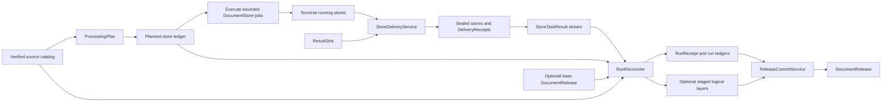
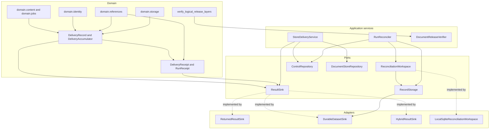
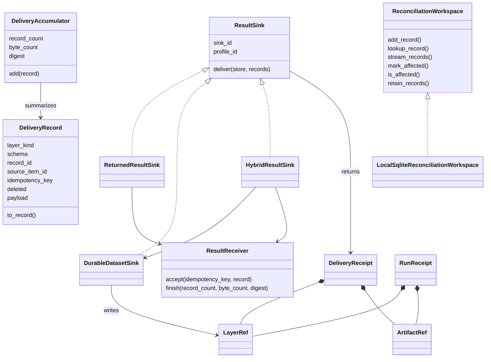
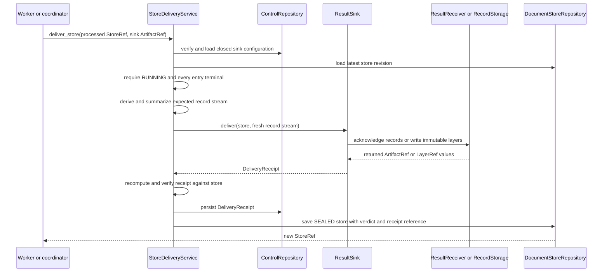
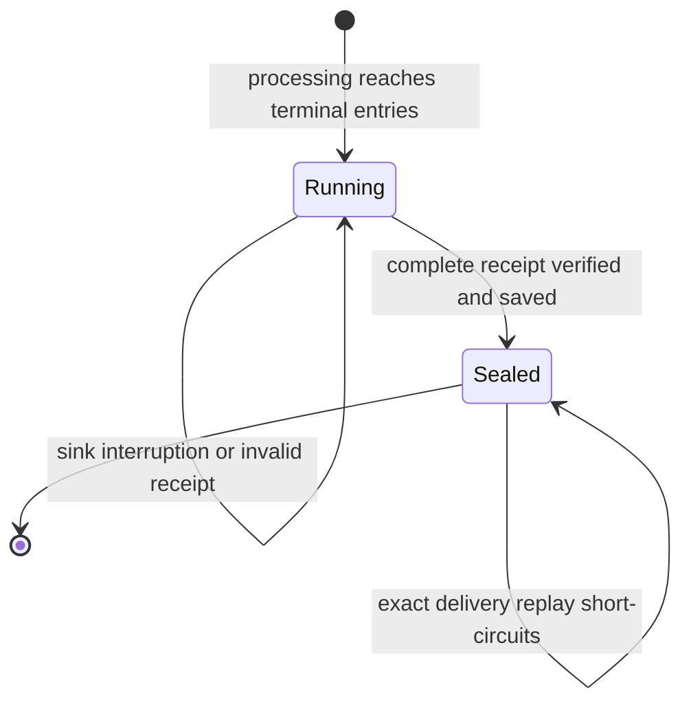
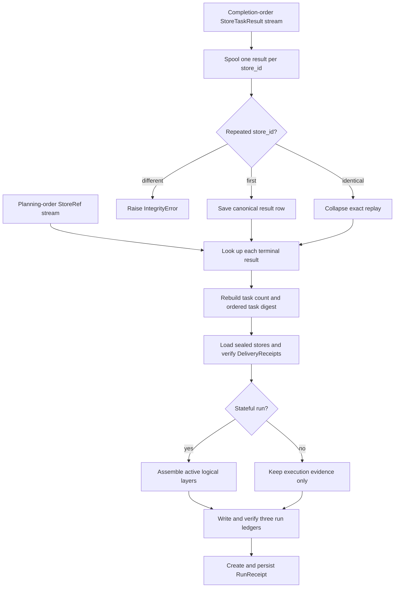
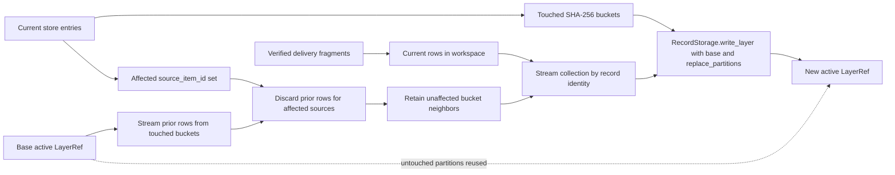
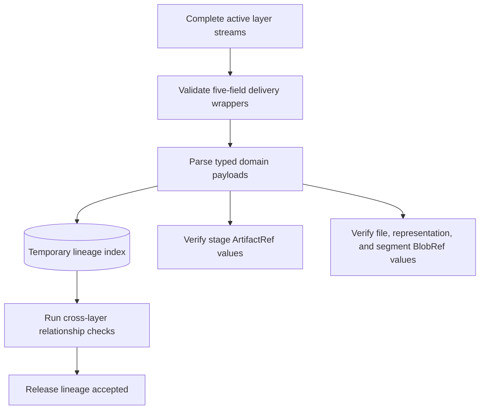

# Result Delivery and Reconciliation

Result delivery and reconciliation turn completed `DocumentStore` jobs into independently checkable output. Delivery emits every terminal store record through a selected sink and seals the store only after complete acknowledgement. Reconciliation then proves that the terminal stores exactly match the planned task population, assembles durable logical layers when requested, and records the run in a `RunReceipt`.

This module owns delivery records, delivery and run receipts, result-sink interfaces and adapters, and the disposable reconciliation workspace. The application services that call these components are documented in [Document Run Application: Delivery, Reconciliation, and Release](document_run_application_delivery_and_release.md). Shared references and record storage belong to [Storage and Shared References](storage_and_shared_references.md); release publication and whole-release verification belong to [Document Release Artifacts](document_release_artifacts.md).

## Purpose and system role

| Question | Answer |
| --- | --- |
| What goes in? | A processed, terminal `DocumentStore`; a pinned result sink; and, during reconciliation, a sealed `ExecutionHandoff`, the planned-store ledger, terminal `StoreTaskResult` values, an optional base release, and the source-catalog summary. |
| What happens? | DocSpec derives a stable record stream, requires complete sink acknowledgement, seals each store, matches terminal results to the planned tasks, and replaces only the affected source partitions in active logical layers. |
| What comes out? | A `DeliveryReceipt` and sealed store per job, immutable store, selection, and task-result ledgers, optional staged release layers, and one `RunReceipt`. |
| How is it checked? | Closed record shapes, canonical JSON byte counts, stable Uniform Resource Names (URNs), entry and task population digests, receipt outcome arithmetic, immutable layer verification, duplicate and conflict checks, and cross-layer lineage verification. |

The module separates three forms of state:

- A `DocumentStore` is the bounded unit delivered by one worker.
- Immutable control artifacts and `LayerRef` values are durable evidence.
- A reconciliation workspace is temporary scratch storage. It can be deleted and rebuilt without changing the run's meaning.

## System context



Upstream content processing supplies the source items, captured files, representations, segments, derived records, failures, and stage receipts that delivery serializes. See [Content Acquisition and Processing](content_acquisition_and_processing.md) for those values and [Processor Extension Model](processor_extension_model.md) for derived processor output. [Portable Task Execution](portable_task_execution.md) explains the handoff and task-result messages reconciled here.

## Scope and source layout

| File | Responsibility |
| --- | --- |
| [`domain/delivery.py`](../src/docspec/domain/delivery.py) | Defines the delivery wrapper, stream summary, record generation, core layer schemas, store verdict derivation, and whole-release lineage checks. |
| [`domain/receipts.py`](../src/docspec/domain/receipts.py) | Defines immutable, content-identified `DeliveryReceipt` and `RunReceipt` values. `CatalogCommitReceipt` belongs to the release lifecycle. |
| [`ports/result_sink.py`](../src/docspec/ports/result_sink.py) | Defines the `ResultSink` interface used by the delivery application service. |
| [`adapters/sinks.py`](../src/docspec/adapters/sinks.py) | Implements returned-result, durable-dataset, and hybrid delivery. It also defines the synchronous `ResultReceiver` boundary. |
| [`ports/reconciliation_workspace.py`](../src/docspec/ports/reconciliation_workspace.py) | Extends the general record-workspace interface with affected-source tracking and prior-record retention. |
| [`adapters/reconciliation.py`](../src/docspec/adapters/reconciliation.py) | Implements a bounded, disposable SQLite reconciliation workspace and its factory. |

Two direct consumers sit in the neighboring application module:

- [`application/delivery.py`](../src/docspec/application/delivery.py) computes the expected stream, calls a `ResultSink`, verifies the receipt, persists it, and seals the store.
- [`application/reconcile.py`](../src/docspec/application/reconcile.py) validates the complete terminal task set, uses the workspace to assemble layers, writes run ledgers, and persists the `RunReceipt`.

## Architecture and dependency direction

The domain layer defines stable records and evidence. Ports describe the minimum behavior required from output and scratch-storage implementations. Adapters depend on those ports and domain values. Application services coordinate the adapters through injected interfaces.



`domain/delivery.py` may inspect content-domain values because it converts them into release records and verifies their lineage. The sink protocol stays smaller: it accepts a store and an iterable of delivery records, then returns a receipt. Neither the protocol nor the domain model depends on filesystem, SQLite, S3, JSON Lines, or scheduler implementations.

## Core component relationships



### Component reference

| Component | Responsibility and important rules |
| --- | --- |
| `DeliveryRecord` | Wraps one domain payload with its logical layer, closed `RecordSchema`, record and source identities, idempotency key, and tombstone flag. `to_record()` emits the five-field durable form. |
| `DeliveryAccumulator` | Rejects repeated idempotency keys and computes the record count, canonical JSON byte count, and ordered SHA-256 digest of newline-delimited keys. |
| `ResultSink` | Delivers one complete bounded store stream. Its `sink_id` selects the injected implementation; its `profile_id` must match the result-delivery profile pinned by the plan. |
| `ResultReceiver` | Accepts one returned record synchronously and acknowledges the completed stream through `finish()`. A receiver implementation owns idempotent handling of replayed keys. |
| `ReturnedResultSink` | Sends records one at a time to a receiver. It creates no durable record layers and therefore requires `finish()` to return an acknowledgement `ArtifactRef`. |
| `DurableDatasetSink` | Groups records by logical layer, writes immutable fragments through `RecordStorage`, includes empty core layers, and returns their `LayerRef` values. |
| `HybridResultSink` | Delivers an independently regenerated stream to the durable sink and the supplied stream to a receiver. It refuses the result unless count, bytes, and key digest agree. |
| `DeliveryReceipt` | Binds a processed store revision to a sink, profile, exact entry and record populations, outcome counts, verdict, durable layers, blob roots, and optional returned-result acknowledgement. |
| `ReconciliationWorkspace` | Spools canonical records, tracks affected source items, retains unaffected rows from touched base partitions, and streams each collection in identity order. |
| `LocalSqliteReconciliationWorkspace` | Implements the scratch workspace in an ephemeral SQLite file with explicit record, spool, cache, and read-batch limits. |
| `RunReceipt` | Binds the run's plan and execution evidence to complete ledgers, the reconciled store digest, staged layers, blob roots, summary counts, failures, coverage, partition policy, and stateful mode. |
| `verify_logical_release_layers()` | Rebuilds a temporary cross-layer index and checks wrapper identities, duplicate keys, source lineage, evidence ranges, derived inputs, artifacts, and blobs. |

## Delivery record model

Every durable or returned record has the same closed wrapper:

```json
{
  "recordId": "logical output identity",
  "sourceItemId": "owning source identity",
  "idempotencyKey": "urn:docspec:delivery-record:v1:...",
  "deleted": false,
  "payload": {}
}
```

`recordId` identifies the logical value within a layer. `sourceItemId` supplies the stable partition value and prevents a result from drifting across documents. `idempotencyKey` derives from `storeId`, `entryId`, `layerKind`, and `outputId`. The key therefore remains stable across an exact retry of the same store content and changes when its governing entry, layer, or output identity changes.

`DeliveryAccumulator.byte_count` sums the canonical JSON bytes of each wrapper; it does not count transport separators or storage-format overhead. Its digest is order-sensitive even though the receipt field is named `idempotencySetDigest`: the accumulator hashes each key followed by a newline in delivery order. Sink implementations must preserve the complete expected order when producing this summary.

### Logical layers

`iter_delivery_records()` walks store entries in their saved order. Within each entry, it emits source item, file, representation, segment, derived, disposition, failure, and stage-receipt records in that order.

| Layer kind | Schema identifier | Record identity | Cardinality per entry | Notes |
| --- | --- | --- | ---: | --- |
| `source-items` | `docspec-source-item-record/1.0` | `SourceItem.item_id` | 1 | The only layer that may carry `deleted=true`; the flag must agree with `SourceItem.state`. |
| `files` | `docspec-file-record/1.0` | `CapturedFile.file_id` | 0..n | Contains only captured files in an active release. |
| `representations` | `docspec-representation-record/1.0` | `Representation.representation_id` | 0..n | Pins the exact captured-file digest and reversible evidence mappings. |
| `segments` | `docspec-segment-record/1.0` | `Segment.segment_id` | 0..n | Names exact representation and evidence ranges. |
| `derived:<processor_id>` | `DerivedRecord.schema_id` | `DerivedRecord.derived_id` | 0..n | The processor identifier in the layer name must equal the payload's processor. |
| `dispositions` | `docspec-disposition-record/1.0` | Stable URN of entry and disposition | 1 | Records change kind, terminal disposition, and warnings. |
| `failures` | `docspec-failure-record/1.0` | Stable URN of entry, failure index, and payload | 0..n | Preserves failure class, code, detail, attempt, and retryability. |
| `receipts` | `docspec-stage-receipt-record/1.0` | `ArtifactRef.artifact_id` | 0..n | Points to immutable acquisition, extraction, segmentation, or processor evidence. |

`core_delivery_schemas()` always returns the seven fixed schemas, including schemas for layers with no records. `DurableDatasetSink` writes all seven core layers so a stateful run has an explicit empty layer instead of an ambiguous omission. It adds dynamic derived layers only when the store contains their records.

The durable sink sorts layer kinds, then sorts each layer's records by `record_id` before calling `RecordStorage.write_layer()`. This storage order differs from delivery order by design: the receipt summary proves the source stream, and each immutable `LayerRef` proves its stored layer.

## Per-store delivery flow

`StoreDeliveryService` is the authority that changes a processed store from `RUNNING` to `SEALED`. A sink can create output, but it cannot seal a store itself.



The service verifies these conditions before sealing:

1. The sink artifact has exactly `sinkId` and `profileId`, and both values match the injected sink.
2. The store is running and every entry has a terminal disposition.
3. The receipt names the exact processed store revision and ordered entry population.
4. Record count, canonical byte count, idempotency-key digest, accepted count, and store verdict equal the independently generated stream.
5. The sink rejected no records and left no records undelivered.
6. The receipt contains durable layers, a returned-result acknowledgement, or both.

The verdict is deterministic: any `REJECTED_RUN` entry makes the store `REJECTED`; otherwise any `ACCEPTED_FAILURE` entry makes it `ACCEPTED_FAILURE`; all other terminal populations produce `COMPLETED`.

If delivery raises or returns an invalid receipt, the service saves neither a receipt nor a sealed revision. A retry starts from the same running store and reuses the same idempotency keys. If the caller repeats delivery after sealing, the service reloads and verifies the existing receipt and returns the latest store reference without calling the sink again.



## Sink behaviors and selection

| Sink | Durable layers | Returned acknowledgement | Memory and flow behavior | Suitable run mode |
| --- | --- | --- | --- | --- |
| `ReturnedResultSink` | No | Required | Pulls the iterable one record at a time; synchronous `accept()` supplies natural backpressure. | Stateless output or a host that durably handles returned results itself. |
| `DurableDatasetSink` | Yes | No | Collects one bounded store into per-layer lists, then writes immutable layer fragments. | Stateful release construction. |
| `HybridResultSink` | Yes | Required | Regenerates the canonical store stream for durable delivery, sends the supplied stream to the receiver, and compares both summaries. | Stateful release construction plus immediate returned results. |

All built-in sinks create successful receipts: every offered record is accepted, and none is rejected or undelivered. The broader receipt model can represent rejected, retried, or undelivered outcomes, but a non-rejected `DeliveryReceipt` must accept its full population, and `StoreDeliveryService` refuses any incomplete outcome before sealing.

`ResultReceiver.accept()` is the retry boundary for returned delivery. It should persist or deduplicate the record before returning. If it raises, the store remains unsealed and the next attempt replays the stable keys from the beginning. `finish()` must validate the final count, byte count, and digest and return an immutable acknowledgement when no durable layers exist.

## Delivery receipt rules

`DeliveryReceipt` uses format `docspec-delivery-receipt` version `1.1`. `DeliveryReceipt.create()` computes `receipt_id` as a stable URN over every field that describes what was delivered and accepted. `completedAt` and `warnings` remain informational and do not affect identity, so an exact replay keeps the same receipt identifier.

The constructor enforces the following local invariants:

- revisions and counts are non-negative integers, and the delivered entry population is non-empty;
- the entry-population and idempotency-key digests are normalized SHA-256 values;
- accepted, rejected, and undelivered counts sum to `record_count`;
- `retried_record_count` does not exceed `record_count`;
- any verdict other than `REJECTED` requires every offered record to be accepted;
- layer identifiers and blob-root artifact identifiers are distinct;
- durable-layer record counts sum to `accepted_record_count` when layers are present; and
- the receipt contains at least one durable layer or a returned-result acknowledgement.

These constructor checks establish internal consistency. `StoreDeliveryService` and `RunReconciler` provide the external checks: they recompute the expected store stream, compare the receipt with the saved store and plan, verify every cited layer, and require the planned result-delivery profile.

## Run reconciliation

Reconciliation converts completion-order scheduler results into planning-order evidence. It accepts exact replay, rejects conflicting replay, and uses the sealed planned-store ledger as the source of truth for completeness.



The reconciler performs the following checks in order:

1. It verifies and loads the processing plan, then matches the source catalog, base release, and partition count to its injected inputs.
2. It reads the complete source snapshot to obtain authoritative coverage and disposition counts.
3. It verifies the execution profile and handoff, including their artifact identities, nested control artifacts, worker composition, planned ledger, base release, and expected task count.
4. It spools successful terminal results by `store_id`. Identical duplicate results collapse; conflicting duplicates fail.
5. It walks the planned-store ledger in canonical order. Each planned store must have exactly one matching result whose reconstructed `StoreTask` agrees with the plan, operation, input reference, and handoff.
6. It rebuilds the task count and ordered task-set digest. Missing, extra, foreign, failed, or conflicting results fail reconciliation.
7. It loads each output store, requires a sealed revision from the same plan, reloads its `DeliveryReceipt`, recomputes its delivery population, checks the result-delivery profile, and verifies cited layers.
8. It writes and verifies the store, selection, and task-result ledgers, computes summaries, and persists a `RunReceipt`.

Stateful and stateless modes share task and receipt verification. A stateful run also requires durable delivery layers and assembles the complete active layer set. A stateless run keeps the immutable run ledgers and receipt but sets `stagedLayers` to an empty tuple; release commit rejects that run mode. Publication behavior belongs to [Document Run Application: Delivery, Reconciliation, and Release](document_run_application_delivery_and_release.md).

## Incremental layer assembly

For a stateful run, the reconciler updates only source partitions touched by current stores. The base release remains immutable.



The affected-source filter matters because a stable hash bucket contains many source items. Replacing a touched bucket must remove old rows for changed or deleted sources and retain unchanged rows that happen to share that bucket.

Layer assembly also enforces plan ownership:

- delivery fragments may contain only the seven core layers and `derived:<processor_id>` layers scheduled by the current plan;
- all fragments for one layer kind must use one schema;
- an existing layer cannot change schema under the same logical layer identity;
- every fragment row must belong to a source item in its store;
- new stateful releases contain every core layer, including empty layers; and
- derived layers for processors removed since the base plan are rewritten and removed from the active set when empty.

The workspace stages every replacement before the reconciler changes the in-memory active-layer map. `RecordStorage` writes the immutable output; the SQLite database never becomes release authority.

## Reconciliation workspace

`ReconciliationWorkspace` extends `RecordWorkspace` with three operations needed for incremental assembly:

- `mark_affected(source_item_id)` records a source whose previous rows must not survive;
- `is_affected(source_item_id)` tests that set; and
- `retain_records()` copies only rows whose source is unaffected.

The local adapter creates two `WITHOUT ROWID` SQLite tables: one keyed by `(collection, identity)` for canonical JSON payloads and one keyed by affected source identity. `stream_records()` orders by logical identity and reads in configured batches. `lookup_record()` supports exact task-result replay checks without loading the result population into memory.

### Bounds and filesystem behavior

| Factory setting | Default | Enforced behavior |
| --- | ---: | --- |
| `max_spooled_bytes` | 1 TiB | Caps the sum of canonical payload bytes inserted during one attempt. It does not measure SQLite indexes or other file overhead. |
| `max_record_bytes` | 8 MiB | Rejects a single canonical payload above the limit. |
| `cache_kib` | 8192 KiB | Sets SQLite's page-cache budget through a negative `PRAGMA cache_size`. |
| `read_batch_size` | 1024 | Bounds the rows fetched from a streaming cursor at once. |

All limits must be positive. The factory creates its root if needed and rejects a symbolic-link root before and after creation. Entering a workspace creates one temporary `reconcile-*.sqlite3` file under that root. Exiting closes the connection and removes the file on success or failure.

The adapter rejects both identical and conflicting duplicate identities in a collection. Callers that permit exact replay must first use `lookup_record()`, compare the complete canonical row, and skip the second insert. `RunReconciler` follows this pattern for terminal task results.

## Run receipt structure

`RunReceipt` uses format `docspec-run-receipt` version `1.2`. Its content-derived `run_id` excludes only `completedAt`; the immutable evidence and all summaries determine run identity.

| Field group | Contents and purpose |
| --- | --- |
| Governing inputs | `plan`, `executionProfile`, `executionHandoff`, `sourceCatalog`, and optional `baseRelease` references. |
| Planned and terminal stores | `plannedStoreLedger`, `storeLedger`, `storeCount`, `taskResultLedger`, and `storeReceiptSetDigest`. The digest covers the ordered store references in the terminal store ledger. |
| Selection | `selectionLedger` and `selectedItemCount`, which connect source items and entry dispositions to their stores. |
| Release material | `stagedLayers` and `blobRoots`. `RunReconciler` sorts layers by kind and deduplicates and sorts roots by artifact identity. Stateful runs populate staged layers; stateless runs do not. |
| Summaries | Non-negative `counts`, normalized `failures`, complete source-catalog `coverage`, and the record `partitionPolicy`. |
| Mode and time | `stateful` records whether the run can feed release construction; `completedAt` records when reconciliation completed. |

The value checks its planned-ledger and task-result-ledger kinds, matches planned, terminal, and task-result counts, matches the selection count to its ledger, requires distinct staged layer identities, normalizes summary JSON, and recomputes `run_id`. Later release verification checks the remaining cross-artifact relationships and publishability rules.

## Whole-release lineage verification

`verify_logical_release_layers()` validates relationships that no individual layer schema can prove. `DocumentReleaseVerifier` calls it when admitting a complete release; see [Document Release Artifacts](document_release_artifacts.md) for the enclosing release checks.

The function streams recognized core and derived layers into a temporary SQLite index. It processes `source-items` first, records every idempotency key globally, parses domain payloads, invokes optional artifact and blob verifiers, and runs relationship queries after indexing. The temporary directory disappears when verification finishes.



The checks cover:

- unique delivery keys across the recognized layers and layer-appropriate logical identities;
- source wrapper identity, state, candidate identity, and tombstone agreement;
- captured-file linkage to an active source version and matching candidate media type, digest, size, and transport version;
- representation linkage to the exact captured file and evidence mappings within file bounds;
- segment linkage to its representation and file, unique ordinal, valid ranges, matching source digest, and reversible persisted evidence mapping;
- derived-record ownership by an active source and inputs that name a same-source segment or derived record rather than the record itself;
- disposition identity and linkage to an existing source;
- closed failure and stage-receipt payloads, source linkage, and stage artifact identity; and
- optional byte-level verification of every cited file, representation, and segment blob.

This verifier complements `RecordStorage.verify()`. Storage verification can prove an immutable layer's bytes, schema, profile, and partition state; logical release verification proves that separately valid rows describe one connected body of content.

## Failure and recovery behavior

| Failure point | Durable state after failure | Safe retry behavior |
| --- | --- | --- |
| Receiver or durable sink interrupts before a valid receipt | Processed store remains `RUNNING`; no delivery receipt is attached. | Replay the complete stable record stream. The receiver deduplicates by idempotency key. |
| Sink returns an incomplete or inconsistent receipt | Store remains `RUNNING`. Any external sink writes may exist, but DocSpec has not accepted them. | Repair the sink or receiver and replay; DocSpec recomputes the full expectation. |
| Delivery receipt is saved but the sealed store save fails | An immutable receipt may exist without a store reference to it. | Retry delivery from the running revision. The sink must make replay safe; the repository may save a new receipt artifact with the same semantic `receipt_id` and different non-identity metadata. |
| Terminal task results arrive more than once | First canonical row is in scratch storage. | Identical replay collapses; conflicting replay raises `IntegrityError`. |
| Reconciliation stops while spooling or staging | Temporary SQLite is removed; any written layers remain immutable but unreferenced by a run receipt. | Start reconciliation again from the sealed handoff and task-result stream. |
| Run receipt exists but release commit has not completed | Run evidence and staged layers remain immutable. | Pass the same run receipt to the separately governed commit flow. |

No workspace operation advances the document catalog. Only the release commit service can make a stateful, verified run current.

## Extension and contribution guide

### Add or change a delivery layer

A new fixed layer or schema version affects more than record generation. Update these areas together:

1. Add the layer schema and deterministic emission rule in `domain/delivery.py`.
2. Define its identity, partition source, tombstone behavior, and relationship to existing records.
3. Extend `verify_logical_release_layers()` with typed parsing, uniqueness constraints, range or lineage checks, and artifact or blob verification where applicable.
4. Update `RunReconciler`'s allowed, required, assembly, and retirement rules.
5. Update release verification and any retention-floor logic that expects the complete active layer set.
6. Add focused tests for empty layers, stable replay, schema disagreement, cross-source references, deletion, and tampering.

For processor-owned output, prefer `derived:<processor_id>` and the processor's declared `schema_id` instead of adding a fixed core layer. The plan must schedule that processor, and every payload must carry the same processor identifier as the layer name.

### Add a result sink

Implement `ResultSink` and preserve the delivery evidence rules:

- expose stable `sink_id` and `profile_id` values that match the persisted sink configuration;
- consume exactly the supplied bounded iterable;
- reject or safely deduplicate repeated idempotency keys;
- calculate counts and bytes from canonical delivery wrappers;
- return immutable `LayerRef` values, a returned-result `ArtifactRef`, or both;
- report every offered record as accepted before returning a non-rejected receipt; and
- make exact retry return semantically identical evidence.

Use the built-in `_successful_receipt()` pattern when adding an in-tree adapter. A sink that supports partial acceptance needs corresponding application semantics before `StoreDeliveryService` can accept it; the current service requires complete delivery.

### Add a reconciliation workspace

Implement the full context-managed `ReconciliationWorkspace` interface. Preserve collection-local identity uniqueness, canonical JSON round trips, deterministic identity ordering, affected-source filtering, bounded record and total storage, and cleanup on every exit path. Treat the workspace as disposable: never return its paths as durable references or make correctness depend on reopening it after reconciliation.

### Preserve these invariants

- Delivery covers every terminal entry and every record derived from it.
- Receipt identity depends on semantic output, not wall-clock completion time.
- A sealed store always names a verified delivery receipt for its previous processed revision.
- Planning order, not scheduler completion order, determines the reconciled task population.
- Exact replay collapses; any conflicting value for the same logical identity fails.
- Stateful runs contain durable core layers and never import an unplanned derived layer.
- Incremental replacement removes affected-source rows and retains unaffected rows in the same touched bucket.
- Scratch storage remains bounded, disposable, and non-authoritative.
- Release admission verifies relationships across layers, not only each layer's schema and digest.

## Verification

Run focused checks from the repository root:

```bash
uv run pytest \
  tests/test_result_sinks_and_recovery.py \
  tests/test_reconciliation_workspace.py \
  tests/test_release_integrity.py \
  tests/conformance/test_result_sink_contract.py \
  tests/conformance/test_recovery.py

uv run ruff check \
  src/docspec/domain/delivery.py \
  src/docspec/domain/receipts.py \
  src/docspec/ports/result_sink.py \
  src/docspec/ports/reconciliation_workspace.py \
  src/docspec/adapters/sinks.py \
  src/docspec/adapters/reconciliation.py \
  src/docspec/application/delivery.py \
  src/docspec/application/reconcile.py
```

The focused suites cover stable returned delivery, acknowledgement backpressure, interrupted replay, complete receipt arithmetic, terminal verdicts, immutable durable and hybrid replay, dropped-stream refusal, stateful and stateless runs, workspace ordering and cleanup, duplicate identities, spool limits, coordinator restart, and whole-release lineage tampering.
