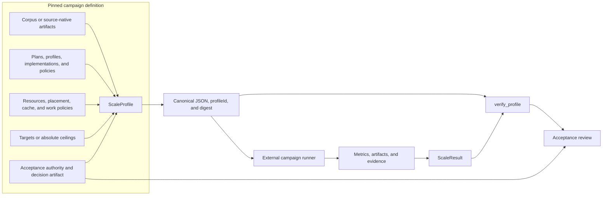
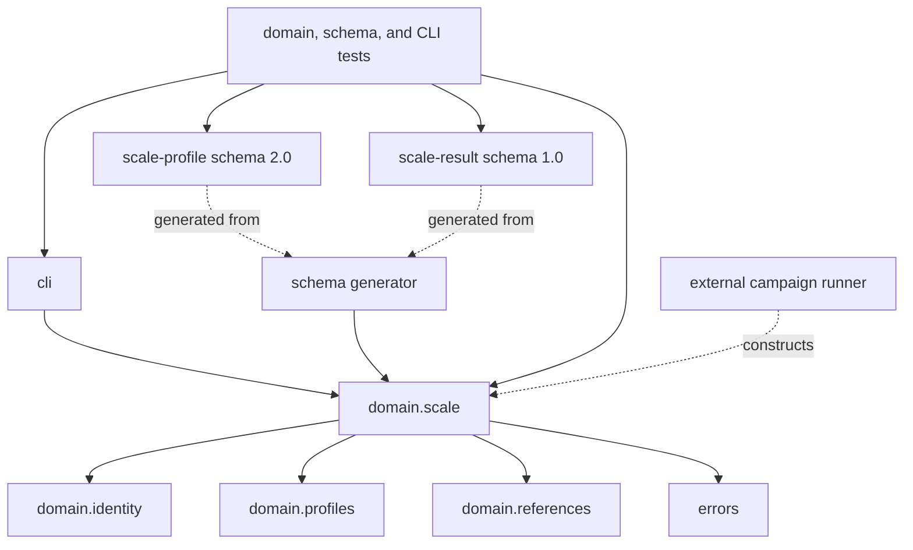
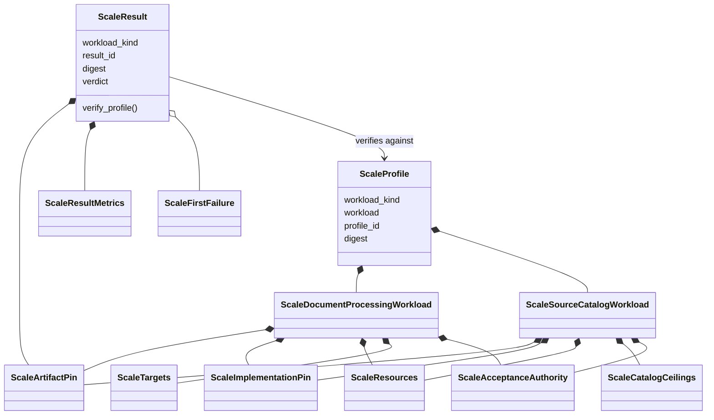
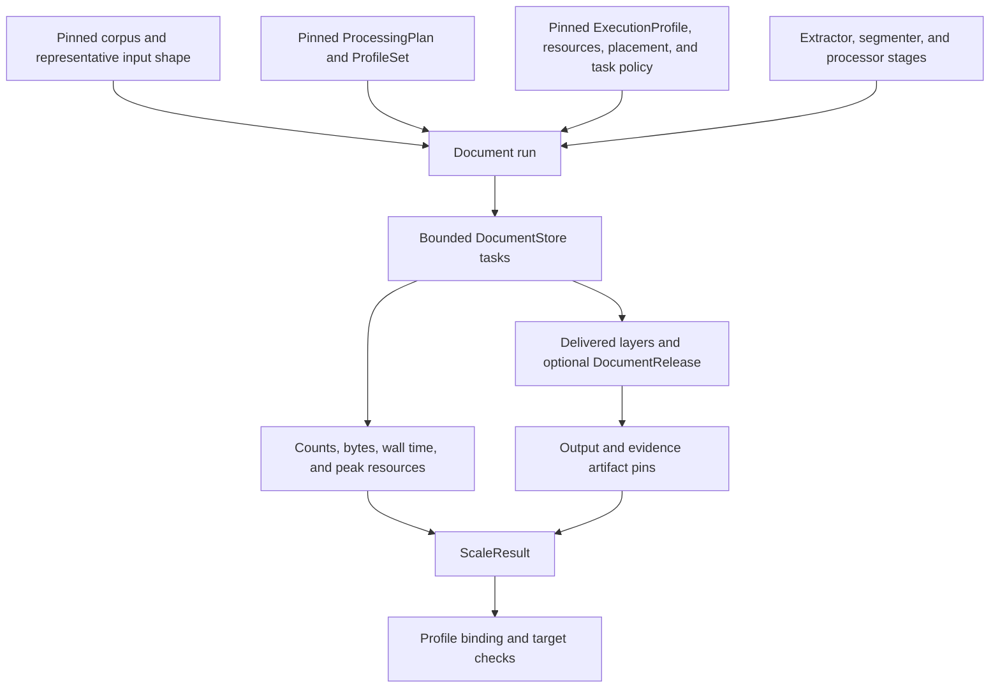
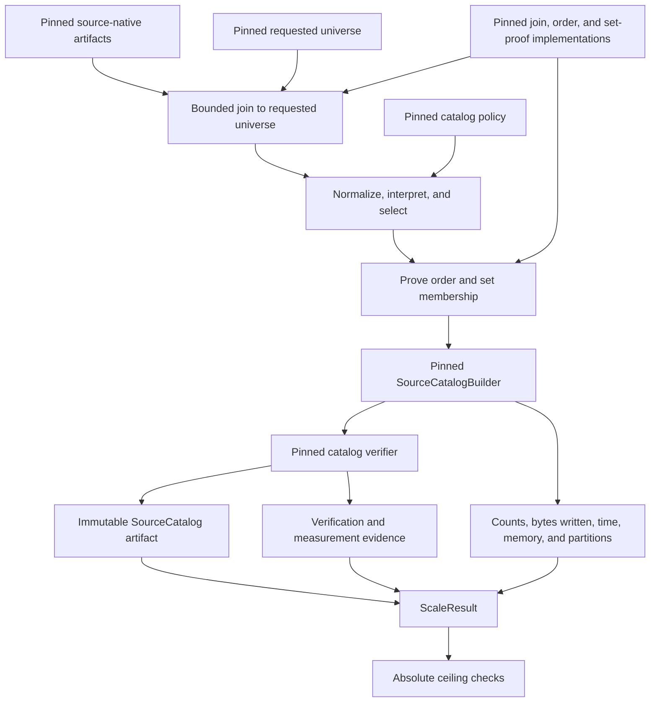
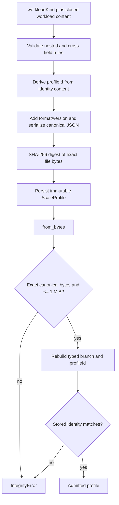
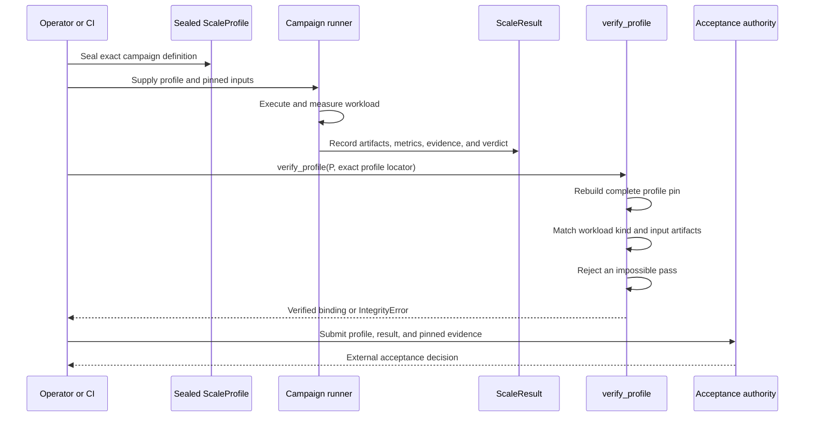

# Scale Acceptance

Scale acceptance makes a DocSpec scale claim reproducible and reviewable. The module seals every input, implementation choice, resource allocation, and acceptance limit in a content-addressed `ScaleProfile`; it records one completed campaign in a content-addressed `ScaleResult`; and it rejects a passing result that conflicts with its sealed profile.

The module defines evidence, not execution machinery. A deployment, benchmark harness, or external scheduler runs the campaign and measures it. `src/docspec/domain/scale.py` supplies the closed records and verification rules that let maintainers decide whether that campaign supports the stated claim.

## Purpose and system role

| Question | Answer |
| --- | --- |
| What goes in? | Exact artifact and implementation pins, a document-processing or source-catalog workload, measured result data, and durable evidence references. |
| What happens? | DocSpec validates closed shapes and cross-field rules, serializes canonical JSON, derives stable identifiers and file digests, and compares a result with its sealed profile. |
| What comes out? | A `docspec-scale-profile` 2.0 artifact and one or more `docspec-scale-result` 1.0 artifacts, each with an identity derived from its content. |
| How is it checked? | Constructors enforce local invariants; canonical readers reject alternate bytes and altered identifiers; generated JSON Schemas close the persisted shapes; `ScaleResult.verify_profile()` rejects inconsistent inputs, resource use, and passing metrics. |

Scale qualification sits beside the systems it measures. It does not replace their own correctness checks. A source catalog must still pass catalog verification, and a document run must still reconcile its tasks, stores, layers, and release. See [Source Catalog Pipeline](source_catalog_pipeline.md) and [Document Run Application](document_run_application.md) for those flows.

## System architecture



The profile fixes the question before execution. The result records the answer after execution. The acceptance authority remains explicit because metric validation alone cannot establish that the campaign used an approved corpus, measurement method, or decision process.

### Neighboring modules

| Module | Relationship to scale acceptance |
| --- | --- |
| [Source Catalog Pipeline](source_catalog_pipeline.md) | Supplies the source-native inputs, catalog policy, requested universe, builder, verifier, output artifact, and proof behavior measured by the `source-catalog` branch. |
| [Processing Plan and Job Model](processing_plan_and_job_model.md) | Defines the `ProcessingPlan`, complete `ProfileSet`, store limits, processor graph, and optional base-release choices pinned by the `document-processing` branch. |
| [Portable Task Execution](portable_task_execution.md) | Defines the `ExecutionProfile`, task population, concurrency boundary, retries, and scheduler-neutral messages that a document campaign exercises. |
| [Processor Extension Model](processor_extension_model.md) | Defines processor identities, dependencies, item limits, cache behavior, provider use, and evidence. Scale targets name processor stages without redefining processor semantics. |
| [Content Acquisition and Processing](content_acquisition_and_processing.md) | Defines extractor and segmenter behavior, representations, segments, and the file, image, page, byte, representation, and segment counts summarized by an input shape. |
| [Document Run Application: Delivery, Reconciliation, and Release](document_run_application_delivery_and_release.md) | Produces the verified stores, task results, run receipt, and optional `DocumentRelease` that a document campaign may pin as output evidence. |

## Code organization and dependency direction

The scale domain has one production source file and no scale-specific port or adapter. This keeps its records portable across local and externally scheduled campaigns.

| File | Responsibility |
| --- | --- |
| [`domain/scale.py`](../src/docspec/domain/scale.py) | Defines both workload branches, shared pins and limits, profile and result serialization, identities, and profile-to-result verification. |
| [`domain/identity.py`](../src/docspec/domain/identity.py) | Supplies exact canonical JSON parsing, SHA-256 validation, file digests, and stable DocSpec URNs. |
| [`domain/profiles.py`](../src/docspec/domain/profiles.py) | Supplies the complete `ProfileSet` embedded in a document-processing workload. |
| [`domain/references.py`](../src/docspec/domain/references.py) | Supplies `DocumentReleaseRef` for an optional incremental base release. |
| [`cli.py`](../src/docspec/cli.py) | Exposes `scale-profile seal` and `scale-profile verify`; it does not run campaigns or admit `ScaleResult` evidence. |
| [`tools/generate_scale_profile_schema.py`](../tools/generate_scale_profile_schema.py) | Generates both checked-in JSON Schemas from the live dataclass field sets plus explicit constraint tables. |
| [`tests/test_scale_profile.py`](../tests/test_scale_profile.py) | Covers both workload variants, identities, canonical round trips, false-pass rejection, and schema admission. |



`domain.scale` imports shared domain values but no application service, storage adapter, scheduler, or provider software. A new campaign runner should depend on this model and the neighboring application ports; the model must not import that runner.

## Component model

`ScaleProfile` is a closed union: `workloadKind` selects exactly one workload shape. `ScaleResult` uses the same workload kind but one common result shape.



All records are frozen, slotted dataclasses. Callers cannot mutate a validated instance in place, and serialized field names use camel case. Deserializers require the exact registered keys; missing and unknown fields fail together as an invalid closed shape.

## Shared pins, classifications, and controls

The two workload branches reuse small values where their meaning matches.

| Component | Purpose and invariants |
| --- | --- |
| `ScaleArtifactPin` | Names an immutable input or evidence artifact by `artifact_id`, `locator`, and normalized `sha256:` digest. It intentionally omits transport metadata such as media type and byte size. |
| `ScaleImplementationPin` | Identifies executable behavior by `implementation_id` and configuration digest. Use it when the campaign needs to pin behavior but does not consume that behavior as a file artifact. |
| `ScaleResultSinkPin` | Specializes an implementation pin for result delivery with `sink_id` and configuration digest. |
| `ScaleAcceptanceAuthority` | Pins the authority identifier, decision-artifact locator, and decision-artifact digest that govern acceptance. The class records this authority; it does not read or execute the decision artifact. |
| `ScaleResources` | Records environment, DocSpec and Python versions, worker count, CPU per worker, worker memory, and coordinator memory. Every numeric resource is a positive integer. |
| `ScalePlacement` | Records worker and storage regions plus a strict Boolean `source_colocated` value. |
| `ScaleCacheState` | Classifies a run as `cold`, `warm`, or `mixed`. The catalog workload permits only `cold` and `warm`. |
| `ScaleWorkloadKind` | Selects `document-processing` or `source-catalog`. The selected enum must match the concrete workload type and its closed JSON shape. |
| `ScaleStageKind` | Classifies a document-processing stage as `extractor`, `segmenter`, or `processor`. |
| `ScaleVerdict` | Records `pass` or `fail`; structural rules connect the value to output and first-failure evidence. |

`ScaleArtifactPin` is smaller than the shared `ArtifactRef` used by stores and repositories. Convert deliberately: do not assume that a scale pin proves media type or byte size, and do not discard either value when a downstream verifier requires them.

## Document-processing workload

`ScaleDocumentProcessingWorkload` describes a complete document run at a declared size. It pins the logical plan and execution profile, describes the selected corpus and observed input shape, names every processing stage, fixes the deployment conditions, and declares overall and per-processor targets.

### Document workload fields

| Field | Component | Meaning |
| --- | --- | --- |
| `processingPlan` | `ScaleArtifactPin` | Exact `ProcessingPlan` artifact used for the run. |
| `executionProfile` | `ScaleArtifactPin` | Exact scheduler-neutral `ExecutionProfile` artifact. |
| `corpus` | `ScaleCorpus` | Corpus identity, corpus digest, and deterministic selection method. |
| `inputShape` | `ScaleInputShape` | Digest-pinned sample and distributions that show why the corpus represents the intended workload. |
| `processingGraph` | tuple of `ScaleProcessingStage` | Ordered extractor, segmenter, and processor declarations with implementation and configuration pins. |
| `resources` | `ScaleResources` | Reference environment and worker/coordinator allocation. |
| `documentStorePolicy` | `ScaleDocumentStorePolicy` | Maximum entries, estimated bytes, expected segments, and duration for each document store. |
| `resultSink` | `ScaleResultSinkPin` | Exact result-delivery implementation and configuration. |
| `profileSet` | `ProfileSet` | One validated physical profile for every registered profile role. See [Processing Plan and Job Model](processing_plan_and_job_model.md). |
| `documentCatalog` | `ScaleImplementationPin` | Document-catalog implementation used to read and advance release state. |
| `baseRelease` | `DocumentReleaseRef` or `null` | Exact prior release for an incremental campaign, or no base for a full build. |
| `placement` | `ScalePlacement` | Worker, storage, and source-colocation conditions. |
| `cacheState` | `ScaleCacheState` | Cold, warm, or mixed starting cache condition. |
| `partitionPolicy` | `ScalePartitionPolicy` | Stable partition-policy identity, bucket count, target member size, and hard member-size ceiling. |
| `taskPolicy` | `ScaleTaskPolicy` | Policy identity, maximum in-flight stores, attempt limit, and checkpoint interval. |
| `targets` | `ScaleTargets` | Required unit count, overall deadline, resource ceilings, and targets for every processor stage. |
| `acceptanceAuthority` | `ScaleAcceptanceAuthority` | Pinned owner and decision evidence for the final acceptance decision. |

### Corpus and input shape

`ScaleCorpus` identifies the complete campaign population. `ScaleInputShape` separately identifies the sample used to characterize that population. This prevents a convenient prefix from standing in for a representative sample without leaving a changed digest and selection method.

Each `ScaleDistribution` contains non-negative `minimum`, `median`, `p95`, and `maximum` values in ascending order. `ScaleInputShape.distributions` must contain these six names in this canonical order:

1. `files`
2. `images`
3. `pages`
4. `bytes`
5. `representations`
6. `segments`

The values use integers. The model does not attach a unit to each distribution because the registered name supplies it.

### Processing stages and targets

Each `ScaleProcessingStage` pins:

- a distinct `stage_id`;
- a registered `stage_kind`;
- an implementation identifier and configuration digest;
- one or more sorted, distinct input layer kinds; and
- one output layer kind.

The workload requires at least one stage and distinct stage IDs. The type calls this sequence a processing graph, but it does not derive or validate edges from layer kinds. The pinned `ProcessingPlan` and processor model own executable ordering and dependency semantics.

`ScaleTargets` sets the overall unit count, deadline, worker CPU, worker memory, and coordinator memory limits. Its processor targets must be sorted and distinct by `processor_id`. More importantly, their IDs must equal the set of `stage_id` values for every stage whose kind is `processor`; each processor stage therefore receives exactly one target.

`ScaleProcessorTarget` records a deadline, maximum concurrency, non-negative cost estimate, and sorted, distinct provider limits. A `ScaleProviderLimit` names a positive maximum and its unit. These declarations support campaign configuration and acceptance evidence. The aggregate `ScaleResultMetrics` cannot prove every processor-specific value by itself, so the campaign must retain supporting evidence for them.

### Partition, task, and store policies

`ScalePartitionPolicy` requires positive bucket and byte values. `hard_max_member_bytes` must be at least `target_member_bytes`. `ScaleTaskPolicy` requires positive in-flight, attempt, and checkpoint values. `ScaleDocumentStorePolicy` requires positive maxima in all four dimensions.

These scale records describe the intended deployment values; they do not replace `PartitionPolicy`, `ExecutionLimits`, or `WorkLimits` in the execution path. Keep the values aligned with the pinned artifacts and retain evidence that the runner applied them. See [Portable Task Execution](portable_task_execution.md) for task validation and [Document Run Application: Store Execution and Recovery](document_run_application_execution.md) for actual work-limit enforcement.

### Document campaign data flow



## Source-catalog workload

`ScaleSourceCatalogWorkload` describes a bounded construction and verification campaign for one complete source catalog. It uses the same `ScaleProfile` family as document processing but replaces every processing-only field with catalog-specific inputs, proof strategies, measurement controls, and ceilings.

### Catalog workload fields

| Field | Component | Meaning |
| --- | --- | --- |
| `sourceNativeInputs` | tuple of `ScaleArtifactPin` | Complete, non-empty set of source-native input artifacts. Pins are sorted by artifact ID, locator, and digest and are distinct by artifact ID. |
| `catalogPolicy` | `ScaleArtifactPin` | Exact policy artifact that selects and interprets source-native rows. |
| `requestedUniverse` | `ScaleArtifactPin` | Exact declaration of the identities the catalog must account for. |
| `builder` | `ScaleImplementationPin` | Catalog builder implementation and configuration. |
| `verifier` | `ScaleImplementationPin` | Independent catalog verifier implementation and configuration. |
| `proofStrategy` | `ScaleCatalogProofStrategy` | Pinned join, order, and set-proof implementations plus their working bounds. |
| `outputProfile` | `ScaleArtifactPin` | Physical output-profile artifact. |
| `command` | `ScaleArtifactPin` | Exact campaign command or executable request. |
| `referenceMachine` | `ScaleArtifactPin` | Machine description used to interpret resource measurements. |
| `resources` | `ScaleResources` | Worker and coordinator allocation on the reference machine. |
| `cacheState` | `ScaleCacheState` | Explicit cold or warm condition; `mixed` is invalid for this branch. |
| `measurementMethod` | `ScaleArtifactPin` | Exact procedure or tool definition used to collect metrics. |
| `ceilings` | `ScaleCatalogCeilings` | Absolute maxima that a passing result may not exceed. |
| `acceptanceAuthority` | `ScaleAcceptanceAuthority` | Pinned owner and decision evidence for catalog-scale acceptance. |

`ScaleCatalogProofStrategy` pins three independent behaviors: joining requested IDs to source rows, proving canonical order, and proving set equality. `max_join_ids` may be zero; `partition_count` and `max_working_bytes` must be positive. The workload also requires:

- `max_working_bytes <= resources.coordinator_memory_bytes`;
- `ceilings.max_partition_count <= proof_strategy.partition_count`; and
- `ceilings.max_peak_resident_memory_bytes <= max(worker_memory_bytes, coordinator_memory_bytes)`.

`ScaleCatalogCeilings` sets positive maxima for source records, source bytes, wall time, resident memory, output bytes, and partition count. Payload and publication byte-write ceilings may be zero, which supports campaigns that require exact reuse or no publication overhead.

### Catalog campaign data flow



For catalog record meaning, complete-universe accounting, and immutable publication, use the [Source Catalog Pipeline](source_catalog_pipeline.md) pages. The scale module records that those operations ran under fixed conditions; it does not duplicate their semantic verifier.

## Profile identity and serialization

`ScaleProfile` seals one branch as canonical JSON. Its top-level shape is:

| JSON field | Rule |
| --- | --- |
| `format` | Exactly `docspec-scale-profile`. |
| `formatVersion` | Exactly `2.0`. |
| `profileId` | Recomputed from `workloadKind` and the complete serialized workload. |
| `workloadKind` | `document-processing` or `source-catalog`. |
| `workload` | The one closed workload shape selected by `workloadKind`. |

The `profile_id` uses `stable_urn("scale-profile", identity_content)` and therefore has a `urn:docspec:scale-profile:v1:` prefix. The URN algorithm's `v1` and the artifact format's `2.0` version separate two concerns: identity derivation and document shape. Changing any identity-bearing workload value changes the profile ID.

`to_bytes()` writes sorted, compact UTF-8 JSON with one trailing newline. `digest` hashes those exact file bytes. `from_bytes()` accepts only exact canonical bytes, verifies the supplied `profileId`, and rejects an artifact larger than 1 MiB.



## Result evidence

`ScaleResult` records one completed campaign. It owns no scheduler state and contains no mutable progress record.

### Result fields

| Field | Meaning and validation |
| --- | --- |
| `profile` | Full `ScaleArtifactPin` for the sealed profile, including the locator used by the verifier. |
| `workloadKind` | Must be a registered workload kind and later match the profile. |
| `startedAt`, `completedAt` | UTC RFC 3339 timestamps ending in `Z`; completion cannot precede start. |
| `inputArtifacts` | Non-empty, sorted, distinct artifact pins for the inputs actually consumed. |
| `outputArtifacts` | Sorted, distinct output pins; may be empty only when the verdict is `fail`. |
| `metrics` | Counts, byte accounting, elapsed time, and peak resource measurements. |
| `evidence` | Non-empty, sorted, distinct pins for logs, reports, traces, or other review material. |
| `firstFailure` | `null` for a pass; required `ScaleFirstFailure` for a failure. |
| `verdict` | `pass` or `fail`. |
| `resultId` | Stable URN derived from every field above; format and result ID are added only after identity derivation. |

Artifact tuples sort by `(artifact_id, locator, digest)` and require distinct artifact IDs. A passing result must pin at least one output artifact and must omit `firstFailure`. A failing result must include a failure code, stage, and evidence pin.

### Metrics

`ScaleResultMetrics` uses integer units throughout.

| Category | Fields |
| --- | --- |
| Population | `input_item_count`, `output_item_count`, `partition_count`, `task_count`, `store_count`, `release_count` |
| Data volume | `input_bytes`, `output_bytes`, `payload_bytes_read`, `payload_bytes_reused`, `payload_bytes_written`, `publication_bytes_written` |
| Time and resources | `wall_time_milliseconds`, `peak_worker_cpu`, `peak_worker_memory_bytes`, `peak_coordinator_memory_bytes`, `peak_scratch_bytes` |

Every metric is non-negative. Wall time, peak worker CPU, peak worker memory, and peak coordinator memory must also be greater than zero. The class validates the measurements' shape and units; the campaign's pinned measurement method defines how the runner obtains them.

Like a profile, a result uses exact canonical JSON, a content-derived stable URN, a SHA-256 file digest, and a 1 MiB maximum. Its format is `docspec-scale-result` version `1.0`.

## Profile-to-result verification

`ScaleResult.verify_profile(profile, profile_locator=...)` performs the mechanical acceptance checks common to all runners.



### Checks for every workload

The method reconstructs the expected profile pin from the supplied profile's `profile_id`, caller-supplied locator, and file digest. It requires exact equality with `result.profile`, including the locator, and requires the result workload kind to match the profile.

The `ScaleResult` constructor has already enforced verdict consistency, timestamp order, canonical artifact ordering, required evidence, and at least one output for a pass.

### Source-catalog pass checks

| Check | Required relationship |
| --- | --- |
| Input artifacts | Exact sorted tuple of all `sourceNativeInputs`, `catalogPolicy`, and `requestedUniverse` pins. |
| Source records | `input_item_count <= max_source_record_count`. |
| Source bytes | `input_bytes <= max_source_bytes`. |
| Wall time | `wall_time_milliseconds <= max_wall_time_milliseconds`. |
| Resident memory | Maximum of observed worker and coordinator memory does not exceed `max_peak_resident_memory_bytes`. |
| Output bytes | `output_bytes <= max_output_bytes`. |
| Payload writes | `payload_bytes_written <= max_payload_bytes_written`. |
| Publication writes | `publication_bytes_written <= max_publication_bytes_written`. |
| Partitions | `partition_count <= max_partition_count`. |
| Worker CPU | `peak_worker_cpu <= worker_count * worker_cpu`. |
| Worker memory | `peak_worker_memory_bytes <= resources.worker_memory_bytes`. |
| Coordinator memory | `peak_coordinator_memory_bytes <= resources.coordinator_memory_bytes`. |

### Document-processing pass checks

| Check | Required relationship |
| --- | --- |
| Input artifacts | Exactly one corpus pin. Its artifact ID and digest must match `ScaleCorpus`; its locator remains result evidence because `ScaleCorpus` has no locator field. |
| Unit population | `input_item_count == targets.unit_count`. |
| Wall time | `wall_time_milliseconds <= targets.deadline_seconds * 1000`. |
| Worker CPU | `peak_worker_cpu <= min(targets.max_worker_cpu, worker_count * worker_cpu)`. |
| Worker memory | `peak_worker_memory_bytes <= min(targets.max_worker_memory_bytes, resources.worker_memory_bytes)`. |
| Coordinator memory | `peak_coordinator_memory_bytes <= min(targets.max_coordinator_memory_bytes, resources.coordinator_memory_bytes)`. |

The minimum in the resource checks makes both declarations binding: a generous target cannot override the allocated environment, and a generous environment cannot override the accepted target.

### Checks that remain outside `verify_profile()`

The method rejects impossible pass claims; it does not establish the entire acceptance decision. The caller or acceptance process must still:

- load each artifact locator and verify the pinned bytes;
- verify source-catalog or document-release semantics through the owning module;
- prove that the runner applied the pinned command, implementations, profiles, placement, cache state, partition policy, task policy, and measurement method;
- check per-processor deadlines, concurrency, cost estimates, and provider limits from supporting evidence;
- compare timestamp duration with measured wall time when the measurement method requires that relationship;
- evaluate determinism or repeated-run requirements; and
- verify and apply the pinned acceptance decision artifact.

Passing `docspec scale-profile verify` proves only that a profile is canonical, internally valid, and identity-consistent. It does not parse a result or declare that a deployment passed a scale campaign.

## Operator workflow

### Seal a profile

Prepare a closed JSON request containing only `workloadKind` and `workload`. The request may use ordinary JSON formatting; the CLI validates it and writes the canonical artifact.

```bash
uv run docspec scale-profile seal \
  --request scale-profile-content.json \
  --destination scale-profile.json \
  --receipt scale-profile-operation.json
```

The command writes the profile and a machine operation receipt as new files. It refuses to replace either destination. The receipt pins the request digest and produced profile artifact.

### Verify the sealed profile

```bash
uv run docspec scale-profile verify scale-profile.json
```

The command reparses canonical bytes and recomputes identity. Its summary reports the profile ID, digest, workload kind, and either document unit and processor-target counts or catalog input and record-ceiling counts.

### Run and admit a result

The repository currently exposes no scale campaign or `scale-result verify` CLI command. A runner must construct `ScaleResult`, persist `result.to_bytes()`, and call the domain verification method before presenting the evidence for acceptance.

```python
from pathlib import Path

from docspec.domain.scale import ScaleProfile, ScaleResult

profile_path = Path("scale-profile.json")
result_path = Path("scale-result.json")

profile = ScaleProfile.from_bytes(profile_path.read_bytes())
result = ScaleResult.from_bytes(result_path.read_bytes())
result.verify_profile(profile, profile_locator=profile_path.as_posix())
```

Use the exact locator embedded by the result producer. A different spelling or location fails the complete profile-pin comparison even when the profile bytes match.

## Validation and refusal behavior

The module fails closed at four layers:

1. Primitive checks reject empty text, malformed SHA-256 values, negative or zero-constrained integers, invalid enums, wrong collection shapes, and noncanonical ordering.
2. Component checks enforce ordered distributions, distinct stages and targets, workload-specific cache states, policy bounds, and verdict/failure consistency.
3. Artifact readers reject non-canonical bytes, unknown formats, extra or missing fields, stale content-derived identifiers, and files larger than 1 MiB.
4. `verify_profile()` rejects profile, workload, input, target, ceiling, and resource conflicts.

Validation raises `ProfileError` for most closed-shape and cross-field failures, `IntegrityError` for canonical-byte, size, binding, and false-pass failures, and `TypeError` or `ValueError` for some primitive API misuse. Callers should treat every validation exception as refusal and preserve the exact error with campaign evidence.

## Contribution guide

Keep the model, generated schemas, CLI summaries, and tests synchronized. The domain source is authoritative for Python behavior; the checked-in schemas are the portable interchange description.

| Change | Required updates and review focus |
| --- | --- |
| Add or rename a workload field | Update the dataclass, closed field set, `to_dict()`, `from_dict()`, schema generator table, both checked-in schema copies, and positive and refusal tests. Decide whether the field changes identity; workload fields currently do. |
| Add a workload kind | Extend `ScaleWorkloadKind`, define one closed workload class, update both `ScaleProfile` dispatch maps and accessors, add a schema union branch, update CLI summaries, define input and pass checks, and test cross-branch refusal. |
| Add a stage, cache, or verdict value | Update the enum, schema enum, branch-specific restrictions, and tests. Preserve existing serialized meanings or change the format version. |
| Add or change a metric | Update `ScaleResultMetrics.to_dict()` and `from_dict()`, the schema generator, result fixtures, and `verify_profile()` when the metric affects acceptance. Specify an integer unit and whether zero is valid. |
| Change pass criteria | Add boundary tests for equality, first exceeded value, combined resource/target minima, both verdicts, and both workload branches. Treat weakened criteria as an acceptance-policy and versioning decision. |
| Change artifact ordering | Preserve deterministic sorting and distinct artifact IDs across constructors, parsers, schemas, runner output, and input comparison. Ordering is identity-bearing. |
| Add a campaign runner | Place it at the application, adapter, CLI, or external-tool boundary. Consume sealed profiles, use the owning pipeline APIs, retain evidence, emit `ScaleResult`, and keep scheduler state out of `domain.scale`. |

When changing either artifact shape, decide whether readers must continue accepting old files. The current readers accept only profile version `2.0` and result version `1.0`; they provide no migration path or permissive unknown-field handling.

### Schema generation

The generator reflects dataclass field names but keeps integer, digest, enum, ordering, and closed-union constraints explicit. Update both parts when semantics change.

```bash
uv run python -m tools.generate_scale_profile_schema \
  > conformance/scale-profile.schema.json
cp conformance/scale-profile.schema.json \
  src/docspec/schemas/scale_profile/2.0/scale-profile.schema.json

uv run python -m tools.generate_scale_profile_schema --result \
  > conformance/scale-result.schema.json
cp conformance/scale-result.schema.json \
  src/docspec/schemas/scale_result/1.0/scale-result.schema.json
```

If a semantic change requires a new format version, create a new packaged schema directory instead of overwriting an old released schema.

### Focused verification

Run these checks from the repository root:

```bash
uv run pytest \
  tests/test_scale_profile.py \
  tests/test_cli.py \
  tests/test_machine_files.py \
  tests/test_package_boundary.py
uv run ruff check src/docspec/domain/scale.py tools/generate_scale_profile_schema.py
```

`tests/test_machine_files.py` proves that the conformance and packaged schemas equal fresh generator output. `tests/test_package_boundary.py` proves that both schemas ship in the built package. Use the broader source-catalog, execution, delivery, and release suites when a scale-profile change alters how a real campaign must run.

## Current completion boundary

The repository's [`conformance/test-matrix.json`](../conformance/test-matrix.json) marks `SCALE` as `partial`. The typed model, both workload branches, canonical identities, generated schemas, profile CLI, and false-pass checks have focused coverage. Full scale acceptance still requires dated campaign results and pinned evidence for the ordered 100,000, 1,000,000, and at least 5,000,000 representative-unit campaigns, including the source-catalog resource and determinism gate.

Documentation and schema validity cannot substitute for those runs. A scale claim becomes acceptable only when the sealed profile, exact result, owning pipeline verification, supporting evidence, and named acceptance authority all agree.
