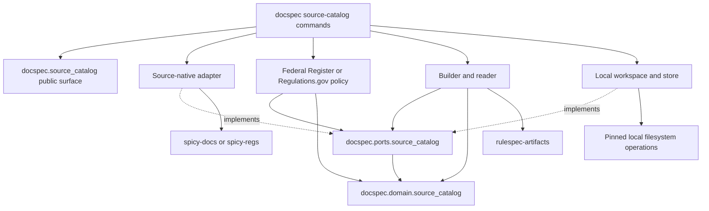
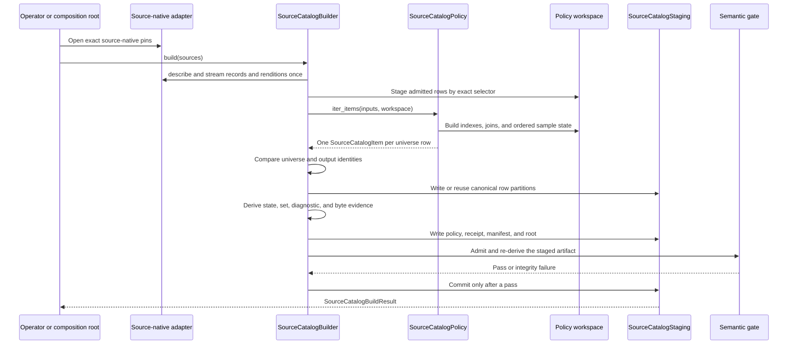
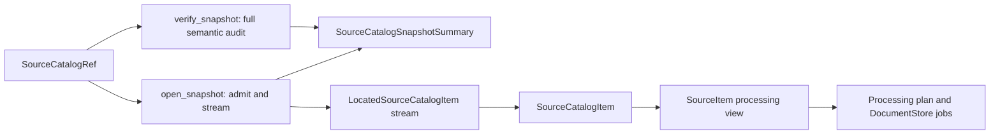

# Source Catalog Pipeline

The source catalog pipeline turns verified source-native releases into one complete, immutable DocSpec snapshot. It preserves every row in the requested universe, applies a pinned interpretation policy, records why each row was selected or refused, and publishes the result only after structural and semantic verification pass.

This module ends before content capture. It chooses candidate renditions and produces the processing view that downstream planning consumes; [Content Acquisition and Processing](content_acquisition_and_processing.md) owns fetching, extraction, and segmentation.

## Purpose and system role

| Question | Answer |
| --- | --- |
| What goes in? | One or more admitted source-native snapshots, an installed catalog policy with closed configuration, a catalog series identifier, producer and verifier identities, a temporary policy workspace, and an immutable store. |
| What happens? | DocSpec validates and merges source row families, performs source-specific normalization, joins, sampling, rendition choice, and selection, then partitions and seals one normative row for every requested identity. |
| What comes out? | A `SourceCatalogRef`, a verified `SourceCatalogSnapshotSummary`, and a globally ordered, single-pass stream of `SourceCatalogItem` rows. |
| How is it checked? | The build accounts for the full universe, validates closed schemas and canonical ordering, runs Rulespec artifact admission, and re-derives every row-based digest in the DocSpec semantic gate before publication. Consumers can repeat the full audit with `verify_snapshot()`. |

The catalog is both a processing input and an evidence boundary. `selected` rows supply capture candidates. `excluded`, `deleted`, `unavailable`, and `failed` rows stay in the snapshot with explicit reasons, so the catalog proves what happened to every requested source identity.

## System context

```mermaid
flowchart LR
    Native["Verified source-native releases"] --> Adapter["Source-native adapter"]
    Adapter --> Inputs["Neutral record and rendition streams"]
    Inputs --> Builder["SourceCatalogBuilder"]
    Policy["Pinned SourceCatalogPolicy"] --> Builder
    Workspace[("Bounded policy workspace")] <--> Policy
    Builder --> Stage["Canonical rows and artifact members in staging"]
    Stage --> Gate["Rulespec admission and DocSpec semantic gate"]
    Gate -->|pass| Store["Immutable artifact and content-addressed partitions"]
    Store --> Ref["SourceCatalogRef"]
    Ref --> Reader["SourceCatalogArtifactReader"]
    Reader --> Snapshot["Verified snapshot and normative row stream"]
    Snapshot --> Planner["RunPlanner"]
    Planner --> Processing["Acquisition, extraction, segmentation, and release flow"]
```



The main relationships are:

- Upstream producers acquire data and publish source-native artifacts. The optional `SpicyRegsSourceNativeAdapter` admits `spicy-docs` or legacy `spicy-regs` releases and exposes only DocSpec-owned structural values.
- Source policies interpret admitted facts. They do not fetch content, write artifacts, or import producer data types.
- The builder owns complete-universe accounting, canonical output, partitioning, evidence derivation, and the pre-publication gate.
- The reader admits immutable artifacts without consulting producer state. `RunPlanner` converts each normative row with `SourceCatalogItem.to_processing_item()` before it creates processing work.
- A later `DocumentRelease` pins the exact catalog used for processing. It does not feed capture results back into the published catalog.

For the neighboring responsibilities, see [Source Intake and Document Preparation](source_intake_and_document_preparation.md), [Document Run Application](document_run_application.md), [Document Release Artifacts](document_release_artifacts.md), and [Scale Acceptance](scale_acceptance.md).

## Architecture and dependency direction

DocSpec keeps source knowledge and storage mechanisms outside the domain model. Application code depends on DocSpec protocols; adapters implement those protocols and contain external package or filesystem details.



`src/docspec/source_catalog.py` is the supported Python import surface. `src/docspec/source_catalog_cli.py` is the operator composition root for `docspec source-catalog build` and `docspec source-catalog verify`. Domain and port modules do not import the CLI, local adapters, or producer packages.

## Sub-module documentation

The implementation has three cohesive sub-modules. Their detailed pages avoid repeating the same model and lifecycle descriptions.

| Sub-module | Scope | Detailed documentation |
| --- | --- | --- |
| Model and ports | Normative rows, dispositions, interpretation evidence, generated schemas, source and policy interfaces, storage interfaces, snapshots, readers, and current pointers | [Source Catalog Pipeline: Model and Ports](source_catalog_pipeline_model_and_ports.md) |
| Policy execution | Shared normalization helpers, Federal Register and Regulations.gov policies, the SQLite policy workspace, and the optional source-native adapter | [Source Catalog Pipeline: Policy Execution](source_catalog_pipeline_policy_execution.md) |
| Artifacts and local storage | Canonical framing, catalog build and read paths, semantic verification, content-addressed partitions, atomic local publication, and current-pointer changes | [Source Catalog Pipeline: Artifacts and Local Storage](source_catalog_pipeline_artifacts_and_storage.md) |

## Core data and identity

`SourceCatalogItem` is the normative interchange row. It preserves source-native facts and observations alongside normalized metadata, all six policy interpretations, candidate renditions, and the final disposition. The smaller `SourceItem` in [Content Acquisition and Processing](content_acquisition_and_processing.md) is a derived processing view, not a replacement catalog format.

Every persisted row contains exactly one interpretation of each kind, in this order:

1. `exact-join`
2. `normalization`
3. `rendition-preference`
4. `sampling`
5. `selection`
6. `topic-recovery`

Each interpretation repeats the policy identifier, version, digest, and input scopes. This makes normalized values and selection results traceable to the exact policy member that produced them.

Several similar names identify different levels of state:

| Value | Meaning |
| --- | --- |
| `SourceCatalogBuildRequest.catalog_id` and `SourceCatalogSnapshotSummary.catalog_id` | Stable catalog series identifier chosen by the caller. The optional current pointer uses this value as its series key. |
| `SourceCatalogRef.catalog_id` and `SourceCatalogSnapshotSummary.logical_id` | Rulespec logical identifier for the exact catalog meaning. The reference field keeps its historical `catalog_id` name. |
| `SourceCatalogRef.digest` and `SourceCatalogSnapshotSummary.artifact_digest` | Digest of the exact physical artifact publication. A physical rebuild can preserve logical identity while changing this digest. |
| `catalogStateDigest` | Digest of every complete normative row in global order. |
| `requestedUniverseSetDigest` | Digest of every requested `sourceItemId`, including non-selected rows. |
| `selectedSourceSetDigest` | Digest of the selected `(sourceItemId, documentId)` pairs. |

`SourceCatalogRef` and the other shared reference values are documented in [Storage and Shared References](storage_and_shared_references.md).

## Build and publication flow



The local implementation assigns rows to 64 stable digest buckets. Each nonempty partition is canonical newline-delimited JSON stored by SHA-256 digest. Unchanged partition bytes can be reused across builds, but a new snapshot never depends on a predecessor to reconstruct its current logical state.

The artifact contains an exact policy member, a build receipt, a member manifest, and a Rulespec root. The receipt records input pins, partition references, counts, join coverage, state and membership digests, diagnostic digests, byte measurements, and verifier identity. [Artifacts and Local Storage](source_catalog_pipeline_artifacts_and_storage.md) documents the member layout and failure-safe publication sequence.

## Read, audit, and downstream use

`SourceCatalogArtifactReader` exposes two paths:

- `open_snapshot(reference)` admits the root and receipt, then returns a summary and a single-pass, globally ordered row stream. A fresh reader validates row canonicality, schema, interpretation order, partition placement, ordering, and counts as the caller consumes the stream.
- `verify_snapshot(reference)` performs the full offline audit. It re-derives the state and membership digests, disposition counts, join coverage, and all diagnostic digests, then memoizes the verdict for that exact reference in the reader instance.



The row stream is not rewindable. Use either `snapshot.located_items` when the supplying partition digest matters or `snapshot.items` for plain rows. Open another snapshot for another pass.

## Required invariants

Changes must preserve these system properties:

- **Complete coverage:** the policy emits exactly one ordered row for every universe identity. A refusal remains a row; it never disappears from accounting.
- **Evidence preservation:** raw source-native facts, malformed observations, exact join outcomes, normalization sources, sampling details, rendition offers, and decision reasons remain available for replay and review.
- **Determinism:** canonical JSON, UTF-16 ordering, fixed interpretation order, stable partitioning, and framed digests make identical inputs and policy produce identical logical state.
- **Bounded work:** source streams and snapshots are single-pass; corpus-sized joins and sample state use a temporary SQLite workspace; row, rendition, summary, and small-member limits fail before publication.
- **Immutable publication:** existing roots and blobs are never overwritten. A mutable current pointer advances separately through full admission, expected-current comparison, and exact `supersedes` evidence.
- **Independent verification:** Rulespec checks generic structure and member integrity. DocSpec checks catalog meaning and re-derives row-authored evidence. Neither trusts the build receipt merely because it is self-consistent.
- **Dependency isolation:** producer packages stay in source adapters, filesystem mechanics stay in storage adapters, and the model and policies exchange DocSpec-owned values.

## Public composition example

Application code normally imports from `docspec.source_catalog` and injects sources that satisfy `SourceNativeRecordSource`:

```python
from pathlib import Path

from docspec.source_catalog import (
    FederalRegisterCatalogPolicy,
    LocalSourceCatalogStore,
    SourceCatalogArtifactReader,
    SourceCatalogBuildRequest,
    SourceCatalogBuilder,
    SqliteCatalogPolicyWorkspace,
    source_catalog_producer,
)

producer = source_catalog_producer(
    implementation_id="urn:example:docspec-implementation:1",
    verifier_id="urn:docspec:verifier:source-catalog",
    verifier_version="1.0.0",
    verifier_implementation_id="urn:example:source-catalog-verifier:1",
)
store = LocalSourceCatalogStore(Path("catalog-store"))
policy = FederalRegisterCatalogPolicy(expected_source_system_id="example-source")

result = SourceCatalogBuilder(
    store=store,
    policy=policy,
    request=SourceCatalogBuildRequest(
        catalog_id="urn:example:catalog-series:federal-register",
        producer=producer,
    ),
    workspace_factory=SqliteCatalogPolicyWorkspace,
).build(sources)

reader = SourceCatalogArtifactReader(store, producer=producer)
summary = reader.verify_snapshot(result.reference)
snapshot = reader.open_snapshot(result.reference)
for catalog_item in snapshot.items:
    processing_item = catalog_item.to_processing_item()
```

The CLI supplies the production-facing local composition, validates the closed policy member, selects source-native profiles, writes the command receipt inside the staged destination, and publishes the whole destination without replacement. Use `docspec source-catalog build --help` and `docspec source-catalog verify --help` for the exact operator arguments.

## Contribution guide

Choose the owner that matches the change:

| Change | Primary documentation | Main verification focus |
| --- | --- | --- |
| Add a source policy, source kind, normalization rule, join, sample, or rendition decision | [Policy Execution](source_catalog_pipeline_policy_execution.md) | Closed policy round trip, one row per universe identity, deterministic evidence, and every refusal path. |
| Change a catalog field, disposition, interpretation result, schema, or processing conversion | [Model and Ports](source_catalog_pipeline_model_and_ports.md) | Dataclass invariants, generated schema equality, canonical round trip, verifier alignment, and downstream planning behavior. |
| Change framing, partitioning, digest derivation, artifact members, store behavior, or current-pointer transitions | [Artifacts and Local Storage](source_catalog_pipeline_artifacts_and_storage.md) | Byte equality, tamper refusal, full re-derivation, atomic publication, reuse, concurrency, and filesystem identity checks. |
| Change how the snapshot becomes processing work | [Document Run Application](document_run_application.md) and [Content Acquisition and Processing](content_acquisition_and_processing.md) | Processing-view compatibility, incremental comparison, bounded planning, and acquisition behavior. |

A semantic change must move the policy or schema identity that describes it. Keep raw observations with normalized output, preserve exact failure reasons, and add a neighboring valid row to tests for row-local source-quality failures. Integrity failures must prove that no partial root becomes visible.

Run the focused checks from the repository root:

```bash
uv run pytest \
  tests/test_catalog_policy.py \
  tests/test_catalog_policy_workspace.py \
  tests/test_regulations_gov_catalog.py \
  tests/test_spicyregs_source_native.py \
  tests/test_framing.py \
  tests/test_source_catalog_snapshot.py \
  tests/test_source_catalog_succession.py \
  tests/test_package_boundary.py
uv run ruff check .
```

Use `tests/test_source_catalog_installed_wheel.py` when a change affects package boundaries, optional producer imports, public composition, or independent admission from built wheels.
