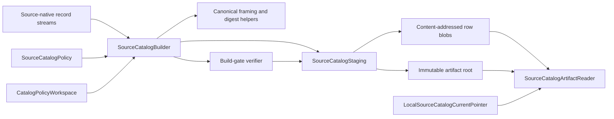
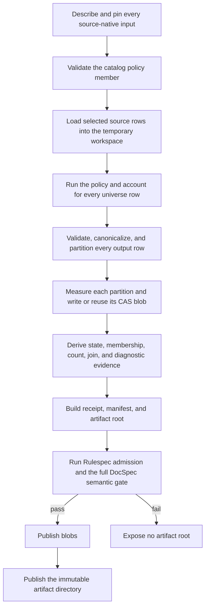
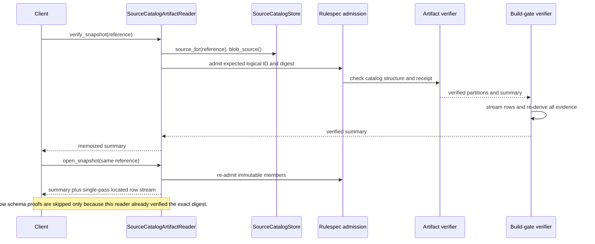
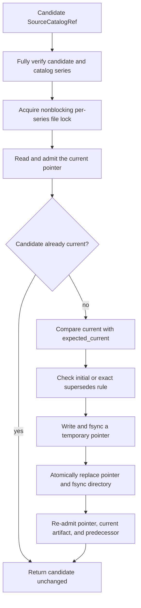

# Source Catalog Pipeline: Artifacts and Local Storage

This part of the source catalog pipeline turns policy-produced catalog rows into an immutable, content-addressed artifact. It also opens and verifies published snapshots, stores their payloads safely on a local filesystem, and advances an optional current pointer without changing any published snapshot.

The artifact and storage code does not decide what a catalog row means. See [Source Catalog Pipeline: Model and Ports](source_catalog_pipeline_model_and_ports.md) for the row model, snapshot types, and interfaces used here. See [Source Catalog Pipeline](source_catalog_pipeline.md) for this sub-module's place in the complete source intake flow.

## Responsibilities at a glance

| Question | Answer |
| --- | --- |
| What goes in? | One or more admitted `SourceNativeRecordSource` streams, an injected `SourceCatalogPolicy`, a `SourceCatalogBuildRequest`, a temporary policy workspace, and a `SourceCatalogStore`. |
| What happens? | The builder validates and accounts for the source universe, partitions canonical catalog rows, writes or reuses content-addressed blobs, derives identity and diagnostic digests, seals the artifact, verifies it, and publishes it atomically. |
| What comes out? | A `SourceCatalogBuildResult` containing a `SourceCatalogRef`, a verified `SourceCatalogSnapshotSummary`, and byte measurements. Readers expose the same immutable snapshot as a globally ordered, single-pass item stream. |
| How is it checked? | Rulespec verifies generic artifact structure and member hashes. DocSpec checks the closed catalog shape, then its full semantic gate re-derives catalog identities, counts, join coverage, and diagnostic digests from the stored rows. |

## Architecture



The implementation follows dependency inversion. `SourceCatalogBuilder` and `SourceCatalogArtifactReader` use the source catalog ports; `LocalSourceCatalogStore` supplies the local implementation. Rulespec supplies generic artifact framing, manifests, pins, and admission. DocSpec adds the source catalog's schema, ordering, accounting, and semantic checks.

## Component map

| File | Components | Responsibility |
| --- | --- | --- |
| `src/docspec/adapters/framing.py` | `FramedSectionHasher`, `framed_section_digest_fast`, `canonical_record_payload` | Produces Rulespec-compatible framed digests incrementally and uses a guarded fast canonical JSON writer. |
| `src/docspec/adapters/source_catalog_artifact.py` | `SourceCatalogBuilder`, `SourceCatalogArtifactVerifier`, `SourceCatalogBuildGateVerifier`, `SourceCatalogArtifactReader`, build request and result types | Builds, seals, verifies, reads, partitions, and derives identities for source catalog artifacts. |
| `src/docspec/adapters/source_catalog_store.py` | `LocalSourceCatalogStore`, `LocalSourceCatalogStaging`, `LocalSourceCatalogPublication`, `LocalSourceCatalogCurrentPointer` | Implements safe local staging, content-addressed blob reuse, immutable publication, whole-destination publication, and atomic current-pointer updates. |

## Artifact structure

A published catalog separates small control members from potentially large row payloads. The artifact directory contains the root, policy, receipt, and manifest. Canonical newline-delimited JSON (NDJSON) partitions live in the blob store and appear in the manifest through their `blobRef` values.

```text
<store-root>/
├── <artifact-digest-hex>/
│   ├── artifact.json
│   ├── catalog-policy.json
│   ├── catalog-build-receipt.json
│   └── manifests/
│       └── catalog.json
├── .blobs/
│   └── sha256/
│       └── <partition-digest-hex>
└── .staging/                 # contains isolated sessions during staging

<pointer-root>/               # may be separate from the artifact store
└── current/
    ├── <sha256-of-catalog-id>.json
    └── .<sha256-of-catalog-id>.lock
```

The artifact root has kind `docspec-source-catalog`. Its closed `spec` binds the catalog series, installed schema bundle, source-system set, source-native schema set, selection policy, requested universe, selected source set, and complete catalog state. Its inputs pin every source-native artifact with role `source-native`. An optional Rulespec `supersedes` member records predecessor evidence.

### Declared members

| Member | Role | Media type | Storage | Purpose |
| --- | --- | --- | --- | --- |
| `catalog-policy.json` | `catalog-policy` | `application/json` | Artifact directory | Pins the exact policy identifier, version, and closed configuration used for the build. |
| `catalog-build-receipt.json` | `catalog-build-receipt` | `application/json` | Artifact directory | Records source pins, partitions, counts, identities, diagnostics, byte accounting, and verifier identity. |
| One member per nonempty partition | `source-items` | `application/x-ndjson` | Content-addressed blob store | Carries canonical `SourceCatalogItem` rows. Its member descriptor uses `blobRef`, `byteSize`, and `recordCount`, not a local object key. |
| `manifests/catalog.json` | Rulespec manifest | JSON | Artifact directory | Describes the policy, receipt, and row-blob members. |
| `artifact.json` | Rulespec root | JSON | Artifact directory | Seals the product kind, spec, producer, source inputs, manifest, and optional predecessor. |

The receipt's `publicationBytesWritten` covers the policy, receipt, manifest, and root. Row payload bytes are tracked separately as read, reused, or written. The builder recalculates the receipt and root until publication-byte accounting reaches a fixed point; it refuses the build if eight iterations do not stabilize.

## Build path



### 1. Admit and stage source rows

`SourceCatalogBuilder.build()` requires at least one source. It calls `describe()` on each source and constructs a canonical policy member from the injected policy. The policy member must pass the installed JSON Schema before row work starts.

`_CatalogPolicyInputs` validates source records and renditions at the boundary. It enforces closed shapes, digest and size formats, strict UTF-16 ordering, exact record-to-rendition matching, and per-record rendition limits. It stores admitted rows in the injected `CatalogPolicyWorkspace`, which lets stateful policies build indexes without retaining a corpus in Python memory.

Each selector is single-use. The policy must completely consume every opened input, read every declared universe input, emit globally ordered and distinct `sourceItemId` values, and emit exactly one output row for every universe identity. Lookup inputs must differ from universe inputs. Any accounting difference stops the build.

### 2. Validate and partition policy output

`_CatalogRowPartitioner` converts each `SourceCatalogItem` to its closed JSON form and checks:

- the installed source-item schema;
- the fixed interpretation order: `exact-join`, `normalization`, `rendition-preference`, `sampling`, `selection`, and `topic-recovery`;
- the policy identifier, version, and digest on every interpretation;
- strict global `sourceItemId` ordering;
- the maximum canonical row size.

The partitioner assigns each row to one of 64 buckets through `partition_bucket(source_item_id, 64)`. Partition identifiers are four decimal digits from `0000` through `0063`. It orders rows within each partition by the shared UTF-16 key rule and writes canonical JSON followed by one newline. Empty partitions do not appear in the receipt.

Each partition blob's SHA-256 digest becomes its `blobRef`. A small change normally replaces only the affected partition; unchanged partition bytes keep the same reference and can be reused.

### 3. Derive identities and diagnostics

The builder derives all catalog evidence from the staged row blobs. The framing protocol includes a domain string, section name, declared record count, and each canonical record's byte length and bytes. Counts and framing prevent ambiguous concatenations.

| Evidence | What it binds |
| --- | --- |
| `catalogStateDigest` | Every complete source catalog row in global order. |
| `requestedUniverseSetDigest` | Every requested `sourceItemId`, including rows that policy later excludes, deletes, marks unavailable, or marks failed. |
| `selectedSourceSetDigest` | Ordered `(sourceItemId, documentId)` pairs for rows with disposition `selected`. |
| `sourceSystemSetDigest` | Source system identity, version, logical-ID digest suffix, state scope and digest, and native schema digest. |
| `sourceNativeSchemaSetDigest` | The ordered native schema identities represented by the inputs. |
| `normalizedFieldsDigest` | Normalized field values and their source paths, outcomes, rejected values, and value source. |
| `joinedFieldsDigest` and `joinCoverage` | Exact-join outputs, evidence, and matched, unmatched, and null-result counts. |
| `dispositionsDigest` and `reasonsDigest` | Each row's final disposition and human-readable reason. |
| `interpretationsDigest` | Every policy interpretation result and its policy and input pins. |
| `renditionChoicesDigest` | The chosen rendition family and candidate identities for every row. |

Derivation uses a streamed serial path for smaller catalogs. At 5,000 rows or more, it may use up to eight spawned workers when more than one partition exists. Workers validate partitions and spill digest-ready payloads to temporary files; the parent performs one ordered merge. The code falls back to the serial path when the interpreter cannot host spawned workers. Serial and parallel paths call the same payload helpers and must produce identical bytes.

### 4. Gate and publish

The builder writes the policy, receipt, manifest, and root into staging, then runs Rulespec admission with `SourceCatalogBuildGateVerifier`. Publication starts only after this gate validates every row and recomputes every sealed identity and diagnostic.

`LocalSourceCatalogStaging.commit()` publishes verified content-addressed blobs before it publishes the artifact directory. This order guarantees that a visible root never points to a missing partition. A failure after blob publication can leave unreferenced blobs, but those blobs remain verified, reusable store state; no catalog becomes visible until its root directory publishes successfully.

## Canonical framing

`FramedSectionHasher` reproduces Rulespec's `framed_section_digest` protocol incrementally. It requires the caller to declare the section count, refuses extra records immediately, and refuses a final count mismatch when `digest()` is called.

`canonical_record_payload()` uses Python's standard JSON writer only when a structural guard proves equality with the Rulespec writer: every object key must be ASCII and the value tree must contain no floats. Unicode values remain allowed. For non-ASCII keys or floats, it delegates to Rulespec's canonical writer. This optimization changes speed, never identity.

`framed_section_digest_fast()` applies the same guarded writer to a batch of `FramedSection` values. It also requires nonempty, distinct section names and exact declared counts.

## Verification and read paths

The two public reader methods answer different questions.

| Method | Checks before returning | Checks while reading rows | Recomputes sealed semantic evidence |
| --- | --- | --- | --- |
| `open_snapshot(reference)` | Rulespec artifact admission, member hashes, expected pin, producer, closed root and receipt shape, schema pins, member descriptors, counts, byte accounting, and join-coverage arithmetic. | Unless this reader already verified the same digest, checks canonical JSON, item schema, interpretation order, partition placement, per-partition ordering, global ordering, and counts. | No. |
| `verify_snapshot(reference)` | All receipt-level checks above. | Performs a complete row derivation. | Yes. It recomputes the catalog state, requested and selected sets, disposition counts, join coverage, and every diagnostic digest. |



`SourceCatalogArtifactVerifier` is the bounded receipt-level verifier. It checks the product kind, closed root `spec`, source input roles, installed producer identity, policy and receipt schemas, schema-bundle digest, policy digest, partition policy, partition descriptors, counts, byte measurements, join coverage, and optional succession evidence. It produces the `SourceCatalogSnapshotSummary` but does not claim that the receipt's row-derived digests are correct.

Row schema validation may use the optional compiled `jsonschema_rs` validator to accept a valid row quickly. Python `jsonschema` remains the authority: every compiled-validator rejection is checked again there, which preserves one refusal decision and error path.

`SourceCatalogBuildGateVerifier` adds that proof by running `_derive_catalog()` and comparing every result with the root and receipt. The builder runs this gate before publication, and `verify_snapshot()` runs it independently for consumers.

The reader memoizes full verification by `(catalog_id, digest)` for its own lifetime. A later `open_snapshot()` on that same reader can skip repeated canonicality and schema checks while retaining ordering, partition-placement, and count checks. A fresh reader performs the full row checks. `located_items` preserves each item's supplying `blobRef`; `items` exposes only the row objects from the same single-pass stream.

## Local content-addressed storage

`LocalSourceCatalogStore` pins its root directory by device and inode. Internal operations open children relative to pinned directory descriptors, refuse symbolic links with `O_NOFOLLOW`, and recheck identities before publication, cleanup, and pointer changes. This design prevents a same-name replacement from redirecting work outside the admitted tree.

### Blob writes and reuse

`LocalSourceCatalogStaging.put_blob()` follows this order:

1. Validate the declared `sha256:` reference and nonnegative byte size.
2. Look for an existing blob in the destination store, the current staging area, and an optional shared blob root.
3. Re-hash and re-measure any candidate before reuse. Verified reuse returns without consuming the caller's chunks.
4. For a new blob, stream chunks to a random `.pending` file while hashing and counting bytes.
5. Refuse any digest or size mismatch.
6. Hard-link the verified file into `sha256/<digest-hex>`, verify it again, and report whether the bytes were written or reused.

The shared blob root must use the same filesystem as the artifact store because reuse depends on hard links. A corrupt existing blob causes an integrity failure; the store never replaces it silently.

### Immutable root publication

Staging writes artifact members with exclusive creation and flushes each file. Commit requires `artifact.json`, validates the reference locator as `<artifact-digest-hex>/artifact.json`, publishes blobs, and then moves the artifact directory into the store without replacement. Concurrent builders may produce valid staged results, but only one can publish a given physical artifact directory.

Cleanup moves an abandoned staging session to a random tombstone and deletes only entries whose identities still match their pinned descriptors. If another process replaces a same-name entry, cleanup refuses the operation instead of following or deleting the replacement.

`LocalSourceCatalogPublication` applies the same rule to a complete external destination. It stages the destination as a random sibling directory, can open a `LocalSourceCatalogStore` within it, writes additional root files with exclusive creation, and publishes the whole directory without replacement. A process exit after the rename leaves the published destination intact; failure before the rename exposes no destination.

## Current-pointer lifecycle

Published artifacts remain immutable. `LocalSourceCatalogCurrentPointer` changes only a small pointer file that selects one admitted artifact for a catalog series.



The pointer path is `current/<sha256(catalog_id)>.json` under the pointer root, which may be separate from the artifact store. Its closed payload names the catalog series, selected `SourceCatalogRef`, and previous reference. Reads admit the referenced current artifact. A successor pointer also admits its predecessor and verifies that the artifact's `supersedes` evidence names that exact predecessor.

`advance()` enforces these transitions:

- the candidate must pass full snapshot verification and belong to the requested series;
- an initial candidate must not declare `supersedes`;
- a successor must declare the exact current logical ID and artifact digest, with a nonempty reason;
- the observed current value must equal `expected_current`, or the method raises `StaleBaseError`;
- advancing to the already-current candidate is idempotent;
- an active nonblocking advisory lock raises `StateTransitionError` instead of waiting;
- the lock file must be regular and have one filesystem link;
- the temporary pointer is flushed before `os.replace()`, and the directory is flushed afterward;
- readback must admit the new pointer before the method returns.

The lock file persists, so stale text from a crashed process does not block a later update. The operating system lock, not the file's presence or contents, decides whether another update is active. A crash before replacement leaves the old pointer intact.

## Limits and fail-closed behavior

| Limit or invariant | Value | Failure |
| --- | --- | --- |
| Catalog row bytes | 4 MiB | `LimitExceededError` before publication. |
| Policy or receipt member bytes when read | 1 MiB each | `LimitExceededError`. |
| Renditions per source record | 1,024 | `LimitExceededError` before allocating an unbounded per-record collection. |
| Aggregate canonical rendition bytes per source record | 4 MiB | `LimitExceededError`. |
| Distinct join identities | 256 | `LimitExceededError` or summary validation failure. |
| Partition buckets | 64 | A row outside its derived four-digit partition is refused. |
| Automatic derivation workers | At most 8; parallel path starts at 5,000 rows | Unsupported spawn environments fall back to serial derivation. |
| Current-pointer bytes | 64 KiB | `IntegrityError` before parsing. |

The pipeline refuses partial or ambiguous artifacts. It stops on malformed source shapes, unmatched renditions, duplicate or out-of-order identities, repeated workspace keys, incomplete source consumption, policy output that misses or adds a universe identity, schema failures, digest mismatches, count mismatches, unknown members, incorrect partition placement, corrupt reusable blobs, stale pointer bases, and filesystem identity changes.

Failures before root publication expose no catalog. Blob publication can precede a later root failure, so a failed attempt may leave verified content-addressed bytes for reuse. Those bytes are storage state, not a published snapshot.

## Contribution guidance

Changes in this area affect persistent identity and must keep the builder, reader, verifier, schemas, and tests aligned.

- Treat canonical bytes, framing domains, section names, ordering, and partition selection as versioned formats. Change them only with an explicit compatibility decision and new identity version where required.
- Keep the standard JSON fast path inside its proved domain. Add differential tests against Rulespec for every guard change.
- Preserve the verifier split. Receipt-level admission should remain bounded; the build gate and `verify_snapshot()` must continue to re-derive every row-authored claim.
- Update the root `spec`, receipt schema, builder, artifact verifier, semantic gate, summary type, and tamper tests together when adding sealed evidence.
- Keep source and output accounting exact. New policy access patterns must remain single-pass from the facade and bounded through `CatalogPolicyWorkspace`.
- Preserve UTF-16 ordering across source admission, workspace iteration, partitions, global merges, inputs, joins, and diagnostics.
- Keep filesystem work relative to pinned descriptors. New paths must reject absolute names, `..`, backslashes, symbolic links, special files, and same-name identity replacements.
- Never convert immutable publication into replacement. Mutable selection belongs in `LocalSourceCatalogCurrentPointer`, guarded by admission, compare-and-swap, and exact succession evidence.
- Add failure-injection tests around new publication steps. The postcondition should be either a fully admitted root or no visible root.

## Focused tests

Run these from the repository root:

```bash
uv run pytest tests/test_framing.py
uv run pytest tests/test_source_catalog_snapshot.py
uv run pytest tests/test_source_catalog_succession.py
uv run pytest tests/test_source_catalog_installed_wheel.py
uv run ruff check src/docspec/adapters/framing.py \
  src/docspec/adapters/source_catalog_artifact.py \
  src/docspec/adapters/source_catalog_store.py \
  tests/test_framing.py \
  tests/test_source_catalog_snapshot.py \
  tests/test_source_catalog_succession.py
```

The focused suites cover byte-for-byte Rulespec framing, canonical-writer fallback, deterministic identity, partition reuse, one-pass source accounting, row and rendition limits, producer-gate recomputation, schema-validator agreement, serial-versus-parallel equality, reader memoization, corrupt-blob refusal, root-publication failure, concurrent publication, pinned-directory and symlink attacks, pointer compare-and-swap, crash recovery, and installed-wheel admission.
