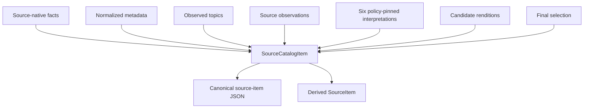
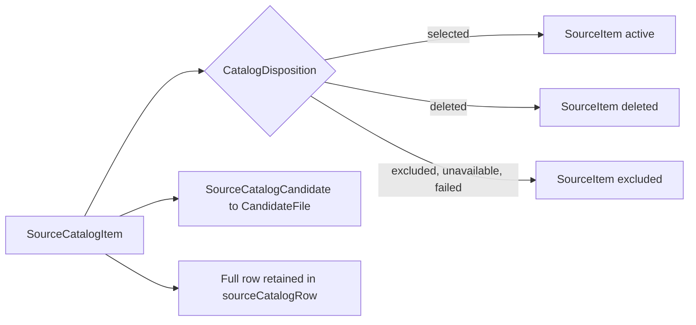
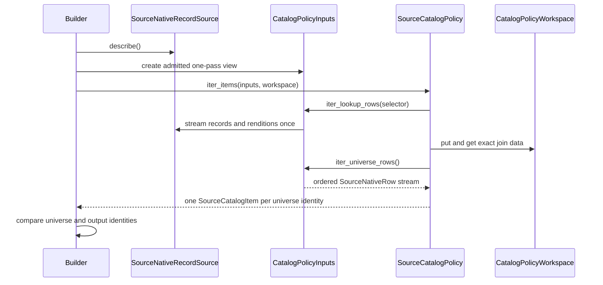
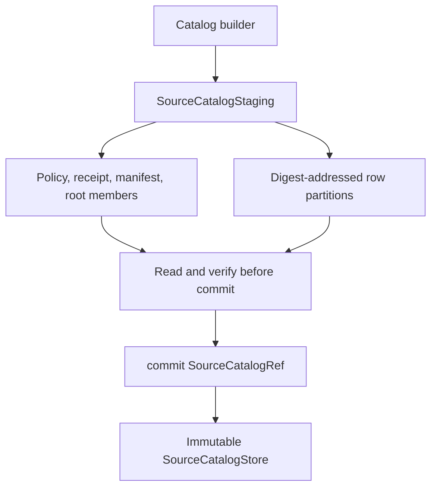
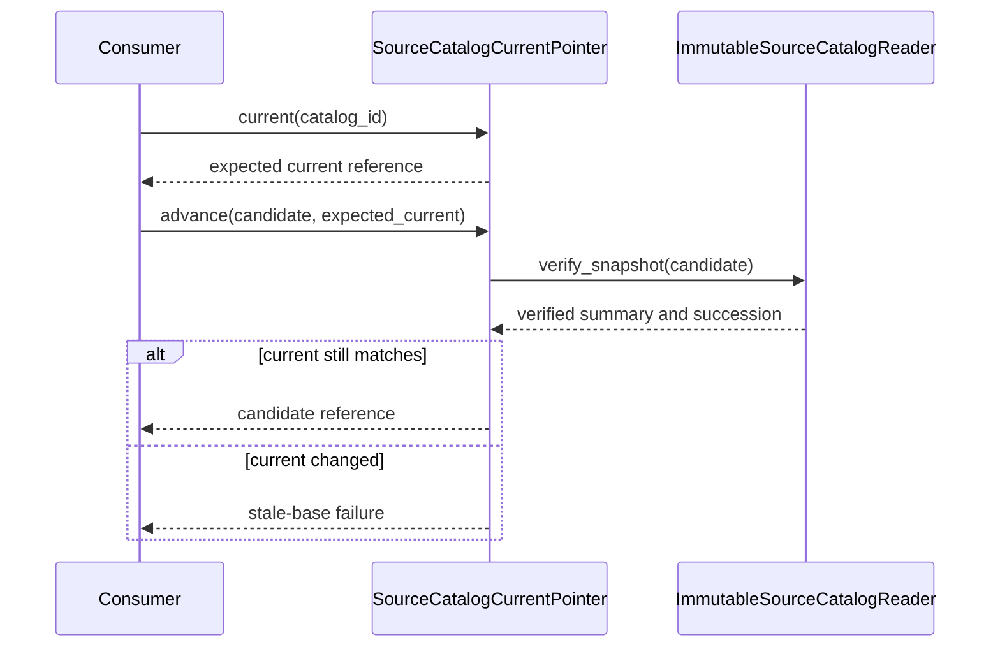

# Source Catalog Pipeline: Model and Ports

The source catalog model defines DocSpec's complete, immutable record of what a source supplied and how DocSpec interpreted it. The ports define the narrow Python interfaces used to admit source-native data, apply a selection policy, store an immutable catalog, read a verified snapshot, and advance a catalog series.

This file covers `src/docspec/domain/source_catalog.py` and `src/docspec/ports/source_catalog.py`. See [Source Catalog Pipeline](source_catalog_pipeline.md) for the full build, verification, storage, and publication flow. The smaller processing model belongs to [Content Acquisition and Processing](content_acquisition_and_processing.md); shared references such as `SourceCatalogRef` belong to [Storage and Shared References](storage_and_shared_references.md).

## Purpose and system role

The model separates two records that serve different needs:

- `SourceCatalogItem` is the normative catalog row. It retains source-native facts, normalized values, observations, interpretation evidence, rendition choices, and the final selection result.
- `SourceItem` is the smaller processing view used by acquisition and extraction. `SourceCatalogItem.to_processing_item()` derives it without replacing or discarding the catalog row.

This separation lets downstream processing use a compact input while audit and verification code retains the evidence needed to reproduce each policy decision.

| Question | Answer |
| --- | --- |
| What goes in? | Already-admitted source-native descriptions, records, and renditions exposed through `SourceNativeRecordSource`. |
| What happens? | A `SourceCatalogPolicy` selects exact row families, may build bounded indexes in a `CatalogPolicyWorkspace`, and emits one `SourceCatalogItem` for every universe row. |
| What comes out? | An immutable catalog reference, a verified `SourceCatalogSnapshotSummary`, and a single-pass stream of located normative rows. |
| How is it checked? | Constructors enforce local invariants; generated JSON Schemas close the persisted shapes; build accounting proves complete universe coverage; artifact admission and full semantic verification check canonical bytes, order, counts, and digests. |

## Architecture overview

The domain model does not import source-producer packages or storage adapters. Ports are `Protocol` interfaces: application and adapter code may satisfy them through structural typing without subclassing a DocSpec base class.

```mermaid
flowchart LR
    Native["Admitted source-native snapshot"] --> Source["SourceNativeRecordSource"]
    Source --> Inputs["CatalogPolicyInputs"]
    Inputs --> Policy["SourceCatalogPolicy"]
    Workspace["CatalogPolicyWorkspace"] <--> Policy
    Policy --> Rows["SourceCatalogItem stream"]
    Rows --> Staging["SourceCatalogStaging"]
    Staging --> Store["SourceCatalogStore"]
    Store --> Reference["SourceCatalogRef"]
    Reference --> Reader["ImmutableSourceCatalogReader"]
    Reader --> Snapshot["SourceCatalogSnapshot"]
    Snapshot --> Normative["Normative SourceCatalogItem"]
    Normative -->|"to_processing_item"| Processing["SourceItem processing view"]
```



The two source files divide responsibility as follows:

| File | Responsibility |
| --- | --- |
| `domain/source_catalog.py` | Defines catalog dispositions, evidence records, the normative row, its processing conversion, and the three installed JSON Schemas. |
| `ports/source_catalog.py` | Defines source input, policy workspace, policy execution, artifact storage, immutable reading, summary, provenance, succession, and current-pointer interfaces. |

## Normative catalog model

### `SourceCatalogItem`

`SourceCatalogItem` is the catalog interchange record. Its serialized form uses camel-case JSON names and contains ten required fields.

| Python field | JSON field | Meaning |
| --- | --- | --- |
| `source_item_id` | `sourceItemId` | Stable identity used to order, partition, and account for the source row. |
| `document_id` | `documentId` | Document identity used when deriving the selected source set. |
| `source_issued_version` | `sourceIssuedVersion` | Policy-selected upstream version marker used for processing identity; policies retain an explicit fallback when the source cannot supply a usable version. |
| `source_native_facts` | `sourceNativeFacts` | One or more pinned source-native fact sets, including scope and source schema identity. |
| `normalized_metadata` | `normalizedMetadata` | Closed, source-independent metadata used across source policies. |
| `source_observed_topics` | `sourceObservedTopics` | Publisher-observed topic identities and labels. |
| `source_observations` | `sourceObservations` | Additional evidence such as field diagnostics and version-selection notes. |
| `interpretations` | `interpretations` | Policy-pinned results for joins, normalization, rendition choice, sampling, selection, and topic recovery. |
| `candidate_renditions` | `candidateRenditions` | Capture candidates selected from the source's offered renditions. |
| `selection` | `selection` | Final disposition and, for every refusal, a machine-readable code and human-readable reason. |

Construction freezes the nested JSON values in facts, metadata, topics, observations, and interpretations. `freeze_json()` rejects floats, non-string object keys, unsupported values, and non-finite numbers; mappings become read-only and sequences become tuples. `to_dict()` returns ordinary mutable JSON-shaped copies for serialization.

`from_dict()` accepts only the ten top-level keys above. It also uses the closed `SourceCatalogCandidate` and `SourceCatalogSelection` readers. Full persisted-row validation remains the JSON Schema and artifact verifier's responsibility; callers should not treat `from_dict()` alone as artifact admission.

The row enforces two cross-field rules directly:

- Candidate rendition IDs must be distinct.
- A row with the `selected` disposition must contain at least one candidate rendition.

### Evidence and decision components

| Component | Responsibility | Main invariants |
| --- | --- | --- |
| `CatalogDisposition` | Names the five final outcomes: `selected`, `excluded`, `deleted`, `unavailable`, and `failed`. | Persisted values come from this closed enumeration. |
| `SourceCatalogCandidate` | Describes one usable rendition and its source URL or immutable-object locator. | Text fields are non-empty; `locator_kind` is `source-url` or `immutable-object`; an optional digest is a qualified SHA-256 value. The JSON Schema also requires an optional byte size to be a non-negative integer. |
| `SourceCatalogSelection` | Records the final disposition. | `selected` has no refusal fields. Every other disposition requires both `reason_code` and `reason`. |
| `CatalogNormalizationField` | Records how one normalized field was obtained. | Source paths are distinct; `value_source` is `source` or `policy`; `outcome` is `normalized`, `absent`, or `unparseable`; unparseable values are distinct and appear only with the `unparseable` outcome. Values are frozen JSON. |
| `CatalogRenditionFamily` | Records one policy-defined candidate family and the rendition IDs it offered. | Family identity is non-empty, and offered rendition IDs are distinct. |
| `CatalogSelectionDecision` | Records one selection check in evaluation order. | A passing decision carries no failure fields. A failing decision names a non-`selected` disposition, reason code, and reason. |

`CatalogNormalizationField`, `CatalogRenditionFamily`, and `CatalogSelectionDecision` serialize into interpretation results. They are helper values rather than additional top-level row fields.

### Required interpretation evidence

The source-item schema requires exactly one interpretation of each kind:

1. `exact-join`
2. `normalization`
3. `rendition-preference`
4. `sampling`
5. `selection`
6. `topic-recovery`

Every interpretation pins `policyId`, `policyVersion`, `policyDigest`, and `inputScopeIds`. The schema closes each result shape. The artifact layer also requires the six entries in the order shown, so a policy must produce both the complete set and the canonical order.



### Closed normalized metadata

The item schema defines the same normalized fields for every source policy:

- `title`
- `agencies`
- `documentType`
- `publicationDate`
- `lastUpdatedDate`
- `docketIds`
- `regulationIdentifierNumbers`
- `commentCloseDate`
- `language`
- `sourceUrl`

Policies may leave nullable fields absent in meaning by using `null` or an empty set where the schema permits it. They must still emit every key. The normalization interpretation explains whether each value was normalized, absent, or unparseable and identifies the source or policy paths used.

### Processing conversion

`to_processing_item()` maps the complete row into the acquisition model without mutating the catalog record.

| Catalog disposition | `SourceItemState` |
| --- | --- |
| `selected` | `active` |
| `deleted` | `deleted` |
| `excluded` | `excluded` |
| `unavailable` | `excluded` |
| `failed` | `excluded` |

Each `SourceCatalogCandidate` becomes a `CandidateFile`: rendition ID becomes candidate ID, locator and media type pass through, and expected digest and size remain attached. The processing metadata contains `documentId`, `normalizedMetadata`, and the full serialized row under `sourceCatalogRow`. See [Content Acquisition and Processing](content_acquisition_and_processing.md) for the lifecycle after this conversion.



## Installed schema family

`source_catalog_schemas()` generates three JSON Schema 2020-12 documents. Their IDs and persisted filenames are part of the installed format.

| Generated file | Schema ID | Scope |
| --- | --- | --- |
| `source-item.schema.json` | `urn:docspec:schema:source-catalog-item:1.0` | Complete normative row, normalized metadata, interpretations, candidates, and selection. |
| `catalog-policy.schema.json` | `urn:docspec:schema:source-catalog-policy:1.0` | Generic policy wrapper: format, version, policy identity, and configuration object. Each installed policy must close and validate its own configuration. |
| `catalog-build-receipt.schema.json` | `urn:docspec:schema:source-catalog-build-receipt:1.0` | Catalog identity, input pins, set and state digests, counts, partitions, join coverage, diagnostic digests, byte measurements, verifier identity, and passing semantic verdict. |

The generated schemas are the source of truth. `tests/test_package_boundary.py` requires the checked-in files under `src/docspec/schemas/source_catalog/1.0/` to equal the generated canonical JSON byte-for-byte. A schema change therefore requires a coordinated model, generated-file, verifier, fixture, and compatibility update.

`SOURCE_CATALOG_MAX_JOIN_IDS` limits receipt-level join coverage to 256 distinct join identities. The bound prevents row-authored join names from creating unbounded summary state.

## Source and policy ports

### Source-native admission

`SourceNativeDescription` pins one admitted input before policy evaluation:

- Artifact identity: `logical_id` and `artifact_digest`
- Producer identity: `source_system_id` and `source_system_version`
- Completeness statement: `source_state_scope`, either `complete-snapshot` or `observed-crawl`
- Content state: `source_state_digest`
- Source schema family: `source_native_schema_set_digest`

`SourceNativeRecordSource` exposes that description plus two streams: records and renditions. The interface uses `Mapping[str, Any]` deliberately, so core DocSpec code does not import producer-owned types.

The artifact builder closes the otherwise structural mapping boundary. An adapter must supply:

- Records with exactly `sourceRecordId`, `scopeId`, `schemaName`, `schemaVersion`, `schemaDigest`, `record`, and `fieldDiagnostics`.
- Renditions with exactly `sourceRecordId`, `renditionId`, `sourceField`, `locator`, `mediaType`, `expectedSha256`, and `expectedByteSize`.
- Records in strict `sourceRecordId` order.
- Renditions in strict `(sourceRecordId, renditionId)` order, with every rendition matched to a record.

Per-record rendition count and byte limits are enforced by the builder. Keep producer-specific parsing and admission in an outer adapter; expose only admitted neutral mappings here.

### Selecting universe and lookup rows

`SourceInputSelector` selects one exact row family through five values: source system ID, source system version, scope ID, schema name, and schema version. Its JSON form is closed, so adding a selector field changes persisted policy configuration and requires versioning.

`SourceNativeRow` groups an admitted record with its matching renditions and the description of the artifact that supplied it.

`CatalogPolicyInputs` provides builder-owned access to selected rows:

- `descriptions` reports all admitted input pins.
- `iter_universe_rows()` yields the population the policy must account for.
- `iter_lookup_rows(selector)` yields supporting rows used for exact joins or enrichment without adding them to the requested universe.

The concrete builder treats these streams as one-pass. It refuses a second open, requires complete consumption of every opened selector, merges multiple universe selectors into one distinct ordered stream, and compares universe identities with emitted row identities at the end.

### Bounded policy workspace

`CatalogPolicyWorkspace` gives a policy three operations:

- `put(namespace, key, value)` stores one JSON mapping under a tuple key.
- `get(namespace, key)` performs an exact lookup.
- `iter_ordered(namespace)` streams values in key order.

The workspace lets policies perform joins, sampling, and stable ordering without holding a corpus-sized dictionary in memory. Namespaces are policy-private. Keys should encode stable source identities and deterministic ordering inputs. Code should treat stored values as append-only because the interface provides no update or delete operation.

### Policy execution

`SourceCatalogPolicy` supplies:

- Stable `policy_id` and `policy_version` values
- JSON-shaped `configuration`
- One or more `universe_inputs`
- `iter_items(inputs, workspace)`, which yields normative catalog rows

The builder computes the policy digest from the installed wrapper and verifies that every row's interpretations carry that exact policy pin. It also requires a one-for-one identity match between the requested universe and the policy output.



## Storage ports

The storage ports separate small artifact members from content-addressed row payloads.

| Port or value | Responsibility |
| --- | --- |
| `SourceCatalogMemberSource` | Lists artifact member keys and opens one member by object key. |
| `SourceCatalogBlobSource` | Opens one immutable payload by qualified content digest. |
| `SourceCatalogBlobWrite` | Reports the verified blob reference, byte size, and whether the store reused existing bytes. |
| `SourceCatalogStaging` | Provides an unpublished transaction that can write members, put content-addressed blobs, read staged content, and commit a `SourceCatalogRef`. |
| `SourceCatalogStore` | Opens isolated staging transactions and resolves published roots and blob content. |

Making staging readable allows the producer's verifier to inspect the exact bytes before `commit()`. Store implementations must treat a committed reference and its digest-addressed blobs as immutable. Detailed reference and blob semantics live in [Storage and Shared References](storage_and_shared_references.md).



## Snapshot and publication ports

### Verified snapshot values

`SourceCatalogSnapshotSummary` exposes compact evidence about a verified root. It validates and freezes the nested mapping fields in `__post_init__()`.

| Evidence group | Fields and checks |
| --- | --- |
| Artifact and series identity | `logical_id`, `artifact_digest`, and `catalog_id` are non-empty or valid SHA-256 values as appropriate. |
| Complete and selected sets | `catalog_state_digest`, `requested_universe_set_digest`, and `selected_source_set_digest` are qualified SHA-256 values. |
| Population | `item_count` and disposition counts are non-negative; disposition counts sum to the item count. |
| Policy pins | Selection policy has exactly ID, version, and digest. Partition policy adds a bucket count from 1 through 65,536. |
| Join coverage | Join IDs are distinct and bounded; counts are non-negative; `eligible = matched + unmatched`; eligible plus null results cannot exceed the catalog population. |
| Diagnostics | The summary requires all six diagnostic digests for normalized fields, joined fields, dispositions, reasons, interpretations, and rendition choices. |
| Input pins | At least one distinct `(logicalId, artifactDigest)` source-native pin is required. |
| Byte accounting | Read, reused, written, and publication byte counts are non-negative; payload bytes read equal reused plus written bytes. |
| Succession | Optional `SourceCatalogSuccession` names the predecessor logical ID, artifact digest, and non-empty reason. |

`LocatedSourceCatalogItem` pairs one normative row with the exact partition `blob_ref` that supplied it. This provenance lets consumers retain the immutable payload identity without reparsing the artifact manifest. The current planner uses the plain `items` view.

`SourceCatalogSnapshot` combines a summary with `located_items`, a single-pass iterator. Its `items` property projects the same iterator to plain `SourceCatalogItem` values. It does not create a copy or rewind the stream. Choose either `located_items` when payload provenance matters or `items` for ordinary processing, and open a new snapshot when a second pass is required.

`ImmutableSourceCatalogReader` defines two operations:

- `open_snapshot(reference)` returns the summary and full row stream.
- `verify_snapshot(reference)` performs full verification and returns only the summary.

The reader implementation decides whether it can safely memoize a verdict for immutable content. Consumers should rely on the port's result, not bypass verification by resolving store paths directly.

### Current catalog series

`SourceCatalogCurrentPointer` addresses the admitted current root for a logical catalog series.

- `current(catalog_id)` returns the current `SourceCatalogRef`, if one exists.
- `advance(catalog_id, candidate, expected_current=...)` performs compare-and-swap style advancement: the candidate may replace only the expected root.

The port makes concurrent state changes explicit. A conforming implementation should fully admit the candidate before changing the pointer and should verify succession evidence when replacing a predecessor. Storage-specific locking and atomic replacement belong to the adapter layer described by the main [Source Catalog Pipeline](source_catalog_pipeline.md) documentation.



## Validation boundaries

Different layers answer different questions. Keep all layers when extending the module.

1. **Value construction:** Dataclass checks reject empty identities, invalid digests, contradictory selection outcomes, duplicate rendition IDs, and invalid join accounting. They also freeze nested evidence trees.
2. **Wire shape:** `source_catalog_schemas()` closes the complete item, policy wrapper, and build receipt shapes.
3. **Build accounting:** The builder enforces source row shapes and order, one-pass selector use, complete universe output, row size limits, partition placement, and canonical serialization.
4. **Artifact admission:** The verifier checks member roles, input pins, schema and policy digests, counts, partition receipts, byte accounting, canonical row order, and installed producer identity.
5. **Semantic verification:** The full gate re-derives state, requested-universe, selected-source, disposition, join, normalization, interpretation, reason, and rendition-choice evidence from stored rows.

A direct constructor or `from_dict()` call proves only the first layer. A consumer that needs an admitted catalog should call `verify_snapshot()` or use an implementation whose `open_snapshot()` performs artifact admission.

## Extension and contribution guidance

### Add or change a catalog policy

1. Give the policy a stable ID and a new version when meaning or configuration changes.
2. Keep configuration JSON-shaped, deterministic, and closed in the policy's own parser.
3. Declare exact `SourceInputSelector` values for every universe family.
4. Use lookup selectors only for supporting evidence; do not let lookup rows silently expand the universe.
5. Consume each selected stream once and completely. Use `CatalogPolicyWorkspace` for corpus-scale joins, sampling, and ordering.
6. Emit exactly one row for every universe identity in strict source-item order.
7. Emit all six interpretation kinds in canonical order and pin each to the installed policy digest and input scopes.
8. Preserve malformed or missing source values in normalization outcomes and observations. Do not convert an unknown value into an unsupported assertion.
9. Provide explicit disposition, reason code, and reason for every non-selected row.

### Implement a source-native adapter

1. Admit and verify the producer artifact before exposing it through `SourceNativeRecordSource`.
2. Return a complete `SourceNativeDescription`; do not infer completeness from the presence of rows.
3. Translate producer values into the exact neutral record and rendition shapes listed above.
4. Sort records and renditions by the required identities and reject duplicates before the builder boundary when practical.
5. Stream data. Avoid materializing an entire release in the adapter.
6. Keep producer imports in the outer adapter, not in the domain or port modules.

### Implement storage or reader ports

1. Make staging isolated and clean it up on success or failure.
2. Verify blob digest and byte size before reporting `SourceCatalogBlobWrite`.
3. Let verification read the staged artifact before publication.
4. Publish without replacing an existing immutable root.
5. Return the exact supplying blob digest in every `LocatedSourceCatalogItem`.
6. Treat snapshot row streams as single-pass and bounded by the verified summary.
7. Admit a current-pointer candidate before atomic advancement and honor `expected_current`.

### Change the model or schema

Treat schema IDs and serialized keys as compatibility boundaries. For a format change:

1. Decide whether the change is backward compatible. If not, mint new format and schema versions.
2. Update dataclass validation, `to_dict()`, `from_dict()`, and `source_catalog_schemas()` together.
3. Update the checked-in schemas under `src/docspec/schemas/source_catalog/` from the generator; do not hand-edit divergent schema copies.
4. Update artifact verification, diagnostic derivation, test fixtures, and downstream processing conversion.
5. Preserve canonical round-trip equality: canonical bytes produced from a row must equal canonical bytes after parse, `from_dict()`, and `to_dict()`.

## Verification checklist

The most relevant tests are:

- `tests/test_source_catalog_snapshot.py`: build and read behavior, one-pass inputs, universe accounting, row round trips, schema gates, digest derivation, and processing conversion.
- `tests/test_package_boundary.py`: generated schema equality and package-boundary rules.
- `tests/test_planner.py`: downstream use of summaries, located rows, and processing views.
- `tests/test_source_catalog_succession.py`: successor evidence and current-pointer behavior.
- Policy-specific tests such as `tests/test_regulations_gov_catalog.py`: normalized fields, joins, sampling, rendition preferences, decisions, and observations.

Run targeted checks from the repository root:

```bash
uv run pytest \
  tests/test_source_catalog_snapshot.py \
  tests/test_package_boundary.py \
  tests/test_planner.py \
  tests/test_source_catalog_succession.py
```

For a schema change, inspect the generated and checked-in schema diff as part of review. For a new policy or source adapter, add failure tests for malformed rows, duplicate identities, partial stream consumption, missing interpretation evidence, unavailable renditions, and every non-selected disposition the policy can emit.
