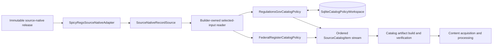
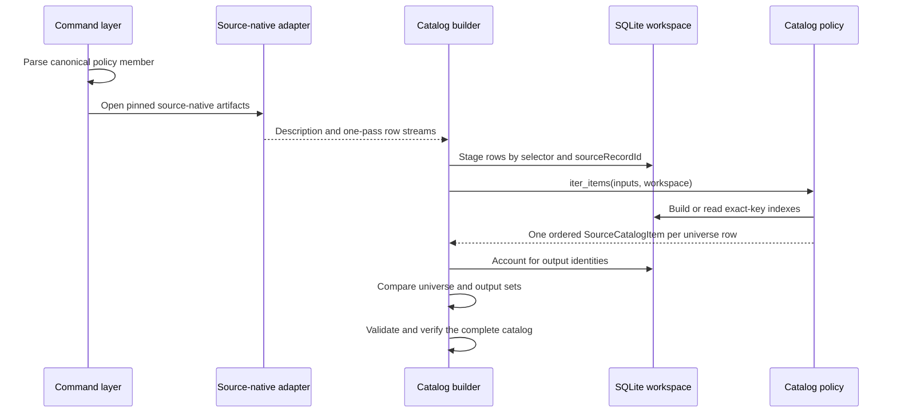
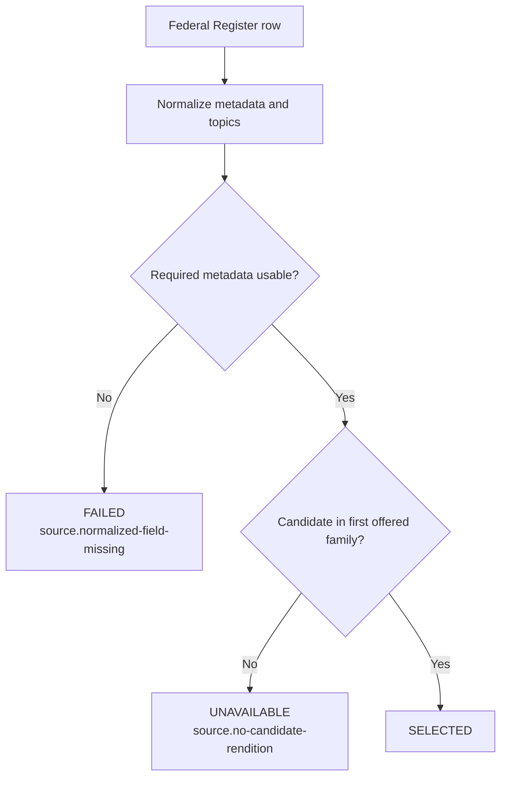
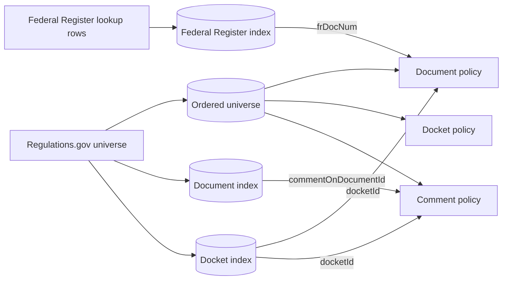
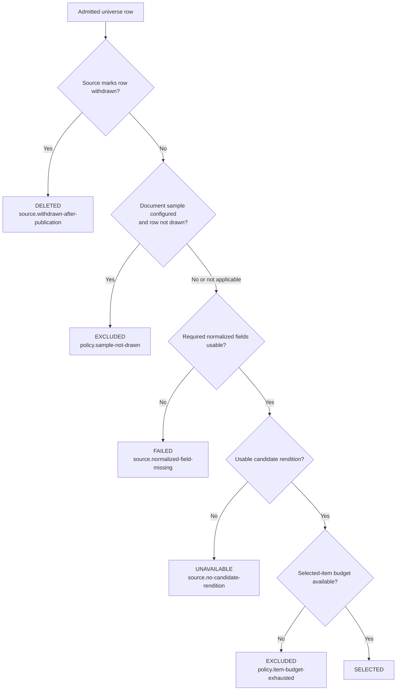

# Source Catalog Pipeline: Policy Execution

The policy execution sub-module turns admitted source-native records into complete, deterministic `SourceCatalogItem` rows. It owns source-specific interpretation: field normalization, exact-key joins, sampling, rendition choice, and the ordered decision that selects or refuses each row. It does not fetch document bytes or publish immutable catalog artifacts.

The catalog row types and the interfaces used here are described in [Source catalog model and ports](source_catalog_pipeline_model_and_ports.md). This page focuses on how the implementations use those types and interfaces.

## Responsibilities and boundaries

| Component | Responsibility |
| --- | --- |
| [`application/catalog_policy.py`](../src/docspec/application/catalog_policy.py) | Provides source-independent normalization, ordering, URL, Regulation Identifier Number (RIN), and observed-topic helpers. |
| [`application/federal_register_catalog.py`](../src/docspec/application/federal_register_catalog.py) | Interprets Federal Register document rows with one source and no lookups or sampling. |
| [`application/regulations_gov_catalog.py`](../src/docspec/application/regulations_gov_catalog.py) | Interprets Regulations.gov documents, dockets, and comments; performs exact joins, optional sampling, and cross-source rendition fallback. |
| [`adapters/catalog_policy_workspace.py`](../src/docspec/adapters/catalog_policy_workspace.py) | Supplies temporary, disk-backed exact-key indexes and deterministic ordered scans for a policy run. |
| [`adapters/spicyregs_source_native.py`](../src/docspec/adapters/spicyregs_source_native.py) | Adapts an installed `spicy-docs` or legacy `spicy-regs` source-native reader to DocSpec's structural source interface. |

The source catalog builder owns input validation, one-pass source access, complete-universe accounting, artifact construction, and publication. The policies receive neutral mappings and emit normative rows. Downstream capture derives the smaller processing view from selected catalog rows; see [Content acquisition and processing](content_acquisition_and_processing.md).



## End-to-end policy flow

A build executes the policy in seven stages:

1. The command layer reads a canonical policy member and selects an installed policy by `policyId`. Each policy's `from_member()` method reconstructs the policy and requires the input member to equal the installed member exactly.
2. `SpicyRegsSourceNativeAdapter` admits each source-native artifact through the selected producer profile and exposes its description, records, and renditions without leaking producer types into DocSpec core.
3. The builder validates and consumes every source stream once. It groups each record and its renditions under a `SourceInputSelector`, then stores the rows in the policy workspace.
4. The policy reads its declared universe once. It may also read separate lookup inputs once and create additional indexes in the same workspace.
5. The policy normalizes source fields, performs exact joins, evaluates sampling and rendition preferences, and records every interpretation under the policy's identifier, version, and digest.
6. The policy emits exactly one `SourceCatalogItem` for every universe `sourceRecordId`, including excluded, deleted, unavailable, and failed rows.
7. The builder compares universe and output identities before it can publish. It then validates, partitions, derives digests from, and verifies the emitted rows.



## Input adaptation

`SpicyRegsSourceNativeAdapter` keeps producer packages outside DocSpec core. The command layer imports this adapter only when an operator builds a catalog; help and catalog verification do not require a producer package.

The adapter resolves producer modules in this order:

1. `spicy_docs.<module>`
2. `spicy_regs.<module>` as a temporary fallback

Fallback occurs only when the preferred package or requested module is absent. A missing transitive dependency inside an installed `spicy-docs` package propagates as an error; the adapter does not hide a broken preferred installation by serving the fallback.

For a reader module, `_require_accepted_reader()` also requires `SUPPORTED_PRODUCER_PRODUCTS` to cover both `spicy-docs` and `spicy-regs`. Resolution order chooses an implementation, but the declared producer set decides whether DocSpec accepts it.

`spicyregs_source_profile()` maps four command choices to producer-owned profiles:

- `federal-register`
- `regulations-gov-documents`
- `regulations-gov-dockets`
- `regulations-gov-comments`

`SpicyRegsSourceNativeAdapter.from_local()` supplies a pinned local member source and blob source to the producer reader. It passes the selected profile, the accepted verifier implementation identifiers, and an expected artifact pin when a logical identifier is available. It always checks the resulting artifact digest against the requested digest.

After admission, DocSpec sees only the `SourceNativeRecordSource` methods:

- `describe()` returns immutable source identity, completeness scope, state digest, and source-native schema-set digest.
- `iter_records()` streams structurally admitted record mappings.
- `iter_renditions()` streams structurally admitted rendition mappings.

The model and validation rules for those values live in [Source catalog model and ports](source_catalog_pipeline_model_and_ports.md).

## Selectors and one-pass access

`SourceInputSelector` identifies one exact row family by five values: source system identifier, source system version, scope identifier, schema name, and schema version. A policy declares its universe selectors through `universe_inputs`; lookup selectors are requested explicitly through `iter_lookup_rows()`.

The builder-owned input reader enforces these rules:

- Each underlying source's record and rendition streams are opened once.
- Each selector is opened at most once and must be consumed fully.
- `iter_universe_rows()` is opened once and merges all declared universe selectors by UTF-16 order of `sourceRecordId`.
- Universe `sourceRecordId` values must be globally distinct.
- A lookup selector must differ from every universe selector.
- Every declared universe input must be read, and every opened selector must reach its end.
- Policy output must contain the same ordered identity set as the requested universe.

These restrictions prevent policies from silently dropping rows, reopening a one-pass source, or treating a partial read as complete. They also explain a key Regulations.gov implementation detail: documents, dockets, and comments are universe members, so the policy indexes document and docket rows while staging the universe. Only Federal Register rows use the separate lookup interface.

## Temporary policy workspace

`SqliteCatalogPolicyWorkspace` keeps corpus-sized indexes off the Python heap. It creates a temporary SQLite database for one policy run and deletes it when the context closes. The database is scratch state, not a recovery log or published artifact.

The workspace stores rows under `(namespace, ordered_key)`:

- A namespace isolates independent indexes.
- A key contains one or more non-empty text parts.
- `_ordered_key()` encodes each part in big-endian UTF-16 with an unambiguous separator. SQLite byte ordering therefore matches the catalog's canonical text and tuple ordering.
- `put()` serializes a mapping as canonical JSON.
- `get()` performs an exact-key lookup.
- `iter_ordered()` parses values in canonical key order.
- Duplicate keys are integrity errors; values cannot replace earlier values.

`put_payload()` and `iter_payloads()` form a narrow performance seam for bytes that a caller already knows are canonical JSON. They preserve the exact payload bytes and the same duplicate-key behavior as `put()`. Policy code should use the checked mapping methods unless it already owns that proof.

The Regulations.gov policy uses separate namespaces for its universe, document and docket indexes, Federal Register lookup index, sampling order, stratum counts, draw results, and per-row sampling details. Namespace separation allows identical keys to serve different purposes without collision.

## Shared normalization rules

The shared helpers convert source values without erasing bad observations. A helper normally returns `(normalized_value, unparseable_values)`. The policy stores the normalized value in `normalizedMetadata` and records the outcome, source paths, value source, and rejected values in a `CatalogNormalizationField` interpretation.

| Helper | Behavior |
| --- | --- |
| `text_value()` | Accepts non-blank strings, preserves their exact text, treats `None` as absent, and reports other values as unparseable. |
| `strings()` | Accepts a list of non-empty strings, removes duplicates, sorts by UTF-16 order, and reports non-string or empty elements. |
| `date_value()` | Uses a valid ISO calendar date from the first ten characters. Federal Register normalization uses this source-shaped rule. |
| `utc_instant_date_value()` | Accepts only a round-tripping, second-precision UTC instant such as `2026-08-24T04:00:00Z`, then returns its calendar date. Regulations.gov uses this stricter rule. |
| `normalized_rins()` | Applies Unicode NFKC normalization, trims, uppercases, validates `####-[A-Z][A-Z0-9]{3}`, removes duplicates, and sorts by UTF-16 order. |
| `http_url()` | Accepts a non-empty HTTP or HTTPS URL with a network location. |
| `normalization_field()` | Marks the field `unparseable`, `normalized`, or `absent` in that precedence and removes duplicate rejected values without changing their first-seen order. |
| `observed_topics()` | Preserves publisher identifiers, schemes, and labels; removes duplicate `(identifier, label)` pairs; and sorts them deterministically. |

Observed topics remain source vocabulary. `observed_topics()` refuses schemes or identifiers beginning with `urn:ref:` or `urn:refspec:` so a publisher value cannot impersonate a RefSpec-owned concept. Unsupported topic shapes are ignored; source-native facts still retain the original source fields.

## Federal Register policy

`FederalRegisterCatalogPolicy` is the simpler implementation. It declares one `federal-register-documents` universe selector, reads every row in order, and does not use lookup rows or policy workspace state.

For each record, the policy:

1. Confirms the source system identifier and requires the source-native `record` payload to be an object.
2. Derives `documentId` from `document_number`, falling back to `sourceRecordId`.
3. Normalizes the ten common metadata fields. The policy supplies `language = "en"`; `lastUpdatedDate` is absent because the source mapping has no field for it.
4. Converts source field diagnostics into ordered source observations.
5. Preserves topics as publisher-observed topics.
6. Evaluates rendition families and then selection.
7. Emits the six required interpretations and the complete catalog row.

The required normalized fields are `title`, `agencies`, `documentType`, `publicationDate`, and `sourceUrl`. A missing required value produces `FAILED` with `source.normalized-field-missing`. If the required values pass but no usable candidate exists, the row becomes `UNAVAILABLE` with `source.no-candidate-rendition`. Otherwise, the row is `SELECTED`.



Rendition families have this fixed preference:

1. `body_html_url`
2. `html_url`
3. `pdf_url`

The policy records every usable offer in every family, but exposes candidates only from the first non-empty family. It accepts HTTP(S) locators and sorts candidates within a family by rendition identifier. The interpretation makes both the offered alternatives and the chosen family reviewable.

Federal Register rows still include all six interpretation kinds. Exact joins contain an empty list, and sampling records an all-items draw. An empty topic list becomes `not-recovered`; it does not claim that the publisher declared an authoritative empty set.

## Regulations.gov policy

`RegulationsGovCatalogPolicy` combines several source-native row families. Documents are required. Dockets and comments are optional universe inputs. Federal Register documents are an optional lookup input and never enlarge the requested universe.

The policy validates selector scope, schema name, and schema version during construction. It also closes and validates the agency-name map, language, source URL template, sample settings, and selected-item limit. `to_member()` serializes these choices, and `from_member()` refuses any value that differs from the installed policy version.

### Staging and exact joins

Before emitting rows, the policy performs this ordered setup:

1. Read the separate Federal Register lookup selector, if configured, into an exact-key index.
2. Read the complete Regulations.gov universe once into global ordered storage.
3. While staging the universe, index document rows and docket rows by `sourceRecordId`.
4. If sampling is configured, compute the complete document sample before selection.
5. Scan the universe in `sourceRecordId` order and emit documents, dockets, and comments through their source-kind handlers.



Joins use exact source identifiers only:

- Documents join to dockets through `data.attributes.docketId`.
- Documents join to Federal Register records through `data.attributes.frDocNum`.
- Comments join to dockets through `data.attributes.docketId`.
- Comments join to documents through `data.attributes.commentOnDocumentId`.
- Dockets perform no joins.

Each join records `matched`, `no-match`, or `not-stated`, plus the source field, source value, lookup scope, and matched record identifier. A miss does not by itself exclude a row. For example, a document can remain selected without a matching docket; its interpretation and catalog receipt expose the miss. A returned row whose identifier differs from the requested exact key stops the build.

### Source-kind behavior

| Source kind | Required normalized fields | Joined facts | Rendition order | Other behavior |
| --- | --- | --- | --- | --- |
| Document | `title`, `agencies`, `documentType`, `publicationDate`, `sourceUrl` | Docket and Federal Register, when exact matches exist | Regulations.gov files, then Federal Register files | Participates in optional stratified sampling; preserves observed topics. |
| Docket | `title`, `agencies`, `lastUpdatedDate`, `sourceUrl` | None | Source record | Uses its own identifier as `documentId` and as the sole docket identifier. |
| Comment | `agencies`, `documentType`, `publicationDate`, `sourceUrl` | Docket and document, when exact matches exist | Regulations.gov files, then source record | Title is optional; preserves an explicit observation for issued-version choice. |

Agency normalization maps the source `agencyId` through the configured agency-name table. Unknown agencies remain visible as unparseable normalization values and may make a required `agencies` field fail.

Document RINs combine values from `additionalRins`, the matched docket's `rin`, and the matched Federal Register record's `regulation_id_numbers`. Comment RINs come from the matched docket. The normalization interpretation identifies every possible source path, so consumers can distinguish source values from policy-supplied values.

When a Regulations.gov row omits its API self link, the policy can construct the normalized `sourceUrl` from its configured templates. A malformed non-null link remains unparseable instead of being silently replaced. Rendition selection uses actual supplied links and rendition records, not the normalized display fallback.

For issued versions:

- Documents use non-empty `modifyDate`, then non-empty `postedDate`, then `"unknown"`. A row that lacks the required normalized publication date cannot become selected.
- Dockets use non-empty `modifyDate`, then `"unknown"`. A missing required `lastUpdatedDate` prevents selection.
- Comments use non-empty `modifyDate`. When it is exactly `None`, they require a non-empty `postedDate` fallback and record the reason and exact source value as a source observation. A malformed non-null `modifyDate` or a missing fallback is an integrity error.

### Deterministic document sampling

`RegulationsGovSamplePolicy` optionally draws documents before metadata and rendition selection. Dockets and comments remain in the all-items frame.

The sample algorithm:

1. Removes withdrawn documents from the sample frame.
2. Partitions documents by normalized `documentType`, using `unknown` when absent.
3. Forms strata within each partition from `agencyId` and publication year, again using `unknown` when absent.
4. Orders each stratum by `md5("{sourceItemId}:{seed}")`, with the document identifier as a deterministic tie-breaker. MD5 supplies a stable order only; the code does not use it for security.
5. Assigns a one-based rank and records the stratum size.
6. Scores each row as `rank / sqrt(stratumSize)` and retains the lowest scores up to `perPartitionLimit` within each document-type partition.

Every document records its partition, stratum, order hash, rank, stratum size, limit, and draw result. Undrawn rows remain in the catalog as `EXCLUDED` with `policy.sample-not-drawn`; the policy never drops them from the universe.

### Rendition preference

Documents prefer Regulations.gov file renditions and use file renditions from an exact Federal Register match only as fallback. Comments prefer their file renditions and then their source-record URL. Dockets use only their source-record URL.

The policy accepts two locator forms:

- An HTTP(S) locator becomes `source-url`.
- A `sha256:` locator becomes `immutable-object` only when `expectedSha256` equals the locator and `expectedByteSize` is a supplied non-negative integer.

An immutable locator with a mismatched digest or missing size stops the build. A rendition with a null locator is not an offer. Candidates are deduplicated by locator where the source-kind helper combines offers, sorted by rendition identifier within each family, and prefixed with `regulations-gov/` or `federal-register/` to keep identities distinct.

As in the Federal Register policy, only candidates from the first non-empty family become the row's candidate list. The rendition interpretation retains every family's offered identifiers and the selected family.

### Selection order

The Regulations.gov policy evaluates applicable decisions in this order and stops at the first failure:



The selected-item limit counts selected documents, dockets, and comments together in global `sourceRecordId` order. It runs after withdrawal, sampling, required metadata, and candidate checks, so bad or unavailable rows do not consume the budget. The interpretation contains the decisions actually reached; later decisions are absent after a failure. Source-kind or configuration-specific stages may also be absent when they do not apply.

## Policy outputs

Every emitted row preserves the source-native facts that support it, the normalized metadata, source observations, observed topics, candidate renditions, and final selection. See [Source catalog model and ports](source_catalog_pipeline_model_and_ports.md) for field-level invariants and serialization.

Each policy emits exactly one interpretation of each kind in this order:

1. `exact-join`
2. `normalization`
3. `rendition-preference`
4. `sampling`
5. `selection`
6. `topic-recovery`

Every interpretation repeats `policyId`, `policyVersion`, `policyDigest`, and `inputScopeIds`. This pin lets verification tie a row's derived values and decisions to the exact serialized policy member. The artifact builder rejects a row whose interpretation pin differs from the installed policy or whose interpretation order differs from the fixed artifact rule.

## Failure behavior

Policy execution separates source quality outcomes from integrity failures.

### Row outcomes that preserve the build

- Missing or unparseable required metadata produces `FAILED`.
- No usable candidate after metadata passes produces `UNAVAILABLE`.
- Source withdrawal produces `DELETED` and removes candidate renditions.
- Sampling or the selected-item limit produces `EXCLUDED`.
- Malformed optional values remain in normalization diagnostics and do not necessarily prevent selection.
- An exact-key join miss remains a `no-match` or `not-stated` interpretation unless another rule refuses the row.
- Missing document or docket dates can use `"unknown"` as the issued-version placeholder only when the row's selection already prevents that placeholder from reaching processing.

These outcomes allow one bad row to remain reviewable without aborting neighboring rows.

### Integrity failures that stop the build

- A source or selector names an undeclared system, scope, schema, or version.
- A source-native record or rendition violates its closed shape, identity, ordering, count, or size limits.
- Two inputs repeat a `sourceRecordId`, or a policy emits duplicate, out-of-order, missing, or extra universe identities.
- A policy reopens a selector, reads a universe selector as a lookup, or fails to consume an opened selector.
- A workspace key is replaced.
- A join index returns a row for a different exact key.
- A content-addressed rendition disagrees with its declared digest or byte size.
- A publisher topic claims a RefSpec-reserved identifier namespace.
- A policy member differs from the installed policy configuration or version.
- The preferred producer package is broken, the reader omits required producer support, or the admitted artifact digest differs from the requested digest.

The surrounding staging transaction prevents these failures from publishing a partial catalog.

## Contribution guidance

### Change the narrowest owner

- Put source-independent parsing and normalization in `catalog_policy.py` only when both policies can use the same rule without source knowledge.
- Keep source field paths, required-field choices, join keys, rendition families, sampling, and decision order in the source-specific policy.
- Use `CatalogPolicyWorkspace` for corpus-sized indexes or ordered frames. Do not collect the whole source in an in-memory list or dictionary.
- Keep producer imports in `spicyregs_source_native.py` or another outer adapter. Application and domain modules should depend only on DocSpec types and interfaces.

### Preserve evidence and determinism

- Retain raw source-native facts even when normalization succeeds.
- Record absent and unparseable outcomes instead of guessing a value.
- Join only on declared exact keys; preserve `no-match` and `not-stated` separately.
- Use UTF-16 ordering helpers for identifiers, mappings, candidates, and observations that enter catalog identity.
- Keep normalization fields and interpretation kinds in their declared order.
- Keep decision identifiers, failure dispositions, and reason codes stable unless the policy version changes deliberately.
- Ensure every universe row emits one catalog row, including refusals.

### Treat the policy member as executable evidence

A semantic policy change must be visible in `configuration`, `policyVersion`, or both, so the canonical member and `policyDigest` identify the new behavior. Update `to_member()` and the closed `from_member()` validation together. Keep the runtime implementation aligned with serialized lists such as normalization fields, joins, source-kind rendition order, sampling method, and selection failures.

When adding a join, use a stable policy-owned `joinId`, record its source field and lookup scope, cover all three outcomes, and remember that artifact verification bounds the number of distinct join identifiers. When adding a source kind, declare its universe selector, required fields, issued-version rule, rendition families, topic behavior, and complete decision path.

## Testing guidance

Run the focused tests from the repository root:

```bash
uv run pytest tests/test_catalog_policy.py tests/test_catalog_policy_workspace.py tests/test_spicyregs_source_native.py
uv run pytest tests/test_regulations_gov_catalog.py
uv run pytest tests/test_source_catalog_snapshot.py
uv run pytest tests/test_source_catalog_installed_wheel.py
uv run ruff check .
```

The focused suites cover different risks:

- `test_catalog_policy.py` pins reserved topic namespaces and shared helper behavior.
- `test_catalog_policy_workspace.py` pins exact lookups, namespace isolation, UTF-16 tuple ordering, duplicate refusal, and exact payload streaming.
- `test_spicyregs_source_native.py` pins preferred and fallback module resolution, producer-set checks, profile resolution, and propagation of broken imports.
- `test_regulations_gov_catalog.py` pins joins, source-kind behavior, strict dates, deterministic sampling, selection order, budget behavior, immutable locators, and policy-member round trips.
- `test_source_catalog_snapshot.py` supplies Federal Register policy coverage and proves one-pass inputs, complete-universe accounting, row-local quality outcomes, rendition preference, topic behavior, and failure-before-publication.
- `test_source_catalog_installed_wheel.py` checks that the public assembly works from installed packages rather than sibling source checkouts.

For each policy change, add at least one successful row and each affected refusal path. Repeat deterministic builds when changing ordering or sampling. Include a neighboring valid row when testing malformed source data, so the test proves that the intended error remains row-local. Include a build-level assertion when testing integrity failures, so the test proves that no partial catalog becomes visible.
