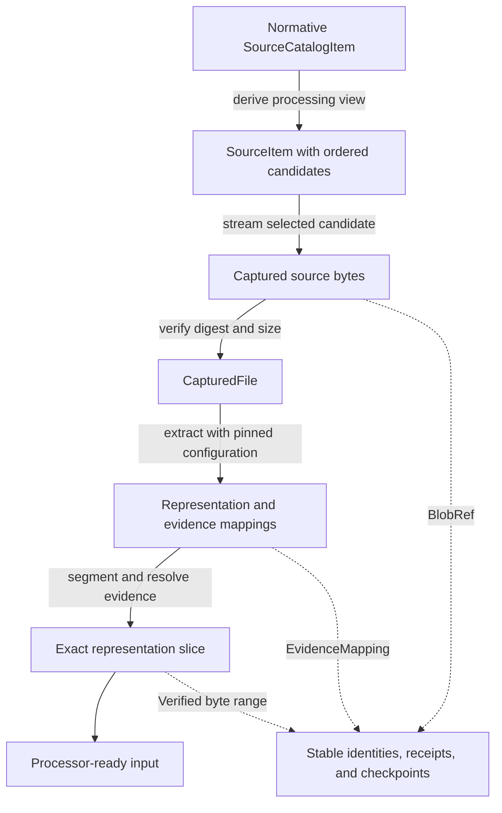

# Source Intake and Document Preparation

## Purpose

This module turns verified source-native releases into reproducible, processor-ready document inputs.

It first builds an immutable source catalog that records every requested source identity, including selected, excluded, deleted, unavailable, and failed items. Selected rows become compact `SourceItem` values. The processing pipeline then captures exact source bytes, derives verified representations, creates source-grounded segments, and records receipts needed for audit and restart.

## Architecture

```mermaid
flowchart LR
    Sources["Verified source-native releases"]

    subgraph Catalog["Source Catalog Pipeline"]
        Adapter["Source-native adapter"]
        Builder["SourceCatalogBuilder"]
        Policy["Pinned SourceCatalogPolicy"]
        Gate["Structural and semantic verification"]
        Store[("Immutable catalog store")]
        Reader["SourceCatalogArtifactReader"]
    end

    subgraph Preparation["Content Acquisition and Processing"]
        Item["SourceItem"]
        Fetch["ContentFetcher"]
        Blobs[("Content-addressed blob store")]
        Capture["CapturedFile"]
        Extract["Extractor"]
        Representation["Representation"]
        Segmenter["Segmenter"]
        Segments["Verified Segment values"]
    end

    Sources --> Adapter --> Builder
    Policy --> Builder
    Builder --> Gate --> Store --> Reader
    Reader -->|"SourceCatalogItem.to_processing_item()"| Item
    Item --> Fetch
    Fetch --> Blobs
    Fetch --> Capture
    Capture --> Extract
    Blobs --> Extract
    Extract --> Representation --> Segmenter --> Segments
    Segments --> Governed["Governed processing and qualification"]
    Governed --> Release["Document release lifecycle"]
```

The catalog and preparation stages form a continuous evidence chain:

The module preserves complete catalog accounting, exact captured bytes, deterministic identities, reversible evidence, bounded work, and independently verifiable checkpoints.

## Core component documentation

| Component | Documentation |
| --- | --- |
| Catalog construction, policy execution, immutable publication, reading, and verification | [Source Catalog Pipeline](source_catalog_pipeline.md) |
| Acquisition, extraction, evidence mapping, segmentation, processing payloads, and receipts | [Content Acquisition and Processing](content_acquisition_and_processing.md) |