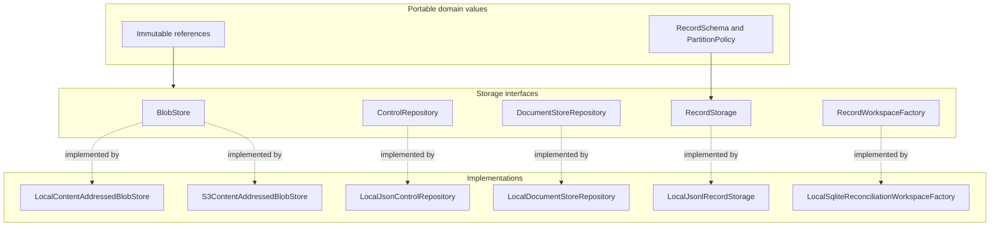
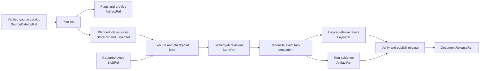
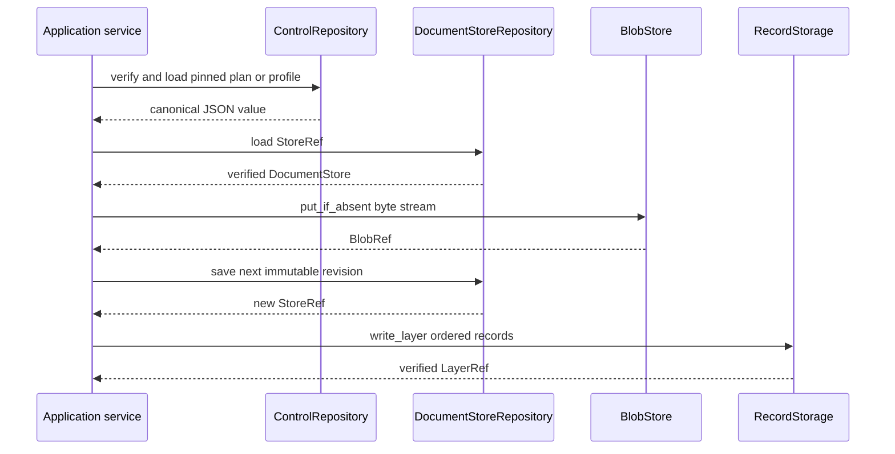
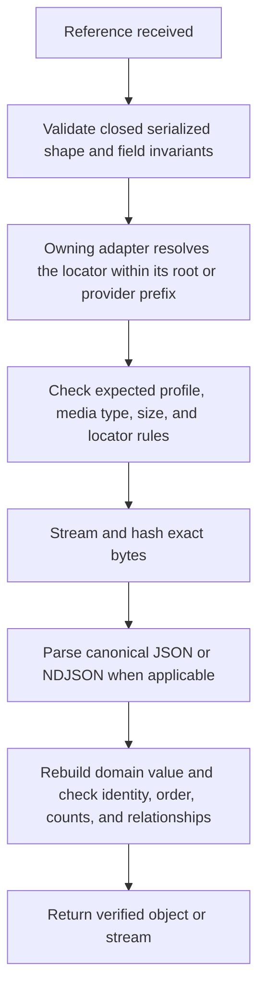

# Storage and Shared References

Storage and shared references give DocSpec a portable way to name immutable bytes, control artifacts, job revisions, logical record layers, source catalogs, and document releases. Application services pass these small values instead of copying large payloads or exposing filesystem and cloud-provider objects.

The module also defines the storage interfaces used by planning, execution, delivery, reconciliation, release publication, and maintenance. Local adapters provide the standalone profile. An S3-compatible adapter can replace local blob storage without changing the domain or application code.

## Purpose and system role

| Question | Answer |
| --- | --- |
| What goes in? | Byte streams, small JSON values, `DocumentStore` revisions, ordered logical records, schemas, partition policies, and previously issued references. |
| What happens? | An adapter writes immutable state, derives or checks SHA-256 identities, enforces size and path limits, and returns a small reference. Readers reopen the state through the same port and verify it before use. |
| What comes out? | `ArtifactRef`, `BlobRef`, `StoreRef`, `LayerRef`, `SourceCatalogRef`, and `DocumentReleaseRef` values plus verified domain objects or record streams. |
| How is it checked? | Closed JSON shapes, canonical serialization, digest and byte-count checks, content-derived locators, strict record schemas, stable partition assignment, ordered-stream checks, write-once publication, and bounded reads. |

This module owns persistence mechanics and the small values that cross process boundaries. It does not decide which sources enter a run, how a document is processed, whether a run is complete, or whether a release may become current. The neighboring domain and application modules make those decisions and use these storage interfaces to preserve their evidence.

## Architecture overview

DocSpec keeps the domain-facing types independent of storage products. Domain objects define portable references and logical record descriptions. Ports state the required behavior. Adapters implement that behavior for a local filesystem, SQLite-backed scratch space, and S3-compatible object storage.



The dependency direction matters. Application code imports ports and domain values. A provider adapter may import an SDK, but no SDK response, exception, path object, file handle, or network body crosses the port.

### Position in the document lifecycle



The arrows carry references, not bulk content. Workers retrieve exact state from the configured stores, then return new references. This keeps scheduler messages small and makes retries checkable.

## Module guide

The module has four focused documentation pages. Each page owns its implementation detail and links back here for system context.

| Sub-module | Responsibility | Detailed documentation |
| --- | --- | --- |
| Reference model | Defines `ArtifactRef`, `BlobRef`, `StoreRef`, `LayerRef`, `SourceCatalogRef`, `DocumentReleaseRef`, `RecordSchema`, `PartitionPolicy`, strict serialized shapes, and stable bucket assignment. | [Reference Model](storage_and_shared_references_reference_model.md) |
| Blob storage | Defines `BlobStore` and the local and S3-compatible content-addressed adapters, including streaming, conditional creation, range reads, materialization, provider differences, and byte verification. | [Blob Storage](storage_and_shared_references_blob_storage.md) |
| Control artifacts and document stores | Defines `ControlRepository`, `DocumentStoreRepository`, canonical control artifacts, immutable job revisions, large-entry members, revision discovery, and the sealed planned-store ledger. | [Control Artifacts and Document Stores](storage_and_shared_references_control_and_document_stores.md) |
| Record layers and workspaces | Defines `RecordStorage`, immutable partitioned layers, full and incremental writes, bounded merge, lookup, verification, and the disposable `RecordWorkspace` used by coordinators. | [Record Layers](storage_and_shared_references_record_layers.md) |

## Shared design rules

### References name state; repositories prove it

Constructing a reference validates its required text, SHA-256 syntax, and non-negative counters. Construction does not prove that the target exists or that its bytes match. The repository or store that owns the locator must reopen and verify the state before application code trusts it.

Each reference therefore combines two kinds of information:

- logical identity, such as a catalog, release, store, layer, or artifact identifier;
- a physical locator plus enough immutable evidence to verify the stored state.

`BlobRef` and `ArtifactRef` also carry media type and byte size. `StoreRef` carries the revision. `LayerRef` carries the layer kind, schema, storage profile, root locator, and record count. See the reference-model page in the module guide for exact fields and serialization rules.

### Durable state is immutable

The local adapters create a new file or directory and refuse conflicting content at an existing immutable locator. Content-addressed members may be reused only after verification. A mutable pointer, such as a catalog's current release, sits outside these repositories and uses its own compare-and-swap or operator-controlled publication path.

This rule supports safe retries: the same input may converge on the same object, but a different value cannot replace an existing immutable object under the same identity.

### Canonical bytes make identities reproducible

Small JSON artifacts and job revisions use canonical JSON file bytes. Record members use one canonical JSON object per newline-delimited JSON (NDJSON) line. Hashes cover exact stored bytes or an explicitly ordered sequence. Callers must preserve the documented order when a digest represents a sequence rather than a mathematical set.

### Logical records are separate from physical files

`RecordSchema` defines a closed set of fields plus identity and partition fields. `PartitionPolicy` fixes the bucket count and gives the policy a stable name. `RecordStorage` exposes logical writes, streams, lookups, and incremental partition replacement; `LocalJsonlRecordStorage` decides how those records become root manifests and content-addressed NDJSON members.

The separation permits a future adapter to use another physical format if it preserves the port's ordering, verification, schema, partition, and replacement behavior.

### Scratch storage is disposable

`RecordWorkspace` spools records for one coordinator operation. Planning, reconciliation, and retention-set construction use it to bound memory and enforce deterministic ordering. No workspace path becomes a durable reference, and a failed operation can discard the workspace and rebuild it from durable inputs.

### Limits are part of safe operation

The adapters bound blob size, artifact size, revision size, record size, member size, open file count, merge scratch, ledger count, and other resource use. They stream large state and use temporary files or SQLite indexes where an in-memory set would grow with the corpus. A new implementation must preserve these bounds or document and qualify equivalent limits.

## Standalone runtime composition

For this module's ports, the command-line application composes four local durable roots and one SQLite workspace root:

| Runtime root | Default adapter | Stored state |
| --- | --- | --- |
| `blobStorage` | `LocalContentAddressedBlobStore` | Captured and derived immutable byte objects. |
| `controlRepository` | `LocalJsonControlRepository` | Plans, profiles, receipts, handoffs, and other small canonical JSON artifacts. |
| `documentStores` | `LocalDocumentStoreRepository` | Every immutable `DocumentStore` revision and each plan's sealed initial-store population. |
| `recordStorage` | `LocalJsonlRecordStorage` | Partitioned logical layers and their content-addressed NDJSON members. |
| operator-selected scratch root | `LocalSqliteReconciliationWorkspaceFactory` | Temporary planning, reconciliation, and maintenance spools. |

`S3ContentAddressedBlobStore` implements the same `BlobStore` port for Amazon S3, Cloudflare R2, and compatible APIs. The standalone CLI still composes the local blob adapter; another composition root must inject the S3 adapter and persist matching profile evidence.

## Main interaction flows

### Persist and advance a job



Application services own valid state changes. Storage adapters reject corrupted or conflicting state, but they do not decide whether a `PLANNED` job may become `RUNNING` or whether a `RUNNING` job may become `SEALED`; the job model and services enforce those transitions.

### Read through an immutable reference



Different readers perform different depths of validation. `BlobStore.verify()` proves byte identity. `RecordStorage.verify()` also proves the layer root, schema, partitions, ordering, members, and counts. Release verification adds cross-layer and lineage checks that no storage adapter can infer from one object alone.

## Failure and recovery behavior

| Condition | Result |
| --- | --- |
| A digest, byte size, media type, locator, schema, count, or identity differs | The adapter raises an integrity error and returns no trusted object. |
| A write exceeds a configured bound | The adapter raises a limit error and removes temporary state when it owns that state. |
| An immutable locator already contains different bytes | The adapter refuses replacement. Job or publication code must resolve the identity conflict. |
| A local locator escapes its root or traverses a symbolic link | The adapter rejects it before use. |
| Two S3 writers race to create the same blob | Conditional creation selects one winner; the loser verifies the winner's complete metadata and bytes. |
| Temporary spooling or external merge fails | The operation discards scratch state. Previously published immutable members may remain unreferenced; cleanup requires a separate, governed maintenance operation. |
| A planned-store ledger path exists but is invalid | The repository fails closed; it never reports corrupt planning state as absent. |

Provider or filesystem failure does not authorize an application transition. The caller may retry from its last verified reference when the underlying operation is replay-safe.

## Relationships to other modules

- [Source Catalog Pipeline](source_catalog_pipeline.md) owns source selection, catalog construction, publication, and semantic verification. This module defines the `SourceCatalogRef` used to name a snapshot.
- [Content Acquisition and Processing](content_acquisition_and_processing.md) owns fetch, extraction, segmentation, and evidence mapping. It stores exact bytes through `BlobStore` and embeds `BlobRef` values in content records.
- [Processing Plan and Job Model](processing_plan_and_job_model.md) owns `DocumentStore` state and legal transitions. This module persists each revision and the planned population.
- [Portable Task Execution](portable_task_execution.md) explains why scheduler messages contain small references and how workers reopen them.
- [Result Delivery and Reconciliation](result_delivery_and_reconciliation.md) writes delivery and run ledgers through `RecordStorage` and uses disposable record workspaces.
- [Document Run Application: Delivery, Reconciliation, and Release](document_run_application_delivery_and_release.md) coordinates receipt verification and release commit.
- [Document Release Artifacts](document_release_artifacts.md) owns release structure, whole-release verification, and catalog publication.
- [Release Maintenance](release_maintenance.md) owns retention reachability and compaction; storage only supplies verified objects and layers.

## Contribution guide

Choose the change point by responsibility:

| Change | Primary location | Required compatibility work |
| --- | --- | --- |
| Add or revise a portable reference | `domain/references.py` | Version or preserve its closed serialized shape; update every parser, receipt, task, and release that embeds it. |
| Add a logical layer schema or partition rule | `domain/storage.py` and the owning domain module | Define stable identity and partition fields; update writers, readers, semantic verifiers, and incremental-replacement tests. |
| Add a storage provider | A new adapter implementing an existing port | Keep provider objects and exceptions inside the adapter; preserve immutability, verification depth, streaming, limits, and retry behavior. |
| Change a local on-disk format | `adapters/storage.py` | Treat the format and version as persistent data; retain readers for supported versions and add tamper tests. |
| Change coordinator scratch behavior | `ports/record_workspace.py` and a workspace adapter | Preserve deterministic ordering, uniqueness, bounded use, cleanup, and non-authoritative status. |
| Change release publication or current pointers | The document-catalog or source-catalog modules | Keep mutable publication state outside immutable storage and retain stale-base checks. |

Before adding a method to a port, identify every application caller and every implementation. Prefer a narrow method that expresses required behavior over one that exposes a storage product's API.

## Verification

Run focused checks from the repository root:

```bash
uv run pytest \
  tests/test_domain.py \
  tests/test_storage_adapters.py \
  tests/test_storage_records_catalog.py \
  tests/test_s3_blob_adapter.py \
  tests/test_bounded_partitions.py \
  tests/conformance/test_record_storage_contract.py \
  tests/conformance/test_scheduler_portability.py

uv run ruff check \
  src/docspec/domain/references.py \
  src/docspec/domain/storage.py \
  src/docspec/ports/blob_store.py \
  src/docspec/ports/control_repository.py \
  src/docspec/ports/document_store_repository.py \
  src/docspec/ports/record_storage.py \
  src/docspec/ports/record_workspace.py \
  src/docspec/adapters/storage.py \
  src/docspec/adapters/s3_blob.py
```

For a format or provider change, add focused fault cases for truncated bytes, wrong digests, wrong counts, noncanonical JSON, extra fields, escaped paths, symbolic links, limit boundaries, conflicting immutable writes, interrupted reads, and exact retry.
