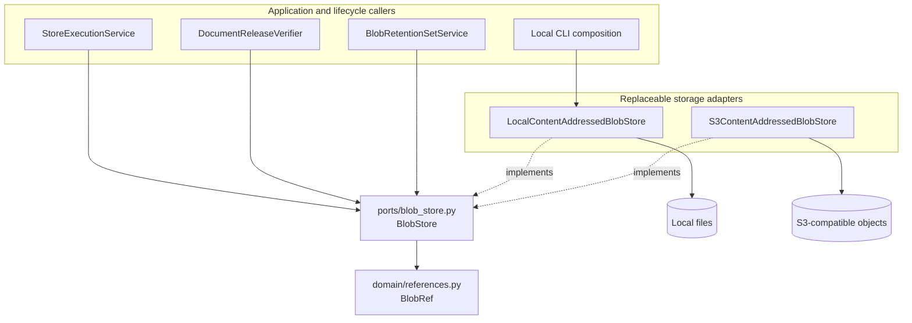
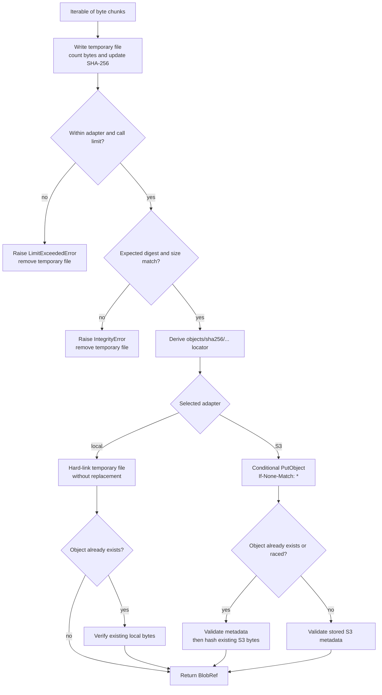
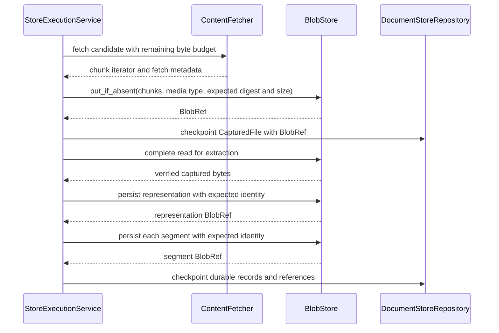

# Storage and Shared References: Blob Storage

Blob storage preserves captured source files and large derived content as immutable, SHA-256-addressed byte objects. Application code writes or reads bytes through the provider-neutral `BlobStore` interface and passes `BlobRef` values across job, receipt, delivery, and release boundaries. This design keeps bulk bytes out of scheduler messages and lets each consumer verify the exact content it uses.

This page covers `BlobRef`, `BlobStore`, `LocalContentAddressedBlobStore`, and `S3ContentAddressedBlobStore`. See [Storage and Shared References](storage_and_shared_references.md) for the complete storage module and [Storage and Shared References: Reference Model](storage_and_shared_references_reference_model.md) for every reference type and serialized field.

## Purpose and system role

| Question | Answer |
| --- | --- |
| What goes in? | An iterable of byte chunks, a non-empty media type, optional expected digest and size, a per-call byte limit, or an existing `BlobRef`. |
| What happens? | The adapter streams the input to temporary storage, enforces its byte limit, computes SHA-256, checks declared expectations, and conditionally publishes the object at a digest-derived locator. Read operations resolve that locator and apply the checks promised by the selected method. |
| What comes out? | A `BlobRef`, a bounded iterator of bytes, an exact half-open byte range, a newly materialized file, or successful verification with no return value. |
| How is it checked? | Closed reference shapes, SHA-256 syntax, digest-derived locators, byte counts, full-stream hashes, provider metadata, contained paths, no-replace creation, and configured size bounds. |

Blob storage owns byte identity and safe persistence. It does not decide which source rendition to acquire, how to extract or segment it, which content a release retains, or when an unreachable object may be deleted. Those decisions belong to [Content Acquisition and Processing](content_acquisition_and_processing.md), [Document Release Artifacts](document_release_artifacts.md), and [Release Maintenance](release_maintenance.md).

## Architecture and dependency direction

Domain and application code depend on `BlobRef` and the `BlobStore` protocol. Provider details stay inside adapters.



`S3ContentAddressedBlobStore` is separate from `AnonymousS3ContentFetcher`. The fetcher reads a source publisher's S3 object as acquisition input. The blob adapter writes DocSpec's own immutable objects after acquisition. A deployment may use either, both, or neither.

## Components and responsibilities

| Component | Location | Responsibility |
| --- | --- | --- |
| `BlobRef` | `src/docspec/domain/references.py` | Carries `locator`, `digest`, `byteSize`, and `mediaType` as a frozen value. `from_dict()` accepts only those four keys. Construction checks required text, SHA-256 syntax, and a non-negative size. |
| `BlobStore` | `src/docspec/ports/blob_store.py` | Defines immutable creation, metadata lookup, streaming reads, range reads, contained materialization, and full verification without naming a provider API. |
| `LocalContentAddressedBlobStore` | `src/docspec/adapters/storage.py` | Implements the port with files rooted under a trusted local directory, hard-link publication, bounded streaming, and symbolic-link refusal. |
| `S3BlobStoreConfig` | `src/docspec/adapters/s3_blob.py` | Sets the S3 single-object limit, transfer chunk size, and optional local staging directory. It caps writes at 5 GiB because the adapter uses one conditional `PutObject` request. |
| `S3ContentAddressedBlobStore` | `src/docspec/adapters/s3_blob.py` | Implements the port for Amazon S3 and APIs with the same client method shapes, including Cloudflare R2. It owns bucket and prefix handling, integrity metadata, conditional creation, streaming-body cleanup, and provider-error normalization. |
| `S3BlobStoreError` | `src/docspec/adapters/s3_blob.py` | Reports S3 setup, stat, read, and write failures without exposing an SDK-specific exception to application code. |

The content-addressed locator has the same form in both adapters:

```text
objects/sha256/{first-two-digest-hex}/{full-digest-hex}
```

An S3 prefix is deployment scope outside the portable locator. For example, prefix `tenant-a` stores a `BlobRef.locator` of `objects/sha256/ab/ab...` at S3 key `tenant-a/objects/sha256/ab/ab...`. The reference remains independent of the bucket and prefix.

## `BlobStore` behavior

| Method | Required behavior | Verification depth |
| --- | --- | --- |
| `put_if_absent()` | Consume byte chunks, enforce the effective maximum, calculate SHA-256 and size, check optional expectations, create the digest-addressed object without replacement, and return `BlobRef`. | Both adapters hash the supplied bytes before publication. Reuse of an existing object requires adapter-specific checks described below. |
| `stat()` | Confirm that the referenced object exists and return the same reference. | Local storage performs full verification. S3 checks the canonical locator plus `ContentLength`, `ContentType`, and DocSpec digest and size metadata with `HeadObject`; it does not download and hash the bytes. |
| `read()` | Yield bounded chunks and enforce an optional read limit against the declared size. | Both adapters count and hash the complete stream. The final digest check runs only when the caller consumes the iterator to completion. |
| `read_range()` | Return `[start, end)` and reject a range outside `[0, byte_size]`. | Local storage fully verifies the object before reading the range. S3 validates stored metadata and the range response's size and `ContentRange`; a range alone cannot prove the full-object digest. |
| `materialize()` | Write a verified object below a caller-supplied root without replacing an existing file. | Local storage verifies before writing and hashes again through `read()`. S3 materialization uses a complete, hashed `read()`. Both remove a partial destination after a failed copy. |
| `verify()` | Prove that the locator, size, and stored bytes agree with the reference. | Both adapters perform a complete streaming SHA-256 pass. S3 also checks media type and DocSpec metadata before reading. |

Treat `read()` as a verification operation only after normal iterator exhaustion. If a consumer stops early, the adapter closes its file or response body, but it cannot compare the full digest. Call `verify()` first when later logic will consume only a prefix or an S3 range.

## Write and reuse flow

Both adapters calculate identity before publishing. This prevents a caller's expected digest or size from becoming an unchecked assertion.



### Local publication

`LocalContentAddressedBlobStore` writes chunks to `.staging`, flushes and synchronizes the temporary file, then uses a hard link to create the final digest path. The link operation never replaces an existing path. If another writer won the race, the adapter requires a regular file and hashes it against the new reference before returning success. It always removes its temporary file.

### S3 publication

`S3ContentAddressedBlobStore` stages the complete input on local disk, even though its public API accepts a stream. Staging lets it know the digest, size, key, and metadata before it sends the single conditional upload. The adapter first checks for an existing object. If none appears, it sends `PutObject` with `IfNoneMatch="*"`, the supplied media type, and these metadata keys:

| S3 field | Stored value |
| --- | --- |
| `ContentType` | `BlobRef.media_type` |
| `Metadata["docspec-sha256"]` | `BlobRef.digest` |
| `Metadata["docspec-byte-size"]` | Decimal `BlobRef.byte_size` |

A precondition or conflict response can mean another writer published the same key. The adapter accepts that race only after `HeadObject` matches all declared metadata and `verify()` hashes the complete object. Other SDK failures become `S3BlobStoreError` values.

After a new upload succeeds, the adapter validates its `HeadObject` response. It has already hashed the staged source bytes, but it does not immediately download the new object. A later `verify()` or complete `read()` supplies an independent stored-byte check.

## Local and S3 behavior

| Area | Local adapter | S3 adapter |
| --- | --- | --- |
| Durable location | Trusted filesystem root. | Injected S3 client, bucket, and optional relative prefix. |
| Publication primitive | No-replace hard link from a synchronized temporary file. | One `PutObject` request with `If-None-Match: *`. |
| Class default maximum | 8 GiB. The current local profile supplies 10 GiB to the standalone run composition. | 5 GiB, enforced as the maximum supported single-request upload. |
| Default transfer chunk | 1 MiB. | 1 MiB. |
| Temporary space | `.staging` below the blob root. | System temporary storage or `S3BlobStoreConfig.staging_directory`. |
| Stored integrity information | Path encodes SHA-256; file length and bytes provide size and digest evidence. | Key encodes SHA-256; object metadata records digest and size; `ContentType` records media type. |
| Media-type check | The local object contains no media-type metadata. The returned reference carries the caller's assertion. | `stat()`, `read()`, and `verify()` require `ContentType` to match the reference. |
| `stat()` cost | Reads and hashes the complete file. | Sends `HeadObject` and checks metadata. |
| Range-read cost | Hashes the complete file, then seeks and reads the range. | Sends `HeadObject`, then a ranged `GetObject`; it does not hash the complete object. |
| Dependencies | Python standard library. | Injected boto3-shaped client; `from_boto3()` lazily imports the optional `docspec[s3]` dependency. |
| Error boundary | DocSpec validation, limit, integrity, state, and operating-system errors. | DocSpec validation, limit, and integrity errors; the adapter translates its main provider-operation failures into `S3BlobStoreError`. |
| Current CLI integration | The standalone run, blob verification command, and garbage-collection inventory use this adapter. | No standalone CLI composition currently selects this adapter. A custom composition must inject it. |

Identical bytes always have the same locator. Media type is not part of that locator. The local adapter can therefore return the same object under different caller-supplied media types because it has no durable media-type record. S3 rejects such reuse when the existing object's `ContentType` differs. Retention construction also rejects conflicting metadata for one profile root and locator. Contributors must preserve one canonical media type for a given byte object or define an explicit compatibility change.

## Integrity, limits, and path safety

### Reference and byte identity

- `BlobRef.from_dict()` rejects missing or extra fields. See the [reference model](storage_and_shared_references_reference_model.md) for the wire shape.
- Every adapter derives the locator from `digest`; callers cannot point a valid digest at an arbitrary path or key.
- `put_if_absent()` rejects non-`bytes` chunks. It compares optional `expected_digest` and `expected_size` before durable publication.
- `verify()` requires the declared byte size and a full SHA-256 match. S3 also requires matching media type, digest metadata, and size metadata.
- A repeated write is idempotent only when the existing immutable object passes the adapter's checks. Different bytes at the same locator cause an integrity failure.

### Bounded work

The effective write limit is the smaller of the adapter's configured maximum and `put_if_absent(max_bytes=...)`. `StoreExecutionService` passes the remaining source-byte budget during capture and the plan's memory bound when persisting representations and segments. `read(max_bytes=...)` refuses an object whose declared size already exceeds the call limit.

The S3 adapter's staging requirement makes local disk capacity part of S3 operation. A process needs room for one complete object up to `max_blob_bytes`. The adapter flushes and synchronizes the temporary file, then removes it after success or failure. It does not implement multipart upload, so `S3BlobStoreConfig` refuses a maximum above 5 GiB.

### Local path containment

The local adapter rejects a symbolic-link storage root. It accepts only contained relative locators, rejects symbolic links in locator parents or at the object path, and requires regular files during verification. `materialize()` applies the same containment rules to its destination root and creates the destination with exclusive mode `0600`. It refuses `..` traversal, symbolic-link traversal, and replacement of an existing file.

### S3 key and materialization containment

The S3 adapter strips leading and trailing slashes from its prefix, then requires a contained forward-slash relative path. It rejects backslashes and traversal such as `../`. Portable locators pass the same relative-path check before key construction. S3 materialization independently checks the local destination root, every parent, and the final path for symbolic links and creates the file without replacement.

## System interactions

### Acquisition, extraction, and segmentation

`StoreExecutionService` is the main write caller. It streams fetched source bytes directly into `put_if_absent()`, supplies source-catalog digest and size expectations when present, and records the resulting `BlobRef` in `CapturedFile`. It later persists representation and segment payloads with their already-computed digest and size as required expectations.



Checkpoint recovery calls `verify()` on captured, representation, and segment references before it accepts a durable frontier. See [Content Acquisition and Processing](content_acquisition_and_processing.md) for the transformation and evidence rules around these bytes.

### Release verification and retention

Releases declare immutable blob profile state through `blob_roots`. `DocumentReleaseVerifier` loads those profile-state artifacts, checks that each profile matches the processing plan, and verifies blob references found in the release's logical layers. The blob adapter proves each object; release verification proves the relationships among objects, records, profiles, stores, and receipts. See [Document Release Artifacts](document_release_artifacts.md).

`BlobRetentionSetService` walks retained release and store roots, deduplicates reachable `BlobRef` values, detects conflicting metadata, and writes a verified retention-reference layer. The local `docspec blob-store gc` command compares that layer with the local object tree, but it currently requires `--dry-run` and deletes nothing. [Release Maintenance](release_maintenance.md) owns reachability, retention evidence, compaction, and future collection policy.

## Configuration and composition

### Local standalone profile

The standalone CLI recognizes `blobStorage` in a local run request and constructs `LocalContentAddressedBlobStore`. It reads `maxObjectBytes` and `streamChunkBytes` from the selected `BlobStorageProfile`. The current `profiles/local-content-addressed-blobs-v1.json` declares 10 GiB and 1 MiB. These profile values override the class's 8 GiB default during a normal local run.

The composition also stores a canonical profile-state artifact with `profileId`, `profileVersion`, and the absolute local `storageRoot`. Delivery receipts and releases retain that artifact so verification and maintenance can distinguish references from different storage roots.

### S3 composition

The repository registers Amazon S3 and S3-compatible profile descriptions, and both name `S3ContentAddressedBlobStore`. The standalone CLI still requires the portable-local profile set; its local document-store profile explicitly requires the local blob profile. A service that uses S3 must provide another composition root, inject the adapter wherever `BlobStore` is required, select a compatible profile set, and persist matching profile-state evidence.

Install the optional SDK only in a deployment that uses `from_boto3()`:

```bash
uv sync --extra s3
```

```python
from pathlib import Path

from docspec.adapters.s3_blob import S3BlobStoreConfig, S3ContentAddressedBlobStore

blobs = S3ContentAddressedBlobStore.from_boto3(
    bucket="documents",
    prefix="tenant-a",
    region_name="us-east-1",
    config=S3BlobStoreConfig(
        max_blob_bytes=5 * 1024**3,
        transfer_chunk_bytes=1024**2,
        staging_directory=Path("/var/tmp/docspec-blobs"),
    ),
)
```

`from_boto3()` accepts `endpoint_url`, `region_name`, `profile_name`, and additional client options. Authentication follows the boto3 session and client configuration. The adapter does not select bucket lifecycle, access, encryption, or region policy and does not add per-request server-side encryption fields. Deployment configuration must satisfy the profile's deployment-supplied governance policies.

## Command-line operations

The blob commands operate on local storage:

```bash
docspec blob-store verify \
  --root /srv/docspec/blobs \
  --reference blob-reference.json
```

`verify` parses a `BlobRef`, requires an existing local root, hashes the file, and emits a `docspec-blob-verification` result with verdict `pass`. `--stream-chunk-bytes` controls the verification stream. The command also accepts `--max-blob-bytes`, but the current verification path does not apply that write-oriented limit.

Collection is inventory-only:

```bash
docspec blob-store gc \
  --run-request local-run-request.json \
  --retention-set blob-retention-set-reference.json \
  --minimum-age-seconds 86400 \
  --sample-limit 20 \
  --dry-run
```

The command verifies the retention layer and every retained object, builds a bounded SQLite membership index, scans the digest tree without following symbolic links, and reports old unreferenced candidates. It refuses to run without `--dry-run`. It does not support S3 inventory or deletion.

## Operating guidance

- Supply `expected_digest` and `expected_size` whenever upstream evidence provides them. This turns acquisition into a check against the source catalog instead of a new assertion.
- Pass the narrowest useful `max_bytes` on every untrusted write and read. The adapter-wide maximum is a safety ceiling, not a substitute for plan and stage budgets.
- Consume `read()` fully before trusting its digest result. Use `verify()` before partial processing or an S3 range read.
- Size local and S3 staging storage for the largest allowed object and concurrent writers. S3 writes require one complete local staging file per active upload.
- Keep each byte object's media type stable. S3 persists and enforces it, and retention records treat a changed media type at the same locator as conflicting immutable metadata.
- Grant an S3 client only the object operations the adapter uses: head, conditional put, full get, and range get within the configured bucket and prefix. Confirm that an S3-compatible provider honors `If-None-Match: *` for atomic no-replace creation.
- Preserve reachable objects until a verified retention set and an authorized collection process say otherwise. The current CLI supplies a dry-run inventory, not deletion.
- Monitor `LimitExceededError`, `IntegrityError`, and `S3BlobStoreError` separately. A limit failure needs a policy or input decision; an integrity failure signals conflicting evidence or corruption; an S3 error reports provider access, transport, or response failure.

## Contribution guide

Preserve these rules when changing or adding a blob adapter:

1. Implement the complete `BlobStore` protocol and return only portable `BlobRef` values.
2. Derive the locator from a verified SHA-256 digest. Never accept caller-selected durable keys for blob content.
3. Bound writes before publication, bound read chunk sizes, and clean up temporary files and response bodies on every exit path.
4. Publish without replacement. Resolve a concurrent writer only by checking the object that won.
5. Keep SDK response objects and provider exceptions inside the adapter. Translate them into DocSpec records and errors.
6. Define the verification depth of `stat()`, `read_range()`, and `verify()` explicitly. Do not describe a metadata check as a byte-hash check.
7. Reject path traversal and symbolic-link traversal during local storage and materialization.
8. Update the matching profile description when limits, key layout, metadata, capabilities, dependencies, or compatibility change. A behavior-changing configuration must remain pinned and checkable.
9. Add shared behavioral tests for port equivalence, then add adapter-specific race, corruption, limit, path, cleanup, and provider-error tests.

Changing `BlobRef` is a durable schema change. Update its closed parser and every content record, receipt, task, release verifier, retention record, and fixture that embeds it. The [reference-model page](storage_and_shared_references_reference_model.md) lists the broader reference compatibility work.

## Focused verification

Run these checks from the repository root after a blob-storage change:

```bash
uv run pytest tests/test_storage_adapters.py -k blob
uv run pytest tests/test_s3_blob_adapter.py
uv run pytest tests/test_maintenance.py tests/test_cli.py -k "blob or retention"
uv run pytest \
  tests/conformance/test_profile_descriptions.py \
  tests/conformance/test_profile_compatibility.py

uv run ruff check \
  src/docspec/domain/references.py \
  src/docspec/ports/blob_store.py \
  src/docspec/adapters/storage.py \
  src/docspec/adapters/s3_blob.py \
  src/docspec/application/execution.py \
  src/docspec/application/commit.py \
  src/docspec/application/maintenance.py \
  src/docspec/cli.py
```

Use `tests/test_s3_blob_adapter.py` for the shared local, Amazon S3, and S3-compatible behavior, conditional-write races, metadata and byte tampering, range semantics, materialization containment, lazy boto3 setup, cleanup, and provider-error boundary. Run the full suite when a change affects `BlobRef`, profile selection, checkpoint recovery, delivery, release verification, or retention reachability.
