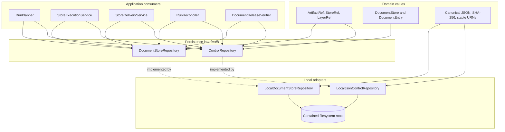
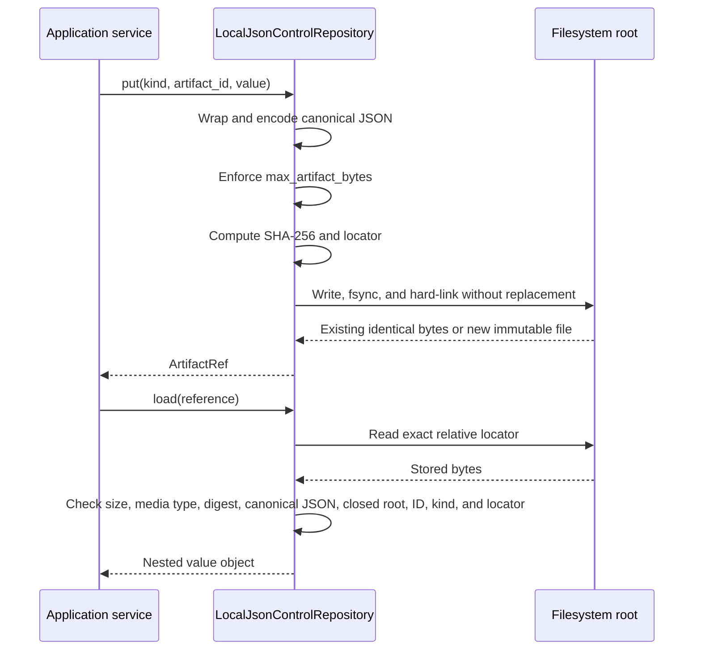
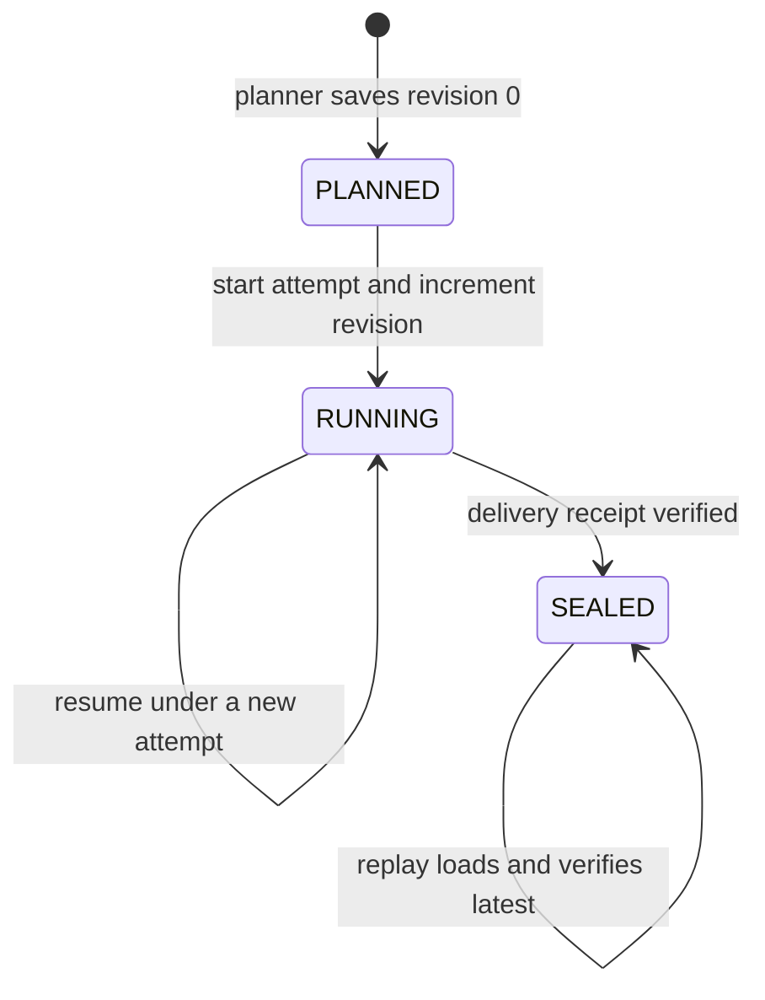
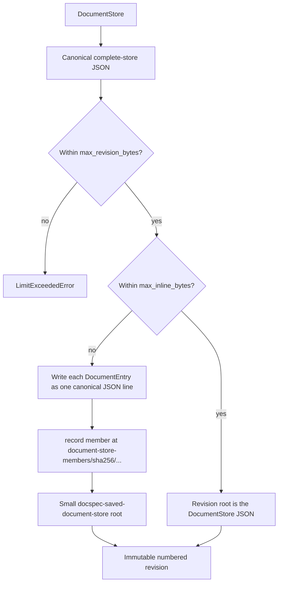
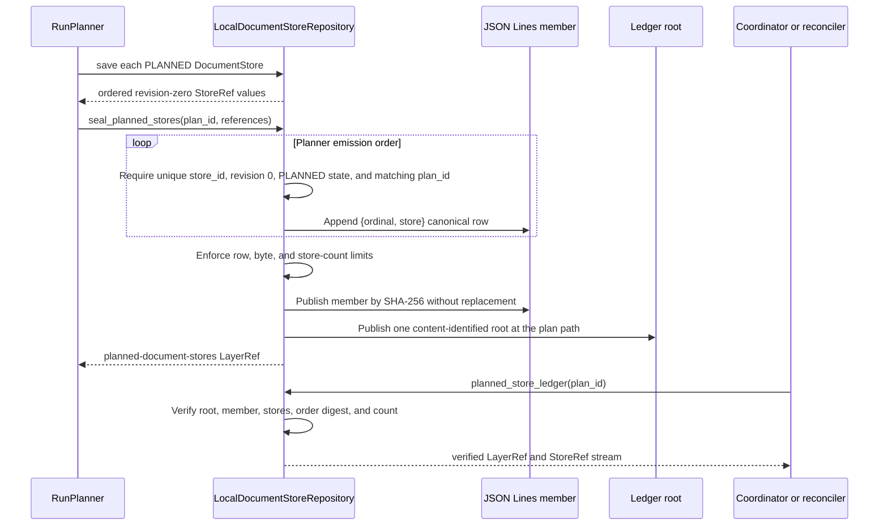

# Storage and Shared References: Control Artifacts and Document Stores

This sub-module persists the small records that coordinate a DocSpec run and the immutable `DocumentStore` revisions that make worker recovery possible. It also seals the exact ordered store population created by a plan. Callers exchange `ArtifactRef`, `StoreRef`, and `LayerRef` values instead of filesystem paths, provider responses, or full job contents.

Read [Storage and Shared References](storage_and_shared_references.md) for the whole storage module, including blobs, logical record layers, and temporary record workspaces. The `DocumentStore` model and its state rules belong to [Processing Plan and Job Model](processing_plan_and_job_model.md). This page focuses on the persistence interfaces and local implementations.

## Purpose and system role

| Question | Answer |
| --- | --- |
| What goes in? | Closed domain records such as a `ProcessingPlan`, receipts, and `DocumentStore`; stable artifact or store identities; and ordered planned `StoreRef` values. |
| What happens? | The control repository writes canonical JSON once. The store repository writes each job revision once, moves large entry populations to content-addressed JSON Lines members, and seals one ordered planned-store ledger for each plan. |
| What comes out? | `ArtifactRef` values for control records, `StoreRef` values for job revisions, and a `LayerRef` for the complete planned population. |
| How is it checked? | Load and verify operations recheck canonical bytes, SHA-256 digests, closed shapes, locators, identities, counts, order, store state, plan membership, and configured limits. Invalid durable state raises an error instead of looking absent. |

These stores preserve evidence and recovery state; they do not decide which work to plan, execute content stages, deliver results, reconcile a run, or publish a release. See [Document Run Application](document_run_application.md) for that complete flow.

## Architecture and dependency direction

The domain defines small immutable references. Ports define the behavior that application services need. The local adapters implement those ports with canonical JSON, JSON Lines, SHA-256, and no-replace filesystem publication.



Application code depends on `ControlRepository` and `DocumentStoreRepository`, not the local classes. A new storage implementation can therefore replace the filesystem adapters if it preserves the same reference, immutability, verification, order, and failure behavior.

## Source map

| Source | Responsibility |
| --- | --- |
| [`domain/references.py`](../src/docspec/domain/references.py) | Defines the frozen references passed among workers, application services, and storage implementations. |
| [`ports/control_repository.py`](../src/docspec/ports/control_repository.py) | Defines write, load, and verification operations for small immutable JSON records. |
| [`ports/document_store_repository.py`](../src/docspec/ports/document_store_repository.py) | Defines revision persistence, history discovery, and the complete planned-store ledger. |
| [`adapters/storage.py`](../src/docspec/adapters/storage.py) | Implements both local repositories and their shared containment, canonical parsing, bounded streaming, and no-replace helpers. |
| [`application/store_state.py`](../src/docspec/application/store_state.py) | Implements latest-revision recovery without bypassing verification of the requested revision. |
| [`domain/jobs.py`](../src/docspec/domain/jobs.py) | Defines the `PLANNED` to `RUNNING` to `SEALED` state changes that create new revisions. |

`BlobRef`, `DocumentReleaseRef`, and `SourceCatalogRef` share the same domain file but belong to the blob, release, and source-catalog paths described on their module pages.

## Shared reference values

All three references in this sub-module are frozen, slotted dataclasses with exact camel-case JSON forms. Their `from_dict()` methods reject missing and additional fields. Constructors require nonempty text, `sha256:` digests, and nonnegative revisions or counts.

| Reference | Fields | Meaning in this sub-module |
| --- | --- | --- |
| `ArtifactRef` | `artifact_id`, `locator`, `digest`, `media_type`, `byte_size` | Identifies one control artifact. The local repository binds the identifier, media type, size, digest, artifact kind, and locator to the stored bytes. |
| `StoreRef` | `store_id`, `revision`, `locator`, `digest` | Identifies one immutable physical revision of a logical `DocumentStore`. `store_id` stays fixed as the revision increases. |
| `LayerRef` | `layer_id`, `layer_kind`, `schema_id`, `profile_id`, `state_ref`, `digest`, `record_count` | Identifies the sealed planned-store ledger. Other modules also use it for logical record layers. |

A reference is a compact claim, not proof by itself. Consumers must call the owning repository's `load()` or `verify()` method before trusting the target. Domain validation checks the reference's basic syntax; the repository checks its relationship to durable bytes and domain meaning.

## Canonical control artifacts

`ControlRepository` stores small coordination records such as processing plans, execution profiles and handoffs, stage receipts, processor results, delivery receipts, run receipts, and catalog-commit receipts. Its interface stays small:

- `put(kind, artifact_id, value)` writes one immutable record and returns an `ArtifactRef`.
- `load(reference)` verifies and returns the nested JSON object.
- `verify(reference)` performs the same checks and discards the returned value.

`LocalJsonControlRepository` wraps each supplied object in a versioned root:

```json
{
  "format": "docspec-control-artifact",
  "formatVersion": "1.0",
  "kind": "plans",
  "artifactId": "plan-1",
  "value": {}
}
```

It serializes that root as canonical JSON with a final newline. The byte digest determines this local path:

```text
control/<kind>/<first-two-digest-hex>/<digest-hex>.json
```

The kind must be one nonempty path segment. The adapter rejects `/`, `.`, and `..`, so an artifact kind cannot choose an arbitrary filesystem location.

### Write and verification flow



Publishing the same bytes again is idempotent. If the target path already contains different bytes or is not a regular file, the adapter raises `IntegrityError`. The parser also rejects duplicate JSON keys and noncanonical encodings through the shared identity helpers.

The repository stores JSON objects only. Large tables and streams belong in `RecordStorage`; exact source or derived bytes belong in `BlobStore`. This separation keeps coordinator reads bounded and prevents small control references from hiding bulk data.

## Immutable `DocumentStore` revisions

`DocumentStoreRepository` persists every state change as a new revision. The domain model controls valid transitions; the repository makes each accepted state durable and independently reloadable.



`store_id` derives from the plan, logical partition, and ordered entry identities. A checkpoint cannot change that population or order. `start()`, `checkpoint()`, and `seal()` each increment `revision`; a sealed store requires terminal entries and a verdict. [Store Execution and Recovery](document_run_application_execution.md) explains which stage frontiers are safe to checkpoint and reuse.

### Revision layout and no-replace save

`LocalDocumentStoreRepository` hashes `store_id` to select a directory and uses a zero-padded revision filename:

```text
document-stores/<sha256-of-store-id>/revisions/<20-digit-revision>.json
```

`save()` canonicalizes the store, selects an inline or split representation, hashes the bytes written at the revision path, and returns a `StoreRef`. It stages the root file under `.staging/writes`, flushes it, and creates the final path with a hard link. Crash debris remains outside the revision directory and does not become history.

If an identical revision already exists, `save()` returns its reference. If the same `store_id` and revision already contain different immutable content, `save()` raises `StateTransitionError`. The repository never overwrites a revision.

### Inline and entry-member forms

Small stores use their canonical `DocumentStore.to_dict()` bytes directly. Large stores keep the root small by moving only the ordered `entries` array into a content-addressed JSON Lines member.



The split root has format `docspec-saved-document-store` version `1.0`. It records:

- the store identity and revision;
- the complete store header without `entries`;
- `documentStoreDigest`, computed over the reconstructed canonical `DocumentStore`;
- an `entriesMember` description with path, media type, byte size, digest, record count, and schema identifier.

The entry member uses media type `application/x-ndjson`, schema `docspec-document-store-entry/1.0`, and this content-addressed path:

```text
document-store-members/sha256/<first-two-digest-hex>/<digest-hex>.jsonl
```

Revisions with unchanged entries can reuse the same member. The revision `StoreRef.digest` identifies the bytes at the revision root. For a split store, `documentStoreDigest` separately proves the reconstructed logical store.

`load()` verifies the root reference before parsing it. For a split root, it also verifies the member's declared size and digest, content-derived locator, media type, schema, complete newline termination, canonical JSON rows, row count, and each `DocumentEntry`. It reconstructs the full store and checks `documentStoreDigest`. Finally, `DocumentStore.from_dict()` reapplies domain invariants, and the repository checks that `store_id`, `revision`, and locator agree with the `StoreRef`.

## Latest revision, full history, and recovery

The two discovery operations make different guarantees:

| Operation | Behavior | Verification scope |
| --- | --- | --- |
| `latest(store_id)` | Returns the highest valid 20-digit revision name, or `None` when the revision directory does not exist or is empty. | Rejects an invalid revision directory or any undeclared filename, then loads and verifies only the newest revision. Historical byte corruption does not prevent recovery from a valid newest revision. |
| `revisions(store_id)` | Returns all references in ascending revision order, or an empty tuple when the directory does not exist. | Applies the same directory checks, then loads and verifies every revision. Any damaged historical revision fails the operation. |

Both operations reject symlinks, non-files, and names outside the exact `<20 digits>.json` pattern. A leftover file inside the revision directory is corruption, even if its name looks temporary. Staging files remain under `.staging/writes` for this reason.

`load_latest_store()` provides application-level replay behavior:

1. Load and verify the exact `StoreRef` supplied by the task.
2. Ask the repository for the latest revision of that same `store_id`.
3. Keep the requested revision when no newer revision exists.
4. Otherwise load and return the newer verified revision.

Loading the requested reference first prevents a forged or damaged task reference from using a valid latest revision as an escape route. The executor and delivery service use this helper to resume durable progress and make stale task replay idempotent.

## Sealed planned-store ledger

Planning produces a stream of revision-zero stores. `seal_planned_stores()` turns that stream into one immutable, ordered population for the plan. This ledger later defines the only acceptable task set during execution and reconciliation.



Each member row has the closed shape `{"ordinal": n, "store": <StoreRef>}`. Ordinals must start at zero and remain complete. The root fixes:

- format `docspec-planned-store-ledger` version `1.0`;
- layer kind `planned-document-stores`;
- schema `docspec-planned-store-reference/1.0`;
- profile `urn:docspec:profile:document-store-persistence:local-json:1`;
- plan identifier and order policy `planner-emission-order`;
- member description, record count, and ordered store-set digest.

The member lives at `planned-store-members/sha256/...jsonl`. The root lives at `planned-store-ledgers/<sha256-of-plan-id>/ledger.json`. A stable Uniform Resource Name (URN) identifies the canonical root content. Because the root path is fixed for a plan, the first population wins: sealing the same bytes is idempotent, and a different population for that plan raises `StateTransitionError`.

The repository uses a temporary SQLite primary-key index to detect duplicate `store_id` values with bounded process memory. During verification, an optional `verification_scratch` directory must sit outside the document-store root. The adapter refuses an internal scratch path because scratch files must never become durable store members.

### Presence is not validity

`has_planned_store_ledger(plan_id)` answers one narrow question: does the expected root path exist as a regular file? It returns `False` only for absence. A symlink or non-file raises `IntegrityError`. Corrupt bytes still count as present.

This distinction supports safe resume selection. The command-line coordinator can choose resume when durable planning state exists, then call `planned_store_ledger()` to verify it. Corruption stops the run; it never silently triggers a new plan that could replace or diverge from the existing population.

`planned_store_ledger()` rebuilds a `LayerRef` from the stored root and calls full verification. Verification checks the reference fields, root digest and closed shape, format and profile identifiers, stable ledger identity, fixed plan locator, counts and limits, member description and bytes, ordered-set digest, row ordinals, unique store identities, each referenced revision, `PLANNED` state, and plan membership.

## How application services use the repositories

This page describes durable boundaries. The neighboring application pages explain the business flow and stage-specific rules.

| Consumer | Control repository use | Document-store repository use | Details |
| --- | --- | --- | --- |
| `RunPlanner` | Verifies and loads the processing plan and, for incremental work, the base release's plan. | Saves bounded revision-zero stores, seals the complete planner-emission order, and streams it back. | [Planning](document_run_application_planning.md) |
| `StoreExecutionService` | Verifies the plan and durable stage evidence; writes stage, processor-attempt, processor-result, and invocation artifacts. | Loads the newest safe revision and saves attempt, stage, processor-layer, and terminal-entry checkpoints. | [Store Execution and Recovery](document_run_application_execution.md) |
| `StoreDeliveryService` | Verifies sink configuration and writes or reloads the `DeliveryReceipt`. | Loads the newest processed revision and saves the final sealed revision. | [Result Delivery and Reconciliation](result_delivery_and_reconciliation.md) |
| `RunReconciler` | Verifies plan, execution-profile, execution-handoff, and delivery evidence; writes the `RunReceipt`. | Opens the sealed planned ledger and loads each terminal sealed store from the exact task population. | [Delivery, Reconciliation, and Release](document_run_application_delivery_and_release.md) |
| `DocumentReleaseVerifier` | Reloads plans and receipts and verifies referenced control artifacts. | Compares the run's planned ledger with the repository's ledger and reloads every sealed store in the run ledger. | [Document Release Artifacts](document_release_artifacts.md) |

The command-line composition also uses `has_planned_store_ledger()` to choose fresh planning or resume, then verifies the ledger before it creates `StoreTask` values. [Portable Task Execution](portable_task_execution.md) describes those reference-only tasks and their sealed handoff.

## Integrity, security, and operating limits

### Failure-closed checks

The local adapters treat ambiguous filesystem state as corruption:

- Storage roots and traversed locator components cannot be symlinks.
- Locators must be contained relative paths; `..`, absolute paths, and traversal through non-directories fail.
- Durable members must be regular files with exact sizes and digests.
- JSON must be canonical, complete, and closed to undeclared fields.
- Existing immutable paths may contain only identical bytes.
- Revision directories may contain only declared revision filenames.
- Planned-ledger roots, members, reference fields, store values, counts, and order must agree.

These checks provide integrity and path containment. They do not provide deployment access control, encryption, backups, or regional placement. The local document-store profile marks those policies as deployment-supplied; operators must secure the storage volume and its lifecycle.

### Default limits

| Setting | Default | Enforcement |
| --- | ---: | --- |
| `LocalJsonControlRepository.max_artifact_bytes` | 8 MiB | Bounds writes and rejects references whose declared size exceeds the limit; `load()` then compares the actual byte length with that declaration. |
| `LocalDocumentStoreRepository.max_revision_bytes` | 64 MiB | Bounds the complete canonical store and any external entry member. |
| `max_inline_bytes` | 1 MiB | Selects inline versus split storage and bounds split and planned-ledger roots. It cannot exceed `max_revision_bytes`. |
| `max_plan_ledger_bytes` | 4 GiB | Bounds the complete planned-store JSON Lines member. |
| `max_plan_record_bytes` | 64 KiB | Bounds each planned-store row. |
| `max_plan_store_count` | 10,000,000 | Bounds the number of planned stores. |

All configured limits must be positive. The command-line local composition reads document-store limits from the pinned `local-document-store-v1` profile instead of relying on constructor defaults. Changes to deployed limits therefore require profile and composition review as well as code changes.

## Contribution guidance

Preserve these properties when changing or replacing either repository:

1. Keep application code dependent on the ports. Provider clients, response objects, path rules, and transport errors belong inside adapters.
2. Keep reference JSON closed and backward compatible. A reference-field change affects persisted plans, receipts, task messages, ledgers, caches, and release artifacts.
3. Use the shared canonical JSON and identity helpers. A second serializer or digest algorithm can produce references that compare equal semantically but fail byte verification.
4. Publish immutable targets without replacement. Treat an existing different value as a state conflict, never an update.
5. Verify on reads. Check both physical bytes and the domain relationships that make those bytes meaningful.
6. Preserve bounded behavior. Stream planned populations and large entries; use disk-backed duplicate checks; keep temporary files outside declared durable member sets.
7. Preserve planner emission order. Sorting a planned ledger changes task identity even when it contains the same stores.
8. Version physical root formats and profile descriptions when readers must interpret new shapes. Continue to read old formats until migration policy explicitly removes them.
9. Add tamper, limit, collision, replay, and interrupted-write tests with each new path. Happy-path round trips alone do not prove safe recovery.

When implementing another `DocumentStoreRepository`, test the interface's semantic guarantees rather than copying the local directory names. The required behavior is immutable revisions, verified latest and history discovery, one exact planned population per plan, bounded streaming, and clear failure on corrupt or conflicting state.

## Focused verification

Run the local storage tests while changing canonical formats, locators, limits, or no-replace behavior:

```bash
uv run pytest tests/test_storage_adapters.py \
  -k 'control_repository or document_store or planned_store or revision'
```

Run state and replay conformance tests while changing revisions, receipt links, or the planned population:

```bash
uv run pytest \
  tests/conformance/test_document_store.py \
  tests/conformance/test_recovery.py \
  tests/test_stage_checkpoint_recovery.py
```

The first group covers canonical control bytes, immutable revision conflicts, latest-versus-history validation, interrupted-write isolation, ordered planned ledgers, absence-versus-corruption, bounds, and split entry members. The second group proves that the application can recover verified checkpoints, replay store tasks, reconcile the exact planned population, and refuse tampered durable evidence.
