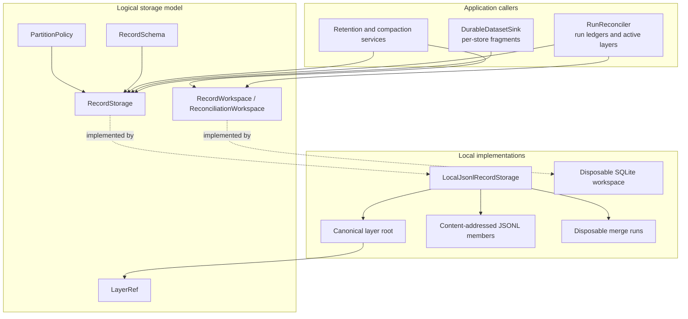
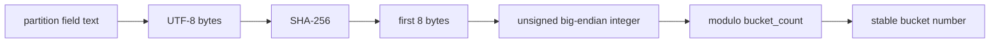
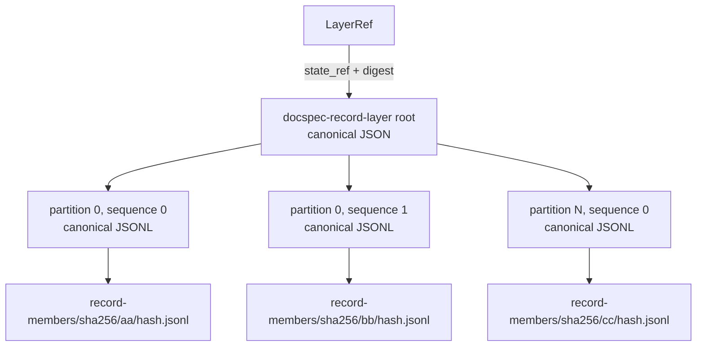
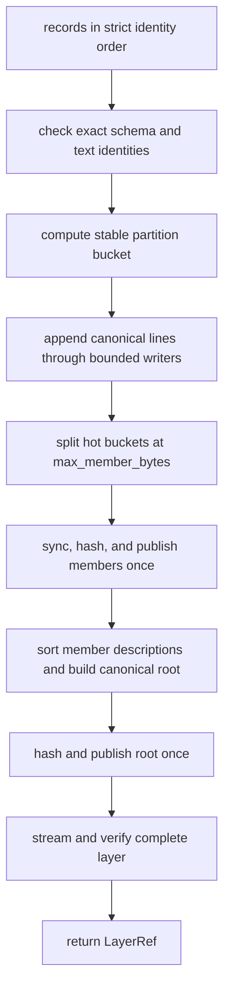
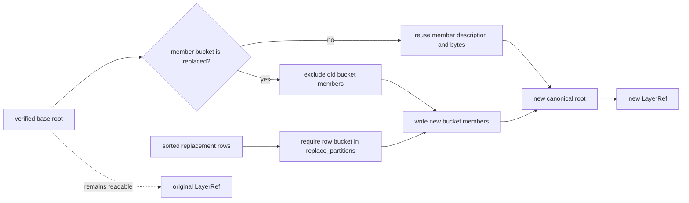
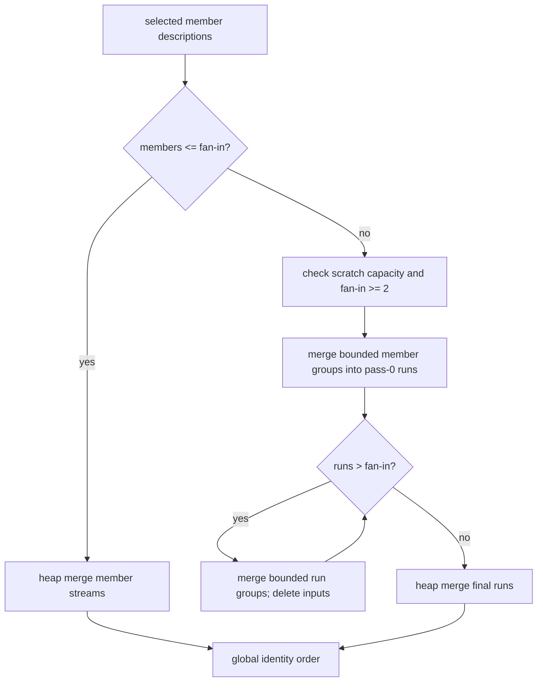
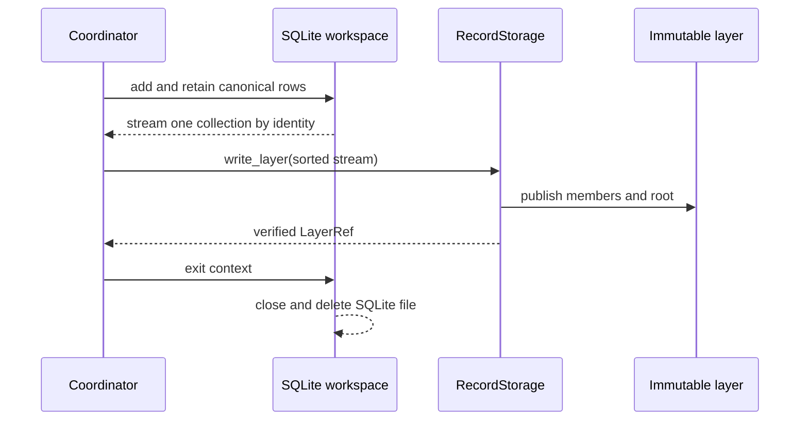

# Storage and Shared References: Record Layers

Record layers store large logical datasets as immutable, partitioned JSON Lines members. The `RecordStorage` interface keeps application code independent of that physical format; `LocalJsonlRecordStorage` supplies the local implementation. Each write returns a compact `LayerRef` that pins the layer's logical identity, schema, storage profile, root location, root digest, and record count.

This page covers the record-layer implementation and its disposable scratch workspace. See [Storage and Shared References](storage_and_shared_references.md) for the complete storage module and [Storage and Shared References: Reference Model](storage_and_shared_references_reference_model.md) for all reference types. [Result Delivery and Reconciliation](result_delivery_and_reconciliation.md) explains delivery receipts and the reconciliation workspace's application-level meaning. [Document Run Application: Delivery, Reconciliation, and Release](document_run_application_delivery_and_release.md) explains when the application creates full or incremental layers. [Document Release Artifacts](document_release_artifacts.md) explains how verified layers enter a release. [Release Maintenance](release_maintenance.md) explains retention layers and full-layer compaction.

## Purpose and system role

| Question | Answer |
| --- | --- |
| What goes in? | A globally identity-sorted record stream, a closed `RecordSchema`, a `PartitionPolicy`, a logical `layer_kind`, and, for an incremental write, a verified base layer plus the exact buckets to replace. |
| What happens? | The adapter validates each row, assigns it to a stable SHA-256 bucket, writes bounded JSON Lines shards, publishes each shard by digest, builds a canonical layer root, and verifies the result. |
| What comes out? | A `LayerRef` and a globally identity-sorted stream available through the provider-neutral `RecordStorage` interface. |
| How is it checked? | Closed shapes, canonical JSON, strict identity order, stable bucket placement, content-derived locations, SHA-256 digests, byte and record counts, ordered shard descriptions, write-once publication, and configured resource limits. |

Record layers are durable evidence. SQLite reconciliation files and external-merge runs are temporary working files. Losing scratch state may require retrying an operation, but it does not change an existing layer.

## Source layout and responsibilities

| Source | Responsibility |
| --- | --- |
| [`domain/storage.py`](../src/docspec/domain/storage.py) | Defines `RecordSchema`, `PartitionPolicy`, and the shared `partition_bucket()` algorithm. |
| [`domain/references.py`](../src/docspec/domain/references.py) | Defines the immutable `LayerRef` value used across services and stored records. |
| [`ports/record_storage.py`](../src/docspec/ports/record_storage.py) | Defines full and incremental writes, verification, streaming, lookup, partition scans, and metadata inspection. |
| [`ports/record_workspace.py`](../src/docspec/ports/record_workspace.py) | Defines the minimal disposable record-spool interface used by coordinators. |
| [`ports/reconciliation_workspace.py`](../src/docspec/ports/reconciliation_workspace.py) | Adds affected-source tracking and base-row retention for incremental reconciliation. |
| [`adapters/storage.py`](../src/docspec/adapters/storage.py) | Implements immutable JSON Lines layers, bounded partition writers, bounded external merge, path containment, and write-once publication. |
| [`adapters/reconciliation.py`](../src/docspec/adapters/reconciliation.py) | Implements the actual bounded SQLite workspace used for both `RecordWorkspace` and the richer `ReconciliationWorkspace` behavior. |
| [`adapters/sinks.py`](../src/docspec/adapters/sinks.py) | Uses `RecordStorage` to stage per-store delivery fragments. |
| [`application/reconcile.py`](../src/docspec/application/reconcile.py) | Combines verified fragments with a base release and writes run ledgers and active layers. |
| [`application/maintenance.py`](../src/docspec/application/maintenance.py) | Writes blob-retention layers and rewrites layers during release compaction. |
| [`profiles/local-jsonl-records-v1.json`](../profiles/local-jsonl-records-v1.json) | Registers the local profile, implementation entry point, capabilities, governance pins, and operating limits. |

## Architecture and dependency direction

Applications depend on the domain values and ports. They do not depend on JSON Lines, temporary files, SQLite, or member paths.



`LayerRef` also names other ordered ledgers, including the planned-store ledger written by `DocumentStoreRepository`. Consumers must inspect `profile_id`, `layer_kind`, and the owning port instead of assuming that every `LayerRef` points to a `docspec-record-layer` root.

## Logical schema and stable partitioning

`RecordSchema` defines the complete logical row shape:

| Field | Meaning and invariant |
| --- | --- |
| `schema_id` | Non-empty schema name and version. It is stored in the root and every member description. |
| `fields` | Non-empty ordered tuple of distinct allowed fields. An input row's key set must match this closed set exactly. |
| `identity_field` | Field that uniquely identifies and globally orders rows. Its value must be non-empty text. |
| `partition_field` | Field used to assign the row to a bucket. Its value must be non-empty text. |

Both special fields must appear in `fields`. Field order participates in the persisted root and therefore in layer identity, even though row admission compares key sets.

`PartitionPolicy` names the partition rule and sets `bucket_count` from 1 through 65,536. The shared function computes a bucket as follows:

```text
bucket = unsigned_big_endian(SHA-256(UTF-8(partition_value))[0:8]) % bucket_count
```



The mapping is deterministic, not range-based. Changing the partition field, algorithm, or bucket count can move every row. An incremental write therefore requires the new layer's complete schema and partition-policy dictionaries to equal the base layer's values.

## Durable layer format

The local adapter separates a small root from one or more immutable members.



### `LayerRef`

The returned reference has a strict seven-field JSON shape:

- `layer_id` is a stable Uniform Resource Name (URN) derived from the canonical layer content.
- `layer_kind` states what the records mean, such as `segments` or `run-selection`.
- `schema_id` pins the logical row schema.
- `profile_id` is `urn:docspec:profile:record-storage:local-jsonl:1` for this adapter.
- `state_ref` locates the root under `record-layers/sha256/<prefix>/<digest>.json`.
- `digest` is the SHA-256 digest of the exact canonical root bytes.
- `record_count` is the sum of all member counts.

The dataclass checks required text, digest syntax, and a non-negative count. `RecordStorage` performs the deeper root and member checks.

### Root document

New writes emit format `docspec-record-layer`, version `1.1`. Readers also admit version `1.0` roots. The root has this closed shape:

```text
format, formatVersion, layerId, layerKind, schema,
profileId, partitionPolicy, members, recordCount
```

The canonical content used to derive `layerId` contains `layerKind`, the complete schema, `profileId`, the complete partition policy, the ordered member descriptions, and `recordCount`. The root's own canonical bytes determine its digest and content-addressed path.

### Member documents

Each version 1.1 member description contains:

```text
partition, sequence, path, mediaType, byteSize,
digest, recordCount, schemaId
```

Member files use media type `application/x-ndjson`. Each line is one canonical JSON object followed by `\n`. The member path derives from its digest:

```text
record-members/sha256/<first-two-hex-digits>/<full-hex-digest>.jsonl
```

Members appear in ascending `(partition, sequence)` order. Keys must be distinct; sequences within each occupied partition must start at zero and remain contiguous. Version 1.0 members omit `sequence` and act as sequence zero.

The writer publishes roots and members once. If a content-derived path already exists, it accepts only the same immutable bytes. Path-containment checks reject absolute paths, parent traversal, symlinks, and non-directory parents.

## Full writes

A full write omits both `base` and `replace_partitions`.



The input stream must increase strictly by `identity_field` across the complete layer. This rule rejects duplicate and unordered identities before publication. Because the input is globally sorted, each partition shard also receives identities in increasing order.

`_BoundedPartitionWriters` uses least-recently-used handle eviction, so a write opens at most `max_open_members` shard files. If the next canonical line would exceed `max_member_bytes`, the writer starts the next sequence for that partition. A single line must fit both `max_record_bytes` and `max_member_bytes`.

Repeated writes of identical logical content produce the same member locations, root, and `LayerRef`.

## Incremental writes and partition reuse

An incremental write requires both `base` and `replace_partitions`. It creates a new immutable layer; it never edits the base.



Before reuse, the adapter fully verifies the base and requires the same `layer_kind`, schema, and partition policy. It copies member descriptions for untouched buckets into the new root. It excludes every member in a replaced bucket, then writes only the supplied replacement rows for those buckets. An empty replacement stream therefore deletes every row in the named buckets.

`RunReconciler` uses this behavior to update a release safely:

1. It marks each changed `sourceItemId` and computes the touched buckets.
2. It spools new delivery rows in a disposable workspace.
3. It reads only touched base buckets and retains rows whose exact source item was unaffected. This step preserves unrelated rows that share a hash bucket.
4. It sends the resulting identity-sorted stream to `write_layer()` with the base and touched bucket set.
5. The new root reuses every untouched member.

See [Result Delivery and Reconciliation](result_delivery_and_reconciliation.md) for fragment validation and affected-source handling. See [Document Run Application: Delivery, Reconciliation, and Release](document_run_application_delivery_and_release.md) for the run gate around these writes.

## Bounded streaming and external merge

A logical stream must be globally sorted by identity even though physical members are grouped by partition. The adapter merges members with a heap.

- When the selection contains at most `max_open_members`, it opens those member streams and performs one heap merge.
- When the selection contains more members, it merges groups of at most `max_open_members` into temporary sorted runs. It repeats this pass until the final run set fits the same fan-in.
- A multi-member external merge requires `max_open_members >= 2`.
- The selected members' declared bytes must not exceed half of `max_merge_scratch_bytes`. This bound reserves room for an input pass and its output runs.
- The temporary directory removes all runs when streaming completes or fails.



Each merge rejects an identity that is less than or equal to the previous identity. This check detects duplicate identities across partitions and across intermediate runs. The implementation exposes `last_write_peak_open_members` and `last_read_peak_open_members` as diagnostic evidence for focused bounded-resource tests.

## Read, lookup, scan, and verification behavior

| Operation | Behavior | Verification depth |
| --- | --- | --- |
| `stream(reference)` | Returns every record in global identity order. | Verifies the root, every selected member's bytes and description, every row shape and local order, stable bucket placement, global uniqueness and order, and member counts. |
| `stream(reference, partitions=...)` | Returns only records in the selected bucket numbers. | Verifies the root and selected members. It validates bucket numbers before opening members. |
| `scan_partition_value(reference, value)` | Hashes `value` and streams its bucket. | Returns bucket candidates, including rows whose partition values collide into the same bucket. The caller must filter for exact partition-field equality when required. |
| `lookup(reference, record_id)` | Scans the globally ordered stream and stops after the target position. | Without `partition_value`, it may scan the whole layer. |
| `lookup(reference, record_id, partition_value=value)` | Restricts the lookup to the computed bucket, then matches exact record identity. | A correct partition value improves pruning; a wrong value can hide an existing record. |
| `verify(reference)` | Consumes a full stream and checks the final count against `LayerRef.record_count`. | Provides complete root-and-member verification. |
| `identity_field()`, `schema()`, `partition_policy()` | Returns metadata from the verified root. | Validates the root and structural member metadata, but does not open member files. |

The local reader verifies a selected member's size and SHA-256 digest before it yields that member's records. Verification also rejects truncated lines, empty lines, non-object JSON values, oversized lines, unknown root versions, wrong profile IDs, member paths that disagree with their digests, non-contiguous sequences, and records stored in the wrong bucket.

The document catalog adds exact source filtering after `scan_partition_value()` because several source IDs may share one bucket. That release-facing behavior belongs to [Document Release Artifacts](document_release_artifacts.md).

## Scratch workspaces are not authoritative

`RecordWorkspace` supplies three operations: add a canonical record, stream a collection in identity order, and look up an identity. `ReconciliationWorkspace` adds affected-source membership and retention of unaffected base records.

`LocalSqliteReconciliationWorkspace` stores each collection under the primary key `(collection, identity)` in a temporary SQLite file. It uses file-backed temporary state, a bounded SQLite cache, batched reads, a per-record byte limit, and a total spool byte limit. It rejects both identical repeats and conflicting rows for the same logical identity.



The workspace removes its SQLite file on context exit. Application services must not place its path in a receipt, release, or reference. `BlobRetentionSetService` uses the minimal `RecordWorkspace` behavior to deduplicate retained blob references before writing a durable retention layer. `RunReconciler` uses the richer interface to combine changed records with touched base buckets. See [Release Maintenance](release_maintenance.md) for retention and compaction decisions.

## Callers and lifecycle

Record layers connect delivery, reconciliation, publication, and maintenance:

1. `DurableDatasetSink` groups a bounded store's delivery records by `layer_kind`, sorts each group by `record_id`, and writes independent full fragment layers.
2. `RunReconciler` verifies those fragments, spools their rows, and writes the store, selection, and task-result ledgers as full layers.
3. For a stateful run, the reconciler creates new active layers or replaces touched buckets in base layers.
4. Release verification checks every referenced layer before publication. [Document Release Artifacts](document_release_artifacts.md) covers the release structure and catalog boundary.
5. `BlobRetentionSetService` writes a full `blob-retention-references` layer from verified roots.
6. `ReleaseCompactionService` streams a complete active layer and writes a full equivalent layer, collapsing reusable shards into the current physical layout while preserving logical release state.

Returned-result delivery does not create durable layers; hybrid delivery compares its returned stream with the durable sink's summary. These delivery choices belong to [Result Delivery and Reconciliation](result_delivery_and_reconciliation.md).

## Invariants and failure behavior

The adapter fails closed when durable state or caller input breaks an invariant.

| Area | Required invariant | Typical failure |
| --- | --- | --- |
| Schema | Every row has exactly the declared fields; identity and partition values are non-empty text. | `IntegrityError` or `ValueError`. |
| Order | Input and output identities are strictly increasing and globally unique. | `IntegrityError`. |
| Partition | Each row hashes to its member's declared bucket; selected and replacement buckets lie within policy range. | `IntegrityError` or `ValueError`. |
| Incremental write | Base verifies; base and successor use the same kind, schema, and policy; new rows stay within replaced buckets. | `IntegrityError` or `ValueError`. |
| Immutable bytes | Root and member sizes, digests, locations, media types, schema IDs, and counts agree. | `IntegrityError`. |
| Closed format | Root, schema, policy, member, and reference mappings contain exactly the expected fields. | `IntegrityError` or `ValueError`. |
| Limits | Root, member, record, open-handle, and merge-scratch bounds hold. | `LimitExceededError` or `ValueError`. |
| Filesystem safety | Storage and scratch roots are directories, and persisted locations stay below their roots without symlink traversal. | `IntegrityError`. |

Write failures clean temporary shard files. External-merge failures close streams and remove the temporary merge directory. Workspace exit closes SQLite and deletes its file. Published immutable members may remain after a later root-write failure; because they are content-addressed, they are safe to reuse and do not become authoritative until a verified root references them.

## Contribution guide

### Change a schema or partition rule

Treat schema and partition changes as stored-data compatibility changes.

1. Assign a new `schema_id` when field meaning, membership, order, identity, or partition behavior changes.
2. Assign a new `policy_id` when the hash algorithm or partition meaning changes.
3. Coordinate any `bucket_count` change with planning, reconciliation, release verification, and migration. An incremental write cannot bridge different counts.
4. Keep `partition_bucket()` as the shared implementation used by writers and callers that compute touched buckets.
5. Add tests for closed shapes, deterministic bucket placement, collision handling, and base incompatibility.

### Change the physical adapter

Preserve these properties when changing `LocalJsonlRecordStorage` or adding another `RecordStorage` profile:

- Accept a streaming input and return a `LayerRef` without exposing provider objects.
- Produce one globally identity-sorted logical stream.
- Keep full writes deterministic and incremental writes immutable.
- Reuse untouched partitions and prune every omitted row from replaced partitions.
- Verify exact bytes, logical shape, order, uniqueness, placement, and counts.
- Bound open readers and writers; avoid whole-member reads.
- Clean temporary files on success and failure.
- Register the profile and add its constructor to the shared conformance-test factory. A new profile is incomplete until it passes the same behavior tests.

Version the root format when a reader cannot safely interpret the old and new shapes as the same behavior. Keep explicit compatibility code for any admitted earlier version; the current reader admits roots `1.0` and `1.1`.

### Change workspace behavior

Keep workspace state disposable. Enforce deterministic identity order, exact duplicate detection, byte limits, and cleanup. Add durable evidence only through `RecordStorage` or another owning repository; never promote a SQLite scratch path into a domain reference.

## Focused verification

Run the record profile conformance suite, bounded partition tests, and workspace tests from the repository root:

```bash
uv run pytest \
  tests/conformance/test_record_storage_contract.py \
  tests/test_bounded_partitions.py \
  tests/test_reconciliation_workspace.py
```

Run the principal delivery, reconciliation, and maintenance integrations after changing a caller or persisted format:

```bash
uv run pytest \
  tests/test_result_sinks_and_recovery.py \
  tests/test_maintenance.py
```

The focused tests prove deterministic repeated writes, strict identity order, immutable base layers, untouched-member reuse, deletion within replaced buckets, tamper detection, hot-partition sharding, bounded open handles, bounded external merge, cross-member duplicate rejection, root-size coverage through all 65,536 buckets, workspace sorting and deduplication, spool limits, and scratch cleanup.
