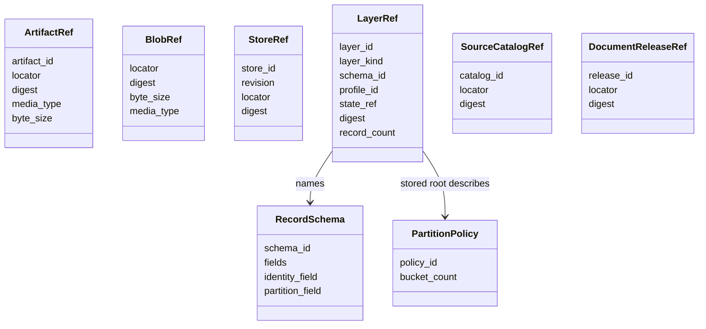
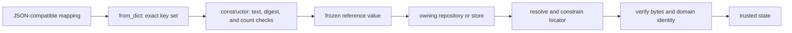
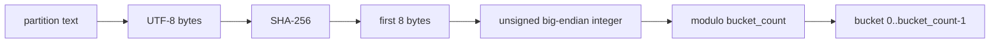
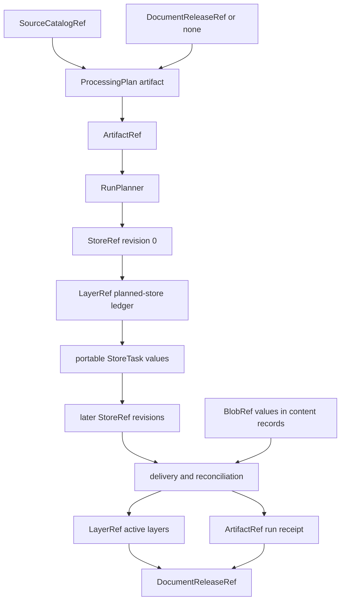

# Storage and Shared References: Reference Model

The reference model defines the small immutable values that DocSpec passes between coordinators, workers, storage profiles, receipts, and releases. It also defines format-neutral record schemas and deterministic partition assignment. These types let the rest of DocSpec name large or durable state without placing that state in scheduler messages or domain records.

See [Storage and Shared References](storage_and_shared_references.md) for the storage interfaces and complete module context. The reference classes live in [`domain/references.py`](../src/docspec/domain/references.py); logical record descriptions live in [`domain/storage.py`](../src/docspec/domain/storage.py).

## Responsibilities at a glance

| Question | Answer |
| --- | --- |
| What goes in? | Logical identifiers, provider-neutral locators, SHA-256 digests, media types, sizes, revision numbers, layer metadata, record field names, and partition counts. |
| What happens? | Frozen dataclasses check local field invariants and serialize to strict JSON shapes. `partition_bucket()` maps a text value to a stable numeric bucket. |
| What comes out? | Portable reference, schema, and partition-policy values that domain objects and port methods can embed or pass across process boundaries. |
| How is it checked? | Required non-empty text, `sha256:<64 lowercase hexadecimal characters>` digests, non-negative sizes and counts, exact serialized keys, distinct schema fields, valid identity and partition fields, and bucket counts from 1 through 65,536. |

## Reference families



The classes share conventions but do not inherit from a common base. Each serialized shape contains only the evidence needed by its owner and consumers.

### `ArtifactRef`

`ArtifactRef` names a small immutable artifact and records its media type and exact byte size. The control repository returns it for plans, profiles, handoffs, receipts, and other canonical JSON objects. The document catalog also uses it to name a staged release artifact before commit.

Fields:

- `artifact_id` is the logical identity used by the owning artifact format.
- `locator` tells the configured repository where to find the bytes.
- `digest` identifies the exact bytes or, for a platform artifact, its admitted artifact digest.
- `media_type` tells readers which representation to expect.
- `byte_size` supports admission limits and exact-size verification.

The JSON keys are `artifactId`, `locator`, `digest`, `mediaType`, and `byteSize`.

### `BlobRef`

`BlobRef` names an immutable byte object. It intentionally has no separate logical identifier: the digest supplies content identity, and the storage adapter derives the canonical locator from that digest. Captured files, extracted representations, segments, delivery records, and retention logic embed this reference.

The JSON keys are `locator`, `digest`, `byteSize`, and `mediaType`. Every blob adapter verifies the digest-derived locator, byte size, and full content hash. The S3 adapter also persists and verifies the media type; the local content-addressed layout stores only the bytes, so its reference carries the caller's media-type assertion.

### `StoreRef`

`StoreRef` names one immutable `DocumentStore` revision. `store_id` identifies the logical job, `revision` identifies its state checkpoint, and the locator and digest identify the saved representation. Planning creates revision `0`; execution and delivery save later revisions instead of changing an existing one.

The JSON keys are `storeId`, `revision`, `locator`, and `digest`. `DocumentStoreRepository.load()` also checks that the parsed store carries the same identity and revision and that its locator follows the repository's identity-derived path.

### `LayerRef`

`LayerRef` names a logical record layer or another ordered record ledger. It carries both logical and physical information:

- `layer_id` identifies the layer's canonical content.
- `layer_kind` tells consumers what the rows mean.
- `schema_id` pins the row schema.
- `profile_id` pins the physical storage behavior needed to read the layer.
- `state_ref` locates the immutable layer root.
- `digest` verifies that root.
- `record_count` gives the complete declared population.

The JSON keys are `layerId`, `layerKind`, `schemaId`, `profileId`, `stateRef`, `digest`, and `recordCount`. A reference alone does not expose member paths, partition policy, or the physical format; the verified root supplies those details.

### `SourceCatalogRef`

`SourceCatalogRef` names one immutable source-catalog artifact. The [Source Catalog Pipeline](source_catalog_pipeline.md) creates and verifies it. Planning receives this reference and checks that it matches the source pin in the processing plan.

The JSON keys are `catalogId`, `locator`, and `digest`. Catalog storage, not this dataclass, determines whether the locator is valid and whether the artifact's rows and semantic digests agree.

### `DocumentReleaseRef`

`DocumentReleaseRef` names a published or expected-base document release. Plans, execution handoffs, run receipts, maintenance records, and scale evidence use it to pin release lineage.

The JSON keys are `releaseId`, `locator`, and `digest`. The document catalog reopens the platform artifact and verifies its complete dependencies before it trusts the reference. See [Document Release Artifacts](document_release_artifacts.md) for release structure and publication.

## Serialization and trust boundary

Every reference provides `to_dict()` and `from_dict()`. `from_dict()` compares the supplied key set with the exact expected key set, so a missing or additional field fails. The constructors then apply field invariants.



The first three steps prove that the message has a known reference shape. Only the owning adapter can prove existence and integrity. Call `verify()`, `load()`, `open()`, or another documented admission method before using referenced state.

The dataclasses are frozen and use slots. They can travel safely as values, but immutability of the Python object does not make the target immutable. Storage implementations enforce write-once behavior and verify the referenced target.

## Logical record description

### `RecordSchema`

`RecordSchema` describes a closed logical record independently of JSON Lines, Parquet, a database table, or another physical format.

| Field | Meaning |
| --- | --- |
| `schema_id` | Stable name and version of the logical row shape. |
| `fields` | Ordered tuple of every allowed field name. The tuple must be non-empty and contain no duplicates. |
| `identity_field` | Field whose non-empty text value orders and uniquely identifies records within the layer. |
| `partition_field` | Field whose non-empty text value determines the stable partition bucket. |

Both special fields must appear in `fields`. The local record adapter compares each row's key set with the schema's field set. It then requires strictly increasing identity values in the input and within every stored member.

The order of `fields` is persisted in the layer root and participates in layer identity. Treat a field reorder as a stored-format compatibility change even though row admission compares field sets.

### `PartitionPolicy`

`PartitionPolicy` pairs a stable `policy_id` with `bucket_count`. The count must be between 1 and 65,536. The policy travels with a record layer, allowing readers to check incremental-write compatibility and direct scans to the correct bucket.

`partition_bucket(value, bucket_count)` performs this calculation:

```text
SHA-256(UTF-8(value))
  -> first 8 digest bytes as an unsigned big-endian integer
  -> integer modulo bucket_count
```



The function gives the same result on every platform. It does not provide range ordering, and changing `bucket_count` can move every value. `LocalJsonlRecordStorage` therefore requires an incremental layer's complete schema and partition-policy dictionaries to match its base.

## How the references move through DocSpec



The same reference classes appear in several modules because they form the shared language at those boundaries:

- [Processing Plan and Job Model](processing_plan_and_job_model.md) embeds catalog, base-release, profile, and receipt references in plans and jobs.
- [Portable Task Execution](portable_task_execution.md) sends references through scheduler-neutral tasks and results.
- [Content Acquisition and Processing](content_acquisition_and_processing.md) embeds blob references in captured and derived content.
- [Result Delivery and Reconciliation](result_delivery_and_reconciliation.md) writes layer references and control-artifact references into delivery and run receipts.
- [Release Maintenance](release_maintenance.md) starts from retained release and store references, then produces retention and compaction evidence.

## Validation depth by reference

| Reference | Constructor checks | Owning admission checks |
| --- | --- | --- |
| `ArtifactRef` | Text, digest syntax, media type, and non-negative size. | Exact bytes, media type, byte size, artifact format, logical identity, and any artifact-specific rules. |
| `BlobRef` | Text locator, digest syntax, media type, and non-negative size. | Digest-derived locator, exact byte count, and full streamed hash; provider metadata, including media type, where the backend persists it. |
| `StoreRef` | Text identity and locator, digest syntax, and non-negative revision. | Canonical saved bytes, identity-derived path, parsed `DocumentStore`, matching ID and revision, and spilled-entry member integrity. |
| `LayerRef` | Required text, digest syntax, and non-negative record count. | Profile and format version, root identity, schema and policy, member paths and hashes, record ordering, partitions, and total count. |
| `SourceCatalogRef` | Text identity and locator plus digest syntax. | Artifact pin, member manifests, catalog schemas, complete-universe accounting, order, and semantic digests. |
| `DocumentReleaseRef` | Text identity and locator plus digest syntax. | Platform artifact, release model, plan and receipt pins, store population, active layers, blob roots, lineage, and publication rules. |

This layered validation avoids duplicating storage knowledge in the domain model. It also prevents a syntactically valid reference from becoming trusted evidence without a read.

## Contribution guide

### Change a reference safely

A reference's JSON keys appear in persisted artifacts and scheduler messages. Changing them is a compatibility change, not a local refactor.

1. Decide whether the existing format can remain readable or needs a new versioned owner format.
2. Update `to_dict()` and strict `from_dict()` together.
3. Update every domain object that embeds the reference and every adapter that admits it.
4. Preserve provider neutrality. Add logical evidence, not SDK response fields or filesystem-only types.
5. Add round-trip, missing-field, extra-field, invalid-digest, negative-count, wrong-locator, and tampered-target tests.

Do not add a boolean such as `verified` to a reference. Verification belongs to the adapter and is valid only for the target inspected at that time.

### Change a record schema or partition policy safely

Define the compatibility boundary before changing `RecordSchema`, a schema identifier, or a policy:

- A field addition or removal changes the closed logical shape.
- A field reorder changes persisted schema content and layer identity.
- A new identity field changes global ordering, uniqueness, lookup, and comparison behavior.
- A new partition field or bucket count changes placement and incremental replacement.
- A new partition algorithm needs a new policy identifier plus coordinated planner, writer, reader, catalog, and verification changes.

Keep `partition_bucket()` as the single implementation of the named policy. Callers that select work partitions, write members, direct lookups, or verify published artifacts must agree exactly.

## Verification

Run the reference and partition checks from the repository root:

```bash
uv run pytest \
  tests/test_domain.py \
  tests/test_bounded_partitions.py \
  tests/test_storage_adapters.py \
  tests/test_storage_records_catalog.py \
  tests/conformance/test_record_storage_contract.py \
  tests/conformance/test_scheduler_portability.py

uv run ruff check \
  src/docspec/domain/references.py \
  src/docspec/domain/storage.py
```

For a reference-shape change, also run the tests for every artifact that embeds it. Typical affected suites include source-catalog snapshots, application pipeline, execution backends, result sinks and recovery, release verification, maintenance, CLI, and scheduler portability.
